# Tutorial: Configure and manage devices connected to your monitoring solution

In this tutorial, you use the Remote Monitoring solution accelerator to configure and manage your connected IoT devices. You add a new device to the solution accelerator, configure the device, and update the device's firmware.

Contoso has ordered new machinery to expand one of their facilities. While you wait for the new machinery to be delivered, you want to run a simulation to test the behavior of your solution. To run the simulation, you add a new simulated engine device to the Remote Monitoring solution accelerator and test that this simulated device responds correctly to actions and configuration updates.

To provide an extensible way to configure and manage devices, the Remote Monitoring solution accelerator uses IoT Hub features such as [jobs](../iot-hub/iot-hub-devguide-jobs.md) and [direct methods](../iot-hub/iot-hub-devguide-direct-methods.md). While this tutorial uses simulated devices, a device developer can implement direct methods on a [physical device connected to the Remote Monitoring solution accelerator](iot-accelerators-connecting-devices.md).

In this tutorial, you:

>[!div class="checklist"]
> * Provision a simulated device.
> * Test a simulated device.
> * Update a device's firmware.
> * Reconfigure a device.
> * Organize your devices.

If you don't have an Azure subscription, create a [free account](https://azure.microsoft.com/free/?WT.mc_id=A261C142F) before you begin.

[!INCLUDE [iot-accelerators-tutorial-prereqs](../../includes/iot-accelerators-tutorial-prereqs.md)]

## Add a simulated device

Navigate to the **Devices** page in the solution and then click **+ New device**:

[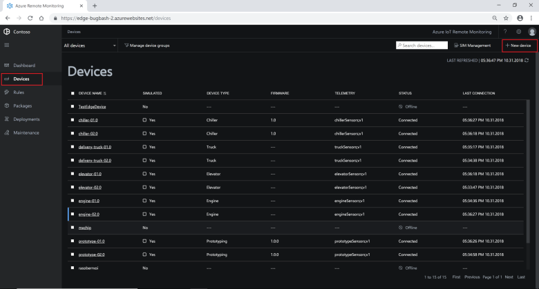](./media/iot-accelerators-remote-monitoring-manage/devicesprovision-expanded.png#lightbox)

In the **New device** panel, choose **Simulated**, leave the number of devices to provision at **1**, choose the **Faulty Engine** device model, and then choose **Apply** to create the simulated device:

[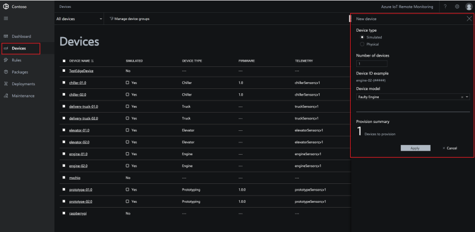](./media/iot-accelerators-remote-monitoring-manage/devicesprovisionengine-expanded.png#lightbox)

## Test the simulated device

To test your simulated engine device is sending telemetry and reporting property values, select it in the list of devices on the **Devices** page. Live information about your engine displays in the **Device Details** panel:

[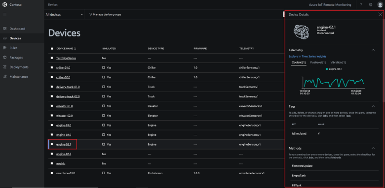](./media/iot-accelerators-remote-monitoring-manage/devicesviewnew-expanded.png#lightbox)

In **Device Details**, verify your new device is sending telemetry. To view the vibration telemetry stream from your device, click **Vibration**:

[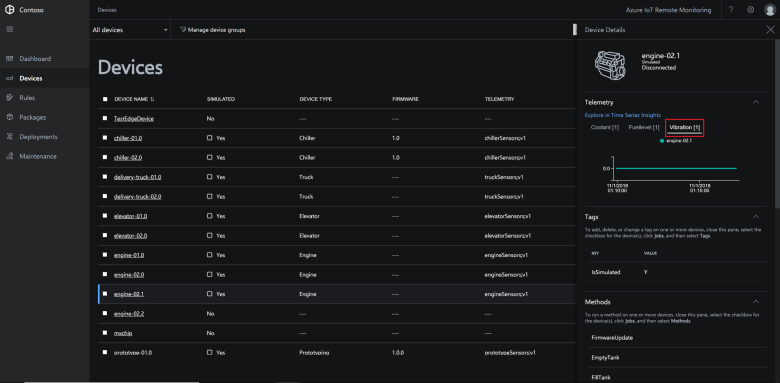](./media/iot-accelerators-remote-monitoring-manage/devicesvibration-expanded.png#lightbox)

The **Device Details** panel displays other information about the device such as tag values, the methods it supports, and the properties reported by the device.

To view detailed diagnostics, scroll down in the **Device Details** panel to view the **Diagnostics** section.

## Act on a device

To test the simulated engine device responds correctly to actions initiated from the dashboard, run the **FirmwareUpdate** method. To act on a device by running a method, select the device in the list of devices, and then click **Jobs**. You can select more than one device if you want to act on multiple devices. In the **Jobs** panel, select **Run method**. The **Engine** device model specifies three methods: **FirmwareUpdate**, **FillTank**, and **EmptyTank**:

[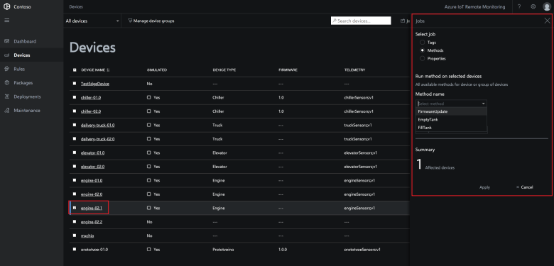](./media/iot-accelerators-remote-monitoring-manage/devicesmethods-expanded.png#lightbox)

Choose **FirmwareUpdate**, set the job name to **UpdateEngineFirmware**, set the firmware version to **2.0.0**, set the firmware URI to **http://contoso.com/engine.bin**, and then click **Apply**:

[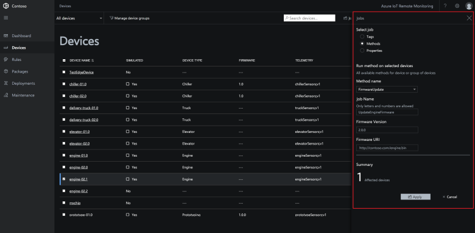](./media/iot-accelerators-remote-monitoring-manage/firmwareupdatejob-expanded.png#lightbox)

To track the status of the job, click **View job status**:

[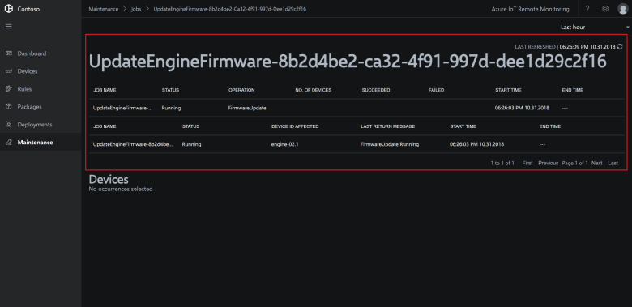](./media/iot-accelerators-remote-monitoring-manage/firmwareupdatestatus-expanded.png#lightbox)

After the job completes, navigate back to the **Devices** page. The new firmware version is displayed for the engine device.

If you select multiple devices of different types on the **Devices** page, you can still create a job to a run a method on those multiple devices. The **Jobs** panel only shows the methods common to all the selected devices.

## Reconfigure a device

To test that you can update the engine's configuration properties, select it in the device list on the **Devices** page. Then click **Jobs**, and then choose **Reconfigure**. The jobs panel shows the updateable property values for the selected device:

[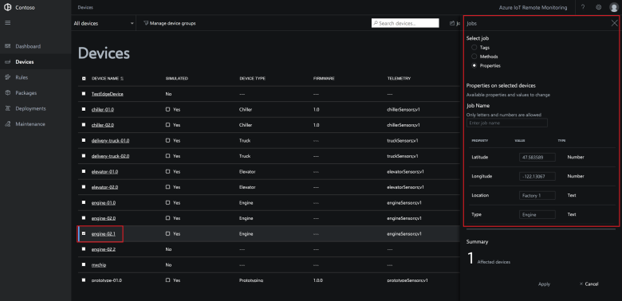](./media/iot-accelerators-remote-monitoring-manage/devicesreconfigure-expanded.png#lightbox)

To update the engine's location, set the job name to **UpdateEngineLocation**, set the longitude to **-122.15**, set the location to **Factory 2**, set the latitude to **47.62**, and click **Apply**:

[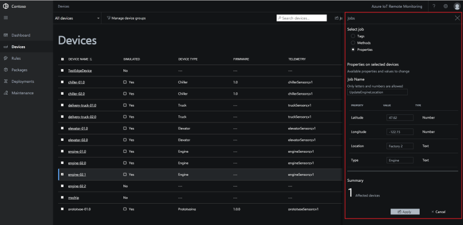](./media/iot-accelerators-remote-monitoring-manage/devicesreconfigurephysical-expanded.png#lightbox)

To track the status of the job, click **View job status**:

[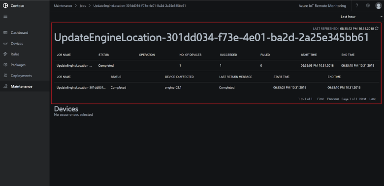](./media/iot-accelerators-remote-monitoring-manage/locationjobstatus-expanded.png#lightbox)

After the job completes, navigate to the **Dashboard** page. The engine device is displayed on the map in its new location:

[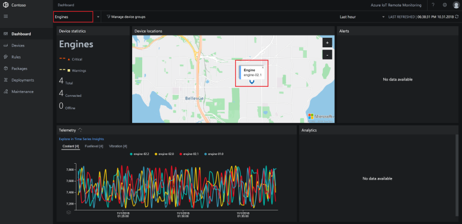](./media/iot-accelerators-remote-monitoring-manage/enginelocation-expanded.png#lightbox)

## Organize your devices

To make it easier as an operator to organize and manage your devices, you want to tag them with a team name. Contoso has two different teams for field service activities:

* The Smart Vehicle team manages trucks and prototyping devices.
* The Smart Building team manages chillers, elevators, and engines.

To display all your devices, navigate to the **Devices** page and choose the **All devices** filter:

[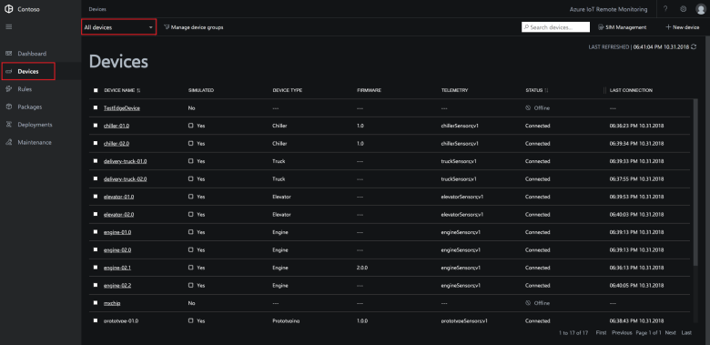](./media/iot-accelerators-remote-monitoring-manage/devicesalldevices-expanded.png#lightbox)

### Add tags

Select all the **Trucks** and **Prototyping** devices. Then click **Jobs**.

In the **Jobs** panel, select **Tag**, set the job name to **AddConnectedVehicleTag**, and then add a text tag called **FieldService** with a value **ConnectedVehicle**. Then click **Apply**:

[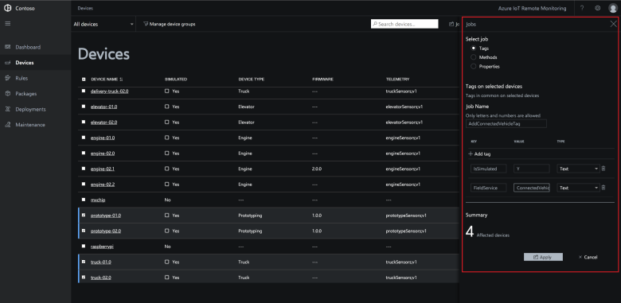](./media/iot-accelerators-remote-monitoring-manage/devicesaddtag-expanded.png#lightbox)

On the device page, select all the **Chiller**, **Elevator**, and **Engine** devices. Then click **Jobs**.

In the **Jobs** panel, select **Tag**, set the job name to **AddSmartBuildingTag**, and then add a text tag called **FieldService** with a value **SmartBuilding**. Then click **Apply**:

[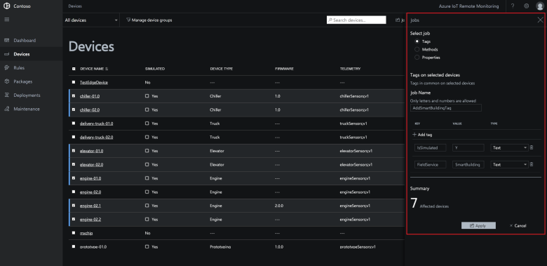](./media/iot-accelerators-remote-monitoring-manage/devicesaddtag2-expanded.png#lightbox)

### Create filters

Now you can use the tag values to create filters. On the **Devices** page, click **Manage device groups**:

[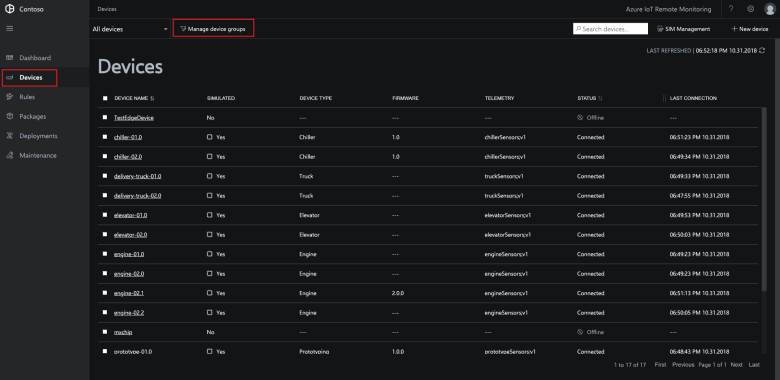](./media/iot-accelerators-remote-monitoring-manage/devicesmanagefilters-expanded.png#lightbox)

Create a text filter that uses the tag name **FieldService** and value **SmartBuilding** in the condition. Save the filter as **Smart Building**:

[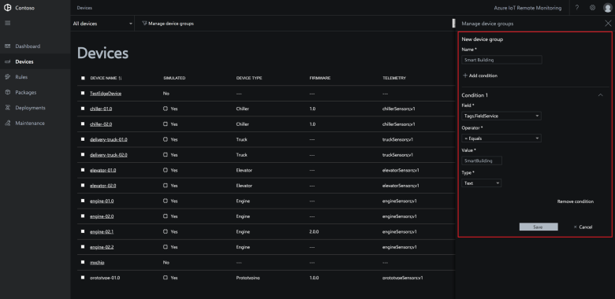](./media/iot-accelerators-remote-monitoring-manage/smartbuildingfilter-expanded.png#lightbox)

Create a text filter that uses the tag name **FieldService** and value **ConnectedVehicle** in the condition. Save the filter as **Connected Vehicle**.

[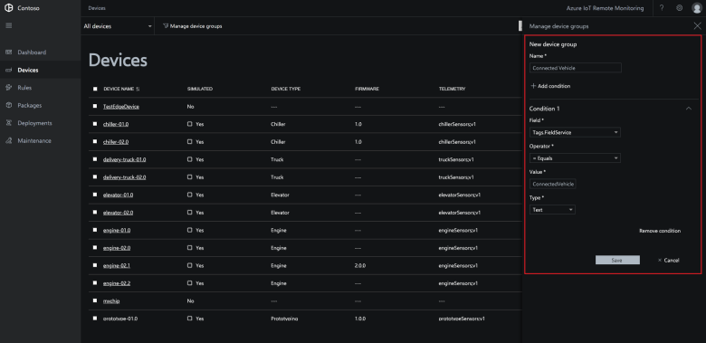](./media/iot-accelerators-remote-monitoring-manage/connectedvehiclefilter-expanded.png#lightbox)

Now the Contoso operator can query for devices based on the operating team:

[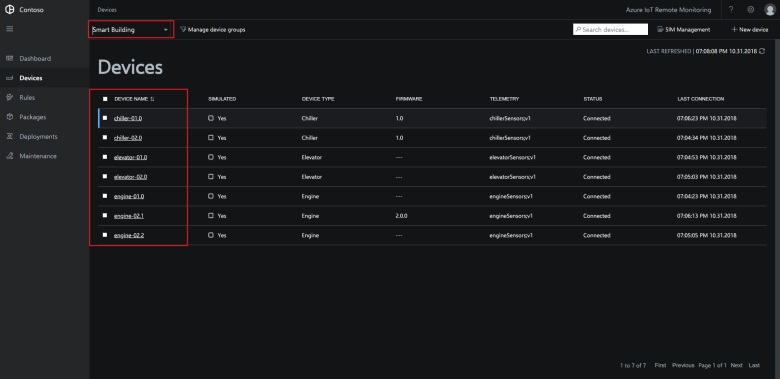](./media/iot-accelerators-remote-monitoring-manage/filterinaction-expanded.png#lightbox)

[!INCLUDE [iot-accelerators-tutorial-cleanup](../../includes/iot-accelerators-tutorial-cleanup.md)]

## Next steps

This tutorial showed you how to configure and manage the devices connected to the Remote Monitoring solution accelerator. To learn how to use the solution accelerator to perform a root-cause analysis on an unexpected alert, continue to the next tutorial.

> [!div class="nextstepaction"]
> [Conduct a root cause analysis on an alert](iot-accelerators-remote-monitoring-root-cause-analysis.md)
