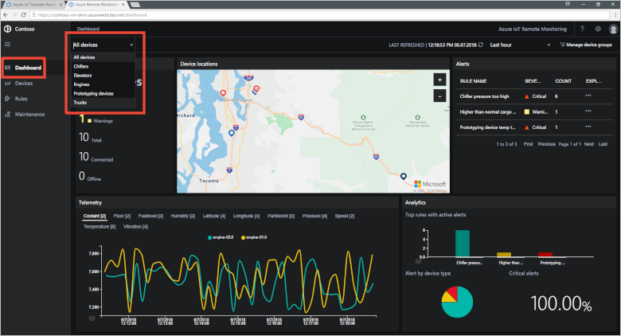
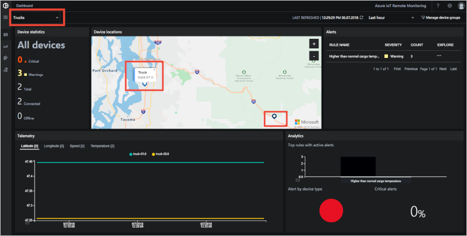
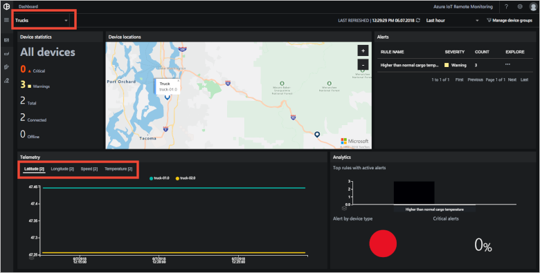
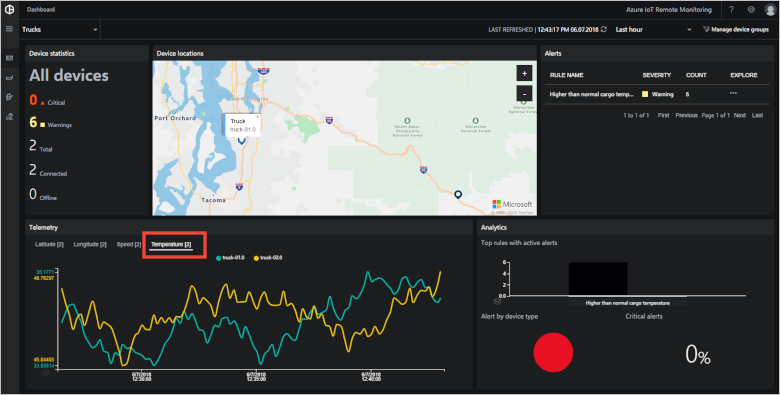
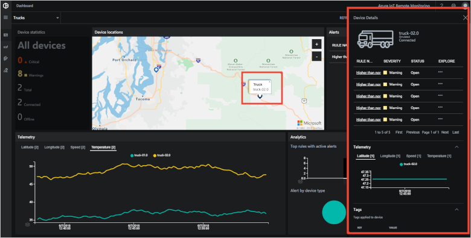
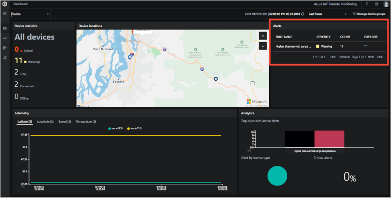
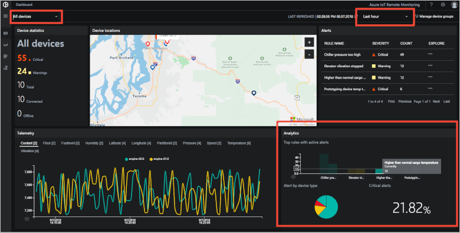

# Tutorial: Monitor your IoT devices

In this tutorial, you use the Remote Monitoring solution accelerator to monitor your connected IoT devices. You use the solution dashboard to view telemetry, device information, alerts, and KPIs.

The tutorial uses two simulated truck devices that send location, speed, and cargo temperature telemetry. The trucks are managed by an organization called Contoso and are connected to the Remote Monitoring solution accelerator. As a Contoso operator, you need to monitor the location and behavior of one of your trucks (truck-02) in the field.

In this tutorial, you:

>[!div class="checklist"]
> * Filter the devices in the dashboard
> * View real-time telemetry
> * View device details
> * View alerts from your devices
> * View the system KPIs

If you don't have an Azure subscription, create a [free account](https://azure.microsoft.com/free/?WT.mc_id=A261C142F) before you begin.

[!INCLUDE [iot-accelerators-tutorial-prereqs](../../includes/iot-accelerators-tutorial-prereqs.md)]

## Choose the devices to display

To select which connected devices display on the **Dashboard** page, use filters. To display only the **Truck** devices, choose the built-in **Trucks** filter in the filter drop-down:

When you apply a filter, only those devices that match the filter conditions display on the map and in the telemetry panel. You can see that there are two trucks connected to the solution accelerator, including truck-02:

To create, edit, and delete filters, click **Manage device groups**.

## View real-time telemetry

The solution accelerator plots real-time telemetry in the chart on the **Dashboard** page. The top of the telemetry chart shows available telemetry types for the devices, including truck-02, selected by the current filter. By default, the chart is showing the latitude of the trucks and truck-02 appears to be stationary:

To view temperature telemetry for the trucks, click **Temperature**. You can see how the temperature for truck-02 has varied over the last hour:

## View the map

The map displays information about the simulated trucks selected by the current filter. You can zoom and pan the map to display locations in more or less detail. The color of a device icon on the map indicates whether any **Alerts** (dark blue) or **Warnings** (red) are active for the device. A summary of the number of **Alerts** and **Warnings** is displayed to the left of the map.

To view the details for truck-02, pan and zoom the map to locate it, then select the truck on the map. Then click on the device label to open the **Device details** panel. Device details include:

* Recent telemetry values
* Methods the device supports
* Device properties

## View alerts

The **Alerts** panel displays detailed information about the most recent alerts from your devices. The alerts from truck-02 indicate higher than normal cargo temperature:

You can use a filter to adjust the time span for recent alerts. By default, the panel displays alerts from the last hour.

## View the system KPIs

The **Dashboard** page displays system KPIs calculated by the solution accelerator in the **Analytics** panel:

The dashboard shows three KPIs for the alerts selected by the current device and timespan filters:

* The number of active alerts for the rules that have triggered the most alerts.
* The proportion of alerts by device type.
* The percentage of alerts that are critical alerts.

For truck-02, all the alerts are warnings of higher than normal cargo temperature.

The same filters that set the time span for alerts and control which devices are displayed determine how the KPIs are aggregated. By default, the panel displays KPIs aggregated over the last hour.

[!INCLUDE [iot-accelerators-tutorial-cleanup](../../includes/iot-accelerators-tutorial-cleanup.md)]

## Next steps

This tutorial showed you how to use the **Dashboard** page in the Remote Monitoring solution accelerator to filter and monitor the simulated trucks. To learn how to use the solution accelerator to detect issues with your connected devices, continue to the next tutorial.

> [!div class="nextstepaction"]
> [Detect issues with devices connected to your monitoring solution](iot-accelerators-remote-monitoring-automate.md)