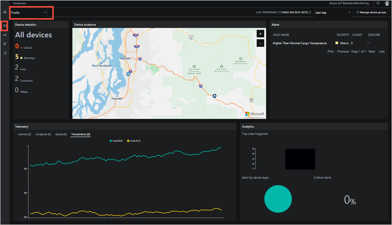
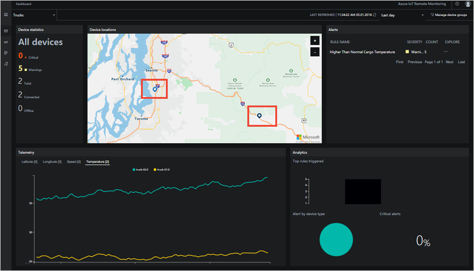
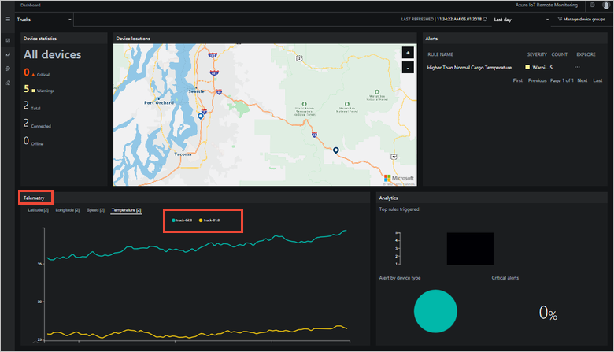
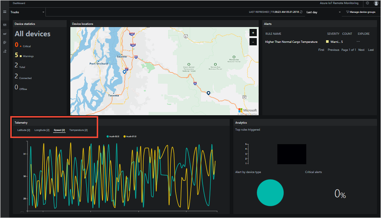
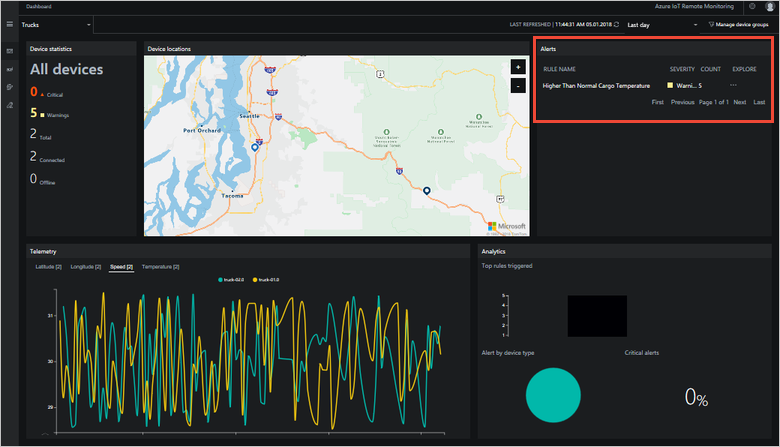

# Perform advanced monitoring using the Remote Monitoring solution

This tutorial shows the capabilities of the Remote Monitoring dashboard. To introduce these capabilities, the tutorial uses a scenario in the Contoso IoT application.

In this tutorial, you use two simulated Contoso truck devices to learn how to monitor your devices from the solution accelerator dashboard. As a Contoso operator, you need to monitor the location and behavior of your trucks in the field.

In this tutorial, you learn how to:

>[!div class="checklist"]
> * Filter the devices in the dashboard
> * View real-time telemetry
> * View device details
> * View alerts from your devices
> * View the system KPIs

## Prerequisites

To follow this tutorial, you need a deployed instance of the Remote Monitoring solution in your Azure subscription.

If you haven't deployed the Remote Monitoring solution yet, you should complete the [Deploy the Remote Monitoring solution accelerator](iot-accelerators-remote-monitoring-deploy.md) tutorial.

## Choose the devices to display

To select which devices display on the **Dashboard** page, use filters. To display only the **Truck** devices, choose the built-in **Trucks** filter in the filter drop-down:

When you apply a filter, only those devices that match the filter conditions display in the map on the **Dashboard** page:

The filter also determines which devices you see in the **Telemetry** chart:

To create, edit, and delete filters, choose **Manage filters**.

## View real-time telemetry

The solution accelerator plots detailed real-time telemetry data in the chart on the **Dashboard** page. The telemetry chart shows telemetry information for the devices selected by the current filter:

To select the telemetry values to view, choose the telemetry type at the top of the chart:

<!-- 05/01 - this features appears to have been removed
To pause the live telemetry display, choose **Flowing**. To re-enable the live display, choose **Pause**:

-->

## Use the map

The map displays information about the simulated trucks selected by the current filter. You can zoom and pan the map to display locations in more or less detail. The device icons on the map indicate any **Alerts** or **Warnings** that are active for the device. A summary of the number of **Alerts** and **Warnings** displays to the left of the map.

<!-- 05/01 - cannot select a deice on the map
To view the device details, pan and zoom the map to locate the devices, then click the device on the map. The details include:

* Recent telemetry values
* Methods the device supports
* Device properties

-->

## View alerts from your devices

The map highlights the devices in the current filter with **Alerts** and **Warnings**. The **Alerts** panel displays detailed information about the most recent alerts from your devices:

You can use the **Dashboard** filter to adjust the time span for recent alerts. By default, the panel displays alerts from the last hour:

## View the system KPIs

The **Dashboard** page displays system KPIs:

You can use the **Dashboard** filter to adjust the time span for the KPI aggregation. By default, the panel displays KPIs aggregated over the last hour.

## Next steps

This tutorial showed you how to use the **Dashboard** page to filter and monitor the simulated trucks provisioned in your Remote Monitoring solution:

<!-- Repeat task list from intro -->
>[!div class="checklist"]
> * Filter the devices in the dashboard
> * View real-time telemetry
> * View device details
> * View alerts from your devices
> * View the system KPIs

Now that you have learned how to monitor your devices, the suggested next steps are to learn how to:

* [Detect issues using threshold-based rules](iot-accelerators-remote-monitoring-automate.md).
* [Manage and configure your devices](iot-accelerators-remote-monitoring-manage.md).
* [Troubleshoot and remediate device issues](iot-accelerators-remote-monitoring-maintain.md).
* [Test your solution with simulated devices](iot-accelerators-remote-monitoring-test.md).

<!-- Next tutorials in the sequence -->