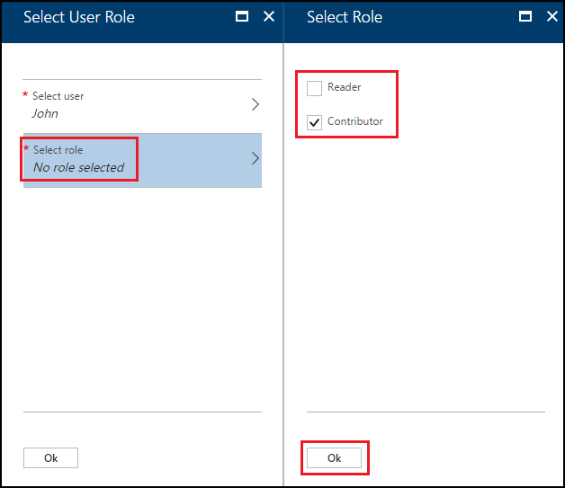
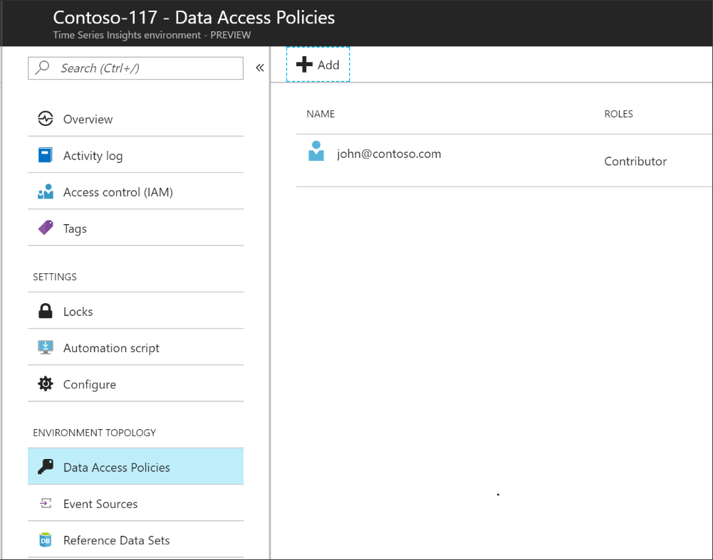

# Configure access controls for the Time Series Insights telemetry explorer

This article provides information about how to configure access controls for the Time Series Insights explorer in the Remote Monitoring solution accelerator. To allow users of the solution accelerator to access the Time Series Insights explorer, you need to grant each user data access.

Data access policies grant permissions to issue data queries, manipulate reference data in the environment, and share saved queries and perspectives associated with the environment.

## Grant data access

Follow these steps to grant data access for a user principal:

1. Sign in to the [Azure portal](https://portal.azure.com).

2. Locate your Time Series Insights environment. Type **Time Series** in the **search** box. Select **Time Series Environment** in the search results. 

3. Select your Time Series Insights environment from the list.

4. Select **Data Access Policies**, then select **+ Add**.
    

5. Select **Select user**.  Search for the user name or email address to locate the user you want to add. Click **Select** to confirm the selection. 

    

6. Select **Select role**. Choose the appropriate access role for the user:
   - Select **Contributor** if you want to allow user to change reference data and share saved queries and perspectives with other users of the environment. 
   - Otherwise, select **Reader** to allow user query data in the environment and save personal (not shared) queries in the environment.

     Select **Ok** to confirm the role choice.

     

7. Select **Ok** in the **Select User Role** page.

    

8. The **Data Access Policies** page lists the users and the role(s) for each user.

    

## Next steps

In this article, you learned how access controls are granted for the Time Series Insights explorer in the Remote Monitoring solution accelerator.

For more conceptual information about the Remote Monitoring solution accelerator, see [Remote Monitoring architecture](iot-accelerators-remote-monitoring-sample-walkthrough.md)

For more information about customizing the Remote Monitoring solution, see [Customize and redeploy a microservice](iot-accelerators-microservices-example.md)
<!-- Next tutorials in the sequence -->