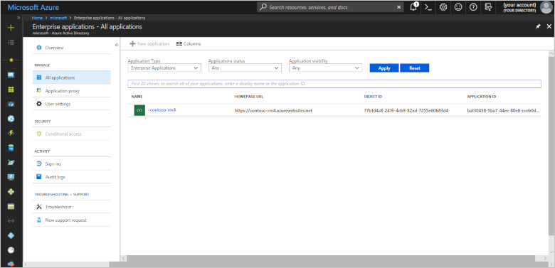
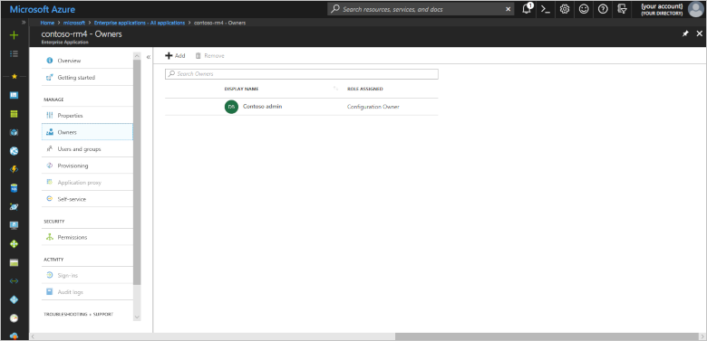
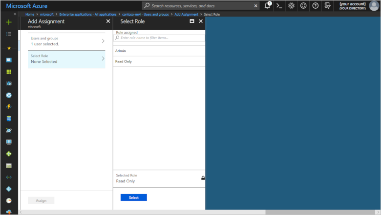
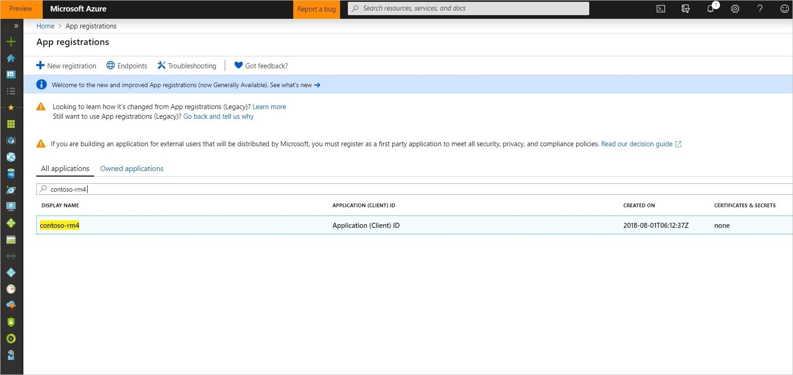

# Configure role-based access controls in the Remote Monitoring solution accelerator

This article provides information about how to configure role-based access controls in the Remote Monitoring solution accelerator. Role-based access controls let you restrict access for individual users to specific features in the solution.

## Default settings

When you first deploy the Remote Monitoring solution, there are two roles: **Admin** and **Read Only**.

Any user in the **Admin** role has full access to the solution. A user in the **Read Only** role can't do any of the following tasks:

- Update alarms
- Delete alarms
- Create devices
- Update devices
- Delete devices
- Create device groups
- Update device groups
- Delete device groups
- Create rules
- Update rules
- Delete rules
- Create jobs
- Update SIM management

The person who deploys the Remote Monitoring solution is automatically assigned to the **Admin** role and is an Azure Active Directory application owner. As an application owner you can assign roles to other users in the Azure portal.

If you want another user to assign roles in the solution, they must also be set as an application owner in the Azure portal.

## Add or remove users

Use the Azure portal to add or remove a user from the Remote Monitoring solution. The following steps use the [Azure Active Directory enterprise application](../active-directory/manage-apps/add-application-portal.md#find-your-azure-ad-tenant-application) that was created for you when you deployed the Remote Monitoring solution.

1. Sign in to the [Azure portal](https://portal.azure.com).

1. Check the [user is in the directory](../active-directory/fundamentals/add-users-azure-active-directory.md) you're using. You chose the directory to use when you signed in to the [Microsoft Azure IoT Solution Accelerators](https://www.azureiotsolutions.com/Accelerators) site. The directory name is visible in the top-right corner of the [page](https://www.azureiotsolutions.com/Accelerators).

1. Find the **Enterprise application** for your solution in the Azure portal. Once there, filter the list by setting **Application Type** to **All Applications**. Search for your application by application name. The application name is the name of your Remote Monitoring solution. In the following screenshot, the solution and application display names are **contoso-rm4**.

    

1. Check you're an owner of the application by clicking the application and then clicking **Owners**. In the following screenshot, **Contoso admin** is an owner of the **contoso-rm4** application:

    

    If you aren't an owner, you need to ask an existing owner to add you to the list. Only owners can assign application roles such as **Admin** or **Read Only** to other users.

1. To see the list of users assigned to roles in the application, click **Users and groups**.

1. To add a user, click **+ Add user**, and then click **Users and groups, None Selected** to select a user from the directory.

1. To assign the user to a role, click **Select role, None Selected** and choose either the **Admin** or **Read Only** role for the user. Click **Select**, and then click **Assign**.

    

1. The user can now access the Remote Monitoring solution with the permissions defined by the role.

1. You can delete users from the application on the **Users and groups** page in the portal.

## Create a custom role

The Remote Monitoring solution includes the **Admin** and **Read Only** roles when it's first deployed. You can add custom roles with different sets of permissions. To define a custom role, you need to:

- Add a new role to the application in the Azure portal.
- Define a policy for the new role in the Authentication and Authorization microservice.
- Update the solution's web UI.

### Define a custom role in the Azure portal

The following steps describe how to add a role to an application in Azure Active Directory. In this example, you create a new role that allows members to create, update, and delete devices in the Remote Monitoring solution.

1. Find the **App registration** for your solution in the Azure portal. The application name is the name of your Remote Monitoring solution. In the following screenshot, the solution and application display names are **contoso-rm4**.

    

1. Select your application and then click **Manifest**. You can see the two existing [app roles](https://docs.microsoft.com/azure/architecture/multitenant-identity/app-roles) defined for the application:

    

1. Edit the manifest to add a role called **ManageDevices** as shown in the following snippet. You need a unique string such as a GUID for the new role ID. You can generate a new GUID using a service such as the [Online GUID Generator](https://www.guidgenerator.com/):

    ```json
    "appRoles": [
      {
        "allowedMemberTypes": [
          "User"
        ],
        "displayName": "Admin",
        "id": "a400a00b-f67c-42b7-ba9a-f73d8c67e433",
        "isEnabled": true,
        "description": "Administrator access to the application",
        "value": "Admin"
      },
      {
        "allowedMemberTypes": [
          "User"
        ],
        "displayName": "Read Only",
        "id": "e5bbd0f5-128e-4362-9dd1-8f253c6082d7",
        "isEnabled": true,
        "description": "Read only access to device information",
        "value": "ReadOnly"
      },
      {
        "allowedMemberTypes": [
          "User"
        ],
        "displayName": "ManageDevices",
        "id": "ADD A NEW GUID HERE",
        "isEnabled": true,
        "description": "A new role for the application.",
        "value": "ManageDevices"
      }
    ],
    ```

    Save the changes.

### Define a policy for the new role

After to add the role to the app in the Azure portal, you need to define a policy in [roles.json](https://github.com/Azure/remote-monitoring-services-dotnet/blob/master/auth/Services/data/policies/roles.json) for the role that assigns the permissions needed to manage devices.

1. Clone the [Remote Monitoring Microservices](https://github.com/Azure/remote-monitoring-services-dotnet) repository from GitHub to your local machine.

1. Edit the **auth/Services/data/policies/roles.json** file to add the policy for the **ManageDevices** role as shown in the following snippet. The **ID** and **Role** values must match the role definition in the app manifest from the previous section. The list of allowed actions allows someone in the **ManageDevices** role to create, update, and delete devices connected to the solution:

    ```json
    {
    "Items": [
      {
        "Id": "a400a00b-f67c-42b7-ba9a-f73d8c67e433",
        "Role": "admin",
        "AllowedActions": [
          "UpdateAlarms",
          "DeleteAlarms",
          "CreateDevices",
          "UpdateDevices",
          "DeleteDevices",
          "CreateDeviceGroups",
          "UpdateDeviceGroups",
          "DeleteDeviceGroups",
          "CreateRules",
          "UpdateRules",
          "DeleteRules",
          "CreateJobs",
          "UpdateSimManagement"
        ]
      },
      {
        "Id": "e5bbd0f5-128e-4362-9dd1-8f253c6082d7",
        "Role": "readOnly",
        "AllowedActions": []
      },
      {
        "Id": "GUID FROM APP MANIFEST",
        "Role": "ManageDevices",
        "AllowedActions": [
          "CreateDevices",
          "UpdateDevices",
          "DeleteDevices"
        ]
      }
    ]
    }
    ```

1. When you have finished editing the **Services/data/policies/roles.json** file, rebuild and redeploy the Authentication and Authorization microservice to your solution accelerator.

### How the web UI enforces permissions

The web UI uses the [Authentication and Authorization microservice](https://github.com/Azure/remote-monitoring-services-dotnet/tree/master/auth) to determine what actions a user is allowed to take and what controls are visible in the UI. For example, if your solution is called **contoso-rm4**, the web UI retrieves a list of allowed actions for the current user by sending the following request:

```http
http://contoso-rm4.azurewebsites.net/v1/users/current
headers:
X-Source: true
Authorization: Bearer <JWT Token from ADAL>
```

For a user called **Device Manager** in the **ManageDevices** role, the response includes the following JSON in the body:

```json
{
  "Id": "userIdExample",
  "Email": "devicemanager@contoso.com",
  "Name": "Device Manager",
  "AllowedActions": [
    "CreateDevices",
    "UpdateDevices",
    "DeleteDevices"
  ]
}
```

The following snippet from [deviceDelete.js](https://github.com/Azure/pcs-remote-monitoring-webui/blob/master/src/components/pages/devices/flyouts/deviceDelete/deviceDelete.js) in the [web UI](https://github.com/Azure/pcs-remote-monitoring-webui/) shows how the permissions are enforced declaratively:

```json
<FlyoutContent>
  <Protected permission={permissions.deleteDevices}>
    <form className="device-delete-container" onSubmit={this.deleteDevices}>
      ...
    </form>
  </Protected>
</FlyoutContent>
```

For more information, see [Protected Components](https://github.com/Azure/pcs-remote-monitoring-webui/blob/master/src/components/shared/protected/README.md). You can define additional permissions in the [authModel.js](https://github.com/Azure/pcs-remote-monitoring-webui/blob/master/src/services/models/authModels.js) file.

### How the microservices enforce permissions

The microservices also check permissions to protect against unauthorized API requests. When a microservice receives an API request, it decodes and validates the JWT token to get the user ID and permissions associated with the user's role.

The following snippet from the [DevicesController.cs](https://github.com/Azure/remote-monitoring-services-dotnet/blob/master/iothub-manager/WebService/v1/Controllers/DevicesController.cs) file in the [IoTHub Manager microservice](https://github.com/Azure/remote-monitoring-services-dotnet/tree/master/iothub-manager), shows how the permissions are enforced:

```csharp
[HttpDelete("{id}")]
[Authorize("DeleteDevices")]
public async Task DeleteAsync(string id)
{
    await this.devices.DeleteAsync(id);
}
```

## Next steps

In this article, you learned how role-based access controls are implemented in the Remote Monitoring solution accelerator.

See [Configure access controls for the Time Series Insights explorer](iot-accelerators-remote-monitoring-rbac-tsi.md) for information about managing access to the Time Series Insights explorer in the Remote Monitoring solution accelerator.

For more conceptual information about the Remote Monitoring solution accelerator, see [Remote Monitoring architecture](iot-accelerators-remote-monitoring-sample-walkthrough.md)

For more information about customizing the Remote Monitoring solution, see [Customize and redeploy a microservice](iot-accelerators-microservices-example.md)
<!-- Next tutorials in the sequence -->