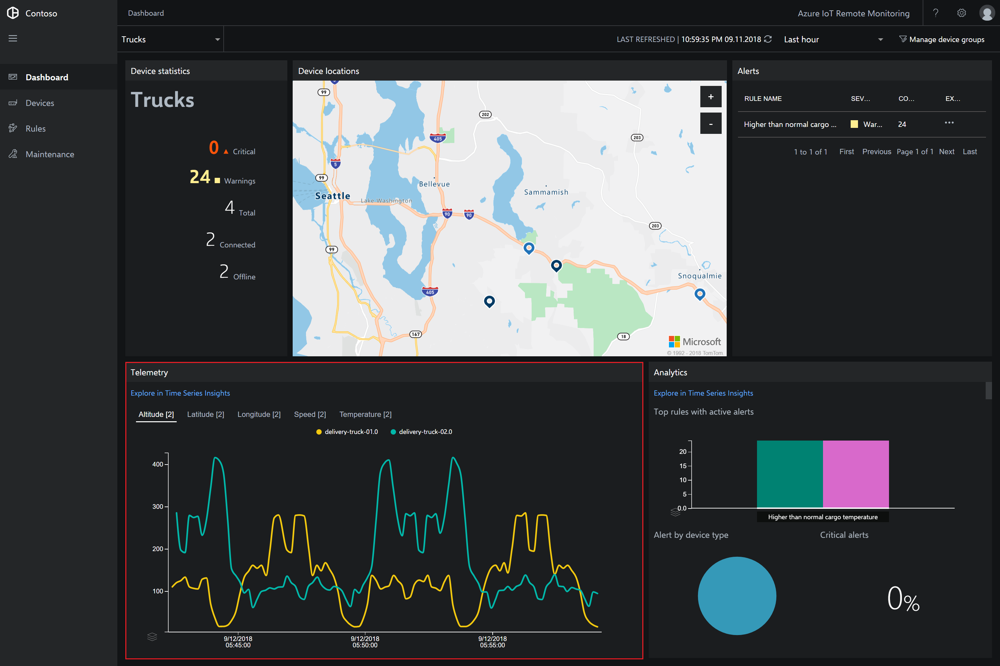
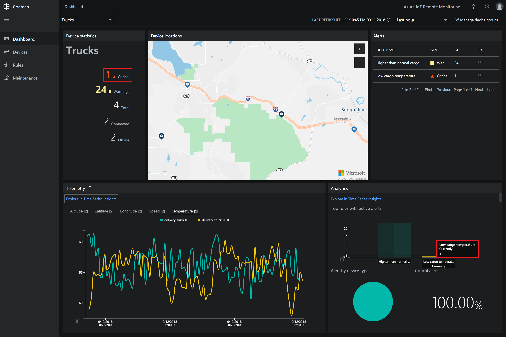
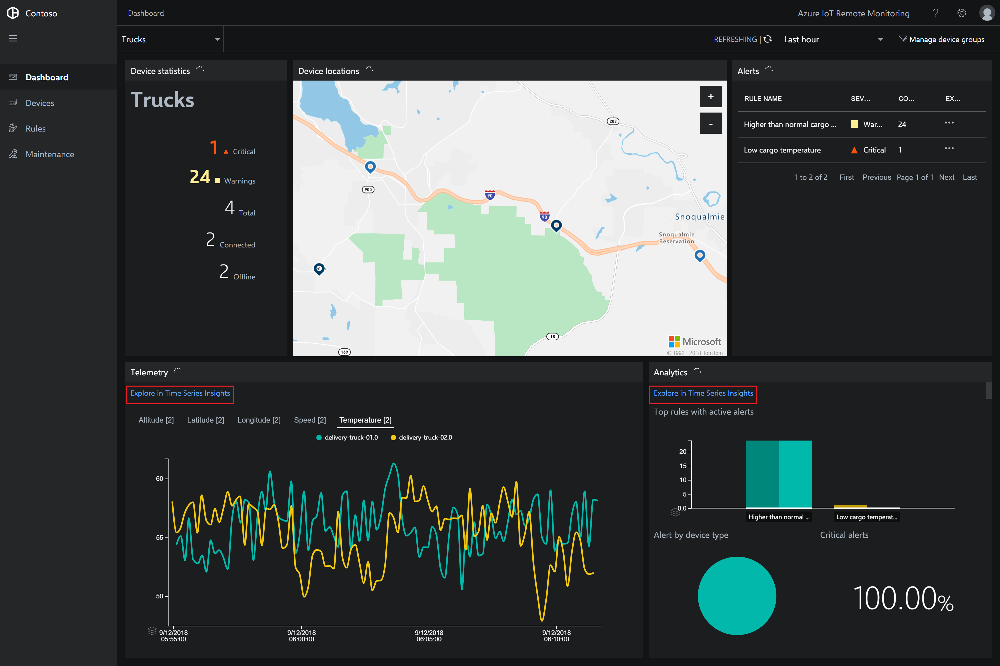
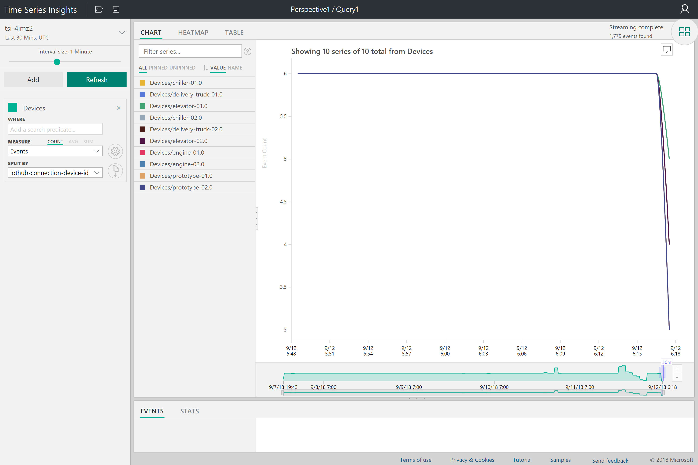
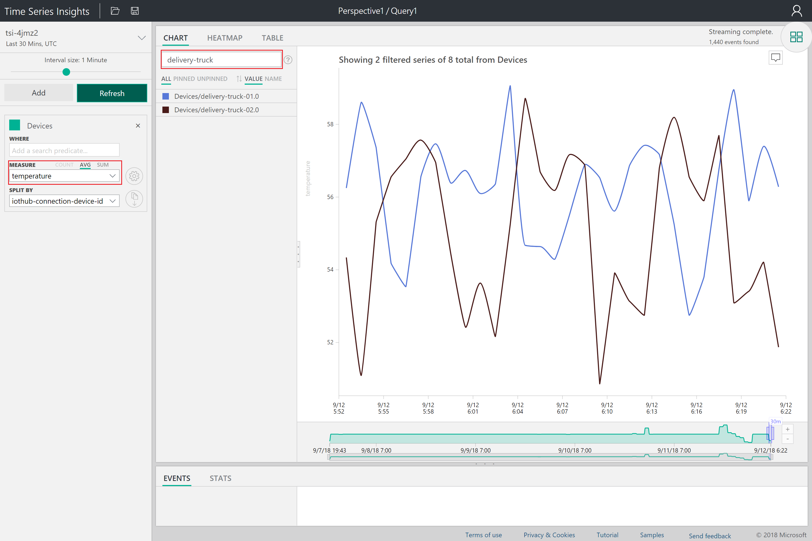
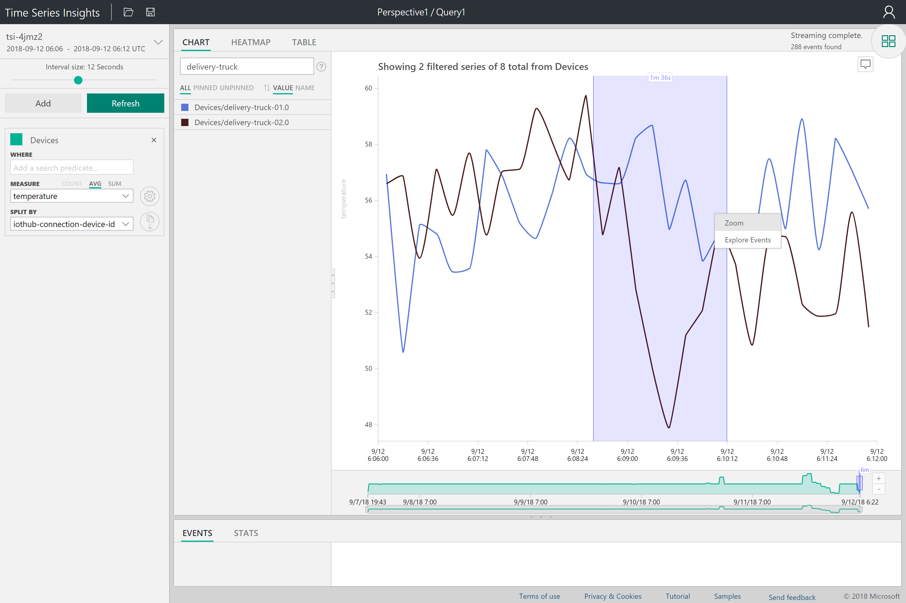
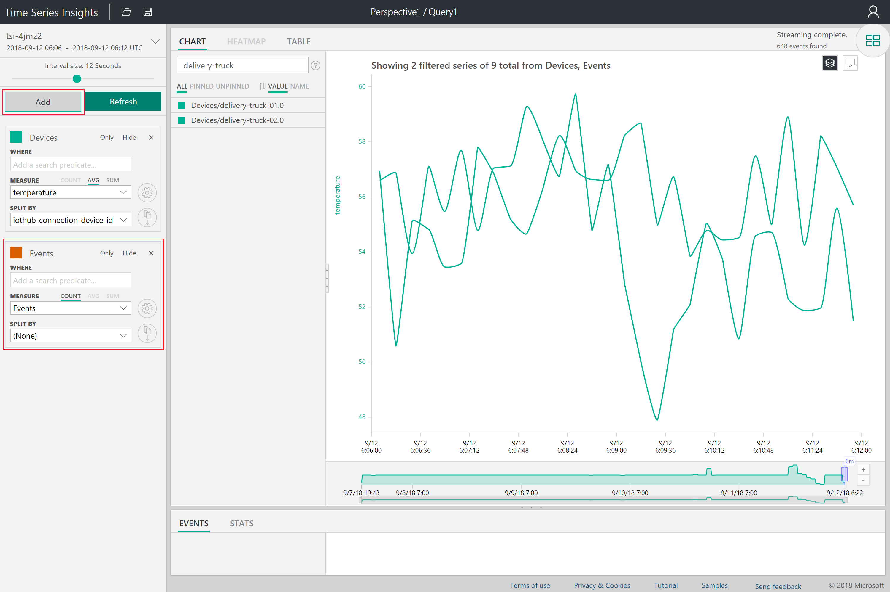
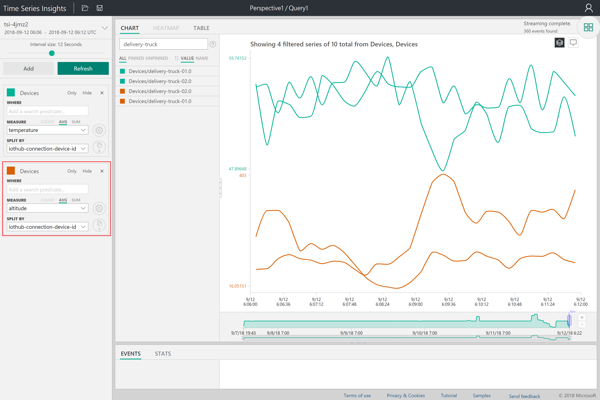
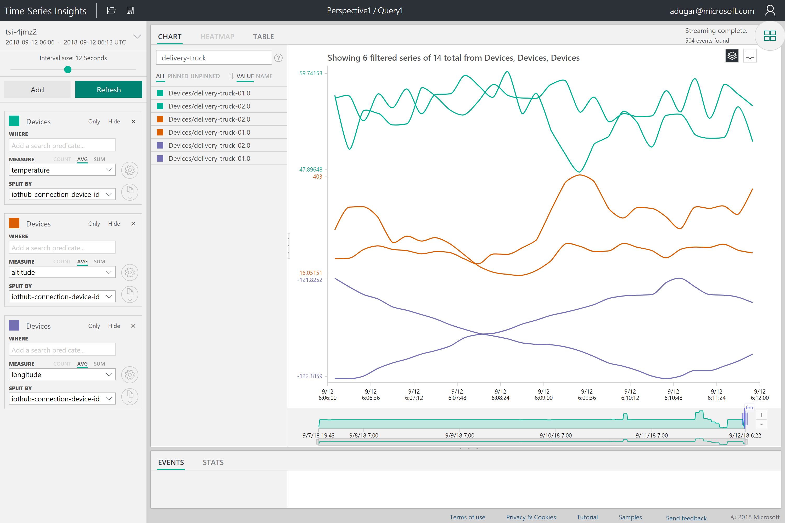
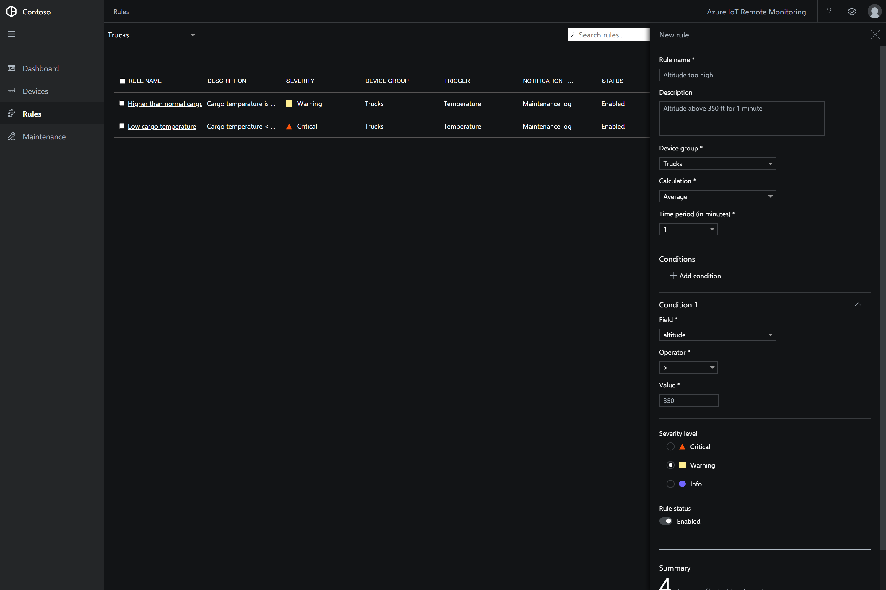

# Tutorial: Conduct a root cause analysis on an alert

In this tutorial, you learn how to use the Remote Monitoring solution accelerator to diagnose the root cause of an alert. You see the alert that has been triggered in the Remote Monitoring solution dashboard and then use the Azure Time Series Insights explorer to investigate the root cause.

The tutorial uses two simulated delivery truck devices that send location, altitude, speed, and cargo temperature telemetry. The trucks are managed by an organization called Contoso and are connected to the Remote Monitoring solution accelerator. As a Contoso operator, you need to understand why one of your trucks (delivery-truck-02) has logged a low temperature alert.

In this tutorial, you:

>[!div class="checklist"]
> * Filter the devices in the dashboard
> * View real-time telemetry
> * Explore data in the Time Series Insights explorer
> * Conduct a root cause analysis
> * Create a new rule based on your learnings

If you don't have an Azure subscription, create a [free account](https://azure.microsoft.com/free/?WT.mc_id=A261C142F) before you begin.

[!INCLUDE [iot-accelerators-tutorial-prereqs](../../includes/iot-accelerators-tutorial-prereqs.md)]

## Choose the devices to display

To select which connected devices display on the **Dashboard** page, use filters. To display only the **Truck** devices, choose the built-in **Trucks** filter in the filter drop-down:

When you apply a filter, only those devices that match the filter conditions are displayed on the map and in the telemetry panel on the **Dashboard** page. You can see that there are two trucks connected to the solution accelerator, including **truck-02**.

## View real-time telemetry

The solution accelerator plots real-time telemetry in the chart on the **Dashboard** page. By default, the chart is showing altitude telemetry,appears to be shifting over time.

To view temperature telemetry for the trucks, click **Temperature**. You can see how the temperature for both trucks has varied over the last 15 minutes. You can also see that an alert for low temperature has been triggered for delivery-truck-02 in the alerts pane.

## Explore data in the Time Series Insights explorer
To get a deeper look at your data to try and understand what is causing the low temperature alarm, open your truck telemetry data in the Time Series Insights explorer by clicking any of the outgoing links:

When the explorer launches, you will see all of your devices displayed:

Filter the devices by typing in **delivery-truck**, and select **Measure > temperature** in the left hand panel.

You will see the same view that you were looking at in the Remote Monitoring dashboard, and can zoom in closer to the time frame that the alert was triggered within.

You can also add in other telemetry streams coming from the trucks. Click the **Add** button in the top left hand corner. You will see a new pane appear.

In the new pane, select **Measure > altitude** and **Split By > iothub-connection-device-id** to add the altitude telemetry into your view. Change the name of the new label to Devices so that it matches the previous one.

## Diagnose the alert
When looking at all of the streams in the current view, you can see that the altitude profiles for the two trucks are very different and the temperature drop in delivery-truck-02 happens when the truck reaches a high altitude. You are surprised by the finding, because the trucks were scheduled to take the same route. 

To confirm your suspicion that the trucks took different journey paths, add in another pane to the side panel using the **Add** button and filter by **Measure > longitude** and **Split By > iothub-connection-device-id**. You can see that the trucks were indeed taking different journeys by looking at the difference in **longitude** streams.

## Create a new rule based on your learnings
While truck routes are generally optimized in advance, you realize that traffic patterns, weather, and other unpredictable events can cause delays and leave last minute route decisions to truck drivers based on their best judgement. However, since the temperature of your assets inside the vehicle is critical, you should set an additional rule back in your Remote Monitoring solution to make sure you recieve a warning if the average altitude over a 1-minute interval goes above 350 feet. 

To learn how to create and edit rules, check out the previous tutorial on [detecing device issues](iot-accelerators-remote-monitoring-automate.md).

[!INCLUDE [iot-accelerators-tutorial-cleanup](../../includes/iot-accelerators-tutorial-cleanup.md)]

## Next steps

This tutorial showed you how to use the Time Series Insights explorer with the Remote Monitoring solution accelerator to diagnose the root cause of an alert. To learn how to use the solution accelerator to identify and fix issues with your connected devices, continue to the next tutorial.

> [!div class="nextstepaction"]
> [Use device alerts to identify and fix issues with devices connected to your monitoring solution](iot-accelerators-remote-monitoring-maintain.md)
