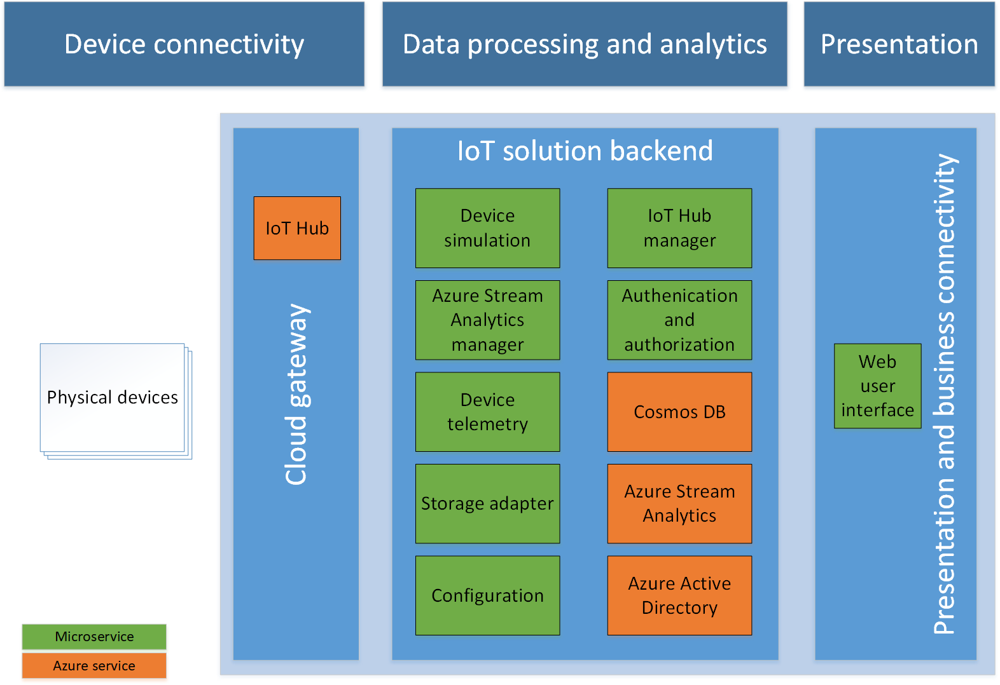

# Remote Monitoring solution accelerator overview

The Remote Monitoring [solution accelerator](../iot-accelerators/about-iot-accelerators.md) implements an end-to-end monitoring solution for multiple machines in remote locations. The solution combines key Azure services to provide a generic implementation of the business scenario. You can use the solution as a starting point for your own implementation and [customize](../iot-accelerators/iot-accelerators-remote-monitoring-customize.md) it to meet your own specific business requirements.

This article walks you through some of the key elements of the Remote Monitoring solution to enable you to understand how it works. This knowledge helps you to:

* Troubleshoot issues in the solution.
* Plan how to customize to the solution to meet your own specific requirements.
* Design your own IoT solution that uses Azure services.

The Remote Monitoring solution accelerator code is available on GitHub:

* [.NET](https://github.com/Azure/azure-iot-pcs-remote-monitoring-dotnet)
* [Java](https://github.com/Azure/azure-iot-pcs-remote-monitoring-java)

## Logical architecture

The following diagram outlines the logical components of the Remote Monitoring solution accelerator overlaid on the [IoT architecture](../iot-fundamentals/iot-introduction.md):

## Why microservices?

Cloud architecture has evolved since Microsoft released the first solution accelerators. [Microservices](https://azure.microsoft.com/blog/microservices-an-application-revolution-powered-by-the-cloud/) have emerged as a proven practice to achieve scale and flexibility without sacrificing development speed. Several Microsoft services use this architectural pattern internally with great reliability and scalability results. The updated solution accelerators put these learnings into practice so you can also benefit from them.

> [!TIP]
> To learn more about microservice architectures, see [.NET Application Architecture](https://www.microsoft.com/net/learn/architecture) and [Microservices: An application revolution powered by the cloud](https://azure.microsoft.com/blog/microservices-an-application-revolution-powered-by-the-cloud/).

## Device connectivity

The solution includes the following components in the device connectivity part of the logical architecture:

### Real devices

You can connect real devices to the solution. You can implement the behavior of your simulated devices using the Azure IoT device SDKs.

You can provision real devices from the dashboard in the solution portal.

### Device simulation microservice

The solution includes the [device simulation microservice](https://github.com/Azure/remote-monitoring-services-dotnet/tree/master/device-simulation) that enables you to manage a pool of simulated devices from the solution portal to test the end-to-end flow in the solution. The simulated devices:

* Generate device-to-cloud telemetry.
* Respond to cloud-to-device method calls from IoT Hub.

The microservice provides a RESTful endpoint for you to create, start, and stop simulations. Each simulation consists of a set of virtual devices of different types, that send telemetry and respond to method calls.

You can provision simulated devices from the dashboard in the solution portal.

### IoT Hub

The [IoT hub](../iot-hub/index.yml) ingests telemetry sent from both the real and simulated devices into the cloud. The IoT hub makes the telemetry available to the services in the IoT solution backend for processing.

The IoT hub in the solution also:

* Maintains an identity registry that stores the IDs and authentication keys of all the devices permitted to connect to the portal.
* Invokes methods on your devices on behalf of the solution accelerator.
* Maintains device twins for all registered devices. A device twin stores the property values reported by a device. A device twin also stores desired properties, set in the solution portal, for the device to retrieve when it next connects.
* Schedules jobs to set properties for multiple devices or invoke methods on multiple devices.

## Data processing and analytics

The solution includes the following components in the data processing and analytics part of the logical architecture:

### IoT Hub manager microservice

The solution includes the [IoT Hub manager microservice](https://github.com/Azure/remote-monitoring-services-dotnet/tree/master/iothub-manager) to handle interactions with your IoT hub such as:

* Creating and managing IoT devices.
* Managing device twins.
* Invoking methods on devices.
* Managing IoT credentials.

This service also runs IoT Hub queries to retrieve devices belonging to user-defined groups.

The microservice provides a RESTful endpoint to manage devices and device twins, invoke methods, and run IoT Hub queries.

### Device telemetry microservice

The [device telemetry microservice](https://github.com/Azure/remote-monitoring-services-dotnet/tree/master/device-telemetry) provides a RESTful endpoint for read access to device telemetry stored in Time Series Insights. The RESTful endpoint also enables CRUD operations on rules and read/write access for alarm definitions from storage.

### Storage adapter microservice

The [storage adapter microservice](https://github.com/Azure/remote-monitoring-services-dotnet/tree/master/storage-adapter) manages key-value pairs, abstracting the storage service semantics, and presenting a simple interface to store data of any format using Azure Cosmos DB.

Values are organized in collections. You can work on individual values or fetch entire collections. Complex data structures are serialized by the clients and managed as simple text payload.

The service provides a RESTful endpoint for CRUD operations on key-value pairs. values

### Azure Cosmos DB

Solution accelerator deployments use [Azure Cosmos DB](https://docs.microsoft.com/azure/cosmos-db/) to store rules, alerts, configuration settings, and all other cold storage.

### Azure Stream Analytics manager microservice

The [Azure Stream Analytics manager microservice](https://github.com/Azure/remote-monitoring-services-dotnet/tree/master/asa-manager) manages Azure Stream Analytics (ASA) jobs, including setting their configuration, starting and stopping them, and monitoring their status.

The ASA job is supported by two reference data sets. One data set defines rules and one defines device groups. The rules reference data is generated from the information managed by the device telemetry microservice. The Azure Stream Analytics manager microservice transforms telemetry rules into stream processing logic.

The device groups reference data is used to identify which group of rules to apply to an incoming telemetry message. The device groups are managed by the configuration microservice and use Azure IoT Hub device twin queries.

The ASA jobs deliver the telemetry from the connected devices to Time Series Insights for storage and analysis.

### Azure Stream Analytics

[Azure Stream Analytics](https://docs.microsoft.com/azure/stream-analytics/) is an event-processing engine that allows you to examine high volumes of data streaming from devices.

### Azure Time Series Insights

[Azure Time Series Insights](https://docs.microsoft.com/azure/time-series-insights/) stores the telemetry from the devices connected to the solution accelerator. It also enables visualizing and querying device telemetry in the solution web UI.

> [!NOTE]
> Time Series Insights is not currently available in the Azure China cloud. New Remote Monitoring solution accelerator deployments in the Azure China cloud use Cosmos DB for all storage.

### Configuration microservice

The [configuration microservice](https://github.com/Azure/remote-monitoring-services-dotnet/tree/master/config) provides a RESTful endpoint for CRUD operations on device groups, solution settings, and user-settings in the solution accelerator. It works with the storage adapter microservice to persist the configuration data.

### Authentication and authorization microservice

The [authentication and authorization microservice](https://github.com/Azure/remote-monitoring-services-dotnet/tree/master/auth) manages the users authorized to access the solution accelerator. User management can be done using any identity service provider that supports [OpenId Connect](https://openid.net/connect/).

### Azure Active Directory

Solution accelerator deployments use [Azure Active Directory](https://docs.microsoft.com/azure/active-directory/) as an OpenID Connect provider. Azure Active Directory stores user information and provides certificates to validate JWT token signatures.

## Presentation

The solution includes the following components in the presentation part of the logical architecture:

The [web user interface is a React Javascript application](https://github.com/Azure/pcs-remote-monitoring-webui). The application:

* Uses Javascript React only and runs entirely in the browser.
* Is styled with CSS.
* Interacts with public facing microservices through AJAX calls.

The user interface presents all the solution accelerator functionality, and interacts with other microservices such as:

* The authentication and authorization microservice to protect user data.
* The IoT Hub manager microservice to list and manage the IoT devices.

The user interface integrates the Azure Time Series Insights explorer to enable querying and analysis of device telemetry.

The configuration microservice enables the user interface to store and retrieve configuration settings.

## Next steps

If you want to explore the source code and developer documentation, start with one of the two GitHub repositories:

* [Solution accelerator for Remote Monitoring with Azure IoT (.NET)](https://github.com/Azure/azure-iot-pcs-remote-monitoring-dotnet).
* [Solution accelerator for Remote Monitoring with Azure IoT (Java)](https://github.com/Azure/azure-iot-pcs-remote-monitoring-java).

Detailed solution architecture diagrams:
* [Solution accelerator for Remote Monitoring architecture](https://github.com/Azure/azure-iot-pcs-remote-monitoring-dotnet/wiki/Architecture).

For more conceptual information about the Remote Monitoring solution accelerator, see [Customize the solution accelerator](../iot-accelerators/iot-accelerators-remote-monitoring-customize.md).
