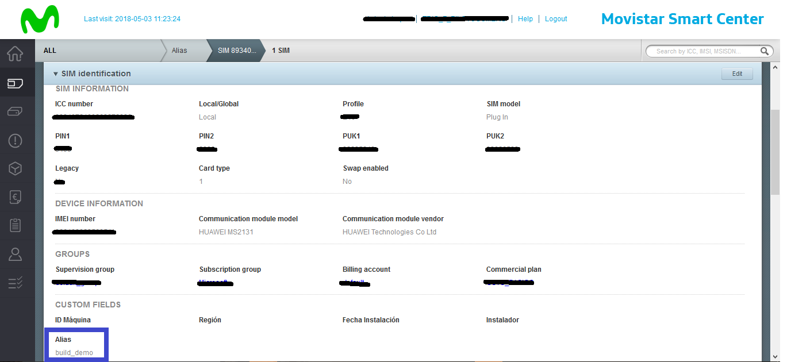
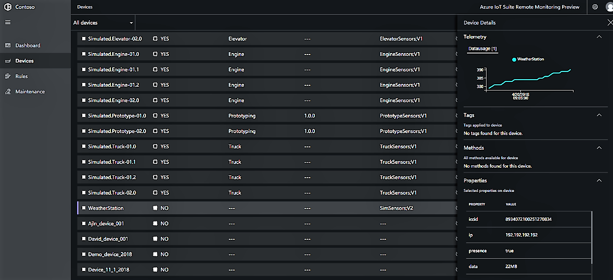

# Integrate SIM data in the Remote Monitoring solution

IoT devices often connect to the cloud using a SIM card that allows them to send data streams from anywhere. The Azure IoT Remote Monitoring solution allows the integration of IoT Managed Connectivity data, so that operators can also track the health of the device through the data provided by the IoT SIM.

Remote Monitoring provides out of the box integration with Telefónica IoT Connectivity, allowing customers using its IoT Connectivity Platform synchronize their device SIMs connectivity data to their solutions. This solution can be extended to support other IoT Connectivity providers through GitHub [repository](https://github.com/Azure/azure-iot-pcs-remote-monitoring-dotnet).

In this tutorial, you learn how to:

* Integrate Telefónica IoT SIM data into the Remote Monitoring solution
* View real-time telemetry
* View SIM data

## Telefónica IoT integration setup

### Prerequisites

This additional Remote Monitoring feature is currently in preview. To sync your connectivity data into Azure Remote Monitoring Solution, follow these steps:

1. Fill a request at [Telefónica's site](https://iot.telefonica.com/contact), select the option **Azure Remote Monitoring**, including your contact data.
2. Telefónica activates your account.
3. If you are not a Telefónica client yet and you want to enjoy this or other IoT Connectivity Cloud Ready services, visit [Telefónica's site](https://iot.telefonica.com/) and select the option **Connectivity**.

### Telefónica SIM setup
Telefónica SIM & Azure Twin device ID association is based on Telefónica IoT SIM "alias" property. 

Navigate to [Telefónica IoT Connectivity Platform Portal](https://m2m-movistar-es.telefonica.com/) > SIM Inventory > Select your SIM, and update each SIM "alias" with your desired Twin deviceID. This task can also be done in bulk mode (refer to Telefónica IoT Connectivity Platform user manuals).

This task can also be done in bulk mode (refer to Telefónica IoT Connectivity Platform user manuals)

To connect your device to the Remote Monitoring, you can follow these tutorials using [C](iot-accelerators-connecting-devices-linux.md) or [Node](iot-accelerators-connecting-devices-node.md). 

## View device telemetry and SIM Properties

Once your Telefónica account is properly configured and your device is connected, you can view device details and SIM data.

The following connectivity parameters are published:

* ICCID
* IP
* Network presence
* SIM Status
* Network-based location
* Consumed data traffic

## Next steps

Now that you have an overview of how to integrate SIM Data into Azure IoT Remote Monitoring, here are suggested next steps for solutions accelerators:

* [Operate the Azure IoT Remote Monitoring solution](quickstart-remote-monitoring-deploy.md)
* [Perform advanced monitoring](iot-accelerators-remote-monitoring-monitor.md)
* [Manage your devices](iot-accelerators-remote-monitoring-manage.md)
* [Troubleshoot device issues](iot-accelerators-remote-monitoring-maintain.md)

