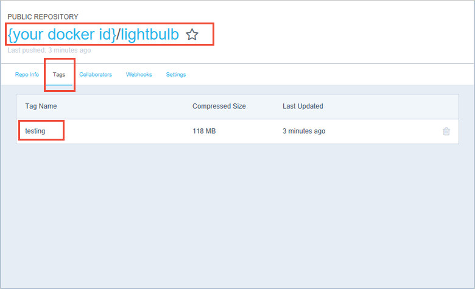
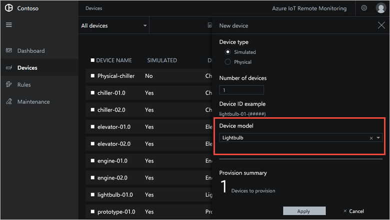
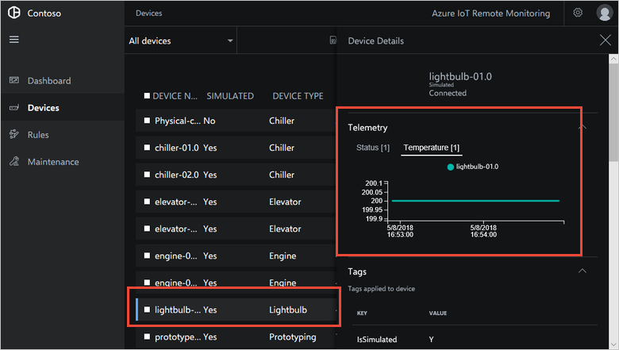
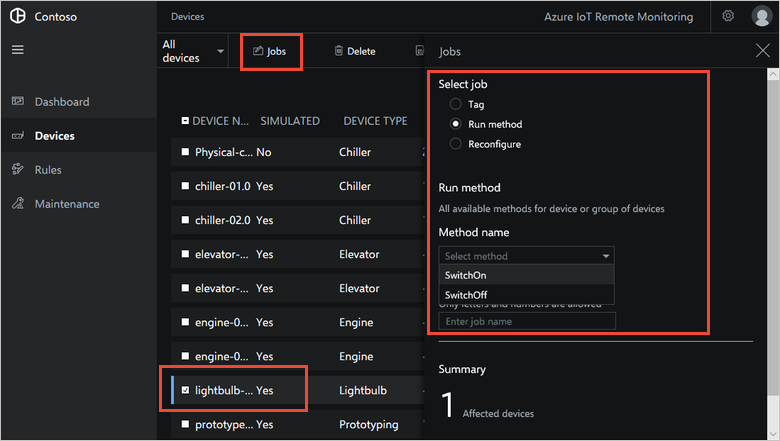

# Create a new simulated device

This tutorial shows you how to customize the device simulator microservice in the Remote Monitoring solution accelerator. To show the capabilities of the device simulator, this tutorial uses two scenarios in the Contoso IoT application.

The following video presents an overview of the options for customizing the device simulator microservice:

>[!VIDEO https://channel9.msdn.com/Shows/Internet-of-Things-Show/How-to-customize-the-Remote-Monitoring-Preconfigured-Solution-for-Azure-IoT/Player]

In the first scenario, Contoso wants to test a new smart lightbulb device. To perform the tests, you create a new simulated device with the following characteristics:

*Properties*

| Name                     | Values                      |
| ------------------------ | --------------------------- |
| Color                    | White, Red, Blue            |
| Brightness               | 0 to 100                    |
| Estimated remaining life | Countdown from 10,000 hours |

*Telemetry*

The following table shows the data the lightbulb reports to the cloud as a data stream:

| Name   | Values      |
| ------ | ----------- |
| Status | "on", "off" |
| Temperature | Degrees F |
| online | true, false |

> [!NOTE]
> The **online** telemetry value is mandatory for all simulated types.

*Methods*

The following table shows the actions the new device supports:

| Name        |
| ----------- |
| Switch on   |
| Switch off  |

*Initial state*

The following table shows the initial status of the device:

| Name                     | Values |
| ------------------------ | -------|
| Initial color            | White  |
| Initial brightness       | 75     |
| Initial remaining life   | 10,000 |
| Initial telemetry status | "on"   |
| Initial telemetry temperature | 200   |

In the second scenario, you add a new telemetry type to Contoso's existing **Chiller** device.

This tutorial shows you how to use the device simulator with the Remote Monitoring solution accelerator:

In this tutorial, you learn how to:

>[!div class="checklist"]
> * Create a new device type
> * Simulate custom device behavior
> * Add a new device type to the dashboard
> * Send custom telemetry from an existing device type

The following video shows a walkthrough of connecting simulated and real devices to the Remote Monitoring solution:

>[!VIDEO https://channel9.msdn.com/Shows/Internet-of-Things-Show/Part-38-Customizing-Azure-IoT-Suite-solution-and-connect-a-real-device/Player]

## Prerequisites

To follow this tutorial, you need:

* A deployed instance of the Remote Monitoring solution in your Azure subscription. If you haven't deployed the Remote Monitoring solution yet, you should complete the [Deploy the Remote Monitoring solution accelerator](../iot-accelerators/quickstart-remote-monitoring-deploy.md) tutorial.

* Visual Studio 2017. If you don't have Visual Studio 2017 installed, you can download the free [Visual Studio Community](https://www.visualstudio.com/free-developer-offers/) edition.

* [Cloud Explorer for Visual Studio 2017](https://marketplace.visualstudio.com/items?itemName=MicrosoftCloudExplorer.CloudExplorerforVS15Preview) Visual Studio extension.

* An account on [Docker Hub](https://hub.docker.com/). You can sign up for free to get started.

* [Git](https://git-scm.com/downloads) installed on your desktop machine.

## Prepare your development environment

Complete the following tasks to prepare your development environment for adding a new simulated device to your Remote Monitoring solution:

### Configure SSH access to the solution virtual machine in Azure

When you created your Remote Monitoring solution at [www.azureiotsolutions.com](https://www.azureiotsolutions.com), you chose a solution name. The solution name becomes the name of the Azure resource group that contains the various deployed resources that the solution uses. The following commands use a resource group named **Contoso-01**, you should replace **Contoso-01** with the name of your resource group.

The following commands use the `az` command from [Azure CLI 2.0](https://docs.microsoft.com/cli/azure?view=azure-cli-latest). You can install the Azure CLI 2.0 on your development machine, or use the [Cloud Shell](https://docs.microsoft.com/azure/cloud-shell/overview) in the [Azure portal](http://portal.azure.com). The Azure CLI 2.0 is pre-installed in the Cloud Shell.

1. To verify the name of the resource group that contains your Remote Monitoring resources, run the following command:

    ```sh
    az group list | grep "name"
    ```

    This command lists all the resource groups in your subscription. The list should include a resource group with the same name as your Remote Monitoring solution.

1. To make your resource group the default group for subsequent commands, run the following command using your resource group name in place of **Contoso-01**:

    ```sh
    az configure --defaults group=Contoso-01
    ```

1. To list the resources in your resource group, run the following command:

    ```sh
    az resource list -o table
    ```

    Make a note of the names of your virtual machine and your network security group. You use these values in later steps.

1. To enable SSH access your virtual machine, run the following command using the name of your network security group from the previous step:

    ```sh
    az network nsg rule create --name SSH --nsg-name YOUR-NETWORK-SECURITY-GROUP --priority 101 --destination-port-ranges 22 --access Allow --protocol TCP
    ```

    To view the list of inbound rules for your network, run the following command:

    ```sh
    az network nsg rule list --nsg-name YOUR-NETWORK-SECURITY-GROUP -o table
    ```

    You should only enable SSH access during test and development. If you enable SSH, [you should disable it again as soon as possible](../security/azure-security-network-security-best-practices.md#disable-rdpssh-access-to-azure-virtual-machines)

1. To change the virtual machine password to a password you know, run the following command. Use the name of the virtual machine you noted previously and a password of your choice:

    ```sh
    az vm user update --name YOUR-VM-NAME --username azureuser --password YOUR-PASSWORD
    ```
1. To find the IP address of your virtual machine, use the following command and make a note of the public IP address:

    ```sh
    az vm list-ip-addresses --name YOUR-VM-NAME
    ```

1. You can now use SSH to connect to your virtual machine. The `ssh` command is pre-installed in the Cloud Shell. Use the public IP address from the previous step and, when prompted, the password you configured for the virtual machine:

    ```sh
    ssh azureuser@public-ip-address
    ```

    You now have access to the shell in the virtual machine that runs the Docker containers in the Remote Monitoring solution. To view the running containers, use the following command:

    ```sh
    docker ps
    ```

### Find the service connection strings

In the tutorial, you work with Visual Studio solution that connects to the solution's Cosmos DB and IoT Hub services. The following steps show you one way to find the connection string values you need:

1. To find the Cosmos DB connection string, run the following command in the SSH session connected to the virtual machine:

    ```sh
    sudo grep STORAGEADAPTER_DOCUMENTDB /app/env-vars
    ```

    Make a note of the connection string. You use this value later in the tutorial.

1. To find the IoT Hub connection string, run the following command in the SSH session connected to the virtual machine:

    ```sh
    sudo grep IOTHUB_CONNSTRING /app/env-vars
    ```

    Make a note of the connection string. You use this value later in the tutorial.

> [!NOTE]
> You can also find these connection strings in the Azure portal or by using the `az` command.

### Stop the device simulation service in the virtual machine

When you modify the device simulation service, you can run it locally to test your changes. Before you run the device simulation service locally, you must stop the instance running in the virtual machine as follows:

1. To find the **CONTAINER ID** of the **device-simulation-dotnet** service, run the following command in the SSH session connected to the virtual machine:

    ```sh
    docker ps
    ```

    Make a note of the container ID of the **device-simulation-dotnet** service.

1. To stop the **device-simulation-dotnet** container, run the following command:

    ```sh
    docker stop container-id-from-previous-step
    ```

### Clone the GitHub repositories

In this tutorial, you work with the **device-simulation** and **storage-adapter** Visual Studio projects. You can clone the source code repositories from GitHub. Perform this step on your local development machine where you have Visual Studio installed:

1. Open a command prompt and navigate to the folder where you want to save your copy of the **device-simulation** and **storage-adapter** GitHub repositories.

1. To clone the .NET version of the **device-simulation** repository, run the following command:

    ```cmd
    git clone https://github.com/Azure/device-simulation-dotnet.git
    ```

    The device simulation service in the Remote Monitoring solution enables you to make changes to the built-in simulated device types and to create new simulated device types. You can use custom device types to test the behavior of the Remote Monitoring solution before you connect your physical devices.

1. To clone the .NET version of the **storage-adapter** repository, run the following command:

    ```cmd
    git clone https://github.com/Azure/pcs-storage-adapter-dotnet.git
    ```

    The device simulation service uses the storage adapter service to connect to the Cosmos DB service in Azure. The Remote Monitoring solution stores the simulated device configuration data in a Cosmos DB database.

### Run the storage adapter service locally

The device simulation service uses the storage adapter service to connect to the solution's Cosmos DB database. If you run the device simulation service locally, you must also run the storage adapter service locally. The following steps show you how to run the storage adapter service from Visual Studio:

1. In Visual Studio, open the **pcs-storage-adapter.sln** solution file in your local clone of the **storage-adapter** repository.

1. In Solution Explorer, right-click the **WebService** project, choose **Properties**, and then choose **Debug**.

1. In the **Environment variables** section, edit the value of the **PCS\_STORAGEADAPTER\_DOCUMENTDB\_CONNSTRING** variable to be the Cosmos DB connection string you noted previously. Then save your changes.

1. In Solution Explorer, right-click the **WebService** project, choose **Debug**, and then choose **Start new instance**.

1. The service starts running locally and opens `http://localhost:9022/v1/status` in your default browser. Verify that the **Status** value is "OK: Alive and well."

1. Leave the storage adapter service running locally until you have completed the tutorial.

You now have everything in place, and you are ready to start adding a new simulated device type to your Remote Monitoring solution.

## Create a simulated device type

The easiest way to create a new device type in the device simulation service is to copy and modify an existing type. The following steps show you how to copy the built-in **Chiller** device to create a new **Lightbulb** device:

1. In Solution Explorer, right-click the **WebService** project, choose **Properties**, and then choose **Debug**.

1. In the **Environment variables** section, edit the value of the **PCS\_IOTHUB\_CONNSTRING** variable to be the IoT Hub connection string you noted previously. Then save your changes.

1. In Solution Explorer, right-click the **device-simulation** solution and choose **Set StartUp Projects**. Choose **Single startup project** and select **WebService**. Then click **OK**.

1. Each device type has a JSON model file and associated scripts in the **Services/data/devicemodels** folder. In Solution Explorer, copy the **Chiller** files to create the **Lightbulb** files as shown in the following table:

    | Source                      | Destination                   |
    | --------------------------- | ----------------------------- |
    | chiller-01.json             | lightbulb-01.json             |
    | scripts/chiller-01-state.js | scripts/lightbulb-01-state.js |
    | scripts/reboot-method.js    | scripts/SwitchOn-method.js    |

### Define the characteristics of the new device type

The **lightbulb-01.json** file defines the characteristics of the type, such as the telemetry it generates and the methods it supports. The following steps update the **lightbulb-01.json** file to define the **Lightbulb** device:

1. In the **lightbulb-01.json** file, update the device metadata as shown in the following snippet:

    ```json
    "SchemaVersion": "1.0.0",
    "Id": "lightbulb-01",
    "Version": "0.0.1",
    "Name": "Lightbulb",
    "Description": "Smart lightbulb device.",
    "Protocol": "MQTT",
    ```

1. In the **lightbulb-01.json** file, update the simulation definition as shown in the following snippet:

    ```json
    "Simulation": {
      "InitialState": {
        "online": true,
        "temperature": 200.0,
        "temperature_unit": "F",
        "status": "on"
      },
      "Interval": "00:00:20",
      "Scripts": [
        {
          "Type": "javascript",
          "Path": "lightbulb-01-state.js"
        }
      ]
    },
    ```

1. In the **lightbulb-01.json** file, update the device type properties as shown in the following snippet:

    ```json
    "Properties": {
      "Type": "Lightbulb",
      "Color": "White",
      "Brightness": 75,
      "EstimatedRemainingLife": 10000
    },
    ```

1. In the **lightbulb-01.json** file, update the device type telemetry definitions as shown in the following snippet:

    ```json
    "Telemetry": [
      {
        "Interval": "00:00:20",
        "MessageTemplate": "{\"temperature\":${temperature},\"temperature_unit\":\"${temperature_unit}\",\"status\":\"${status}\"}",
        "MessageSchema": {
          "Name": "lightbulb-status;v1",
          "Format": "JSON",
          "Fields": {
            "temperature": "double",
            "temperature_unit": "text",
            "status": "text"
          }
        }
      }
    ],
    ```

1. In the **lightbulb-01.json** file, update the device type methods as shown in the following snippet:

    ```json
    "CloudToDeviceMethods": {
      "SwitchOn": {
        "Type": "javascript",
        "Path": "SwitchOn-method.js"
      },
      "SwitchOff": {
        "Type": "javascript",
        "Path": "SwitchOff-method.js"
      }
    }
    ```

1. Save the **lightbulb-01.json** file.

### Simulate custom device behavior

The **scripts/lightbulb-01-state.js** file defines the simulation behavior of the **Lightbulb** type. The following steps update the **scripts/lightbulb-01-state.js** file to define the behavior of the **Lightbulb** device:

1. Edit the state definition in the **scripts/lightbulb-01-state.js** file as shown in the following snippet:

    ```js
    // Default state
    var state = {
      online: true,
      temperature: 200.0,
      temperature_unit: "F",
      status: "on"
    };
    ```

1. Add a **flip** function after the **vary** function with the following definition:

    ```js
    /**
    * Simple formula that sometimes flips the status of the lightbulb
    */
    function flip(value) {
      if (Math.random() < 0.2) {
        return (value == "on") ? "off" : "on"
      }
      return value;
    }
    ```

1. Edit the **main** function to implement the behavior as shown in the following snippet:

    ```js
    function main(context, previousState, previousProperties) {

        // Restore the global device properties and the global state before
        // generating the new telemetry, so that the telemetry can apply changes
        // using the previous function state.
        restoreSimulation(previousState, previousProperties);

        state.temperature = vary(200, 5, 150, 250);

        // Make this flip every so often
        state.status = flip(state.status);

        updateState(state);

        return state;
    }
    ```

1. Save the **scripts/lightbulb-01-state.js** file.

The **scripts/SwitchOn-method.js** file implements the **Switch On** method in a **Lightbulb** device. The following steps update the **scripts/SwitchOn-method.js** file:

1. Edit the state definition in the **scripts/SwitchOn-method.js** file as shown in the following snippet:

    ```js
    var state = {
       status: "on"
    };
    ```

1. To switch on the lightbulb, edit the **main** function as follows:

    ```js
    function main(context, previousState) {
        log("Executing lightbulb Switch On method.");
        state.status = "on";
        updateState(state);
    }
    ```

1. Save the **scripts/SwitchOn-method.js** file.

1. Make a copy the **scripts/SwitchOn-method.js** file called **scripts/SwitchOff-method.js**.

1. To switch off the lightbulb, edit the **main** function in the **scripts/SwitchOff-method.js** file as follows:

    ```js
    function main(context, previousState) {
        log("Executing lightbulb Switch Off method.");
        state.status = "off";
        updateState(state);
    }
    ```

1. Save the **scripts/SwitchOff-method.js** file.

1. In Solution Explorer, select each of your four new files in turn. In the **Properties** window for each file, verify that **Copy to output directory** is set to **Copy if newer**.

### Configure the device simulation service

To limit the number of simulated devices that connect to the solution during testing, configure the service to run a single chiller and a single lightbulb device. The configuration data is stored in the Cosmos DB instance in the solution's resource group. To edit the configuration data, use the **Cloud Explorer** view in Visual Studio:

1. To open the **Cloud Explorer** view in Visual Studio, choose **View** and then **Cloud Explorer**.

1. To find the simulation configuration document, in **Search for resources** enter **simualtions.1**.

1. Double-click the **simulations.1** document to open it for editing.

1. In the value for **Data**, locate the **DeviceModels** array that looks like the following snippet:

    ```json
    [{\"Id\":\"chiller-01\",\"Count\":1},{\"Id\":\"chiller-02\",\"Count\":1},{\"Id\":\"elevator-01\",\"Count\":1},{\"Id\":\"elevator-02\",\"Count\":1},{\"Id\":\"engine-01\",\"Count\":1},{\"Id\":\"engine-02\",\"Count\":1},{\"Id\":\"prototype-01\",\"Count\":1},{\"Id\":\"prototype-02\",\"Count\":1},{\"Id\":\"truck-01\",\"Count\":1},{\"Id\":\"truck-02\",\"Count\":1}]
    ```

1. To define a single chiller and a single lightbulb simulated device, replace the **DeviceModels** array with the following code:

    ```json
    [{\"Id\":\"chiller-01\",\"Count\":1},{\"Id\":\"lightbulb-01\",\"Count\":1}]
    ```

    Save the change to the **simulations.1** document.

> [!NOTE]
> You can also use the Cosmos DB Data Explorer in the Azure portal to edit the **simulations.1** document.

### Test the Lightbulb device type locally

You are now ready to test your new simulated lightbulb type by running the device simulation project locally.

1. In Solution Explorer, right-click **WebService**, choose **Debug** and then choose **Start new instance**.

1. To check that the two simulated devices are connected to your IoT Hub, open the Azure portal in your browser.

1. Navigate to the IoT hub in the resource group that contains your Remote Monitoring solution.

1. In the **Monitoring** section, choose **Metrics**. Then verify that the number of **Connected devices** is two:

    

1. In your browser, navigate to the **Dashboard** for your Remote Monitoring solution. In the telemetry panel on the **Dashboard**, select **temperature**. The temperature for all your simulated devices displays on the chart:

    

You now have the lightbulb device simulation running locally. The next step is to deploy your updated simulator code to the virtual machine that runs the Remote Monitoring microservices in Azure.

Before you continue, you can stop debugging both the device simulation and storage adapter projects in Visual Studio.

### Deploy the updated simulator to the cloud

The microservices in the Remote Monitoring solution run in docker containers. The containers are hosted in the solution's virtual machine in Azure. In this section, you:

* Create a new device simulation docker image.
* Upload the image to your docker hub repository.
* Import the image into your solution's virtual machine.

The following steps assume that you have a repository called **lightbulb** in your Docker Hub account.

1. In Visual Studio, in the **device-simulation** project, open the file **solution\scripts\docker\build.cmd**.

1. Edit the line that sets the **DOCKER_IMAGE** environment variable to your Docker Hub repository name:

    ```cmd
    SET DOCKER_IMAGE=your-docker-hub-acccount/lightbulb
    ```

    Save the change.

1. In Visual Studio, in the **device-simulation** project, open the file **solution\scripts\docker\publish.cmd**.

1. Edit the line that sets the **DOCKER_IMAGE** environment variable to your Docker Hub repository name:

    ```cmd
    SET DOCKER_IMAGE=your-docker-hub-acccount/lightbulb
    ```

    Save the change.

1. Open a command prompt as an administrator. Then navigate to the folder **scripts\docker** in your clone of the **device-simulation** GitHub repository.

1. To build the docker image, run the following command:

    ```cmd
    build.cmd
    ```

1. To sign in to your Docker Hub account, run the following command:

    ```cmd
    docker login
    ```

1. To upload your new image to your Docker Hub account, run the following command:

    ```cmd
    publish.cmd
    ```

1. To verify the upload, navigate to [https://hub.docker.com/](https://hub.docker.com/). Locate your **lightbulb** repository and choose **Details**. Then choose **Tags**:

    

    The scripts added the **testing** tag to the image.

1. Use SSH to connect to your solution's virtual machine in Azure. Then navigate to the **App** folder and edit the **docker-compose.yml** file:

    ```sh
    cd /app
    sudo nano docker-compose.yml
    ```

1. Edit the entry for the device simulation service to use your docker image:

    ```yaml
    devicesimulation:
      image: {your docker ID}/lightbulb:testing
    ```

    Save your changes.

1. To restart all the services with the new settings, run the following command:

    ```sh
    sudo ./start.sh
    ```

1. To check the log file from your new device simulation container, run the following command to find the container ID:

    ```sh
    docker ps
    ```

    Then run the following command using the container ID:

    ```sh
    docker logs {container ID}
    ```

You have now completed the steps to deploy an updated version of the device simulation service to your Remote Monitoring solution.

In your browser, navigate to the **Dashboard** for your Remote Monitoring solution. In the telemetry panel on the **Dashboard**, select **temperature**. The temperature for your two simulated devices displays on the chart:


On the **Devices** page, you can provision instances of your new type:



You can view the telemetry from the simulated device:



You can call the **SwitchOn** and **SwitchOff** methods on your device:



## Add a new telemetry type

This section describes how to modify an existing simulated device type to support a new telemetry type.

### Locate the Chiller device type files

The following steps show you how to find the files that define the built-in **Chiller** device:

1. If you have not already done so, use the following command to clone the **device-simulation-dotnet** GitHub repository to your local machine:

    ```cmd/sh
    git clone https://github.com/Azure/azure-iot-pcs-remote-monitoring-dotnet.git
    ```

1. Each device type has a JSON model file and associated scripts in the `data/devicemodels` folder. The files that define the simulated **Chiller** device type are:

    * **data/devicemodels/chiller-01.json**
    * **data/devicemodels/scripts/chiller-01-state.js**

### Specify the new telemetry type

The following steps show you how to add a new **Internal Temperature** type to the **Chiller** device type:

1. Open the **chiller-01.json** file.

1. Update the **SchemaVersion** value as follows:

    ```json
    "SchemaVersion": "1.1.0",
    ```

1. In the **InitialState** section, add the follwing two definitions:

    ```json
    "internal_temperature": 65.0,
    "internal_temperature_unit": "F",
    ```

1. In the **Telemetry** array, add the following definition:

    ```json
    {
      "Interval": "00:00:05",
      "MessageTemplate": "{\"internal_temperature\":${internal_temperature},\"internal_temperature_unit\":\"${internal_temperature_unit}\"}",
      "MessageSchema": {
        "Name": "chiller-internal-temperature;v1",
        "Format": "JSON",
        "Fields": {
          "temperature": "double",
          "temperature_unit": "text"
        }
      }
    },
    ```

1. Save the **chiller-01.json** file.

1. Open the **scripts/chiller-01-state.js** file.

1. Add the following fields to the **state** variable:

    ```js
    internal_temperature: 65.0,
    internal_temperature_unit: "F",
    ```

1. Add the following line to the **main** function:

    ```js
    state.internal_temperature = vary(65, 2, 15, 125);
    ```

1. Save the **scripts/chiller-01-state.js** file.

### Test the Chiller device type

To test the updated **Chiller** device type, first run a local copy of the **device-simulation-dotnet** service to test your device type behaves as expected. When you have tested and debugged your updated device type locally, you can rebuild the container and redeploy the **device-simulation-dotnet** service to Azure.

When you run the **device-simulation-dotnet** service locally, it sends telemetry to your Remote Monitoring solution. On the **Devices** page, you can provision instances of your updated type.

To test and debug your changes locally, see the previous section [Test the Lightbulb device type locally](#test-the-lightbulb-device-type-locally).

To deploy your updated device simulation service to the solution's virtual machine in Azure, see the previous section [Deploy the updated simulator to the cloud](#deploy-the-updated-simulator-to-the-cloud).

On the **Devices** page, you can provision instances of your updated type:


You can view the new **Internal temperature** telemetry from the simulated device.

## Next steps

This tutorial, showed you how to:

<!-- Repeat task list from intro -->
>[!div class="checklist"]
> * Create a new device type
> * Simulate custom device behavior
> * Add a new device type to the dashboard
> * Send custom telemetry from an existing device type

Now you have learned how to customize the device simulation service. The suggested next step is to learn how to [connect a physical device to your Remote Monitoring solution](iot-accelerators-connecting-devices-node.md).

For more developer information about the Remote Monitoring solution, see:

* [Developer Reference Guide](https://github.com/Azure/azure-iot-pcs-remote-monitoring-dotnet/wiki/Developer-Reference-Guide)
* [Developer Troubleshooting Guide](https://github.com/Azure/azure-iot-pcs-remote-monitoring-dotnet/wiki/Developer-Troubleshooting-Guide)

<!-- Next tutorials in the sequence -->
