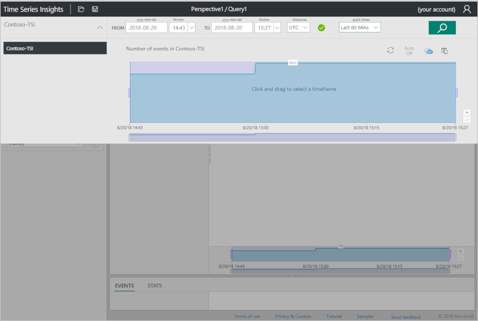
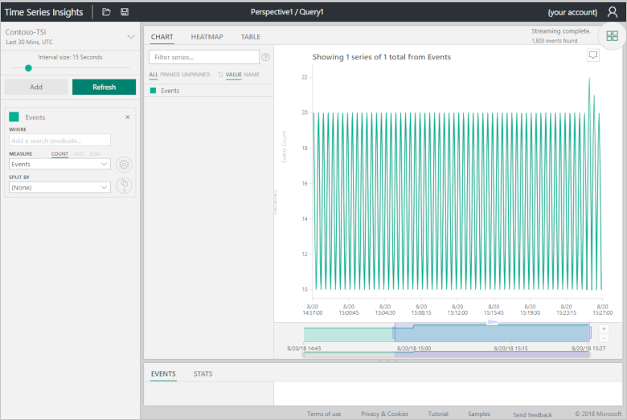
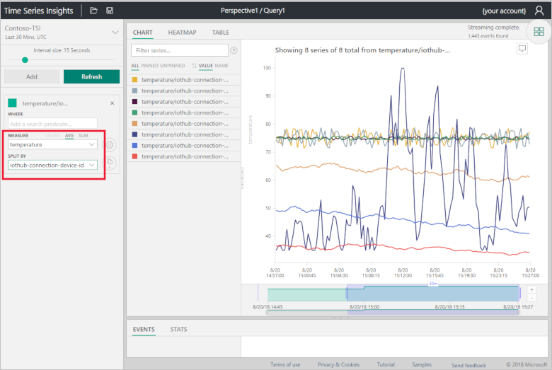
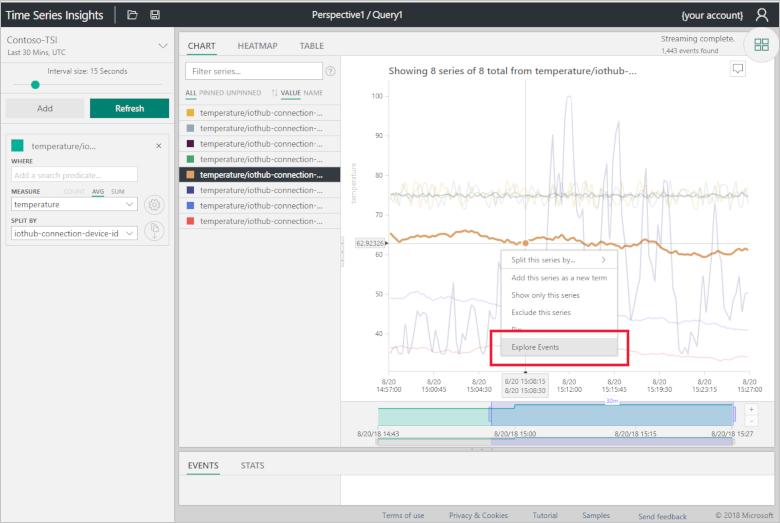
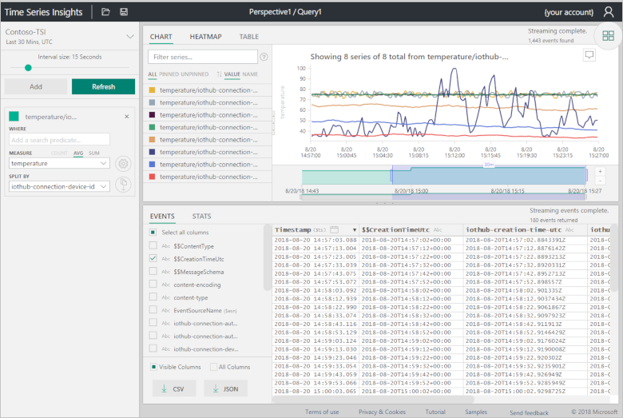
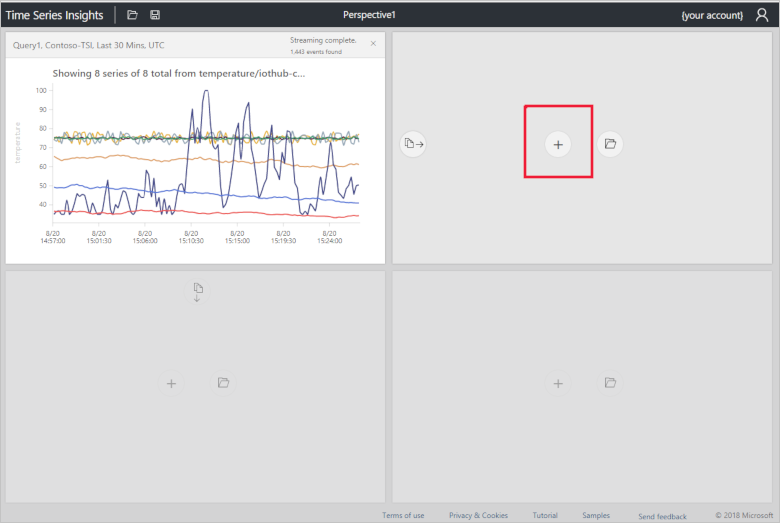
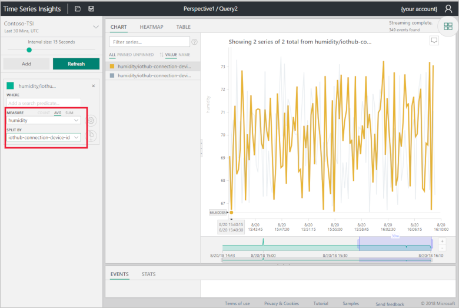
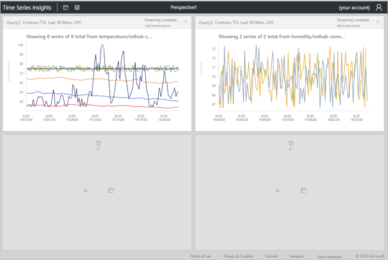

# Use Time Series Insights to visualize telemetry sent from the Remote Monitoring solution accelerator

As an operator, you may want to extend the out-of-the-box data visualization capabilities of the Remote Monitoring solution accelerator. This how-to guide shows you how to use a Time Series Insights environment to visualize and analyze telemetry sent to the Remote Monitoring solution accelerator.

## Prerequisites

To follow the steps in this how-to guide, you need an active Azure subscription. If you don't have an Azure subscription, create a [free account](https://azure.microsoft.com/free/?WT.mc_id=A261C142F) before you begin.

The steps in this how-to guide assume you've deployed the Remote Monitoring solution accelerator to your Azure subscription. If you haven't deployed the solution accelerator, follow the steps in the [Deploy and run a cloud-based remote monitoring solution](quickstart-remote-monitoring-deploy.md) quickstart.

This article assumes the name of your solution accelerator is **contoso-simulation**. Replace **contoso-simulation** with the name of your solution accelerator as you complete the following steps.

[!INCLUDE [cloud-shell-try-it.md](../../includes/cloud-shell-try-it.md)]

[!INCLUDE [iot-accelerators-create-tsi.md](../../includes/iot-accelerators-create-tsi.md)]

## Time Series Insights explorer

The Time Series Insights explorer is a web app you can use to visualize your telemetry.

1. In the Azure portal, select the Time Series Insights **Overview** tab.

1. To open the Time Series Insights explorer web app, click **Go to Environment**:

    

1. In the time selection panel, select **Last 30 minutes** from the quick times menu and click **Search**:

    

1. In the terms panel on the left, select **temperature** as the **Measure** and **iothub-connection-device-id** as the **Split By** value:

    

1. Right-click on the chart and select **Explore events**:

    

1. The event data shows in a grid:

    

1. Click the perspective view button:

    

1. Click **+** to add a new query to the perspective:

    

1. Select **Last 30 minutes** as the time span, **Humidity** as the **Measure**, and **iothub-connection-device-id** as the **Split By** value:

    

1. Click the perspective view button to view your device telemetry dashboard:

    

[!INCLUDE [iot-accelerators-cleanup-tsi.md](../../includes/iot-accelerators-cleanup-tsi.md)]

## Next Steps

To learn about how to explore and query data in the Time Series Insights explorer, see [Azure Time Series Insights explorer](https://docs.microsoft.com/azure/time-series-insights/time-series-insights-explorer).
