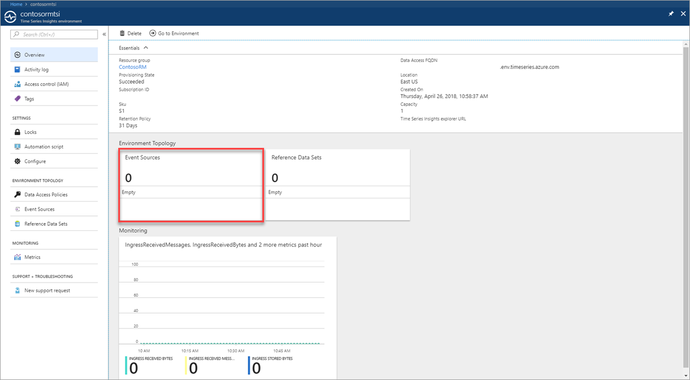
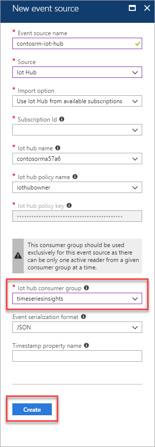
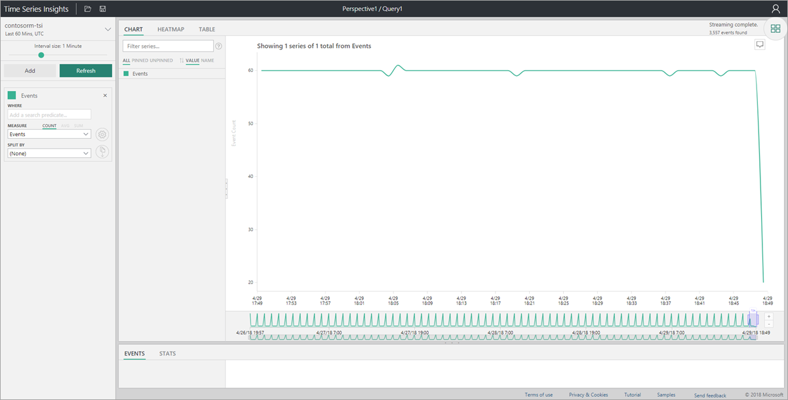
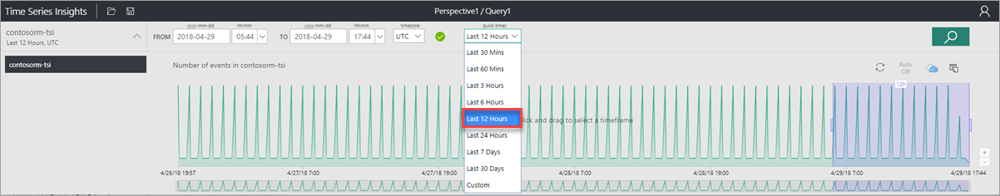
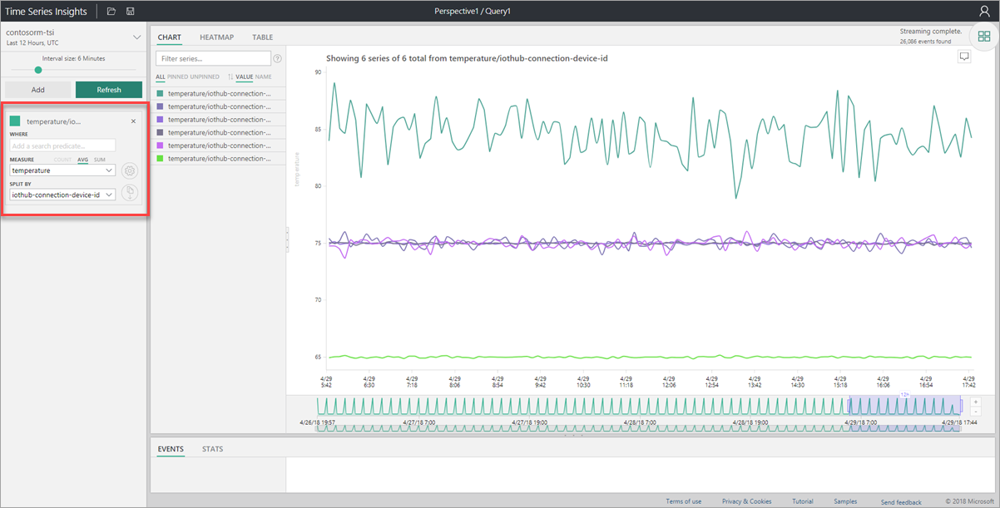
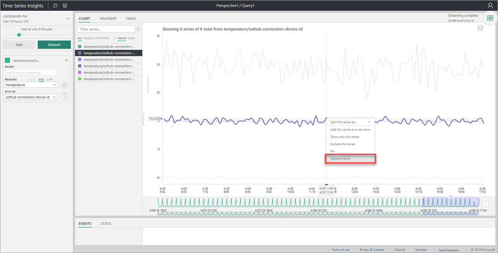
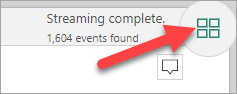
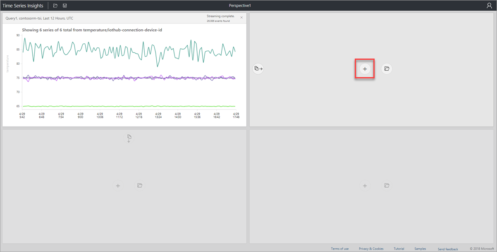
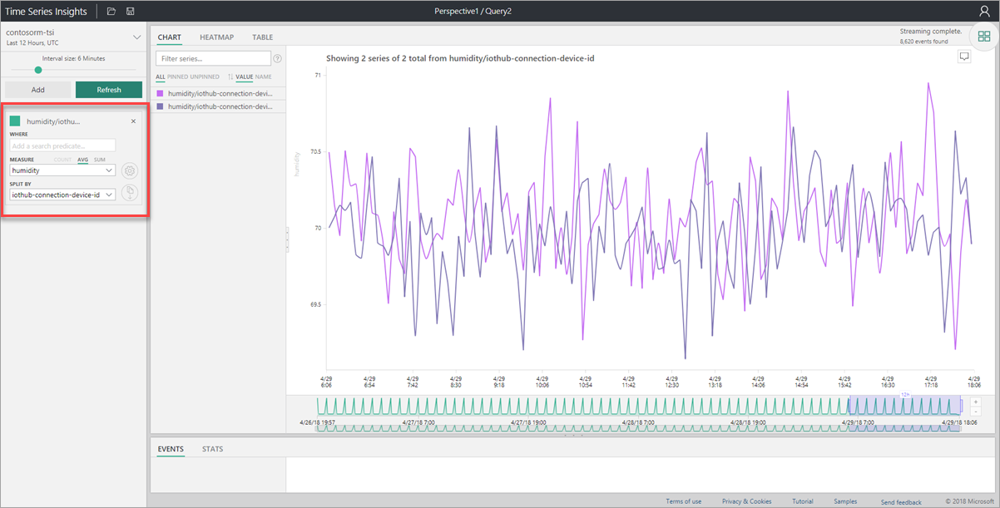
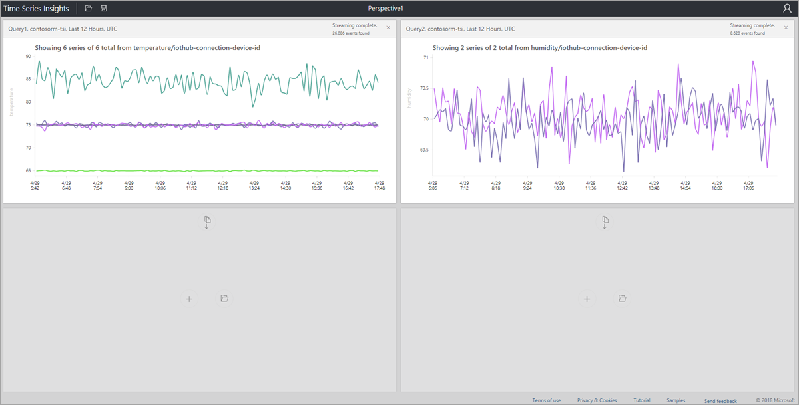

# Visualize Remote Monitoring Data with Time Series Insights

An operator may want to further extend the out of the box data visualization provided by the Remote Monitoring preconfigure solution. Our solution accelerator provides out of the box integration with TSI. In this how-to you will learn how to configure Time Series Insights to analyze device telemetry and detect anomalies.

## Prerequisites

To complete this how-to, you will need the following:

* [Deploy the Remote Monitoring preconfigured solution](iot-accelerators-remote-monitoring-deploy.md)

## Create a consumer group

You will need to create a dedicated consumer group in your IoT hub to be used for streaming data to Time Series Insights.

> [!NOTE]
> Consumer groups are used by applications to pull data from Azure IoT Hub. Each consumer group allows up to five output consumers. You should create a new consumer group for every five output sinks and you can create up to 32 consumer groups.

1. In the Azure portal, click the Cloud Shell button.

1. Execute the following command to create a new consumer group:

```azurecli-interactive
az iot hub consumer-group create --hub-name contosorm30526 --name timeseriesinsights --resource-group ContosoRM
```

## Create a new Time Series Insights environment

Azure Time Series Insights is a fully managed analytics, storage, and visualization service for managing IoT-scale time-series data in the cloud. It provides massively scalable time-series data storage and enables you to explore and analyze billions of events streaming in from all over the world in seconds. Use Time Series Insights to store and manage terabytes of time-series data, explore, and visualize billions of events simultaneously, conduct root-cause analysis, and to compare multiple sites and assets.

1. Sign in to the [Azure portal](http://portal.azure.com/).

1. Select **Create a resource** > **Internet of Things** > **Time Series Insights**.

    

1. To create your Time Series Insights environment, use the values in the following table:

    | Setting | Value |
    | ------- | ----- |
    | Environment Name | The following screenshot uses the name **contorosrmtsi**. Choose your own unique name when you complete this step. |
    | Subscription | Select your Azure subscription in the drop-down. |
    | Resource group | **Create new**. We are using the name **ContosoRM**. |
    | Location | We are using **East US**. Create your environment in the same region as your Remote Monitoring solution. |
    | Sku |**S1** |
    | Capacity | **1** |
    | Pin to dashboard | **Yes** |

    

1. Click **Create**. It can take a moment for the environment to be created.

## Create Event Source

Create a new Event Source to connect to your IoT hub. Make sure that you use the consumer group created in the previous steps. Time Series Insights requires each service to have a dedicated consumer group not in use by another service.

1. Navigate to your new Time Series Environment.

1. On the left, select **Event Sources**.

    

1. Click **Add**.

    

1. To configure your IoT hub as a new event source, use the values in the following table:

    | Setting | Value |
    | ------- | ----- |
    | Event source Name | The following screenshot uses the name **contosorm-iot-hub**. Use your own unique name when you complete this step. |
    | Source | **IoT Hub** |
    | Import option | **Use IoT Hub from available subscriptions** |
    | Subscription Id | Select your Azure subscription in the drop-down. |
    | Iot hub name | **contosorma57a6**. Use the name of your IoT hub from your Remote Monitoring solution. |
    | Iot hub policy name | **iothubowner** Ensure the policy used is an owner policy. |
    | Iot hub policy key | This field is populated automatically. |
    | Iot hub consumer group | **timeseriesinsights** |
    | Event serialization format | **JSON**     | Timestamp property name | Leave blank |

    

1. Click **Create**.

> [!NOTE]
> If you need to grant additional users access to the Time Series Insights explorer, you can use these steps to [grant data access](https://docs.microsoft.com/azure/time-series-insights/time-series-insights-data-access#grant-data-access).

## Time Series Insights Explorer

The Time Series Insights explorer is a web app that helps you create visualizations of your data.

1. Select the **Overview** tab.

1. Click **Go To Environment**, which will open the Time Series Insights explorer web app.

    

1. In the time selection panel, select **Last 12 Hours** from the quick times menu and click **Search**.

    

1. In the terms panel on the left, select a Measure value of **temperature** and a Split By value of **iothub-connection-device-id**.

    

1. Right-click on the chart and select **Explore events**.

    

1. The events are rendered in the grid in tabular format.

    

1. Click the perspective view button.

    

1. Click **Add** to create a new query in the perspective.

    

1. Select a quick time of **Last 12 Hours**, a Measure of **Humidity** and a Split By of **iothub-connection-device-id**.

    

1. Click the perspective view button to view your dashboard of device metrics.

    

## Next Steps

To learn about how to explore and query data in the Time Series Insights explorer, see [Azure Time Series Insights explorer](https://docs.microsoft.com/azure/time-series-insights/time-series-insights-explorer).
