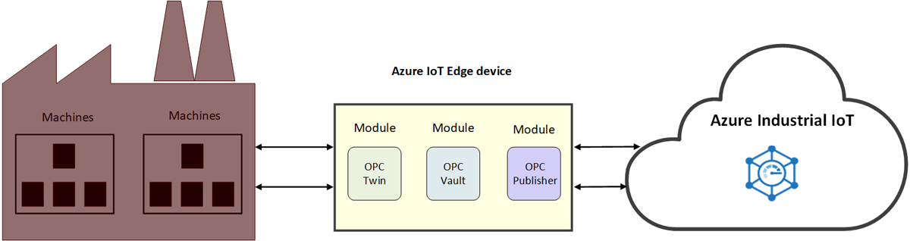

# What is industrial IoT (IIoT)

IIoT is the Industrial Internet of Things. IIoT enhances industrial efficiencies through the application of IoT in the manufacturing industry. 

## Improve industrial efficiencies

Enhance your operational productivity and profitability with a connected factory solution accelerator. Connect and monitor your industrial equipment and devices in the cloud—including your machines already operating on the factory floor. Analyze your IoT data for insights that help you increase the performance of the entire factory floor.

Reduce the time-consuming process of accessing factory floor machines with OPC Twin, and focus your time on building IIoT solutions. Streamline certificate management and industrial asset integration with OPC Vault, and feel confident that asset connectivity is secured. These microservices provide a REST-like API on top of [Azure Industrial IoT components](https://github.com/Azure/azure-iiot-opc-ua). The service API gives you control of edge module functionality. 

> [!NOTE]
> For more information about
Azure Industrial IoT services, see the GitHub [repository](https://github.com/Azure/azure-iiot-services).
> If you're unfamiliar with how Azure IoT Edge modules work, begin with the following articles:
- [About Azure IoT Edge](../iot-edge/about-iot-edge.md)
- [Azure IoT Edge modules](../iot-edge/iot-edge-modules.md)

## Connected factory

[Connected Factory](../iot-accelerators/iot-accelerators-connected-factory-features.md) is an implementation of Microsoft's Azure Industrial IoT reference architecture that can be customized to meet specific business requirements. The full solution code is open-source and available on Connected Factory solution accelerator GitHub repository. You can use it as a starting point for a commercial product, and deploy a pre-built solution into your Azure subscription in minutes. 

## Factory floor connectivity

OPC Twin is an IIoT component that automates device discovery and registration, and offers remote control of industrial devices through REST APIs. OPC Twin, uses Azure IoT Edge and IoT Hub to connect the cloud and the factory network. OPC Twin allows IIoT developers to focus on building IIoT applications without worrying about how to securely access the on-premises machines.

## Security

OPC Vault is an implementation of OPC UA Global Discovery Server (GDS) that can configure, register, and manage certificate lifecycle for OPC UA server and client applications in the cloud. OPC Vault simplifies the implementation and maintenance of secure asset connectivity in the industrial space. By automating certificate management, OPC Vault frees factory operators from the manual and complex processes associated with connectivity and certificate management.

## Next steps

Now that you've had an introduction to industrial IoT and its components, here is the suggested next step:

> [!div class="nextstepaction"]
> [What is OPC Twin](overview-opc-twin.md)
