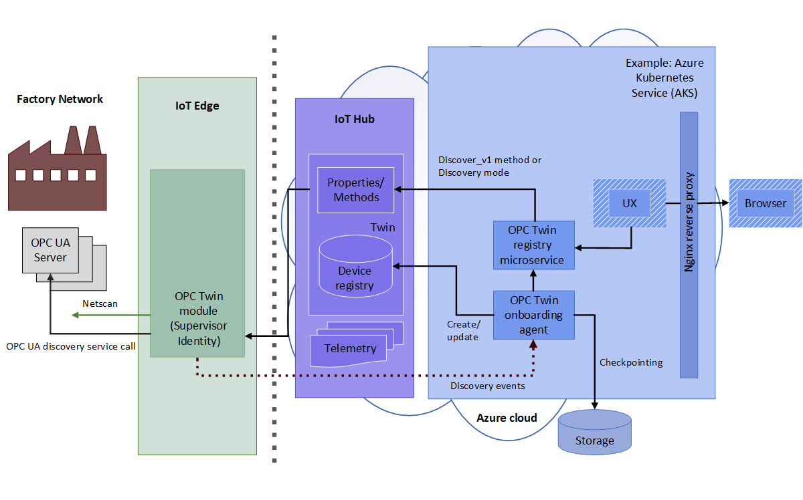
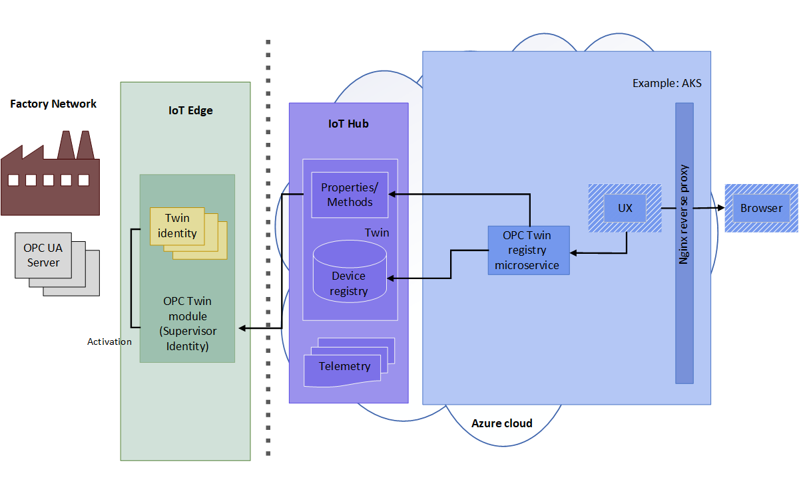
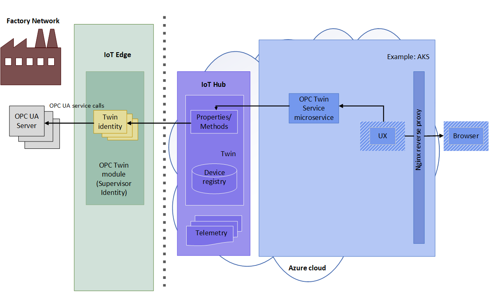
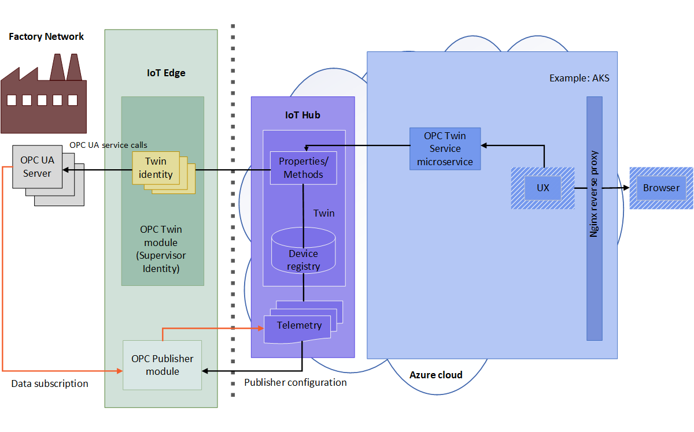

# OPC Twin architecture

The following diagrams illustrate the OPC Twin architecture.

## Discover and activate

1. The operator enables network scanning on the module or makes a one-time discovery using a discovery URL. The discovered endpoints and application information are sent via telemetry to the onboarding agent for processing.  The OPC UA device onboarding agent processes OPC UA server discovery events sent by the OPC Twin IoT Edge module when in discovery or scan mode. The discovery events result in application registration and updates in the OPC UA device registry.

   

1. The operator inspects the certificate of the discovered endpoint and activates the registered endpoint twin for access.​ 

   

## Browse and monitor

1. Once activated, the operator can use the Twin service REST API to browse or inspect the server information model, read/write object variables and call methods.  The user uses a simplified OPC UA API expressed fully in HTTP and JSON.

   

1. The twin service REST interface can also be used to create monitored items and subscriptions in the OPC Publisher. The OPC Publisher allows telemetry to be sent from OPC UA server systems to IoT Hub. For more information about OPC Publisher, see [What is OPC Publisher](overview-opc-publisher.md).

   
