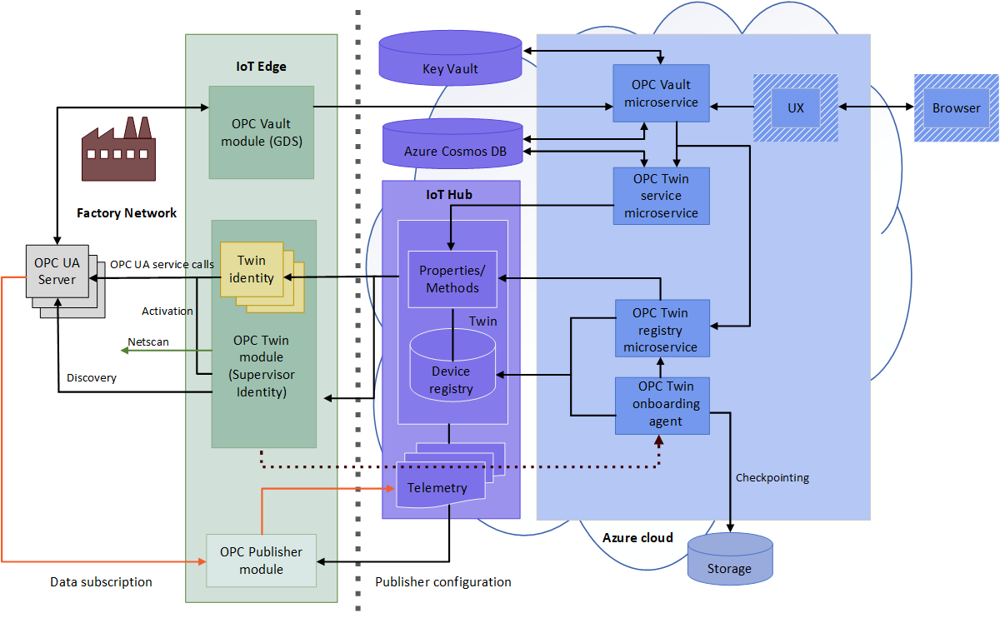

# What is OPC Vault?

OPC Vault is a microservice that can configure, register, and manage certificate lifecycle for OPC UA server and client applications in the cloud. This article describes the OPC Vault's simple use cases.

## Certificate management
​
For example, ​a manufacturing company needs to connect their OPC UA server machine to their newly built client application. When the manufacturer makes the initial access of the server machine, an error message is immediately shown on the OPC UA server application to indicate that the client application is not secure. This mechanism is built in the OPC UA server machine to prevent any unauthorized application access, which prevents vicious hacking on the shop floor.​

## Application security management
A security professional uses OPC Vault microservice to easily enable OPC UA server to communicate with any client application, because OPC Vault has all the functions for certificate registry, storage, and lifecycle management. ​Now the OPC UA server is securely connected, it can communicate to the newly built client application

## The complete OPC Vault architecture
The following diagram illustrates the complete OPC Vault architecture.

