# Quickstart: Try a cloud-based solution to manage my industrial IoT devices

This quickstart shows you how to deploy the Azure IoT Connected Factory solution accelerator to run a cloud-based monitoring and management simulation for industrial IoT devices. When you deploy the Connected Factory solution accelerator, it's pre-populated with simulated resources that let you step through a common industrial IoT scenario. Several simulated factories are connected to the solution, they report the data values needed to compute overall equipment efficiency (OEE) and key performance indicators (KPIs). This quickstart shows you how to use the solution dashboard to:

* Monitor factory, production lines, station OEE, and KPI values.
* Analyze the telemetry data generated from these devices.
* Respond to alarms.

To complete this quickstart, you need an active Azure subscription.

If you don't have an Azure subscription, create a [free account](https://azure.microsoft.com/free/?WT.mc_id=A261C142F) before you begin.

## Deploy the solution

When you deploy the solution accelerator to your Azure subscription, you must set some configuration options.

Navigate to [Microsoft Azure IoT solution accelerators](https://www.azureiotsolutions.com) and sign in using your Azure account credentials.

Click the **Connected Factory** tile. On the **Connected Factory** page, click **Try Now**:

On the **Create Connected Factory solution** page, enter a unique **Solution name** for your Connected Factory solution accelerator. This name is the name of the Azure resource group that contains all the solution accelerator resources. This quickstart uses the name **MyDemoConnectedFactory**.

Select the **Subscription** and **Region** you want to use to deploy the solution accelerator. Typically, you choose the region closest to you. For this quickstart, we're using **Visual Studio Enterprise** and **East US**. You must be a [global administrator or user](iot-accelerators-permissions.md) in the subscription.

Click **Create** to start your deployment. This process takes at least five minutes to run:

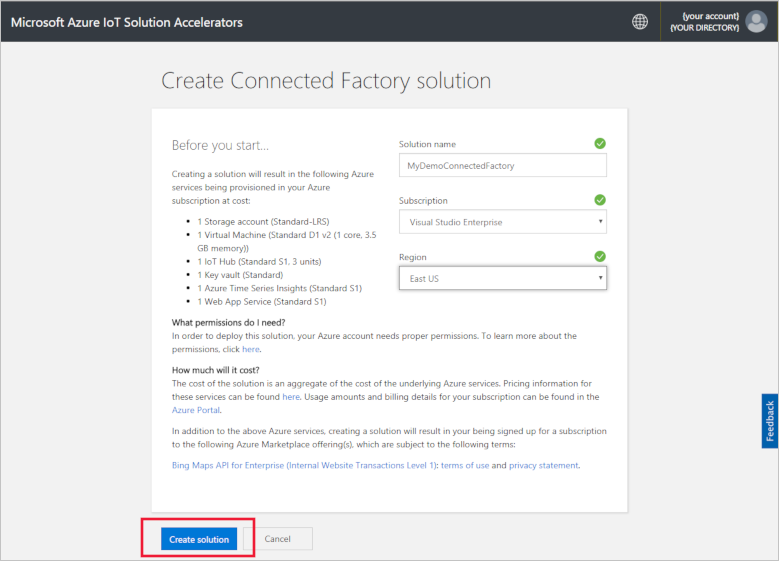

## Sign in to the solution

When the deployment to your Azure subscription is complete, you see a green checkmark and **Ready** on the solution tile. You can now sign in to your Connected Factory solution accelerator dashboard.

On the **Provisioned solutions** page, click your new Connected Factory solution accelerator:

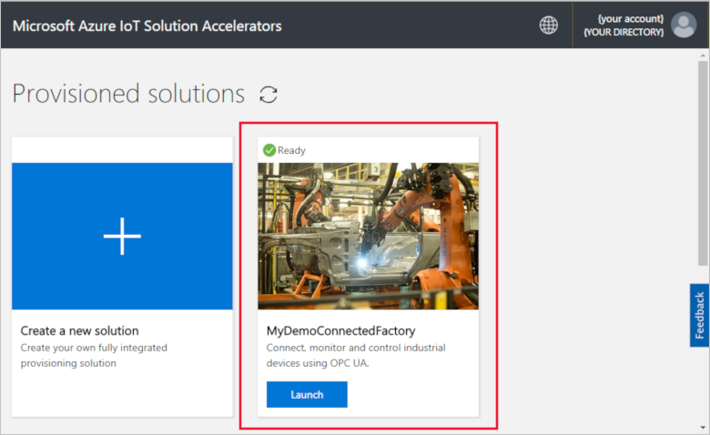

You can view information about your Connected Factory solution accelerator in the page that appears. Choose **Go to your Solution accelerator** to view your Connected Factory solution accelerator:

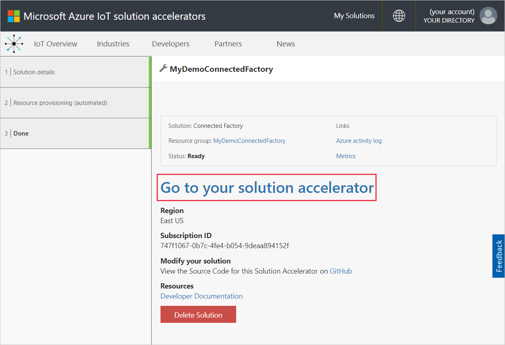

Click **Accept** to accept the permissions request, the Connected Factory solution dashboard displays in your browser. It shows a set of simulated factories, production lines, and stations.

## View the dashboard

The default view is the *dashboard*. To navigate to other areas of the portal, use the menu on the left-hand side of the page:

[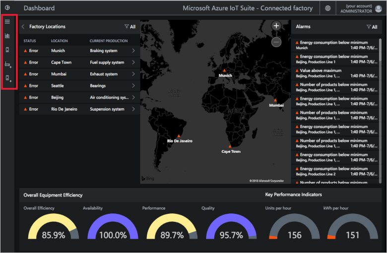](./media/quickstart-connected-factory-deploy/dashboard-expanded.png#lightbox)

You use the dashboard to manage your industrial IoT devices. Connected Factory uses a hierarchy to show a global factory configuration. The top level of the hierarchy is the enterprise that contains one or more factories. Each factory contains production lines, and each production line is made up of stations. At each level you can view OEE and KPIs, publish new nodes for telemetry, and respond to alarms.

On the dashboard you can see:

## Overall equipment efficiency

The **Overall Equipment Efficiency** panel shows the OEE values for the whole enterprise, or the factory/production line/station you're viewing. This value is aggregated from the station view to the enterprise level. The OEE figure and its constituent elements can be further analyzed.

[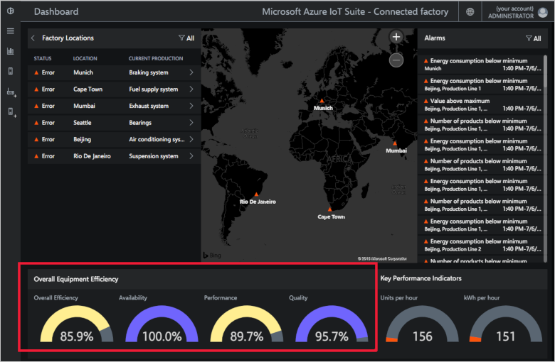](./media/quickstart-connected-factory-deploy/oee-expanded.png#lightbox)

OEE rates the efficiency of the manufacturing process using production-related operational parameters. OEE is an industry standard measure calculated by multiplying the availability rate, performance rate, and quality rate: OEE = availability x performance x quality.

You can further analyze the OEE for any level in the hierarchy data. Click either the OEE, availability, performance, or quality percentage dial. A context panel appears with visualizations showing data over different timescales:

[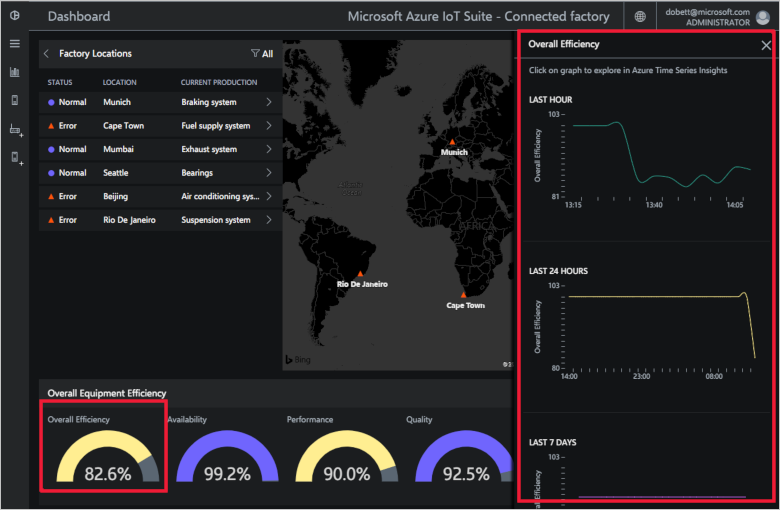](./media/quickstart-connected-factory-deploy/oeedetail-expanded.png#lightbox)

You can click on a chart to do further analysis of the data.

### Key performance indicators

The **Key Performance Indicators** panel displays the number of units produced per hour and energy (kWh) used by the whole enterprise or by the factory/production line/station you're viewing. These values are aggregated from a station view to the enterprise level.

[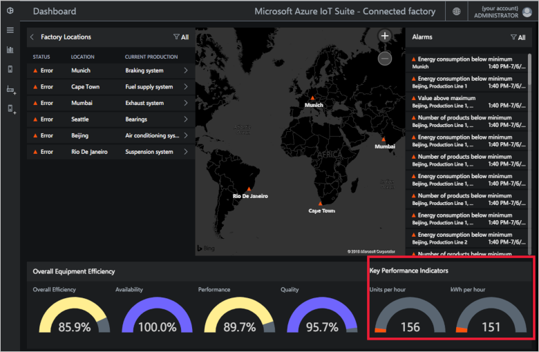](./media/quickstart-connected-factory-deploy/kpis-expanded.png#lightbox)

You can further analyze the KPIs for any level in the hierarchy data. Click either the OEE, availability, performance, or quality percentage dial. A context panel appears with visualizations showing data over different timescales:

[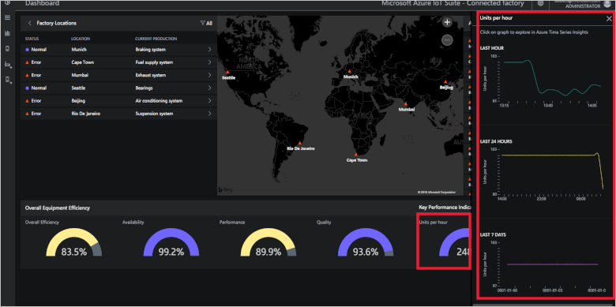](./media/quickstart-connected-factory-deploy/kpidetail-expanded.png#lightbox)

You can click on a chart to do further analysis of the data.

### Factory Locations

A **Factory locations** panel that shows the status, location, and current production configuration in the solution. When you first run the solution accelerator, the dashboard shows a simulated set of factories. Each production line simulation is made up of three real OPC UA servers that run simulated tasks and share data. For more information about OPC UA, see the [Connected Factory FAQ](iot-accelerators-faq-cf.md):

[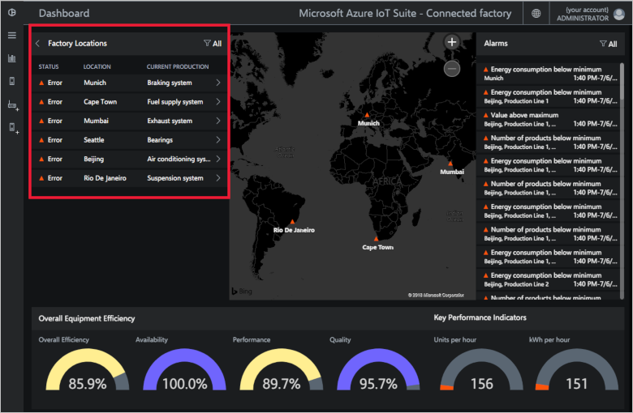](./media/quickstart-connected-factory-deploy/factorylocations-expanded.png#lightbox)

You can navigate through the solution hierarchy and view OEE values and KPIs at each level:

1. In **Factory Locations**, click **Mumbai**. You see the production lines at this location.

1. Click **Production Line 1**. You see the stations on this production line.

1. Click **Packaging**. You see the OPC UA nodes published by this station.

1. Click **EnergyConsumption**. You see some charts plotting this value over different timescales. You can click on a chart to do further analysis of the data.

### Map

If your subscription has access to the [Bing Maps API](iot-accelerators-faq-cf.md), the *Factories* map shows you the geographical location and status of all the factories in the solution. To drill into the location details, click the locations displayed on the map.

[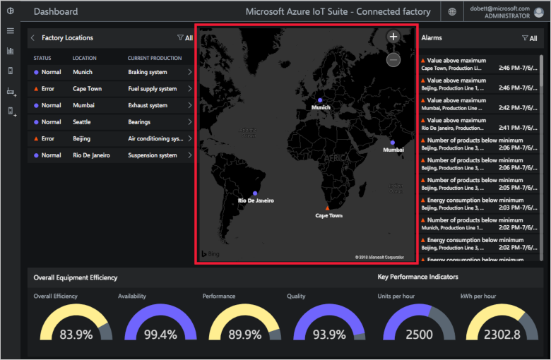](./media/quickstart-connected-factory-deploy/map-expanded.png#lightbox)

### Alarms

The **Alarms** panel shows alarms generated when a reported value or a calculated OEE/KPI value goes over a threshold. This panel displays alarms at each level of the hierarchy, from the station level to the enterprise. Each alarm includes a description, date, time, location, and number of occurrences:

[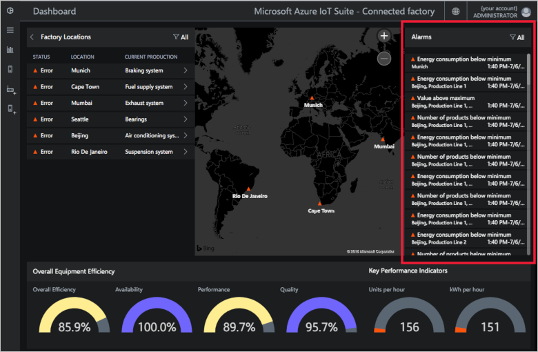](./media/quickstart-connected-factory-deploy/alarms-expanded.png#lightbox)

You can analyze the data that caused the alarm from the dashboard. If you're an Administrator, you can take default actions on the alarms such as:

* Close the alarm.
* Acknowledge the alarm.

Click one of the alarms, in the **Choose action** drop-down, choose **Acknowledge alert**, and then click **Apply**:

[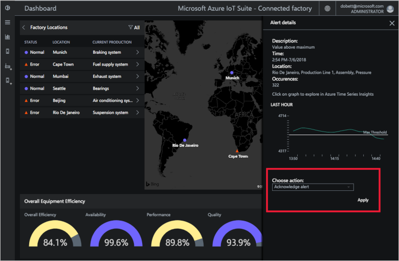](./media/quickstart-connected-factory-deploy/acknowledge-expanded.png#lightbox)

To further analyze the alarm data, click the graph in the alarm panel.

These alarms are generated by rules that are specified in a configuration file in the solution accelerator. These rules can generate alarms when the OEE or KPI figures or OPC UA node values go over a threshold. You can set this threshold value.

## Clean up resources

If you plan to explore further, leave the Connected Factory solution accelerator deployed.

If you no longer need the solution accelerator, delete it from the [Provisioned solutions](https://www.azureiotsolutions.com/Accelerators#dashboard) page by selecting it, and then clicking **Delete Solution**:

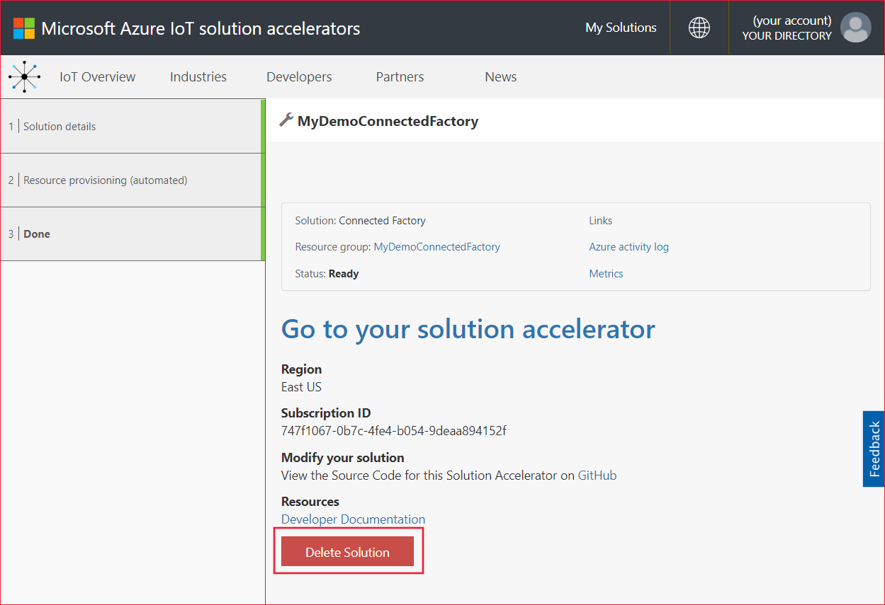

## Next steps

In this quickstart, you deployed the Connected Factory solution accelerator and learned how to navigate through your factories, production lines, and stations. You also saw how to view the OEE and KPI values at any level in the hierarchy, and how to respond to alarms.

To learn how to use other features in the dashboard to manage your industrial IoT devices, continue to the following how-to guide:

> [!div class="nextstepaction"]
> [Use the Connected Factory dashboard](iot-accelerators-connected-factory-dashboard.md)