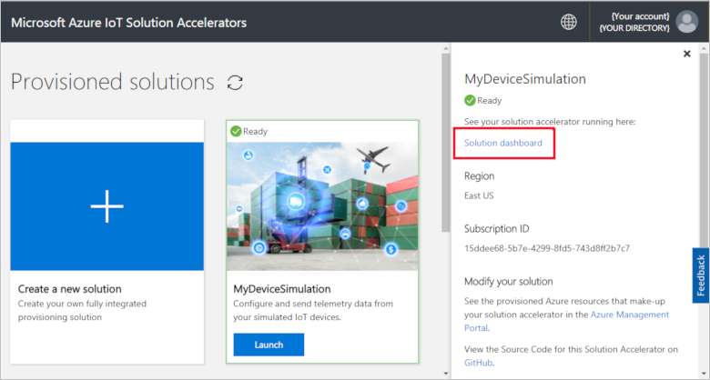
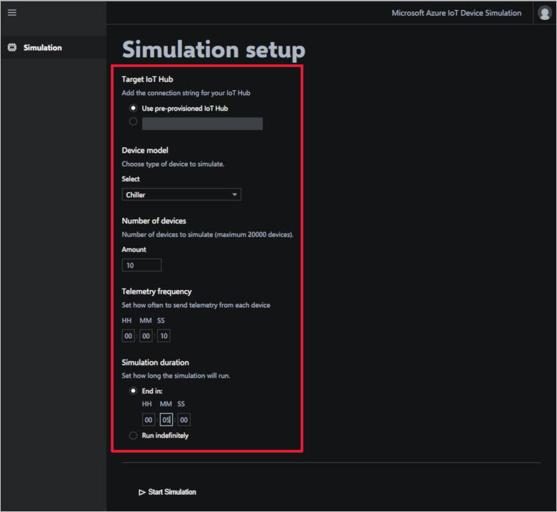
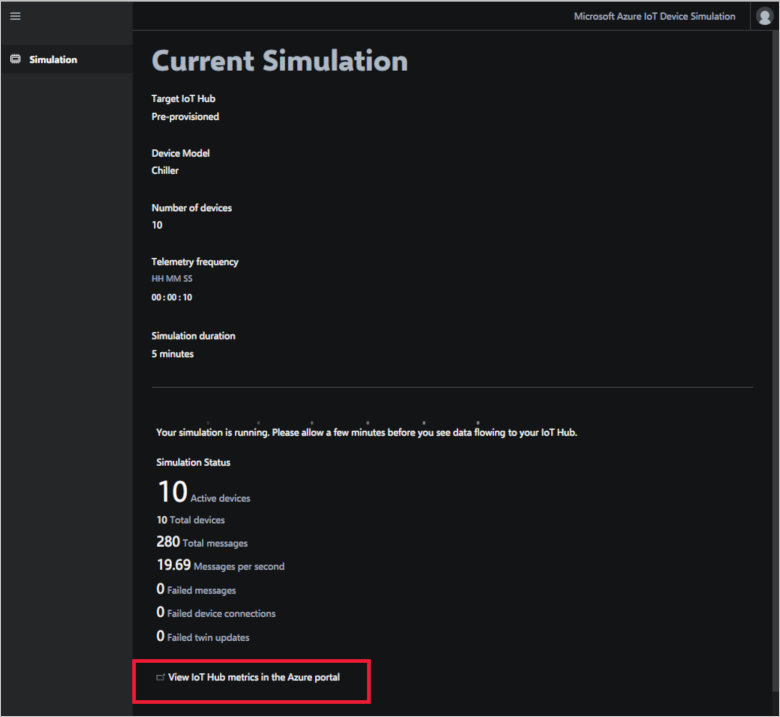

# Quickstart: Deploy and run a cloud-based device simulation solution

This quickstart shows you how to deploy the Azure IoT Device Simulation solution accelerator to use to test your IoT solution. After you've deployed the solution accelerator, you use the **Simulation** page to create and run a simulation.

To complete this quickstart, you need an active Azure subscription.

If you don't have an Azure subscription, create a [free account](https://azure.microsoft.com/free/?WT.mc_id=A261C142F) before you begin.

## Deploy the solution

When you deploy the solution accelerator to your Azure subscription, you must set some configuration options.

Sign in to [azureiotsolutions.com](https://www.azureiotsolutions.com/Accelerators) using your Azure account credentials.

Click **Try Now** on the **Device Simulation** tile.

On the **Create Device Simulation solution** page, enter a unique **Solution name**. Make a note of your solution name, it's the name of the Azure resource group that contains all the solution's resources.

Select the **Subscription** and **Region** you want to use to deploy the solution accelerator. Typically, you choose the region closest to you. You must be a [global administrator or user](iot-accelerators-permissions.md) in the subscription.

Check the box to deploy an IoT hub to use with your Device Simulation solution. You can always change the IoT hub your simulation uses later.

Click **Create Solution** to begin provisioning your solution. This process takes at least five minutes to run:

## Sign in to the solution

When the provisioning process is complete, you can sign in to your Device Simulation solution accelerator dashboard.

On the **Provisioned solutions** page, click your new Device Simulation solution accelerator:

You can view information about your Device Simulation solution accelerator in the panel that appears. Choose **Solution dashboard** to view your Device Simulation solution accelerator:

Click **Accept** to accept the permissions request, the Device Simulation solution dashboard displays in your browser:

## Configure the simulation

You configure and run a simulation from the dashboard. Use the values in the following table to configure your simulation:

| Setting             | Value                       |
| ------------------- | --------------------------- |
| Target IoT Hub      | Use pre-provisioned IoT Hub |
| Device model        | Chiller                     |
| Number of devices   | 10                          |
| Telemetry frequency | 10 seconds                  |
| Simulation duration | 5 minutes                   |

## Run the simulation

Click **Start Simulation**. The simulation runs for the duration you chose. You can stop the simulation at any time by clicking **Stop Simulation**. The simulation shows statistics for the current run. Click on **View IoT Hub metrics in the Azure portal** to see the metrics reported by the IoT hub:

You can only run one simulation at a time from a provisioned instance of the solution accelerator.

## Clean up resources

If you plan to explore further, leave the Device Simulation solution accelerator deployed.

If you no longer need the solution accelerator, delete it from the [Provisioned solutions](https://www.azureiotsolutions.com/Accelerators#dashboard) page, by selecting it, and then clicking **Delete Solution**:

## Next steps

In this quickstart, you've deployed the Device Simulation solution accelerator and run an IoT device simulation.

To learn how to use an existing IoT Hub in a simulation, see the following How-to guide:

> [!div class="nextstepaction"]
> [Use an existing IoT hub with the Device Simulation solution accelerator](iot-accelerators-device-simulation-choose-hub.md)
