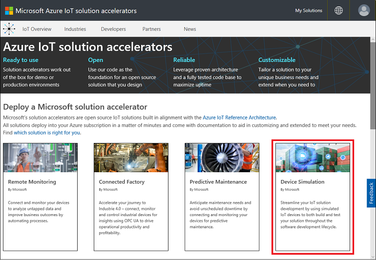
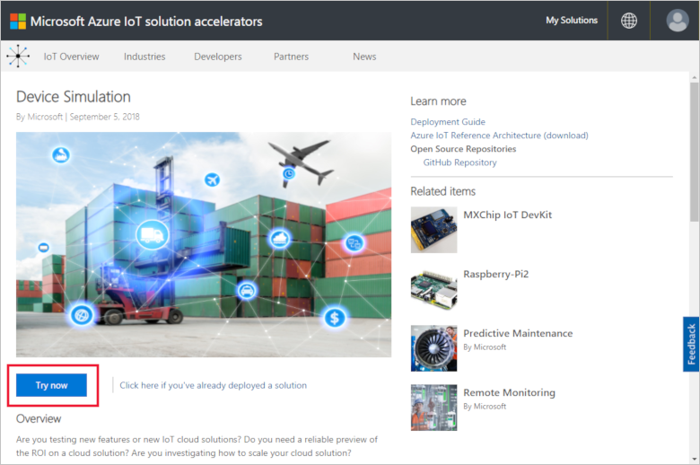
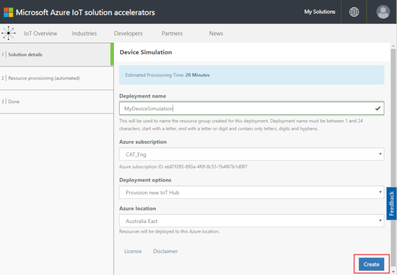
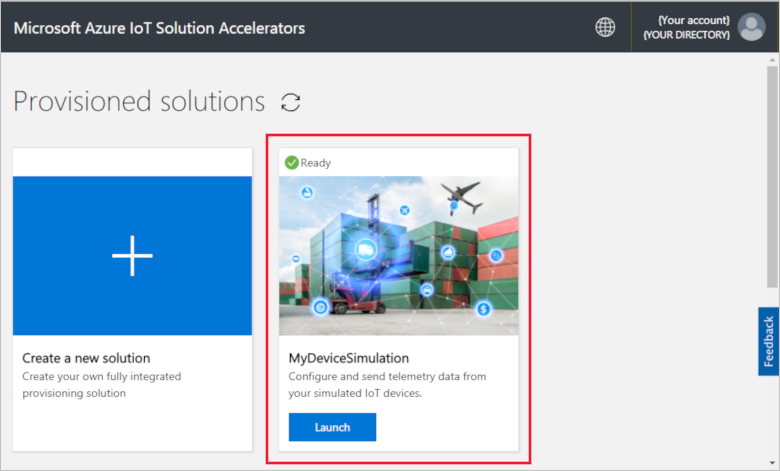
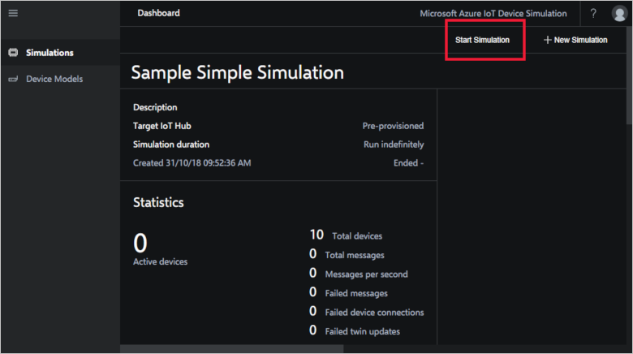
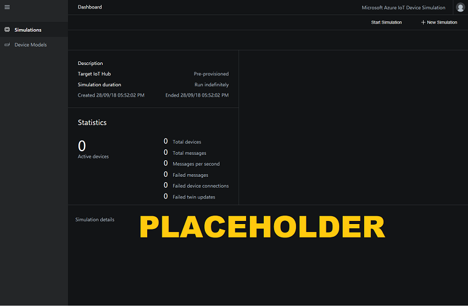
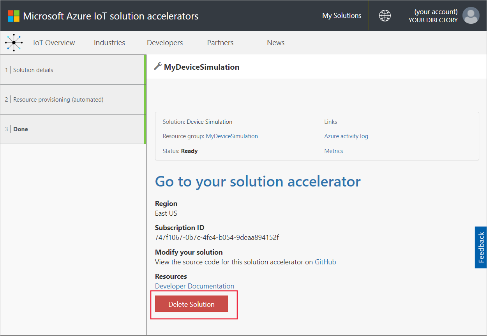

# Quickstart: Deploy and run an IoT device simulation in Azure

This quickstart shows you how to deploy Azure IoT Device Simulation to test your IoT solution. After you've deployed the solution accelerator, you run a sample simulation to get started.

To complete this quickstart, you need an active Azure subscription.

If you don't have an Azure subscription, create a [free account](https://azure.microsoft.com/free/?WT.mc_id=A261C142F) before you begin.

## Deploy Device Simulation

When you deploy Device Simulation to your Azure subscription, you must set some configuration options.

Sign in to [azureiotsolutions.com](https://www.azureiotsolutions.com/Accelerators) using your Azure account credentials.

Click the **Device Simulation** tile:

Click **Try now** on the Device Simulation description page:

On the **Create Device Simulation solution** page, enter a unique **Solution name**.

Select the **Subscription** and **Region** you want to use to deploy the solution accelerator. Typically, you choose the region closest to you. You must be a [global administrator or user](iot-accelerators-permissions.md) in the subscription.

Check the box to deploy an IoT hub to use with your Device Simulation solution. You can always change the IoT hub your simulation uses later.

Click **Create** to begin provisioning your solution. This process takes at least five minutes to run:

## Sign in to the solution

When the provisioning process is complete, you can sign in to your instance of Device Simulation by clicking the **Launch** button:

Click **Accept** to accept the permissions request, the Device Simulation solution dashboard displays in your browser.

When first opened, you see the Device Simulation dashboard with a **Getting started** guide. Click on the first tile to open a sample simulation. If you close the **Getting started** guide, you can open the **Sample Simple Simulation** from the dashboard by clicking its tile:

## Sample Simulation

As a sample simulation, it can't be edited. The simulation is configured with the following settings:

| Setting             | Value                       |
| ------------------- | --------------------------- |
| Target IoT Hub      | Use pre-provisioned IoT Hub |
| Device model        | Truck                       |
| Number of devices   | 10                          |
| Telemetry frequency | 10 seconds                  |
| Simulation duration | Run indefinitely            |

## Run the simulation

Click **Start Simulation**. The simulation will run indefinitely as configured. You can stop the simulation at any time by clicking **Stop Simulation**. The simulation shows statistics for the current run.

You can only run one simulation at a time from a Device Simulation instance.

## Clean up resources

If you plan to explore further, leave Device Simulation deployed.

If you no longer need Device Simulation, delete it from the [Provisioned solutions](https://www.azureiotsolutions.com/Accelerators#dashboard) page, by clicking on its tile, and then clicking **Delete Solution**:

## Next steps

In this quickstart, you've deployed Device Simulation and run a sample IoT device simulation.

> [!div class="nextstepaction"]
> [Create a simulation with one or more device types](iot-accelerators-device-simulation-create-simulation.md)