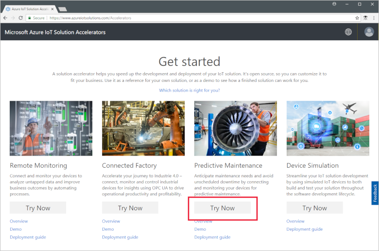
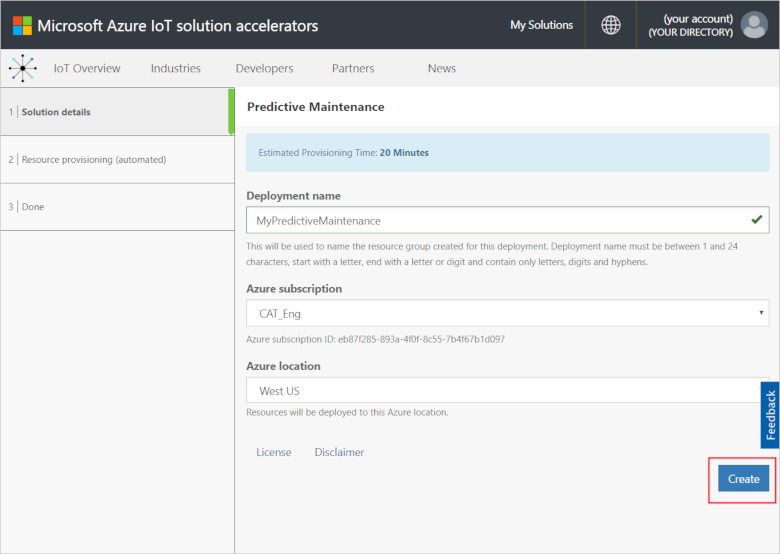
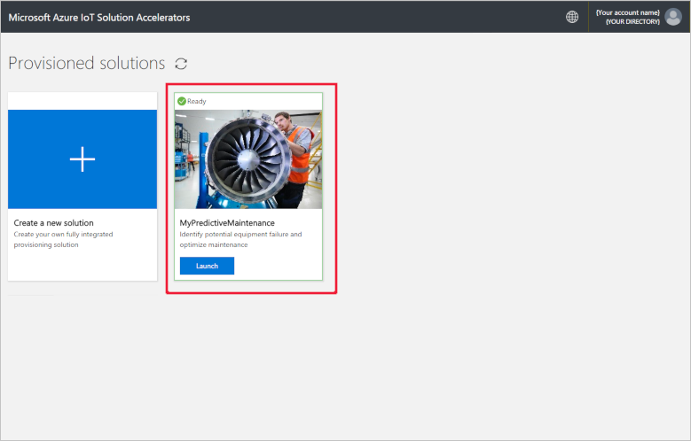
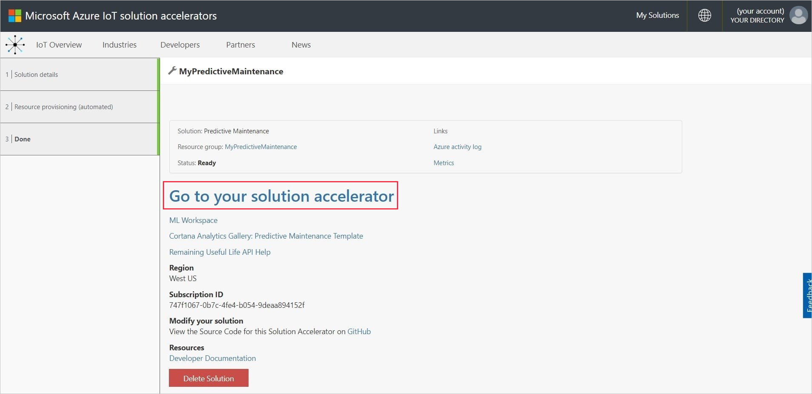
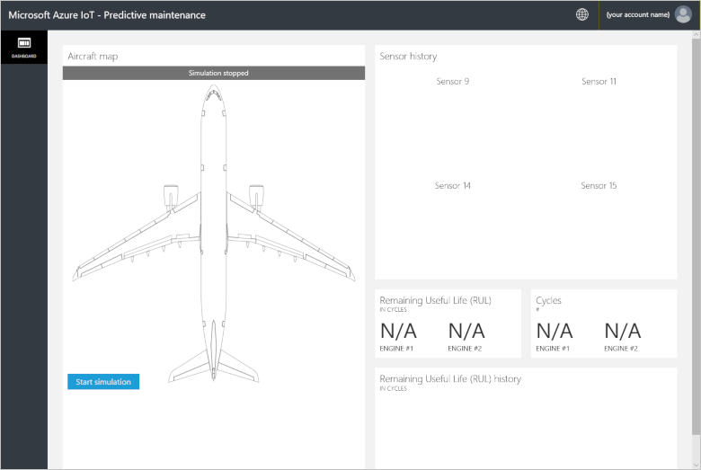
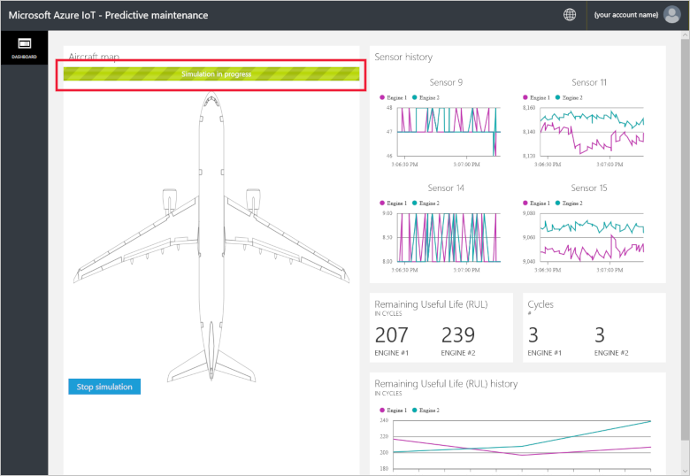
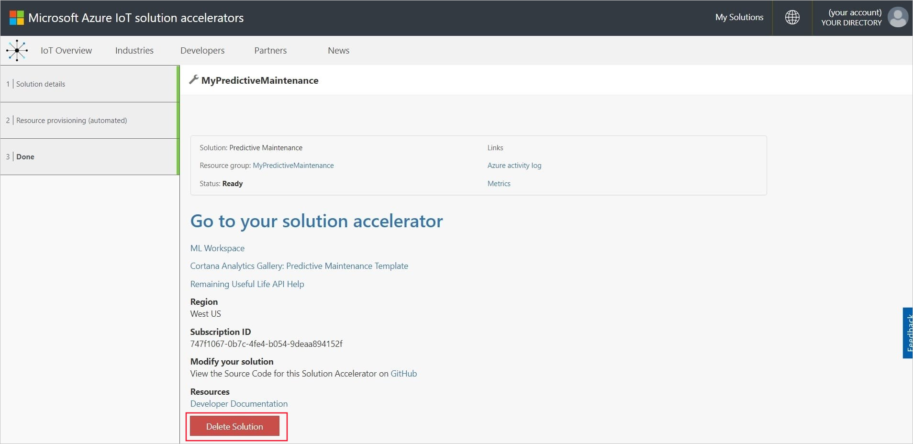

# Quickstart: Try a cloud-based solution to run a predictive maintenance analysis on my connected devices

This quickstart shows you how to deploy the Azure IoT Predictive Maintenance solution accelerator to run a cloud-based predictive maintenance simulation. After you've deployed the solution accelerator, you use the solution **Dashboard** page to run a predictive maintenance analysis on data from a simulated aircraft engine. You can use this solution accelerator as the starting point for your own implementation or as a learning tool.

In the simulation, Fabrikam is a regional airline that focuses on great customer experience at competitive prices. One cause of flight delays is maintenance issues and aircraft engine maintenance is particularly challenging. Fabrikam must avoid engine failure during flight at all costs, so it inspects its engines regularly and schedules maintenance according to a plan. However, aircraft engines don't always wear the same. Some unnecessary maintenance is done on engines. More importantly, issues arise which can ground an aircraft until maintenance is done. These issues can be especially costly if an aircraft is at a location where the right technicians or spare parts aren't available.

The engines of Fabrikam's aircraft are instrumented with sensors that monitor engine conditions during flight. Fabrikam has years of engine operational and failure data from these sensors. Fabrikam's data scientists used this data to develop a model to predict the Remaining Useful Life (RUL) of an aircraft engine. The model uses a correlation between data from four of the engine sensors and the engine wear that leads to eventual failure. While Fabrikam continues to do regular safety inspections, it can now use the models to compute the RUL for each engine after every flight. Fabrikam can now predict future points of failure and plan for maintenance to minimize aircraft ground time. This process reduces operating costs while ensuring the safety of passengers and crew.

To complete this quickstart, you need an active Azure subscription.

If you don't have an Azure subscription, create a [free account](https://azure.microsoft.com/free/?WT.mc_id=A261C142F) before you begin.

## Deploy the solution

When you deploy the solution accelerator to your Azure subscription, you must set some configuration options.

Navigate to [Microsoft Azure IoT solution accelerators](https://www.azureiotsolutions.com) and sign in using your Azure account credentials.

Click the **Predictive Maintenance** tile. On the **Predictive Maintenance** page, click **Try Now**:

On the **Create Predictive Maintenance solution** page, enter a unique **Solution name** for your Predictive Maintenance solution accelerator. For this quickstart, we're using **MyPredictiveMaintenance**.

Select the **Subscription** and **Region** you want to use to deploy the solution accelerator. Typically, you choose the region closest to you. For this quickstart, we're using **Visual Studio Enterprise** and **East US**. You must be a [global administrator or user](iot-accelerators-permissions.md) in the subscription.

Click **Create** to begin the deployment. This process takes at least five minutes to run:

## Sign in to the solution

When the deployment to your Azure subscription is complete, you see a green checkmark and **Ready** on the solution tile. You can now sign in to your Predictive Maintenance solution accelerator dashboard.

On the **Provisioned solutions** page, click your new Predictive Maintenance solution accelerator.

 You can view information about the solution accelerator in the page that appears. Choose **Go to your solution accelerator** to view your Predictive Maintenance solution accelerator:

Click **Accept** to accept the permissions request, the Predictive Maintenance solution dashboard displays in your browser:

Click **Start simulation** to begin the simulation. The sensor history, RUL, Cycles, and RUL history populate the dashboard:

When RUL is less than 160 (an arbitrary threshold chosen for demonstration purposes), the solution portal displays a warning symbol next to the RUL display. The solution portal also highlights the aircraft engine in yellow. Notice how the RUL values have a general downward trend overall, but tend to bounce up and down. This behavior results from the varying cycle lengths and the model accuracy.

The full simulation takes around 35 minutes to complete 148 cycles. The 160 RUL threshold is met for the first time at around 5 minutes and both engines hit the threshold at around 8 minutes.

The simulation runs through the complete dataset for 148 cycles and settles on final RUL and cycle values.

You can stop the simulation at any point, but clicking **Start Simulation** replays the simulation from the start of the dataset.

## Clean up resources

If you plan to explore further, leave the Predictive Maintenance solution accelerator deployed.

If you no longer need the solution accelerator, delete it from the [Provisioned solutions](https://www.azureiotsolutions.com/Accelerators#dashboard) page, by selecting it, and then clicking **Delete Solution**:

## Next steps

In this quickstart, you've deployed the Predictive Maintenance solution accelerator and run a simulation.

To learn more about the solution accelerator and the simulated aircraft engines, continue to the following article.

> [!div class="nextstepaction"]
> [Predictive Maintenance solution accelerator overview](iot-accelerators-predictive-walkthrough.md)
