# Quickstart: Try a cloud-based remote monitoring solution

This quickstart shows you how to deploy the Azure IoT Remote Monitoring solution accelerator. In this cloud-based solution, you use the **Dashboard** page to visualize simulated devices on a map and the **Maintenance** page respond to a pressure alert from a simulated chiller device. You can use this solution accelerator as the starting point for your own implementation or as a learning tool.

The initial deployment configures the solution accelerator for a company called Contoso. As an operator at Contoso, you manage a selection of different device types, such as chillers, deployed in different physical environments. A chiller device sends temperature, humidity, and pressure telemetry to the Remote Monitoring solution accelerator.

This quickstart deploys a **Basic** version of the solution accelerator for test and demonstration purposes that minimizes costs. For more information about the different versions you can deploy, see [Basic and standard deployments](iot-accelerators-remote-monitoring-deploy-cli.md#basic-and-standard-deployments).

To complete this quickstart, you need an active Azure subscription.

If you don't have an Azure subscription, create a [free account](https://azure.microsoft.com/free/?WT.mc_id=A261C142F) before you begin.

## Deploy the solution

When you deploy the solution accelerator to your Azure subscription, you must set some configuration options.

Sign in to [azureiotsolutions.com](https://www.azureiotsolutions.com/Accelerators) using your Azure account credentials.

Click the **Remote Monitoring** tile. On the **Remote Monitoring** page, click **Try Now**:

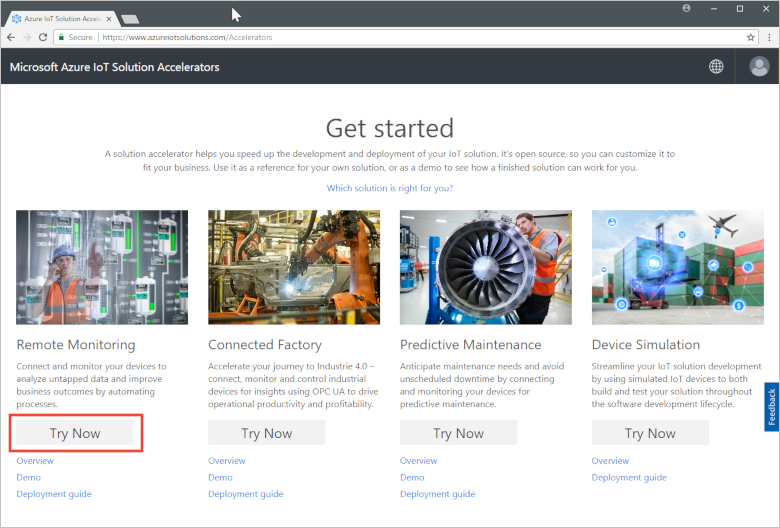

Choose **C# Microservices** as the **Deployment options**. The Java and C# implementations have the same features.

Enter a unique **Solution name** for your Remote Monitoring solution accelerator. For this quickstart, we're calling ours **contoso-rm**.

Select the **Subscription** and **Region** you want to use to deploy the solution accelerator. Typically, you choose the region closest to you. For this quickstart, we're using **East US**.
You can choose **Visual Studio Enterprise**, but you must be a [global administrator or user](iot-accelerators-permissions.md) to do so.

To begin your deployment, click **Create**. This process takes at least five minutes to run:

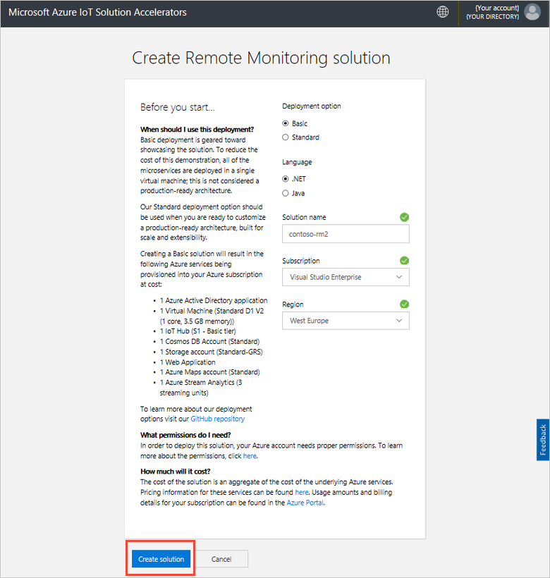

## Sign in to the solution

When the deployment to your Azure subscription is complete, you see a green checkmark and **Ready** on the solution tile. You can now sign in to your Remote Monitoring solution accelerator dashboard.

On the **Provisioned solutions** page, click your new Remote Monitoring solution accelerator:

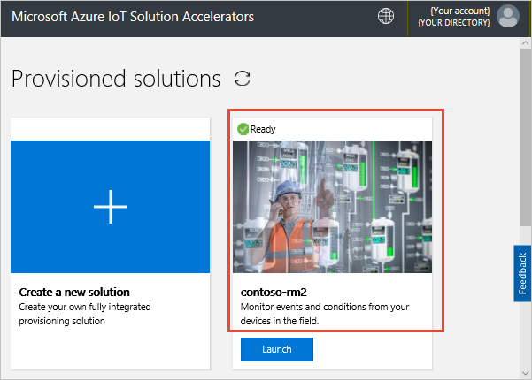

You can view information about your Remote Monitoring solution accelerator in the panel that appears. Choose **Go to your solution accelerator** to view your Remote Monitoring solution accelerator:

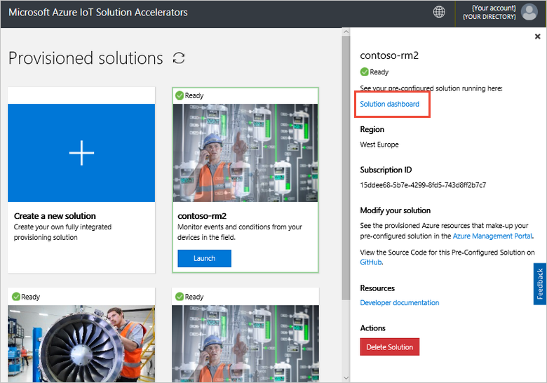

Click **Accept** to accept the permissions request, the Remote Monitoring solution dashboard displays in your browser:

[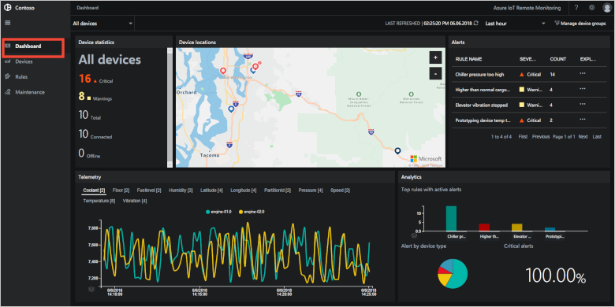](./media/quickstart-remote-monitoring-deploy/solutiondashboard-expanded.png#lightbox)

## View your devices

The solution dashboard shows the following information about Contoso's simulated devices:

* The **Device statistics** panel shows summary information about alerts and the total number of devices. In the default deployment, Contoso has 10 simulated devices of different types.

* The **Device locations** panel shows where your devices are physically located. The color of the pin shows when there are alerts from the device.

* The **Alerts** panel shows details of alerts from your devices.

* The **Telemetry** panel shows telemetry from your devices. You can view different telemetry streams by clicking the telemetry types at the top.

* The **Analytics** panel shows combined information about the alerts from your devices.

## Respond to an alert

As an operator at Contoso, you can monitor your devices from the solution dashboard. The **Device statistics** panel shows there have been a number of critical alerts, and the **Alerts** panel shows most of them are coming from a chiller device. For Contoso's chiller devices, an internal pressure over 250 PSI indicates the device isn't working correctly.

### Identify the issue

On the **Dashboard** page, in the **Alerts** panel, you can see the **Chiller pressure too high** alert. The chiller has a red pin on the map (you may need to pan and zoom on the map):

[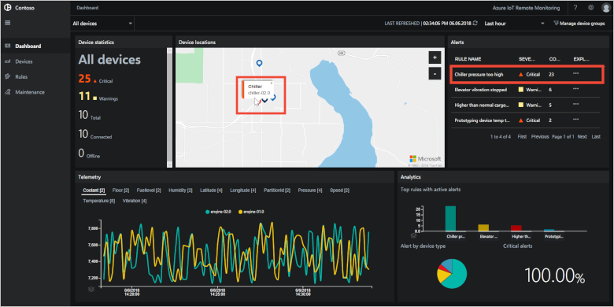](./media/quickstart-remote-monitoring-deploy/dashboardalarm-expanded.png#lightbox)

In the **Alerts** panel, click **...** in the **Explore** column next to the **Chiller pressure too high** rule. This action takes you to the **Maintenance** page where you can view the details of the rule that triggered the alert.

The **Chiller pressure too high** maintenance page shows details of the rule that triggered the alerts. The page also lists when the alerts occurred and which device triggered them:

You've now identified the issue that triggered the alert and the associated device. As an operator, your next steps are to acknowledge the alert and fix the issue.

### Fix the issue

To indicate to other operators that you're working on the alert, select it, and change the **Alert status** to **Acknowledged**:

[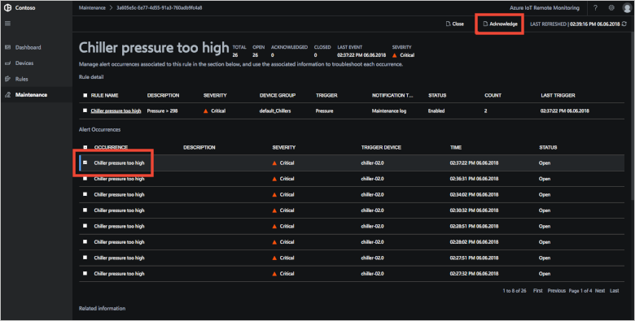](./media/quickstart-remote-monitoring-deploy/maintenanceacknowledge-expanded.png#lightbox)

The value in the status column changes to **Acknowledged**.

To act on the chiller, scroll-down to **Related information**, select the chiller device in the **Alerted devices** list, and then choose **Jobs**:

[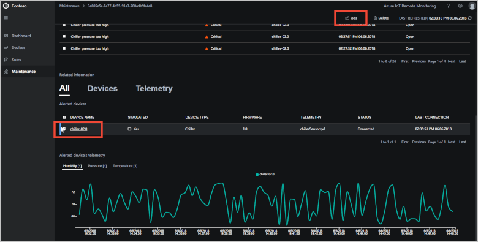](./media/quickstart-remote-monitoring-deploy/maintenanceschedule-expanded.png#lightbox)

In the **Jobs** panel, choose **Run method** and then the **EmergencyValveRelease** method. Add the job name **ChillerPressureRelease**, and click **Apply**. These settings create a job for you that executes immediately.

To view the job status, return to the **Maintenance** page and view the list of jobs in the **Jobs** view. You may need to wait a few seconds before you can see the job has run:

[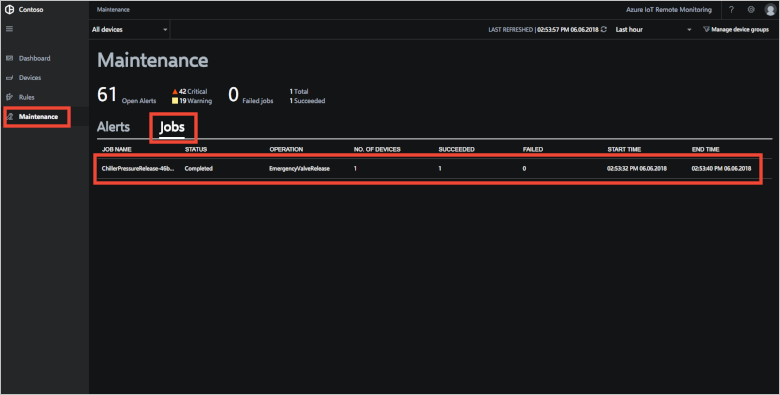](./media/quickstart-remote-monitoring-deploy/maintenancerunningjob-expanded.png#lightbox)

### Check the pressure is back to normal

To view the pressure telemetry for the chiller, navigate to the **Dashboard** page, select **Pressure** in the telemetry panel, and confirm that the pressure for **chiller-02.0** is back to normal:

[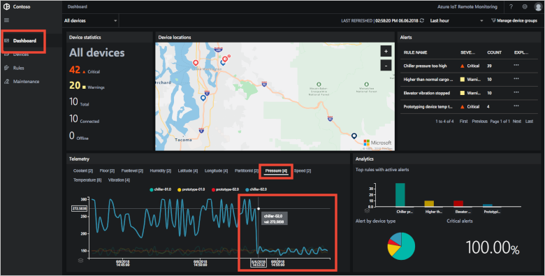](./media/quickstart-remote-monitoring-deploy/pressurenormal-expanded.png#lightbox)

To close the incident, navigate to the **Maintenance** page, select the alert, and set the status to **Closed**:

[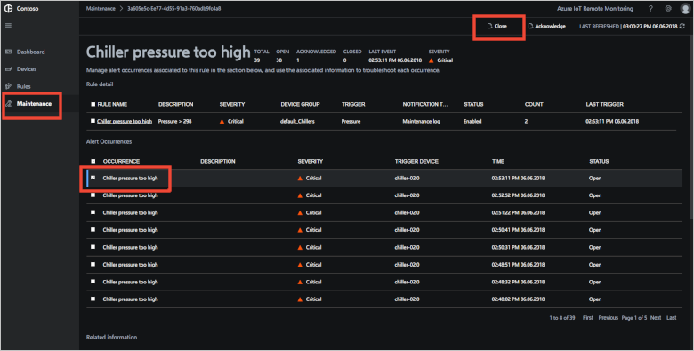](./media/quickstart-remote-monitoring-deploy/maintenanceclose-expanded.png#lightbox)

The value in the status column changes to **Closed**.

## Clean up resources

If you plan to move on to the tutorials, leave the Remote Monitoring solution accelerator deployed.

If you no longer need the solution accelerator, delete it from the [Provisioned solutions](https://www.azureiotsolutions.com/Accelerators#dashboard) page, by selecting it, and then clicking **Delete Solution**:

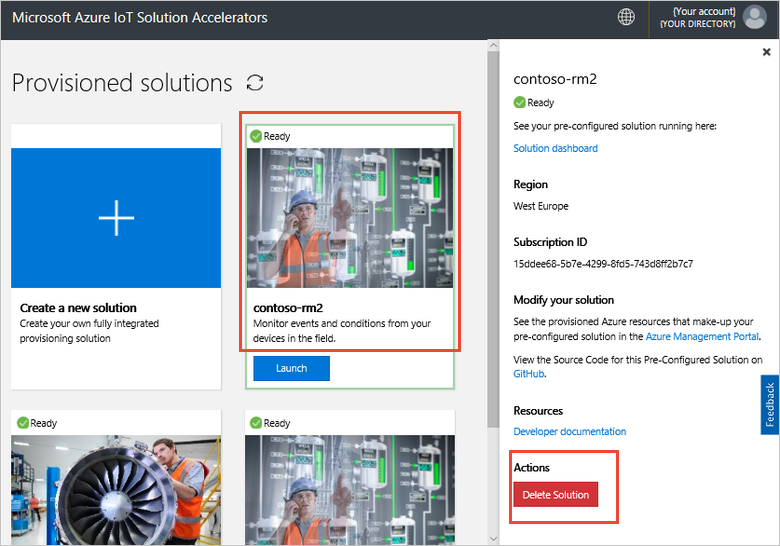

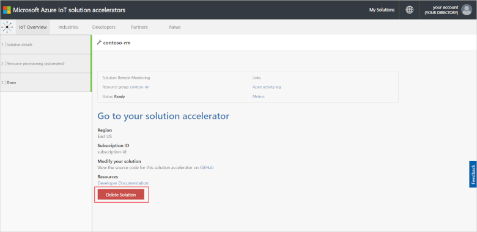

## Next steps

In this quickstart, you've deployed the Remote Monitoring solution accelerator and completed a monitoring task using the simulated devices in the default Contoso deployment.

To learn more about the solution accelerator using simulated devices, continue to the following tutorial.

> [!div class="nextstepaction"]
> [Tutorial: Monitor your IoT devices](iot-accelerators-remote-monitoring-monitor.md)