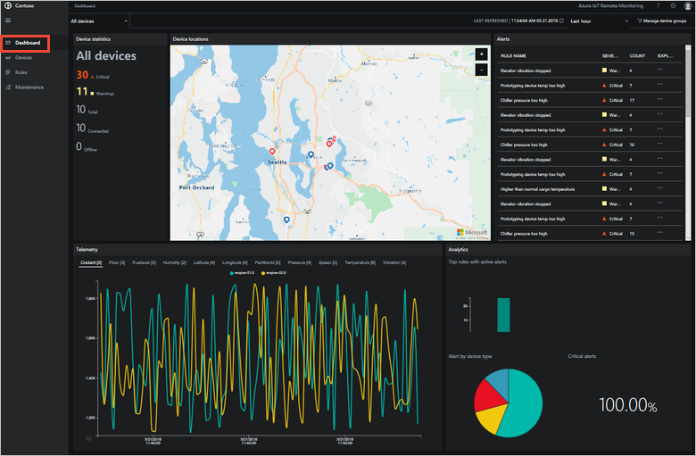
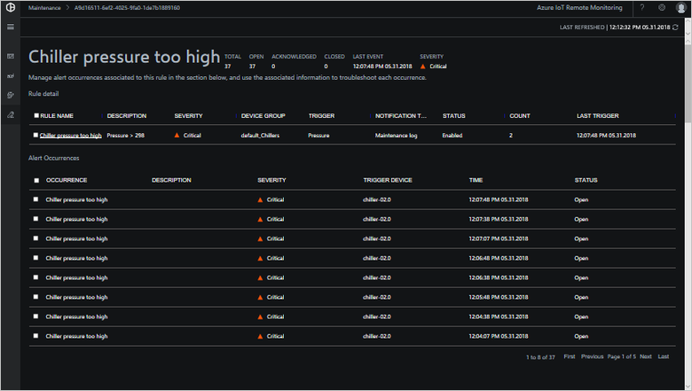
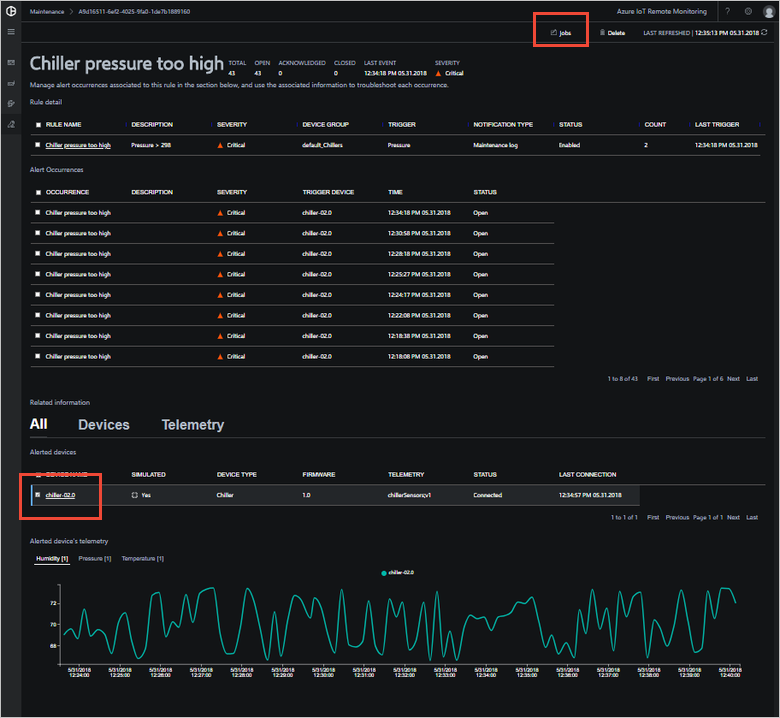
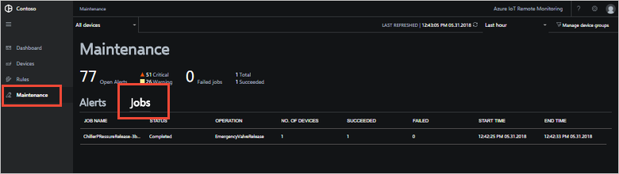
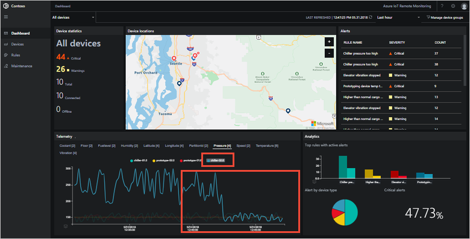

# Quickstart: Deploy the Remote Monitoring solution accelerator and use the solution dashboard

This quickstart shows you how to deploy the Remote Monitoring solution accelerator. After you've deployed the solution, you use the solution dashboard to visualize your devices on a map, and respond to a pressure alert from a simulated chiller device.

The default deployment configures the Remote Monitoring solution for a company called Contoso that manages a selection of different devices in different environments. Contoso uses different types of smart devices, including chillers that send temperature, humidity, and pressure telemetry. Operators at Contoso know the thresholds that determine whether a device is working correctly. For example, a chiller isn't working correctly if its internal pressure goes above 250 PSI.

## Prerequisites

To complete this tutorial, you need an active Azure subscription.

If you don't have an Azure subscription, create a [free account](https://azure.microsoft.com/free/?WT.mc_id=A261C142F) before you begin.

## Deploy the solution

Before you deploy the solution accelerator to your Azure subscription, you must choose some configuration options:

1. Log on to [azureiotsolutions.com](https://www.azureiotsolutions.com/Accelerators) using your Azure account credentials.

1. Click **Try Now** on the **Remote Monitoring** tile.

    

1. On the **Create Remote Monitoring solution** page, select a **Basic** deployment. If you're deploying the solution to learn how it works or to run a demonstration, choose the **Basic** option to minimize costs.

1. Choose **.NET** as the language. All the microservices are available as either Java or .NET implementations.

1. Enter a unique **Solution name** for your Remote Monitoring solution accelerator.

1. Select the **Subscription** and **Region** you want to use to deploy the solution. Typically, you choose the region closest to you.

1. Click **Create Solution** to begin the deployment. This process takes several minutes to run:

    

## Sign in to the solution

When the deployment is complete, you can sign in to your Remote Monitoring solution accelerator.

1. On the **Provisioned solutions** page, click your new Remote Monitoring solution:

    

1. You can view information about your Remote Monitoring solution in the panel that appears. Choose **Solution dashboard** to connect to your Remote Monitoring solution:

    

1. The Remote Monitoring solution dashboard displays in your browser:

    

## View your devices

The solution dashboard shows the following information about Contoso's devices:

* **Device statistics** shows summary information about alerts and the total number of devices. In the default deployment Contoso has 10 simulated devices of different types.

* **Device locations** shows where your devices are physically located. The color of the pin shows when there are alerts from the device.

* **Alerts** shows details of alerts from your devices.

* **Telemetry** shows telemetry from your devices. You can view different telemetry streams by clicking the telemetry types at the top.

* **Analytics** shows combined information about the alerts from your devices.

## Respond to an alert

As an operator at Contoso, you can monitor your devices from the solution dashboard. The **Device statistics** panel shows there have been a number of critical alerts, and the **Alerts** panel shows most of them are coming from a chiller device.

1. On the **Dashboard** page, in the **Alerts** grid, you can see the **Chiller pressure too high** alert. The chiller has a red pin on the map:

    

1. Click **Explore** next to the **Chiller pressure too high** rule in the **Alerts** panel. This action takes you to the **Maintenance** page where you can view the details of the rule that triggered the alert.

1. The **Chiller pressure too high** maintenance page shows details of the rule that triggered the alerts, lists when the alerts occurred and which device triggered it:

    

    You've now identified the issue that triggered the alert and the associated device. As an operator, the next steps are to acknowledge the alert and mitigate the issue.

1. To indicate to other operators that you're now working on the alert, change the **Alert status** to **Acknowledged**:

    

1. To act on the chiller, scroll-down, select it in the **Alerted devices** list and then choose **Jobs**. Select **Run method**, then **EmergencyValveRelease**, add a job name **ChillerPressureRelease**, and choose **Apply**. These settings create a job that executes immediately:

    

1. To view the job status, return to the **Maintenance** page and view the list of jobs in the **Jobs** view. You can see the job has run to release the valve pressure on the chiller:

    

Finally, confirm that the telemetry values from the chiller are back to normal.

1. Navigate to the **Dashboard** page.

1. To view the pressure telemetry, select **Pressure** in the telemetry panel, and confirm that the pressure for **chiller-02.0** is back to normal.

    

1. To close the incident, navigate to the **Maintenance** page, select the alert, and set the status to **Closed**:

    

## Clean up resources

If you plan to move on to the tutorials, leave the Remote Monitoring solution accelerator deployed.

If you don't need the solution accelerator any longer, delete it from the [Provisioned solutions](https://www.azureiotsolutions.com/Accelerators#dashboard) page:

## Next steps

In this quickstart, you've deployed the Remote Monitoring solution accelerator and completed a monitoring task using the simulated devices in the default Contoso deployment.

To learn how to update the firmware in your connected devices and organize your assets in the solution, continue to the next tutorial.

> [!div class="nextstepaction"]
> [Tutorial: Explore the capabilities of the Remote Monitoring solution accelerator](iot-accelerators-remote-monitoring-explore.md)