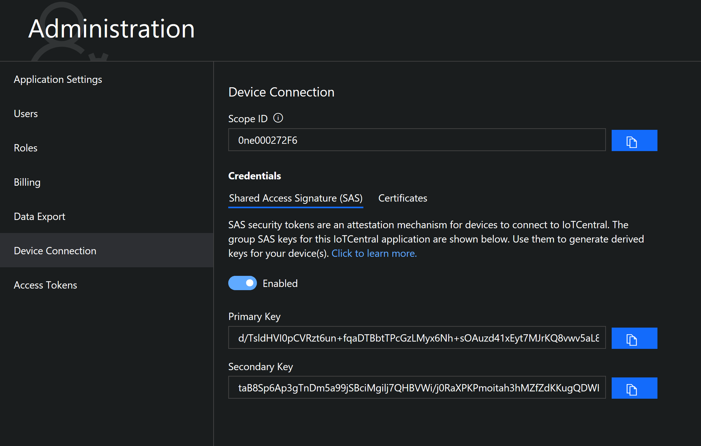

# Device connectivity in Azure IoT Central

This article introduces key concepts relating to device connectivity in Microsoft Azure IoT Central.

Azure IoT Central uses the [Azure IoT Hub Device Provisioning service (DPS)](https://docs.microsoft.com/azure/iot-dps/about-iot-dps) to manage all device registration and connection.

Using DPS enables:

- IoT Central to support onboarding and connecting devices at scale.
- You to generate device credentials and configure the devices offline without registering the devices through IoT Central UI.
- Devices to connect using shared access signatures (SAS).
- Devices to connect using industry-standard X.509 certificates.
- You to use your own device IDs to register devices in IoT Central. Using your own device IDs simplifies integration with existing back-office systems.
- A single, consistent way to connect devices to IoT Central.

This article describes the following four use cases:

1. [Quickly connect a single device using SAS](#connect-a-single-device)
1. [Connect devices at scale using SAS](#connect-devices-at-scale-using-sas)
1. [Connect devices at scale using X.509 certificates](#connect-devices-using-x509-certificates) this is the recommended approach for production environments.
1. [Connect without first registering devices](#connect-without-registering-devices)

## Connect a single device

This approach is useful when you're experimenting with IoT Central or testing devices. You can use the device connection information from your IoT Central application to generate the connection string for a device. For detailed steps, see [How to generate a device connection string to connect to an Azure IoT Central application](howto-generate-connection-string.md).

## Connect devices at scale using SAS

To connect devices to IoT Central at scale using SAS, you need to register and then set up the devices:

### Register devices in bulk

To register a large number of devices with your IoT Central application, use a CSV file to [import device IDs and device names](howto-manage-devices.md#import-devices).

To retrieve the connection information for the imported devices, [export a CSV file from your IoT Central application](howto-manage-devices.md#export-devices).

> [!NOTE]
> To learn how you can connect devices without first registering them in IoT Central, see [Connect without first registering devices](#connect-without-registering-devices).

### Set up your devices

Use the connection information from the export file in your device code to enable your devices to connect and send data to IoT to your IoT Central application. For more information about connecting devices, see [Next steps](#next-steps).

## Connect devices using X.509 certificates

In a production environment, using X.509 certificates is the recommended device authentication mechanism for IoT Central. To learn more, see [Device Authentication using X.509 CA Certificates](../iot-hub/iot-hub-x509ca-overview.md).

The following steps describe how to connect devices to IoT Central using X.509 certificates:

1. In your IoT Central application, _add and verify the intermediate or root X.509 certificate_ you're using to generate device certificates:

    - Navigate to **Administration > Device Connection > Certificates (X.509)** and add X.509 root or intermediate certificate you're using to generate the leaf device certificates.

      

      If you have a security breach or your primary certificate is set to expire, use the secondary certificate to reduce downtime. You can continue to provision devices using the secondary certificate while you update the primary certificate.

    - Verifying certificate ownership ensures that the uploader of the certificate has the certificate's private key. To verify the certificate:
        - Select the button next to **Verification Code** to generate a code.
        - Create an X.509 verification certificate with the verification code you generated in the previous step. Save the certificate as a .cer file.
        - Upload the signed verification certificate and select **Verify**.

          

1. Use a CSV file to _import and register devices_ in your IoT Central application.

1. _Set up your devices._ Generate the leaf certificates using the uploaded root certificate. Use the **Device ID** as the CNAME value in the leaf certificates. The device ID should be all lower case. Then program your devices with provisioning service information. When a device is switched on for the first, it retrieves its connection information for your IoT Central application from DPS.

### Further reference

- Sample implementation for [RaspberryPi.](https://aka.ms/iotcentral-docs-Raspi-releases)

- [Sample device client in C.](https://github.com/Azure/azure-iot-sdk-c/blob/dps_symm_key/provisioning_client/devdoc/using_provisioning_client.md)

### For testing purposes only

For testing only, you can use these utilities to generate CA certificates and device certificates.

- If you're using a DevKit device, this [command-line tool](https://aka.ms/iotcentral-docs-dicetool) generates a CA certificate that you can add to your IoT Central application to verify the certificates.

- Use this [command-line tool](https://github.com/Azure/azure-iot-sdk-c/blob/master/tools/CACertificates/CACertificateOverview.md ) to:
  - Create a certificate chain. Follow Step 2 in the GitHub article.
  - Save the certificates as .cer files to upload to your IoT Central application.
  - Use the verification code from the IoT Central application to generate the verification certificate. Follow Step 3 in the GitHub article.
  - Create leaf certificates for your devices using your device IDs as a parameter to the tool. Follow Step 4 in the GitHub article.

## Connect without registering devices

A key scenario IoT Central enables is for OEMs to mass manufacture devices that can connect to an IoT Central application without first being registered. A manufacturer must generate suitable credentials, and configure the devices in the factory. When a device turns on for the first time, it connects automatically to an IoT Central application. An IoT Central operator must approve the device before it can stat sending data.

The following diagram outlines this flow:


The following steps describe this process in more detail. The steps differ slightly depending on whether you're using SAS or X.509 certificates for device authentication:

1. Configure your connection settings:

    - **X.509 Certificates:** [Add and verify the root/intermediate certificate](#connect-devices-using-x509-certificates) and use it to generate the device certificates in the following step.
    - **SAS:** Copy the primary key. This key is the group SAS key for the IoT Central application. Use the key to generate the device SAS keys in the following step.
    

1. Generate your device credentials
    - **Certificates X.509:** Generate the leaf-certificates for your devices using the root or intermediate certificate you added to your IoT Central application. Make sure you use the lower-case **Device ID** as the CNAME in the leaf certificates. For testing purposes only, use this [command-line tool](https://github.com/Azure/azure-iot-sdk-c/blob/master/tools/CACertificates/CACertificateOverview.md ) to generate device certificates.
    - **SAS:** Use this [command line tool](https://www.npmjs.com/package/dps-keygen) to generate device SAS keys. Use the group **Primary Key** from the previous step. The Device ID must be lower-case.

      To install the [key generator utility](https://github.com/Azure/dps-keygen), run the following command:

      ```cmd/sh
      npm i -g dps-keygen
      ```

      To generate a device key from the group SAS primary key, run the following command:

      ```cmd/sh
      dps-keygen -mk:<Primary_Key(GroupSAS)> -di:<device_id>
      ```

1. To set up your devices, flash each device with the **Scope ID**, **Device ID**, and **X.509 device certificate** or **SAS key**.

1. Then turn on the device for it to connect to your IoT Central application. When you switch on a device, it first connects to DPS to retrieve its IoT Central registration information.

1. The connected device initially shows up as an **Unassociated device** on the **Device Explorer** page. The device provisioning status is **Registered**. **Associate** the device to the appropriate device template and approve the device to connect to your IoT Central application. The device can then retrieve a connection string from IoT Hub and start sending data. Device provisioning is now complete and the provisioning status is now **Provisioned**.

## Provisioning status

When a real device connects to your IoT Central application, its provisioning status changes as follows:

1. The device provisioning status is first **Registered**. This status means the device is created in IoT Central, and has a device ID. A device is registered when:
    - A new real device is added on the **Device Explorer** page.
    - A set of devices is added using **Import** on the **Device Explorer** page.
    - A device wasn't registered manually on the **Device Explorer** page, but connected with valid credentials and is visible as an **Unassociated** device on the **Device Explorer** page.

1. The device provisioning status changes to **Provisioned** when the device that connected to your IoT Central application with valid credentials completes the provisioning step. In this step, the device retrieves a connection string from IoT Hub. The device can now connect to IoT Hub and start sending data.

1. An operator can block a device. When a device is blocked, it can't send data to your IoT Central application. Blocked devices have a provisioning status of **Blocked**. An operator must reset the device before it can resume sending data. When an operator unblocks a device the provisioning status returns to its previous value, **Registered** or **Provisioned**.

## SDK support

The Azure Device SDKs offer the easiest way for you implement your device code. The following device SDKs are available:

- [Azure IoT SDK for C](https://github.com/azure/azure-iot-sdk-c)
- [Azure IoT SDK for Python](https://github.com/azure/azure-iot-sdk-python)
- [Azure IoT SDK for Node.js](https://github.com/azure/azure-iot-sdk-node)
- [Azure IoT SDK for Java](https://github.com/azure/azure-iot-sdk-java)
- [Azure IoT SDK for .NET](https://github.com/azure/azure-iot-sdk-csharp)

Each device connects using a unique connection string that identifies the device. A device can only connect to the IoT hub where it's registered. When you create a real device in your Azure IoT Central application, the application generates the information you need to construct a connection string using `dps-keygen`.

### SDK features and IoT Hub connectivity

All device communication with IoT Hub uses the following IoT Hub connectivity options:

- [Device-to-cloud messaging](../iot-hub/iot-hub-devguide-messages-d2c.md)
- [Device twins](../iot-hub/iot-hub-devguide-device-twins.md)

The following table summarizes how Azure IoT Central device features map on to IoT Hub features:

| Azure IoT Central | Azure IoT Hub |
| ----------- | ------- |
| Measurement: Telemetry | Device-to-cloud messaging |
| Device properties | Device twin reported properties |
| Settings | Device twin desired and reported properties |

To learn more about using the Device SDKs, see one of the following articles for example code:

- [Connect a generic Node.js client to your Azure IoT Central application](howto-connect-nodejs.md)
- [Connect a Raspberry Pi device to your Azure IoT Central application](howto-connect-raspberry-pi-python.md)
- [Connect a DevDiv kit device to your Azure IoT Central application](howto-connect-devkit.md).

### Protocols

The Device SDKs support the following network protocols for connecting to an IoT hub:

- MQTT
- AMQP
- HTTPS

For information about these difference protocols and guidance on choosing one, see [Choose a communication protocol](../iot-hub/iot-hub-devguide-protocols.md).

If your device can't use any of the supported protocols, you can use Azure IoT Edge to do protocol conversion. IoT Edge supports other intelligence-on-the-edge scenarios to offload processing to the edge from the Azure IoT Central application.

## Security

All data exchanged between devices and your Azure IoT Central is encrypted. IoT Hub authenticates every request from a device that connects to any of the device-facing IoT Hub endpoints. To avoid exchanging credentials over the wire, a device uses signed tokens to authenticate. For more information, see, [Control access to IoT Hub](../iot-hub/iot-hub-devguide-security.md).

## Next steps

Now that you've learned about device connectivity in Azure IoT Central, here are the suggested next steps:

- [Prepare and connect a DevKit device](howto-connect-devkit.md)
- [Prepare and connect a Raspberry Pi](howto-connect-raspberry-pi-python.md)
- [Connect a generic Node.js client to your Azure IoT Central application](howto-connect-nodejs.md)
- [C SDK: Provisioning Device Client SDK](https://github.com/Azure/azure-iot-sdk-c/blob/master/provisioning_client/devdoc/using_provisioning_client.md)
