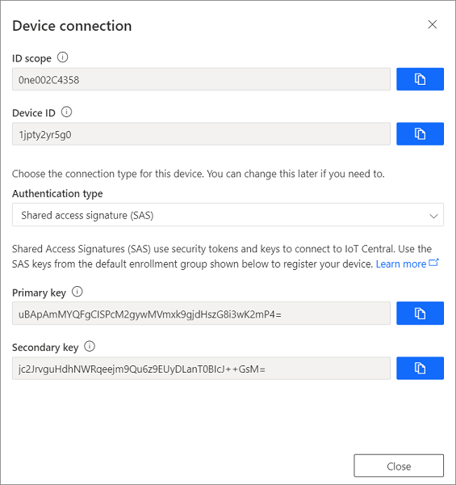
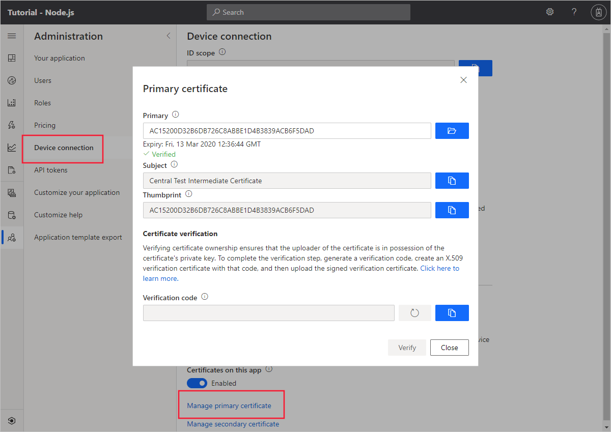
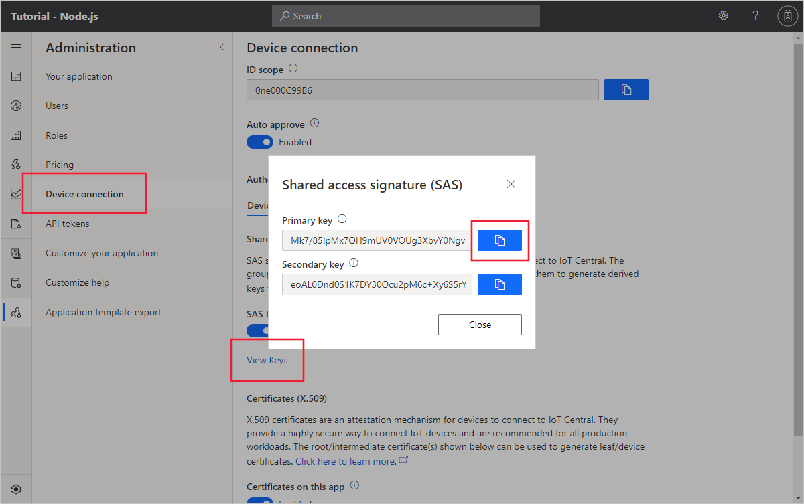

# Get connected to Azure IoT Central

*This article applies to operators and device developers.*

This article describes the options for connecting your devices to an Azure IoT Central application.

Typically, you must register a device in your application before it can connect. However, IoT Central does support scenarios where [devices can connect without first being registered](#connect-without-registering-devices).

IoT Central uses the [Azure IoT Hub Device Provisioning service (DPS)](../../iot-dps/about-iot-dps.md) to manage the connection process. A device first connects to a DPS endpoint to retrieve the information it needs to connect to your application. Internally, your IoT Central application uses an IoT hub to handle device connectivity. Using DPS enables:

- IoT Central to support onboarding and connecting devices at scale.
- You to generate device credentials and configure the devices offline without registering the devices through IoT Central UI.
- You to use your own device IDs to register devices in IoT Central. Using your own device IDs simplifies integration with existing back-office systems.
- A single, consistent way to connect devices to IoT Central.

To secure the communication between a device and your application, IoT Central supports both shared access signatures (SAS) and X.509 certificates. X.509 certificates are recommended in production environments.

This article describes the following use cases:

- [Connect a single device using SAS](#connect-a-single-device)
- [Connect devices at scale using SAS](#connect-devices-at-scale-using-sas)
- [Connect devices at scale using X.509 certificates](#connect-devices-using-x509-certificates) - the recommended approach for production environments.
- [Connect devices without first registering them](#connect-without-registering-devices)
- [Connect devices that use DPS individual enrollments](#individual-enrollment-based-device-connectivity)
- [Automatically associate a device with a device template](#automatically-associate-with-a-device-template)

## Connect a single device

This approach is useful when you're experimenting with IoT Central or testing devices. You can use the device connection SAS keys from your IoT Central application to connect a device to your IoT Central application. Copy the _device SAS key_ from the connection information for a registered device:



To learn more, see the [Create and connect a Node.js client application to your Azure IoT Central application](./tutorial-connect-device-nodejs.md) tutorial.

## Connect devices at scale using SAS

To connect devices to IoT Central at scale using SAS keys, you need to register and then set up the devices:

### Register devices in bulk

To register a large number of devices with your IoT Central application, use a CSV file to [import device IDs and device names](howto-manage-devices.md#import-devices).

To retrieve the connection information for the imported devices, [export a CSV file from your IoT Central application](howto-manage-devices.md#export-devices). The exported CSV file includes the device IDs and the SAS keys.

### Set up your devices

Use the connection information from the export file in your device code to enable your devices to connect and send data to IoT to your IoT Central application. You also need the DPS **ID scope** for your application. You can find this value in **Administration > Device connection**.

> [!NOTE]
> To learn how you can connect devices without first registering them in IoT Central, see [Connect without first registering devices](#connect-without-registering-devices).

## Connect devices using X.509 certificates

In a production environment, using X.509 certificates is the recommended device authentication mechanism for IoT Central. To learn more, see [Device Authentication using X.509 CA Certificates](../../iot-hub/iot-hub-x509ca-overview.md).

Before you connect a device with an X.509 certificate, add and verify an intermediate or root X.509 certificate in your application. Devices must use leaf X.509 certificates generated from the root or intermediate certificate.

### Add and verify a root or intermediate certificate

Navigate to **Administration > Device Connection > Manage primary certificate** and add the X.509 root or intermediate certificate you're using to generate the device certificates.



Verifying certificate ownership ensures that the person uploading the certificate has the certificate's private key. To verify the certificate:

  1. Select the button next to **Verification Code** to generate a code.
  1. Create an X.509 verification certificate with the verification code you generated in the previous step. Save the certificate as a .cer file.
  1. Upload the signed verification certificate and select **Verify**. The certificate is marked as **Verified** when the verification is successful.

If you have a security breach or your primary certificate is set to expire, use the secondary certificate to reduce downtime. You can continue to provision devices using the secondary certificate while you update the primary certificate.

### Register and connect devices

To bulk connect devices using X.509 certificates, first register the devices in your application, by using a CSV file to [import the device IDs and device names](howto-manage-devices.md#import-devices). The device IDs should all be in lower case.

Generate X.509 leaf certificates for your devices using the uploaded root or intermediate certificate. Use the **Device ID** as the `CNAME` value in the leaf certificates. Your device code needs the **ID scope** value for your application, the **device ID**, and the corresponding device certificate.

#### Sample device code

The following sample from the [Azure IoT Node.JS SDK](https://github.com/Azure/azure-iot-sdk-node/blob/master/provisioning/device/samples/register_x509.js) shows how a Node.js device client uses an X.509 leaf certificate and DPS to register with an IoT Central application:

:::code language="nodejs" source="~/azure-iot-sdk-node/provisioning/device/samples/register_x509.js":::

For an equivalent C sample, see [prov_dev_client_sample.c](https://github.com/Azure/azure-iot-sdk-c/blob/master/provisioning_client/samples/prov_dev_client_sample/prov_dev_client_sample.c) in the [Azure IoT C Provisioning Device Client SDK](https://github.com/Azure/azure-iot-sdk-c/blob/master/provisioning_client/devdoc/using_provisioning_client.md).

### For testing purposes only

For testing only, you can use the following utilities to generate root, intermediate, and device certificates:

- [Tools for the Azure IoT Device Provisioning Device SDK](https://github.com/Azure/azure-iot-sdk-node/blob/master/provisioning/tools/readme.md): a collection of Node.js tools that you can use to generate and verify X.509 certificates and keys.
- If you're using a DevKit device, this [command-line tool](https://aka.ms/iotcentral-docs-dicetool) generates a CA certificate that you can add to your IoT Central application to verify the certificates.
- [Manage test CA certificates for samples and tutorials](https://github.com/Azure/azure-iot-sdk-c/blob/master/tools/CACertificates/CACertificateOverview.md): a collection of PowerShell and Bash scripts to:
  - Create a certificate chain.
  - Save the certificates as .cer files to upload to your IoT Central application.
  - Use the verification code from the IoT Central application to generate the verification certificate.
  - Create leaf certificates for your devices using your device IDs as a parameter to the tool.

## Connect without registering devices

The previously described scenarios all require you to register devices in your application before they connect. IoT Central also enables OEMs to mass manufacture devices that can connect without first being registered. An OEM generates suitable device credentials, and configures the devices in the factory. When a customer turns on a device for the first time, it connects to DPS, which then automatically connects the device to the correct IoT Central application. An IoT Central operator must approve the device before it starts sending data to the application.

The flow is slightly different depending on whether the devices use SAS tokens or X.509 certificates:

### Connect devices that use SAS tokens without registering

1. Copy the IoT Central application's group primary key:

    

1. Use the [dps-keygen](https://www.npmjs.com/package/dps-keygen) tool to generate the device SAS keys. Use the group primary key from the previous step. The device IDs must be lower-case:

    ```cmd
    dps-keygen -mk:<group primary key> -di:<device ID>
    ```

1. The OEM flashes each device with a device ID, a generated device SAS key, and the application **ID scope** value.

1. When you switch on a device, it first connects to DPS to retrieve its IoT Central registration information.

    The device initially has a device status **Unassociated** on the **Devices** page and isn't assigned to a device template. On the **Devices** page, **Migrate** the device to the appropriate device template. Device provisioning is now complete, the device status is now **Provisioned**, and the device can start sending data.

    On the **Administration > Device connection** page, the **Auto approve** option controls whether you need to manually approve the device before it can start sending data.

    > [!NOTE]
    > To learn how automatically associate a device with a device template, see [Automatically associate a device with a device template](#automatically-associate-with-a-device-template).

### Connect devices that use X.509 certificates without registering

1. [Add and verify a root or intermediate X.509 certificate](#connect-devices-using-x509-certificates) to your IoT Central application.

1. Generate the leaf-certificates for your devices using the root or intermediate certificate you added to your IoT Central application. Use lower-case device IDs as the `CNAME` in the leaf certificates.

1. The OEM flashes each device with a device ID, a generated leaf X.509 certificate, and the application **ID scope** value.

1. When you switch on a device, it first connects to DPS to retrieve its IoT Central registration information.

    The device initially has a device status **Unassociated** on the **Devices** page and isn't assigned to a device template. On the **Devices** page, **Migrate** the device to the appropriate device template. Device provisioning is now complete, the device status is now **Provisioned**, and the device can start sending data.

    On the **Administration > Device connection** page, the **Auto approve** option controls whether you need to manually approve the device before it can start sending data.

    > [!NOTE]
    > To learn how automatically associate a device with a device template, see [Automatically associate a device with a device template](#automatically-associate-with-a-device-template).

## Individual enrollment-based device connectivity

For customers connecting devices that each have their own authentication credentials, use individual enrollments. An individual enrollment is an entry for a single device that is allowed to connect. Individual enrollments can use either X.509 leaf certificates or SAS tokens (from a physical or virtual trusted platform module) as attestation mechanisms. The device ID (also known as registration ID) in an individual enrollment is alphanumeric, lowercase, and may contain hyphens. For more information, see [DPS individual enrollment](https://docs.microsoft.com/azure/iot-dps/concepts-service#individual-enrollment).

> [!NOTE]
> When you create an individual enrollment for a device, it takes precedence over the default group enrollment options in your IoT Central application.

### Create individual enrollments

IoT Central supports the following attestation mechanisms for individual enrollments:

- **Symmetric key attestation:** Symmetric key attestation is a simple approach to authenticating a device with the DPS instance. To create an individual enrollment that uses symmetric keys, open the **Device Connection** page, select **Individual enrollment** as the connection method, and **Shared access signature (SAS)** as the mechanism. Enter base64 encoded primary and secondary keys, and save your changes. Use the **ID scope**, **Device ID**, and either the primary or secondary key to connect your device.

    > [!TIP]
    > For testing, you can use **OpenSSL** to generate base64 encoded keys: `openssl rand -base64 64`

- **X.509 certificates:** To create an individual enrollment with X.509 certificates, open the **Device Connection** page, select **Individual enrollment** as the connection method, and **Certificates (X.509)** as the mechanism. Device certificates used with an individual enrollment entry have a requirement that the issuer and subject CN are set to the device ID.

    > [!TIP]
    > For testing, you can use [Tools for the Azure IoT Device Provisioning Device SDK for Node.js](https://github.com/Azure/azure-iot-sdk-node/tree/master/provisioning/tools) to generate a self-signed certificate: `node create_test_cert.js device "mytestdevice"`

- **Trusted Platform Module (TPM) attestation:** A [TPM](https://docs.microsoft.com/azure/iot-dps/concepts-tpm-attestation) is a type of hardware security module. Using a TPM is one of the most secure ways to connect a device. This article assumes you're using a discrete, firmware, or integrated TPM. Software emulated TPMs are well suited for prototyping or testing, but they don't provide the same level of security as discrete, firmware, or integrated TPMs. Don't use software TPMs in production. To create an individual enrollment that uses a TPM, open the **Device Connection** page, select **Individual enrollment** as the connection method, and **TPM** as the mechanism. Enter the TPM endorsement key and save the device connection information.

## Automatically associate with a device template

One of the key features of IoT Central is the ability to associate device templates automatically on device connection. Along with device credentials, devices can send a **CapabilityModelId** as part of the device registration call. The **CapabilityModelID** is a URN that identifies the capability model the device implements. The IoT Central application can use the **CapabilityModelID** to identify the device template to use and then automatically associate the device with the device template. The discovery process works as follows:

1. If the device template is already published in the IoT Central application, the device is associated with the device template.
1. For pre-certified IoT Plug and Play devices, if the device template is not already published in the IoT Central application, the device template is fetched from the public repository.

The following snippets show the format of the additional payload the device must send during the DPS registration call for automatic association to work.

This is the format for devices that use the generally available device SDK that doesn't support IoT Plug and Play:

```javascript
    iotcModelId: '< this is the URN for the capability model>';
```

This is the format for devices using public preview device SDK that does support IoT Plug and Play:

```javascript
'__iot:interfaces': {
    CapabilityModelId: <this is the URN for the capability model>
}
```

> [!NOTE]
> The **Auto approve** option on **Administration > Device connection** must be enabled for devices to automatically connect, discover the device template, and start sending data.

## Device status values

When a real device connects to your IoT Central application, its device status changes as follows:

1. The device status is first **Registered**. This status means the device is created in IoT Central, and has a device ID. A device is registered when:
    - A new real device is added on the **Devices** page.
    - A set of devices is added using **Import** on the **Devices** page.

1. The device status changes to **Provisioned** when the device that connected to your IoT Central application with valid credentials completes the provisioning step. In this step, the device uses DPS to automatically retrieve a connection string from the IoT Hub used by your IoT Central application. The device can now connect to IoT Central and start sending data.

1. An operator can block a device. When a device is blocked, it can't send data to your IoT Central application. Blocked devices have a status of **Blocked**. An operator must reset the device before it can resume sending data. When an operator unblocks a device the status returns to its previous value, **Registered** or **Provisioned**.

1. If the device status is **Waiting for Approval**, it means the **Auto approve** option is disabled. An operator must explicitly approve a device before it starts sending data. Devices not registered manually on the **Devices** page, but connected with valid credentials will have the device status **Waiting for Approval**. Operators can approve these devices from the **Devices** page using the **Approve** button.

1. If the device status is **Unassociated**, it means the device connecting to IoT Central doesn't have an associated device template. This situation typically happens in the following scenarios:

    - A set of devices is added using **Import** on the **Devices** page without specifying the device template.
    - A device was registered manually on the **Devices** page without specifying the device template. The device then connected with valid credentials.  

    The Operator can associate a device to a device template from the **Devices** page using the **Migrate** button.

## Best practices

Don't persist or cache the device connection string that DPS returns when you first connect the device. To reconnect a device, go through the standard device registration flow to get the correct device connection string. If the device caches the connection string, the device software runs into the risk of having a stale connection string if IoT Central updates the underlying Azure IoT hub it uses.

## SDK support

The Azure Device SDKs offer the easiest way for you implement your device code. The following device SDKs are available:

- [Azure IoT SDK for C](https://github.com/azure/azure-iot-sdk-c)
- [Azure IoT SDK for Python](https://github.com/azure/azure-iot-sdk-python)
- [Azure IoT SDK for Node.js](https://github.com/azure/azure-iot-sdk-node)
- [Azure IoT SDK for Java](https://github.com/azure/azure-iot-sdk-java)
- [Azure IoT SDK for .NET](https://github.com/azure/azure-iot-sdk-csharp)

### SDK features and IoT Hub connectivity

All device communication with IoT Hub uses the following IoT Hub connectivity options:

- [Device-to-cloud messaging](../../iot-hub/iot-hub-devguide-messages-d2c.md)
- [Device twins](../../iot-hub/iot-hub-devguide-device-twins.md)

The following table summarizes how Azure IoT Central device features map on to IoT Hub features:

| Azure IoT Central | Azure IoT Hub |
| ----------- | ------- |
| Telemetry | Device-to-cloud messaging |
| Property | Device twin reported properties |
| Property (writeable) | Device twin desired and reported properties |
| Command | Direct methods |

To learn more about using the Device SDKs, see [Connect an MXChip IoT DevKit device to your Azure IoT Central application](howto-connect-devkit.md) for example code.

### Protocols

The Device SDKs support the following network protocols for connecting to an IoT hub:

- MQTT
- AMQP
- HTTPS

For information about these difference protocols and guidance on choosing one, see [Choose a communication protocol](../../iot-hub/iot-hub-devguide-protocols.md).

If your device can't use any of the supported protocols, you can use Azure IoT Edge to do protocol conversion. IoT Edge supports other intelligence-on-the-edge scenarios to offload processing to the edge from the Azure IoT Central application.

## Security

All data exchanged between devices and your Azure IoT Central is encrypted. IoT Hub authenticates every request from a device that connects to any of the device-facing IoT Hub endpoints. To avoid exchanging credentials over the wire, a device uses signed tokens to authenticate. For more information, see, [Control access to IoT Hub](../../iot-hub/iot-hub-devguide-security.md).

## Next steps

If you're a device developer, some suggested next steps are to:

- Learn how to [Monitor device connectivity using Azure CLI](./howto-monitor-devices-azure-cli.md)
- Learn how to [Define a new IoT device type in your Azure IoT Central application](./howto-set-up-template.md)
- Read about [Azure IoT Edge devices and Azure IoT Central](./concepts-iot-edge.md)
