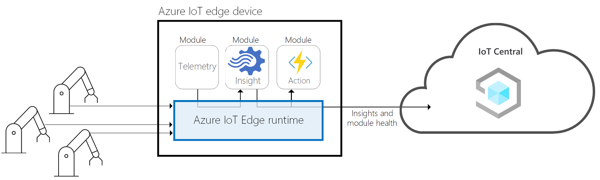

# Connect Azure IoT Edge devices to an Azure IoT Central application

Azure IoT Edge moves cloud analytics and custom business logic from the cloud to your devices. This approach lets your cloud solution focus on business insights instead of data management. Scale out your IoT solution by packaging your business logic into standard containers, deploy those containers to your devices, and monitor them from the cloud.

This article describes:

* IoT Edge gateway patterns with IoT Central.
* How IoT Edge devices connect to an IoT Central application.
* How to use IoT Central to manage your IoT Edge devices.

To learn more about IoT Edge, see [What is Azure IoT Edge?](../../iot-edge/about-iot-edge.md)

## IoT Edge



IoT Edge is made up of three components:

* [IoT Edge modules](../../iot-edge/iot-edge-modules.md) are containers that run Azure services, partner services, or your own code. Modules are deployed to IoT Edge devices, and run locally on those devices. A [deployment manifest](../../iot-edge/module-composition.md) specifies the modules to deploy to an IoT Edge device.
* The [IoT Edge runtime](../../iot-edge/iot-edge-runtime.md) runs on each IoT Edge device, and manages the modules deployed to each device. The runtime consists of two IoT Edge modules: [IoT Edge agent and IoT Edge hub](../../iot-edge/module-edgeagent-edgehub.md).
* A *cloud-based interface* enables you to remotely monitor and manage IoT Edge devices. IoT Central is an example of a cloud interface.

IoT Central enables the following capabilities to for IoT Edge devices:

* Deployment manifest management. An IoT Central application can manage a collection of deployment manifests and assign them to devices.
* Device templates to describe the capabilities of an IoT Edge device, such as:
  * The telemetry each IoT Edge module sends.
  * The properties each IoT Edge module reports.
  * The commands each IoT Edge module responds to.
  * The relationships between an IoT Edge gateway device and downstream device.
  * Cloud properties that aren't stored on the IoT Edge device.
  * Device views and forms.
* The ability to provision IoT Edge devices at scale using Azure IoT device provisioning service.
* Rules and actions.
* Custom dashboards and analytics.
* Continuous data export of telemetry from IoT Edge devices.

An IoT Edge device can be:

* A standalone device composed of custom modules.
* A *gateway device*, with downstream devices connecting to it. A gateway device may include custom modules.

## IoT Edge devices and IoT Central

IoT Edge devices can use *shared access signature* tokens or X.509 certificates to authenticate with IoT Central. You can manually register your IoT Edge devices in IoT Central before they connect for the first time, or use the Device Provisioning Service to handle the registration. To learn more, see [How devices connect](overview-iot-central-developer.md#how-devices-connect).

IoT Central optionally uses [device templates](concepts-device-templates.md) to define how IoT Central interacts with an IoT Edge device. For example, a device template specifies:

* The types of telemetry and properties an IoT Edge device sends so that IoT Central can interpret them and create visualizations.
* The commands an IoT Edge device responds to so that IoT Central can display a UI for an operator to use to call the commands.

If there's no device template associated with a device, telemetry and property values display as *unmodeled* data. However, you can still use IoT Central data export capabilities to forward telemetry and property values to other backend services.

## IoT Edge deployment manifests

In IoT Edge, you deploy and manage business logic in the form of modules. IoT Edge modules are the smallest unit of computation managed by IoT Edge, and can contain Azure services such as Azure Stream Analytics, or your own solution-specific code.

An IoT Edge [deployment manifest](../../iot-edge/module-composition.md) lists the IoT Edge modules to deploy on the device and how to configure them.

In Azure IoT Central, navigate to **Edge manifests** to import and manage the deployment manifests for the IoT Edge devices in your solution.

The following code snippet shows an example IoT Edge deployment manifest:

```json
{
  "modulesContent": {
    "$edgeAgent": {
      "properties.desired": {
        "schemaVersion": "1.0",
        "runtime": {
          "type": "docker",
          "settings": {
            "minDockerVersion": "v1.25",
            "loggingOptions": "",
            "registryCredentials": {}
          }
        },
        "systemModules": {
          "edgeAgent": {
            "type": "docker",
            "settings": {
              "image": "mcr.microsoft.com/azureiotedge-agent:1.0.9",
              "createOptions": "{}"
            }
          },
          "edgeHub": {
            "type": "docker",
            "status": "running",
            "restartPolicy": "always",
            "settings": {
              "image": "mcr.microsoft.com/azureiotedge-hub:1.0.9",
              "createOptions": "{}"
            }
          }
        },
        "modules": {
          "SimulatedTemperatureSensor": {
            "version": "1.0",
            "type": "docker",
            "status": "running",
            "restartPolicy": "always",
            "settings": {
              "image": "mcr.microsoft.com/azureiotedge-simulated-temperature-sensor:1.0",
              "createOptions": "{}"
            }
          }
        }
      }
    },
    "$edgeHub": {
      "properties.desired": {
        "schemaVersion": "1.0",
        "routes": {
            "route": "FROM /* INTO $upstream"
        },
        "storeAndForwardConfiguration": {
          "timeToLiveSecs": 7200
        }
      }
    },
    "SimulatedTemperatureSensor": {
      "properties.desired": {
           "SendData": true,
           "SendInterval": 10
      }
    }
  }
}
```

In the previous snippet, you can see:

* There are three modules. The *IoT Edge agent* and *IoT Edge hub* system modules that are present in every deployment manifest. The custom **SimulatedTemperatureSensor** module.
* The public module images are pulled from an Azure Container Registry repository that doesn't require any credentials to connect. For private module images, set the container registry credentials to use in the `registryCredentials` setting for the *IoT Edge agent* module.
* The custom **SimulatedTemperatureSensor** module has two writable properties `"SendData": true` and `"SendInterval": 10`.

The following screenshot shows this deployment manifest imported into IoT Central:

:::image type="content" source="media/concepts-iot-edge/imported-deployment-manifest.png" alt-text="Screenshot that shows the imported Environmental sensor deployment manifest.":::

If your application uses [organizations](howto-create-organizations.md), you can assign your deployment manifests to specific organizations. The previous screenshot shows the deployment manifest assigned to the **Store Manager / Americas** organization.

To learn how to use the **Edge manifests** page and assign deployment manifests to IoT Edge devices, see [Manage IoT Edge deployment manifests in your IoT Central application](howto-manage-deployment-manifests.md).

### Manage an unassigned device

An IoT Edge device that doesn't have an associated device template is known as an *unassigned* device. You can't use IoT Central features such as dashboards, device groups, analytics, rules, and jobs with unassigned devices. However, you can use the following capabilities with unassigned devices:

* View raw data such as telemetry and properties.
* Call device commands.
* Read and write properties.

:::image type="content" source="media/concepts-iot-edge/unassigned-device-capabilities.png" alt-text="Screenshot that shows unassigned device capabilities.":::

You can also manage individual modules on unassigned devices:

:::image type="content" source="media/concepts-iot-edge/unassigned-module-capabilities.png" alt-text="Screenshot that shows the options for managing modules on unassigned devices.":::

## IoT Edge device templates

IoT Central device templates use models to describe the capabilities of IoT Edge devices. Device templates are optional for IoT Edge devices. The device template enables you to interact with telemetry, properties, and commands using IoT Central capabilities such as dashboards and analytics. The following diagram shows the structure of the model for an IoT Edge device:

:::image type="content" source="media/concepts-iot-edge/iot-edge-model.png" alt-text="Diagram that shows the model structure for an IoT Edge device connected to IoT Central." border="false":::

IoT Central models an IoT Edge device as follows:

* Every IoT Edge device template has a capability model.
* For every custom module listed in the deployment manifest, add a module definition if you want to use IoT Central to interact with that module.
* A module capability model implements one or more module interfaces.
* Each module interface contains telemetry, properties, and commands.

You can generate the basic capability model based on the modules and properties defined in the device manifest. To learn more, see [Add modules and properties to device templates](howto-manage-deployment-manifests.md#add-modules-and-properties-to-device-templates).

## IoT Edge gateway patterns

IoT Central supports the following IoT Edge device patterns:

### IoT Edge as a transparent gateway

Downstream devices connect to IoT Central through the gateway with their own identity.


The IoT Edge device is provisioned in IoT Central along with the downstream devices connected to the IoT Edge device. Runtime support for provisioning downstream devices through the gateway isn't currently supported.

The IoT Edge hub module behaves like IoT Central and handles connections from devices registered in IoT Central. Messages pass from downstream devices to IoT Central as if there's no gateway between them. In a transparent gateway, you can't use custom modules to manipulate the messages from the downstream devices.

> [!NOTE]
> IoT Central currently doesn't support connecting an IoT Edge device as a downstream device to an IoT Edge transparent gateway. This is because all devices that connect to IoT Central are provisioned using the Device Provisioning Service (DPS) and DPS doesn't currently support nested IoT Edge scenarios.

### IoT Edge as a protocol translation gateway

This pattern enables you to connect devices that can't use any of the protocols that IoT Central supports.


The IoT Edge device is provisioned in IoT Central and any telemetry from your downstream devices is represented as coming from the IoT Edge device. Downstream devices connected to the IoT Edge device aren't provisioned in IoT Central.

### IoT Edge as an identity translation gateway

Downstream devices connect to a module in the gateway that provides IoT Central device identities for them.


The IoT Edge device is provisioned in IoT Central along with the downstream devices connected to the IoT Edge device. Currently, IoT Central doesn't have runtime support for a gateway to provide an identity and to provision downstream devices. If you bring your own identity translation module, IoT Central can support this pattern.

### Downstream device relationships with a gateway and modules

If the downstream devices connect to an IoT Edge gateway device through the *IoT Edge hub* module, the IoT Edge device is a transparent gateway:

:::image type="content" source="media/concepts-iot-edge/gateway-transparent.png" alt-text="Diagram of transparent gateway" border="false":::

If the downstream devices connect to an IoT Edge gateway device through a custom module, the IoT Edge device is a translation gateway. In the following example, downstream devices connect through a *Modbus* custom module that does the protocol translation:

:::image type="content" source="media/concepts-iot-edge/gateway-module.png" alt-text="Diagram of custom module connection" border="false":::

The following diagram shows connections to an IoT Edge gateway device through both types of modules. In this scenario, the IoT Edge device is both a transparent and a translation gateway:

:::image type="content" source="media/concepts-iot-edge/gateway-module-transparent.png" alt-text="Diagram of connecting using both connection modules" border="false":::

Downstream devices can connect to an IoT Edge gateway device through multiple custom modules. The following diagram shows downstream devices connecting through a Modbus custom module, a BLE custom module, and the *IoT Edge hub*  module:

:::image type="content" source="media/concepts-iot-edge/gateway-two-modules-transparent.png" alt-text="Diagram of connecting using multiple custom modules" border="false":::

To learn more about the IoT Edge gateway patterns, see [How an IoT Edge device can be used as a gateway](../../iot-edge/iot-edge-as-gateway.md).

## Deploy the IoT Edge runtime

To learn where you can run the IoT Edge runtime, see [Azure IoT Edge supported systems](../../iot-edge/support.md).

You can also install the IoT Edge runtime in the following environments:

* [Install or uninstall Azure IoT Edge for Linux](../../iot-edge/how-to-provision-single-device-linux-symmetric.md)
* [Install and provision Azure IoT Edge for Linux on a Windows device (Preview)](../../iot-edge/how-to-provision-single-device-linux-on-windows-symmetric.md)
* [Run Azure IoT Edge on Ubuntu Virtual Machines in Azure](../../iot-edge/how-to-install-iot-edge-ubuntuvm.md)

## Monitor your IoT Edge devices

To learn how to remotely monitor your IoT Edge fleet, see [Collect and transport metrics](../../iot-edge/how-to-collect-and-transport-metrics.md).

## Next steps

A suggested next step is to learn how to [Develop your own IoT Edge modules](../../iot-edge/module-development.md).
