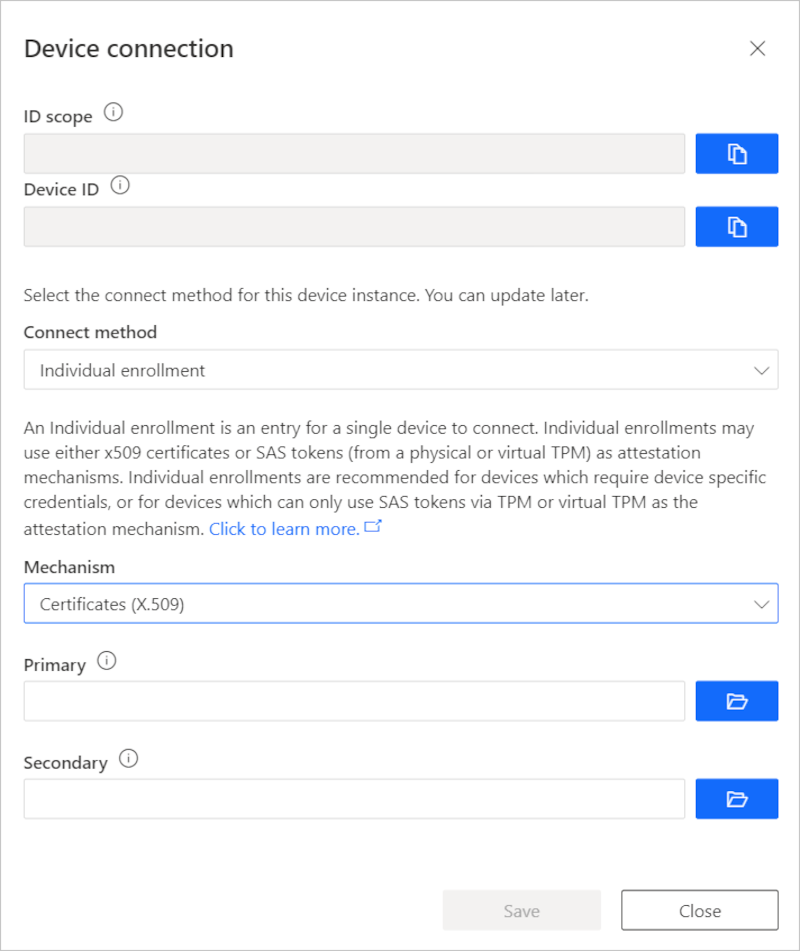

# How to roll X.509 device certificates in IoT Central Application

During the lifecycle of your IoT solution, you'll need to roll certificates. Two of the main reasons for rolling certificates would be a security breach, and certificate expirations.

If you have a security breach, rolling certificates is a security best practice to help secure your system. As part of [Assume Breach Methodology](https://download.microsoft.com/download/C/1/9/C1990DBA-502F-4C2A-848D-392B93D9B9C3/Microsoft_Enterprise_Cloud_Red_Teaming.pdf), Microsoft advocates the need for having reactive security processes in place along with preventative measures. Rolling your device certificates should be included as part of these security processes. The frequency in which you roll your certificates will depend on the security needs of your solution. Customers with solutions involving highly sensitive data may roll certificate daily, while others roll their certificates every couple years.

## Obtain new X.509 certificates

You can create your own X.509 certificates using a tool like OpenSSL. This approach is great for testing X.509 certificates but provides few guarantees around security. Only use this approach for testing unless you are prepared to act as your own CA provider.

## Enrollment groups and security breaches

To update a group enrollment in response to a security breach, you should use the following approach that updates the current certificate immediately:

1. Navigate to **Administration**  in the left pane and select **Device connection**.

2. Select **Enrollment Groups**, and select the group name in the list.

3. For certificate update, select **Manage primary** or **Manage Secondary**.

4. Add and verify root X.509 certificate in the enrollment group.

   Complete these steps for the primary and secondary certificates, if both are compromised.

## Enrollment groups and certificate expiration

If you're rolling certificates to handle certificate expirations, use the following approach to update the current certificate immediately:

1. Navigate to **Administration**  in the left pane and select **Device connection**.

2. Select **Enrollment Groups**, and select the group name in the list.

3. For certificate update, select **Manage Primary**.

4. Add and verify root X.509 certificate in the enrollment group.

5. Later when the secondary certificate has expired, come back and update that secondary certificate.

## Individual enrollments and security breaches

If you're rolling certificates in response to a security breach, use the following approach to update the current certificate immediately:

1. Select **Devices**, and select the device.

2. Select **Connect**, and select connect method as **Individual Enrollment**

3. Select **Certificates (X.509)** as mechanism.

    

4. For certificate update, select the folder icon to select the new certificate to be uploaded for the enrollment entry. Select **Save**.

    Complete these steps for the primary and secondary certificates, if both are compromised

## Individual enrollments and certificate expiration

If you're rolling certificates to handle certificate expirations, you should use the secondary certificate configuration as follows to reduce downtime for devices attempting to provision.

When the secondary certificate nears expiration, and needs to be rolled, you can rotate to using the primary configuration. Rotating between the primary and secondary certificates in this way reduces downtime for devices attempting to provision.

1. Select **Devices**, and select the device.

2. Select **Connect**, and select connect method as **Individual Enrollment**

3. Select **Certificates (X.509)** as mechanism.

    

4. For secondary certificate update, select the folder icon to select the new certificate to be uploaded for the enrollment entry. Select **Save**.

5. Later when the primary certificate has expired, come back and update that primary certificate.

## Next steps

Now that you've learned how to roll X.509 certificates in your Azure IoT Central application, you can [Get connected to Azure IoT Central](concepts-get-connected.md).

