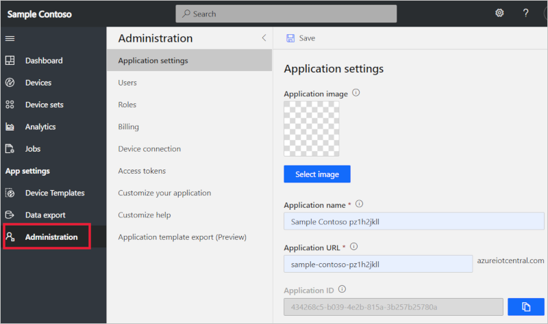
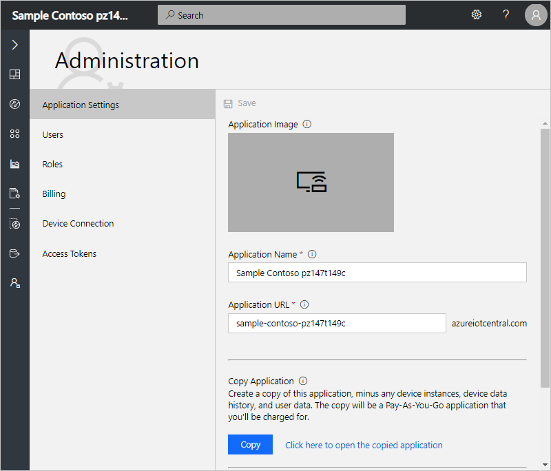

# Manage your IoT Central application

[!INCLUDE [iot-central-original-pnp](../../../includes/iot-central-original-pnp-note.md)]

This article describes how, as an administrator, you can manage application by changing application name and URL, uploading image, also you can learn how to copy, and delete an application in your Azure IoT Central application.

To access and use the **Administration** section, you must be in the **Administrator** role for an Azure IoT Central application. If you create an Azure IoT Central application, you're automatically assigned to the **Administrator** role for that application. 

## Change application name and URL

In the **Application Settings** page, you can change the name and URL of your application, then select **Save**.

If your administrator creates a custom theme for your application, this page includes an option to hide the **Application Name** in the UI. This is useful if the application logo in the custom theme includes the application name. For more information, see [Customize the Azure IoT Central UI](./howto-customize-ui.md).

> [!Note]
> If you change your URL, your old URL can be taken by another Azure IoT Central customer. If that happens, it is no longer available for you to use. When you change your URL, the old URL no longer works, and you need to notify your users about the new URL to use.

## Prepare and upload image

To change the application image, see [Prepare and upload images to your Azure IoT Central application](howto-prepare-images.md).

## Copy an application

You can create a copy of any application, minus any device instances, device data history, and user data. The copy is a Pay-As-You-Go application that you'll be charged for. You can't create a Trial application in this way.

Select **Copy**. In the dialog box, enter the details for the new Pay-As-You-Go application. Then select **Copy** to confirm that you want to continue. Learn more about the fields in this form in [Create an application](quick-deploy-iot-central.md) quickstart.

After the app copy operation succeeds, you can navigate to the new application using the link.

Copying an application also copies the definition of rules and email action. Some actions like Flow, Logic Apps etc. are tied to specific rules via the Rule ID. When a rule is copied to a different application, it gets its own Rule ID. In this case, users will have to create a new action and then associate the new rule with it. In general, it is a good idea to check the rules and actions to make sure they are up-to-date in the new app.

> [!WARNING]
> If a dashboard includes tiles that display information about specific devices, then those tiles show **The requested resource was not found** in the new application. You must reconfigure these tiles to display information about devices in your new application.

## Delete an application

Use the **Delete** button to permanently delete your IoT Central application. This action permanently deletes all data that's associated with the application.

> [!Note]
> To delete an application, you must also have permissions to delete resources in the Azure subscription you chose when you created the application. To learn more, see [Use role-based access control to manage access to your Azure subscription resources](https://docs.microsoft.com/azure/active-directory/role-based-access-control-configure).

## Manage programatically

IoT Central Azure Resource Manager SDK packages are available for Node, Python, C#, Ruby, Java, and Go. You can use these packages to create, list, update, or delete IoT Central applications. The packages include helpers to manage authentication and error handling.

You can find examples of how to use the Azure Resource Manager SDKs at [https://github.com/emgarten/iotcentral-arm-sdk-examples](https://github.com/emgarten/iotcentral-arm-sdk-examples).

To learn more, see the following GitHub repositories and packages:

| Language | Repository | Package |
| ---------| ---------- | ------- |
| Node | [https://github.com/Azure/azure-sdk-for-node](https://github.com/Azure/azure-sdk-for-node) | [https://www.npmjs.com/package/azure-arm-iotcentral](https://www.npmjs.com/package/azure-arm-iotcentral)
| Python |[https://github.com/Azure/azure-sdk-for-python](https://github.com/Azure/azure-sdk-for-python) | [https://pypi.org/project/azure-mgmt-iotcentral](https://pypi.org/project/azure-mgmt-iotcentral)
| C# | [https://github.com/Azure/azure-sdk-for-net](https://github.com/Azure/azure-sdk-for-net) | [https://www.nuget.org/packages/Microsoft.Azure.Management.IotCentral](https://www.nuget.org/packages/Microsoft.Azure.Management.IotCentral)
| Ruby | [https://github.com/Azure/azure-sdk-for-ruby](https://github.com/Azure/azure-sdk-for-ruby) | [https://rubygems.org/gems/azure_mgmt_iot_central](https://rubygems.org/gems/azure_mgmt_iot_central)
| Java | [https://github.com/Azure/azure-sdk-for-java](https://github.com/Azure/azure-sdk-for-java) | [https://search.maven.org/search?q=a:azure-mgmt-iotcentral](https://search.maven.org/search?q=a:azure-mgmt-iotcentral)
| Go | [https://github.com/Azure/azure-sdk-for-go](https://github.com/Azure/azure-sdk-for-go) | [https://github.com/Azure/azure-sdk-for-go](https://github.com/Azure/azure-sdk-for-go)

## Next steps
 
Now that you've learned about how to administer your Azure IoT Central application, the suggested next step is to learn about [Manage users and roles](howto-manage-users-roles.md) in Azure IoT Central.