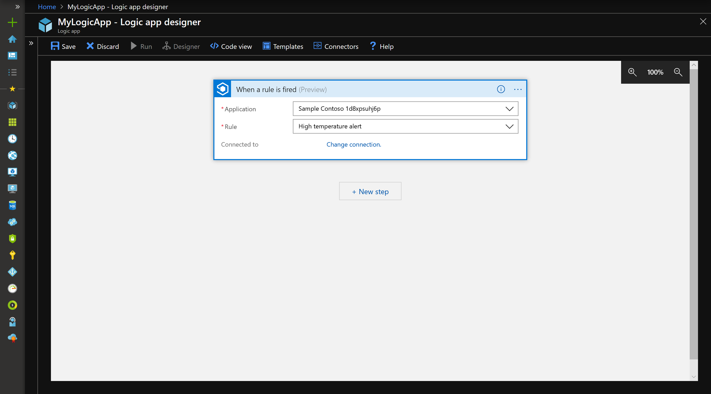
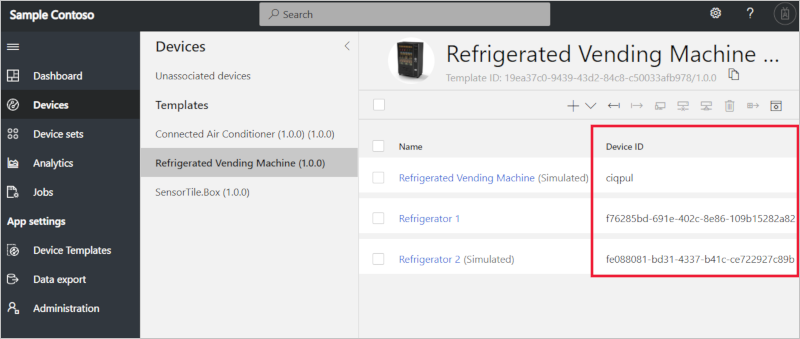

# Build workflows with the IoT Central connector in Azure Logic Apps

*This topic applies to builders and administrators.*

Use Azure Logic Apps to build automated scalable workflows that integrate apps and data across cloud services and on-premises systems. Azure Logic Apps has many connectors across many Azure services, Microsoft services, and other Software-As-A-Service (SaaS) products. Using the IoT Central connector in Azure Logic Apps, you can trigger workflows when a rule is triggered in IoT Central. You can also use the actions in the IoT Central connector to create a device, update a device's properties and settings, or delete a device.

You can use the IoT Central connector in Microsoft Flow. Both Azure Logic Apps and Microsoft Flow are designer-first integration services, but target slightly different audiences. Flow empowers any office worker to build the business workflows they need. Logic Apps empowers IT Pros to build the integrations they need to connect data. Compare Flow and Logic Apps [here](https://docs.microsoft.com/azure/azure-functions/functions-compare-logic-apps-ms-flow-webjobs). Learn about how to build workflows with the IoT Central connector in Microsoft Flow [here](howto-add-microsoft-flow.md).

## Prerequisites

- A Pay-As-You-Go application
- An Azure account and subscription to create and manage Logic apps

## Trigger a workflow when a rule is triggered

This section shows you how to post a message to Microsoft Teams when a rule is triggered. You can configure your workflow to use other connectors to do things such as send an event to your Event hub, create a new Azure DevOps work item, or insert a new row in SQL server.

1. Start by [creating a rule in IoT Central](howto-create-telemetry-rules.md). After you save the rule conditions, select the **Azure Logic Apps** tile as a new action. Select **Create in Azure portal**. You are taken to the Azure portal to create a new logic app. You may need to sign into your Azure account.

1. Enter the required information to create a new logic app. You can choose an Azure subscription to provision your new logic app into. It does not have to be the same subscription your IoT Central app was created in. Select **Create**.

    

1. After your logic app has been successfully created, you are automatically navigated to the Logic Apps Designer. Select **Blank Logic App**. 

    

1. In the designer, search for "iot central", and choose the **When a rule is fired** trigger. Sign into the connector with the account you sign into your IoT Central app with.

    

1. After successful sign-in, you should see fields appear. Select the **Application** and **Rule** from the dropdowns.

    

1. Add a new action. Search for **post message teams** and choose **Post a message** from the Microsoft Teams connector. Sign into the connector with the account you use in Microsoft Teams.

1. In the action, choose the **Team** and **Channel**. Fill in the **Message** field with what you want each message to say. You can include *Dynamic content* from your IoT Central rule, passing along important information such as device name and timestamp to your notification.
    > [!NOTE]
    > Select the **See more** text in the Dynamic content window to get measurement and property values that triggered the rule.

    

1. When you are done editing your action, select **Save**.

1. If you go back to your IoT Central app, you'll see this rule has an Azure Logic Apps action under the Actions area.

You can always start building a workflow using the IoT Central connector in Logic Apps in the Azure Portal. You can then choose which IoT Central app and which rule to connect to, and it still works the same way. There is no need to start from the IoT Central rules page each time.

## Create, update, and delete a device in a workflow

When you are building a workflow in your logic app, you can add an action using the IoT Central connector. The available actions are the **Create a device**, **Update a device**, and **Delete a device**.

> [!NOTE]
> For **Update a device** and **Delete a device**, you'll need an ID of the existing device you want to update or delete. You can get the ID of the IoT Central device in the **Device Explorer**

## Next steps

Now that you've learned how to use Microsoft Flow to build workflows, the suggested next step is to [manage devices](howto-manage-devices.md).
