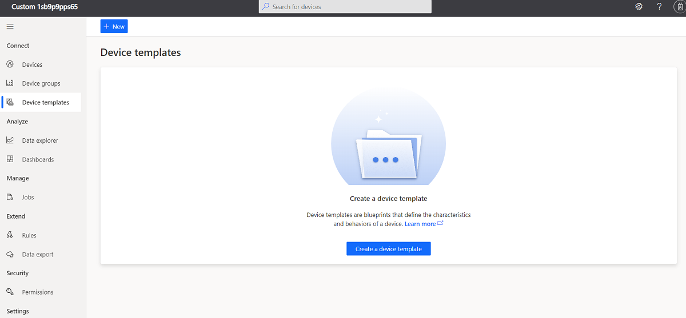
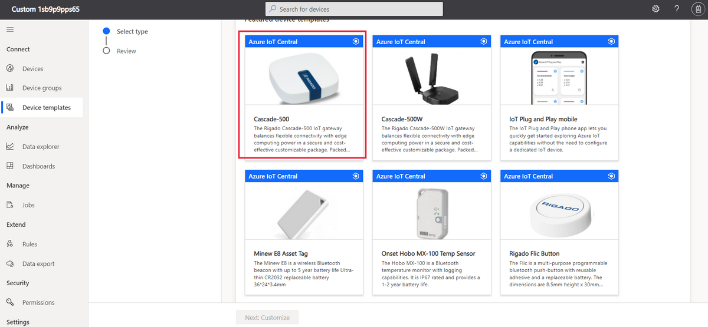
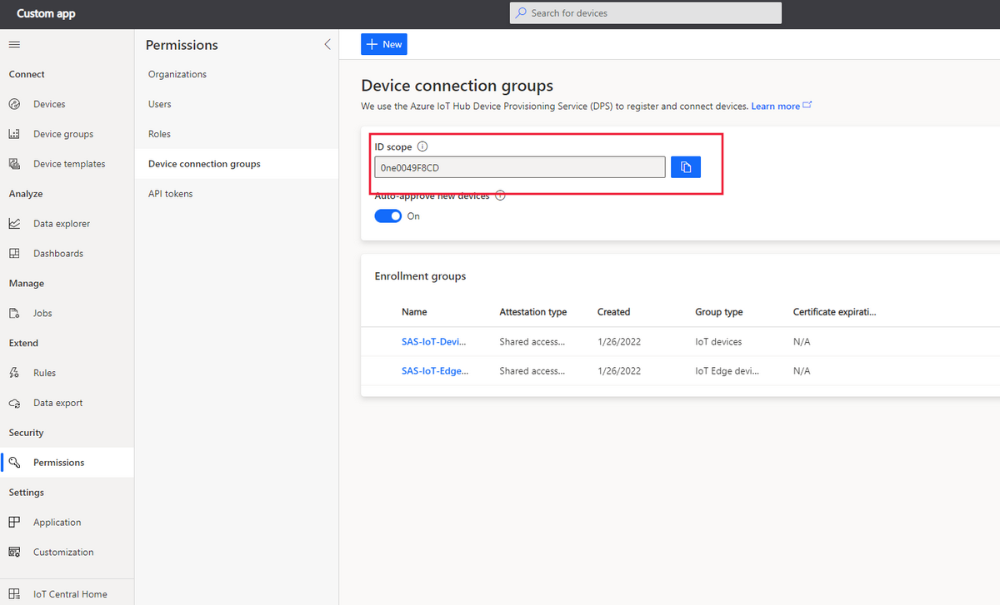
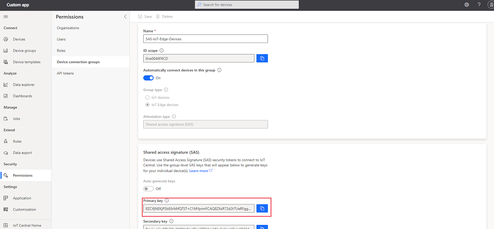
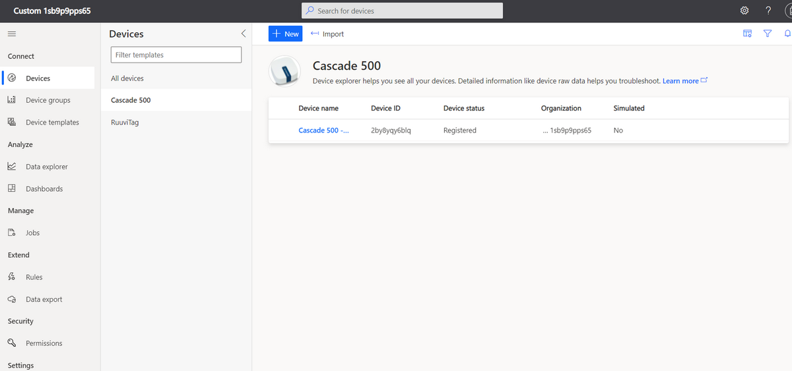

# Connect a Rigado Cascade 500 gateway device to your Azure IoT Central application

*This article applies to solution builders and device developers.*

This article describes how, as a solution builder, you can connect a Rigado Cascade 500 gateway device to your Microsoft Azure IoT Central application. 

## What is Cascade 500?

Cascade 500 IoT gateway is a hardware offering from Rigado that is included as part of their Cascade Edge-as-a-Service solution. It provides commercial IoT project and product teams with flexible edge computing power, a robust containerized application environment, and a wide variety of wireless device connectivity options, including Bluetooth 5, LTE, & Wi-Fi.

Cascade 500 is pre-certified for Azure IoT Plug and Play (preview) allowing our solution builders to easily onboard the device into their end to end solutions. The Cascade gateway allows you to wirelessly connect to a variety of condition monitoring sensors that are in proximity to the gateway device. These sensors can be onboarded into IoT Central via the gateway device.

## Prerequisites
To step through this how-to guide, you need the following resources:

* A Rigado Cascade 500 device. For more information, please visit [Rigado](https://www.rigado.com/).
* An Azure IoT Central application. For more information, see the [create a new application](./quick-deploy-iot-central.md).

## Add a device template

In order to onboard a Cascade 500 gateway device into your Azure IoT Central application instance, you will need to configure a corresponding device template within your application.

To add a Cascade 500 device template: 

1. Navigate to the ***Device Templates*** tab in the left pane, select **+ New**: 

1. The page gives you an option to ***Create a custom template*** or ***Use a preconfigured device template***
1. Select the C500 device template from the list of preconfigured device templates as shown below:

1. Select ***Next: Customize*** to continue to the next step. 
1. On the next screen, select ***Create*** to onboard the C500 device template into your IoT Central application.

## Retrieve application connection details

You will now need to retrieve the **Scope ID** and **Primary key** for your Azure IoT Central application in order to connect the Cascade 500 device. 

1. Navigate to **Administration**  in the left pane and click on **Device connection**. 
2. Make a note of the **Scope ID** for your IoT Central application.

3. Now click on **View Keys** and make a note of the **Primary key**
  

## Contact Rigado to connect the gateway 

In order to connect the Cascade 500 device to your IoT Central application, you will need to contact Rigado and provide them with the application connection details from the above steps. 

Once the device is connected to the internet, Rigado will be able to push down a configuration update down to the Cascade 500 gateway device through a secure channel. 

This update will apply the IoT Central connection details on the Cascade 500 device and it will appear in your devices list. 

  

You are now ready to use your C500 device in your IoT Central application!

## Next steps

If you're a device developer, some suggested next steps are to:

- Read about [Device connectivity in Azure IoT Central](./concepts-get-connected.md)
- Learn how to [Monitor device connectivity using Azure CLI](./howto-monitor-devices-azure-cli.md)
