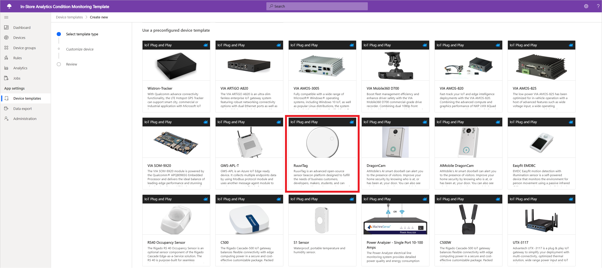
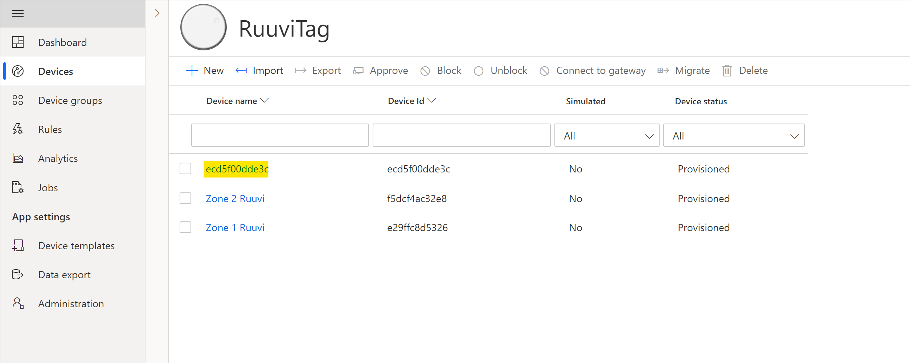

# Connect a RuuviTag sensor to your Azure IoT Central application

*This article applies to solution builders and device developers.*

This article describes how, as a solution builder, you can connect a RuuviTag sensor to your Microsoft Azure IoT Central application.

What is a Ruuvi tag?

RuuviTag is an advanced open-source sensor beacon platform designed to fulfill the needs of business customers, developers, makers, students, and hobbyists. The device is set up to work as soon as you take it out of its box and is ready for you to deploy it where you need it. It's a Bluetooth LE beacon with an environment sensor and accelerometer built in.

RuuviTag communicates over BLE (Bluetooth Low Energy) and requires a gateway device to talk to Azure IoT Central. Make sure you have a gateway device, such as the Rigado Cascade 500, setup to enable a RuuviTag to connect to IoT Central.

Please follow the [instructions here](./howto-connect-rigado-cascade-500.md) if you'd like to set up a Rigado Cascade 500 gateway device.

## Prerequisites

To connect RuuviTag sensors, you need the following resources:

* A RuuviTag sensor. For more information, please visit [RuuviTag](https://ruuvi.com/).
* A Rigado Cascade 500 device or another BLE gateway. For more information, please visit [Rigado](https://www.rigado.com/).
* An Azure IoT Central application. For more information, see the [create a new application](./quick-deploy-iot-central.md).

## Add a RuuviTag device template

To onboard a RuuviTag sensor into your Azure IoT Central application instance, you need to configure a corresponding device template within your application.

To add a RuuviTag device template:

1. Navigate to the ***Device Templates*** tab in the left pane, select **+ New**:
    
    The page gives you an option to ***Create a custom template*** or ***Use a preconfigured device template***
1. Select the RuuviTag device template from the list of preconfigured device templates as shown below:
    
1. Select ***Next: Customize*** to continue to the next step.
1. On the next screen, select ***Create*** to onboard the C500 device template into your IoT Central application.

## Connect a RuuviTag sensor

As mentioned previously, to connect the RuuviTag with your IoT Central application, you need to set up a gateway device. The steps below assume that you've set up a Rigado Cascade 500 gateway device.  

1. Power on your Rigado Cascade 500 device and connect it to your network connection (via Ethernet or wireless)
1. Pop the cover off of the RuuviTag and pull the plastic tab to secure the connection with the battery.
1. Place the RuuviTag close to a Rigado Cascade 500 gateway that's already configured in your IoT Central application.
1. In just a few seconds, your RuuviTag should appear in your list of devices within IoT Central.  
    

You can now use this RuuviTag within your IoT Central application.  

## Create a simulated RuuviTag

If you don't have a physical RuuviTag device, you can create a simulated RuuviTag sensor to use for testing within your Azure IoT Central application.

To create a simulated RuuviTag:

1. Select **Devices > RuuviTag**.
1. Select **+ New**.
1. Specify a unique **Device ID** and a friendly **Device name**.  
1. Enable the **Simulated** setting.
1. Select **Create**.  

## Next Steps

If you're a device developer, some suggested next steps are to:

- Read about [Device connectivity in Azure IoT Central](./concepts-get-connected.md)
- Learn how to [Monitor device connectivity using Azure CLI](./howto-monitor-devices-azure-cli.md)
