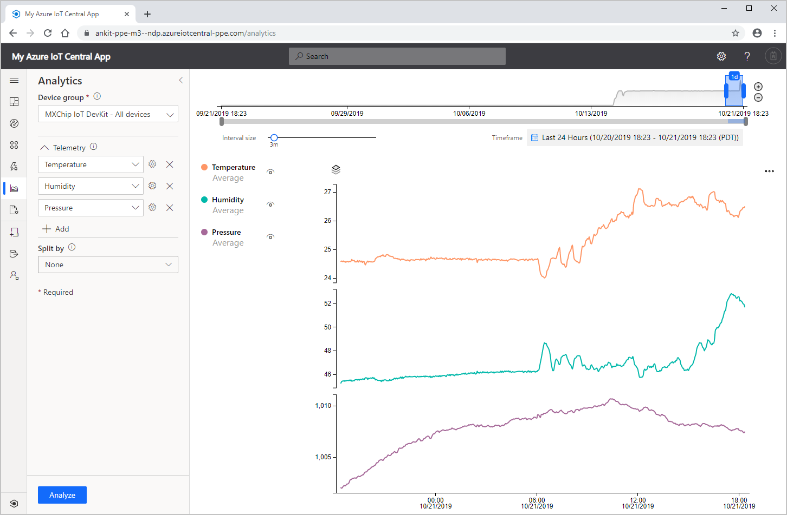
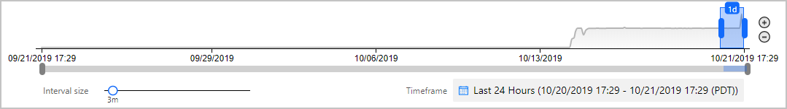
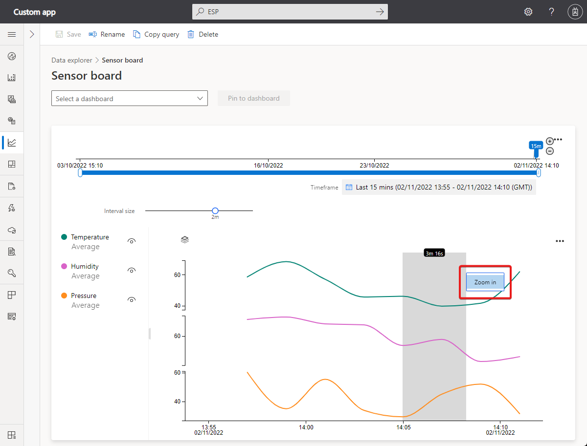

# How to use analytics to analyze device data

*This article applies to operators, builders, and administrators.*

Azure IoT Central provides rich analytics capabilities to analyze historical trends and correlate various telemetries from your devices. To get started, visit **Analytics** on the left pane.

## Understanding the Analytics UI
Analytics user interface is made of three main components:
- **Data configuration panel:** On the configuration panel, start by selecting the device group for which you want to analyze the data. Next, select the telemetry that you want to analyze and select the aggregation method for each telemetry. **Split By** control helps to group the data by using the device properties as dimensions.

- **Time control:** Time control is used to select the duration for which you want to analyze the data. You can drag either end of the time slider to select the time span. Time control also has an **Interval size** slider that controls the bucket or the interval size used to aggregate the data. 

- **Chart control:** Chart control visualizes the data as a line chart. You can toggle the visibility of specific lines by interacting with the chart  legend. 

  

## Querying your data

You'll need to start by choosing a **device group**, and the telemetry that you want to analyze. Once you're done, select **Analyze** to start visualizing your data.

- **Device group:** A [device group](tutorial-use-device-groups.md) is a user-defined group of your devices. For example, all Refrigerators in Oakland, or All version 2.0 wind turbines.

- **Telemetry:** Select the telemetry that you want to analyze and explore. You can select multiple telemetries to analyze together. Default aggregation method is set to Average for numerical and Count for string data-type respectively. Supported aggregation methods for Numeric data types are Average, Maximum, Minimum, Count and, Sum.  Supported aggregation methods for string data type are count.

- **Split by:** 'Split by' control helps to group the data by using the device properties as dimensions. Values of the device and cloud properties are joined along with the telemetry as and when it is sent by the device. If the cloud or device property has been updated, then you will see the telemetry grouped by different values on the chart.

    > [!TIP]
    > To view data for each device separately, select Device Id in the 'Split by' control.

## Interacting with your data

Once you've queried your data, you can start visualizing it on the line chart. You can show/hide telemetry, change the time duration, view telemetry in a data grid.

- **Time editor panel:** By default we'll retrieve data from the past one day. You can drag either end of the time slider to change the time duration. You can also use the calendar control to select one of the predefined time buckets or select a custom time range. Time control also has an **Interval size** slider that controls the bucket or the interval size used to aggregate the data.

    

    - **Inner date range slider tool**: Use the two endpoint controls by dragging them over the time span you want. This inner date range is constrained by the outer date range slider control.
    
   
    - **Outer date range slider control**: Use the endpoint controls to select the outer date range, which will be available for your inner date range control.

    - **Increase and decrease date range buttons**: Increase or decrease your time span by selecting either button for the interval you want.

    - **Interval-size slider**: Use it to zoom in and out of intervals over the same time span. This action provides more precise control of movement between large slices of time. You can use it to see granular, high-resolution views of your data, even down to milliseconds. The slider's default starting point is set as the most optimal view of the data from your selection, which balances resolution, query speed, and granularity.
    
    - **Date range picker**: With this web control, you can easily select the date and time ranges you want. You can also use the control to switch between different time zones. After you make the changes to apply to your current workspace, select Save.

    > [!TIP]
    > Interval size is determined dynamically based on the selected time span. Smaller time spans will enable aggregating the data into very granular intervals of up to a few seconds.

- **Chart Legend:** Chart legend shows the selected telemetry on the chart. You can hover over each item on the legend to bring it into focus on the chart. When using 'Split By', the telemetry is grouped by the respective values of the selected dimension. You can toggle the visibility of each specific telemetry or the whole group by clicking on the group name.  

- **Y-axis format control:** y-axis mode cycles through the available y-axis view options. This control is available only when different telemetries are being visualized. You can set the y-axis by choosing from one of three modes:

    - **Stacked:** A graph for every telemetry is stacked and each of the graphs have their own y-axis. This mode is set as default.
    - **Shared:** A graph for every telemetry is plotted against the same y-axis.
    - **Overlap:** Use it to stack multiple lines on the same y-axis, with the y-axis data changing based on the selected line.

  

- **Zoom control:** Zoom lets you drill further into your data. If you find a time period you'd like to focus on within your result set, use your mouse pointer to grab the area and then drag it to the endpoint of your choice. Then right click on the selected area and click Zoom.

  

Under the ellipsis, there are more chart controls to interact with the data.

- **Display Grid:** Your results are available in a table format, enabling you to view the specific value for each data point.

- **Drop a Marker:** 'Drop Marker' control provides a way to anchor certain data points on the chart. It is useful when you are trying to compare data for multiple lines across different time periods.

  