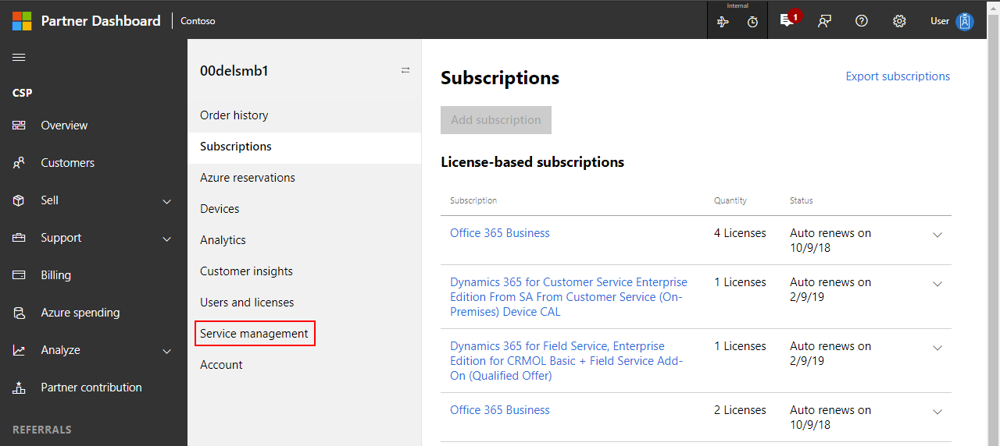

---
# Mandatory fields. See more on aka.ms/skyeye/meta.
title: Manage Azure IoT Central applications from the CSP portal
description: As a CSP, learn how to create and manage an Azure IoT Central application on behalf of your customer.
services: iot-central
ms.service: iot-central
author: dominicbetts
ms.author: dobett
ms.date: 06/13/2023
ms.topic: how-to

---

# Create and manage an Azure IoT Central application from the CSP portal

The Microsoft Cloud Solution Provider (CSP) program is a Microsoft Reseller program. Its intent is to provide our channel partners with a one-stop program to resell all Microsoft Commercial Online Services. Learn more about the [Cloud Solution Provider program](https://partner.microsoft.com/cloud-solution-provider).

[!INCLUDE [Warning About Access Required](../../../includes/iot-central-warning-contribitorrequireaccess.md)]

As a CSP, you can create and manage Microsoft Azure IoT Central applications on behalf of your customers through the [Microsoft Partner Center](https://partnercenter.microsoft.com/partner/home). When Azure IoT Central applications are created on behalf of customers by CSPs, just like with other CSP managed Azure services, CSPs manage billing for customers. A charge for Azure IoT Central appears in your total bill in the Microsoft Partner Center.

To get started, sign-in to your account on the Microsoft Partner Portal and select a customer for whom you want to create an Azure IoT Central application. Navigate to **Service Management** for the customer from the left nav.

Azure IoT Central is listed as a service available to administer. Select the **Azure IoT Central** link on the page to create new applications or manage existing applications for this customer.

You land on the **Azure IoT Central Application Manager** page. Azure IoT Central keeps context that you came from the Microsoft Partner Center and that you came to manage that particular customer. The **Application Manager** page header shows the Microsoft Partner Center context. From here, you can either navigate to an existing application you created earlier for this customer to manage or create a new application for the customer.

:::image type="content" source="media/howto-create-and-manage-applications-csp/iot-central-landing-page.png" alt-text="Screenshot of the IoT Central application manager page.":::

To create an Azure IoT Central application, select **Build** in the left menu. Choose one of the industry templates, or choose **Custom app** to create an application from scratch. You must complete all the fields on the **Application Create** page and then choose **Create**.

## Application name

The name of your application is displayed on the **Application Manager** page and within each Azure IoT Central application. You can choose any name for your Azure IoT Central application. Choose a name that makes sense to you and to others in your organization.

## Application URL

The application URL is the link to your application. You can save a bookmark to it in your browser or share it with others.

When you enter the name for your application, your application URL is autogenerated. If you prefer, you can choose a different URL for your application. Each Azure IoT Central URL must be unique within Azure IoT Central. You see an error message if the URL you choose has already been taken.

## Directory

Azure IoT Central knows the customer you selected in the Microsoft Partner Portal, so you see just the Azure Active Directory tenant for that customer in the **Directory** field.

An Azure Active Directory tenant contains user identities, credentials, and other organizational information. Multiple Azure subscriptions can be associated with a single Azure Active Directory tenant.

To learn more, see [Azure Active Directory](../../active-directory/index.yml).

## Azure subscription

An Azure subscription enables you to create instances of Azure services. Azure IoT Central automatically finds all Azure Subscriptions of the customer to which you have access, and displays them in a dropdown on the **Create Application** page. Choose an Azure subscription to create a new Azure IoT Central Application.

If you don't have an Azure subscription, you can create one in the Microsoft Partner Center. After you create the Azure subscription, navigate back to the **Create Application** page. Your new subscription appears in the **Azure Subscription** drop-down.

To learn more, see [Azure subscriptions](../../guides/developer/azure-developer-guide.md#understanding-accounts-subscriptions-and-billing).

## Location

**Location** is where you'd like to create the application. Typically, you should choose the location that's physically closest to your devices to get optimal performance. Currently, you can create an IoT Central application in the **Australia East**, **Canada Central**, **Central US**, **East US**, **East US 2**, **Japan East**, **North Europe**, **South Central US**, **Southeast Asia**, **UK South**, **West Europe**, and **West US** regions. Once you choose a location, you can't later move your application to a different location.

## Application template

Choose the application template you want to use for your application.

## Next steps

Now that you have learned how to create an Azure IoT Central application as a CSP, here's the suggested next step:

> [!div class="nextstepaction"]
> [Administer your application](howto-administer.md)