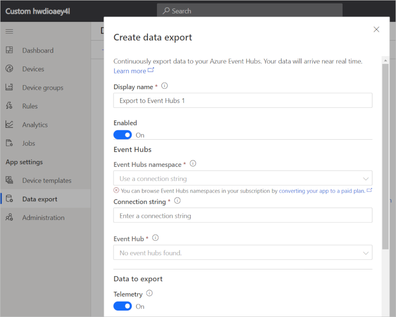

# Export IoT data to destinations in Azure

*This topic applies to administrators.*

This article describes how to use the data export feature in Azure IoT Central. This feature lets you export your data continuously to **Azure Event Hubs**, **Azure Service Bus**, or **Azure Blob storage** instances. Data export uses the JSON format and can include telemetry, device information, and device template information. Use the exported data for:

- Warm-path insights and analytics. This option includes triggering custom rules in Azure Stream Analytics, triggering custom workflows in Azure Logic Apps, or passing it through Azure Functions to be transformed.
- Cold-path analytics such as training models in Azure Machine Learning or long-term trend analysis in Microsoft Power BI.

> [!Note]
> When you turn on data export, you get only the data from that moment onward. Currently, data can't be retrieved for a time when data export was off. To retain more historical data, turn on data export early.

## Prerequisites

You must be an administrator in your IoT Central application, or have Data export permissions.

## Set up export destination

Your export destination must exist before you configure your data export.

### Create Event Hubs namespace

If you don't have an existing Event Hubs namespace to export to, follow these steps:

1. Create a [new Event Hubs namespace in the Azure portal](https://ms.portal.azure.com/#create/Microsoft.EventHub). You can learn more in [Azure Event Hubs docs](../../event-hubs/event-hubs-create.md).

2. Choose a subscription. You can export data to other subscriptions that aren't in the same subscription as your IoT Central application. You connect using a connection string in this case.

3. Create an event hub in your Event Hubs namespace. Go to your namespace, and select **+ Event Hub** at the top to create an event hub instance.

### Create Service Bus namespace

If you don't have an existing Service Bus namespace to export to, follow these steps:

1. Create a [new Service Bus namespace in the Azure portal](https://ms.portal.azure.com/#create/Microsoft.ServiceBus.1.0.5). You can learn more in [Azure Service Bus docs](../../service-bus-messaging/service-bus-create-namespace-portal.md).
2. Choose a subscription. You can export data to other subscriptions that aren't in the same subscription as your IoT Central application. You connect using a connection string in this case.

3. To create a queue or topic to export to, go to your Service Bus namespace, and select **+ Queue** or **+ Topic**.

When you choose Service Bus as an export destination, the queues and topics must not have Sessions or Duplicate Detection enabled. If either of those options are enabled, some messages won't arrive in your queue or topic.

### Create storage account

If you don't have an existing Azure storage account to export to, follow these steps:

1. Create a [new storage account in the Azure portal](https://ms.portal.azure.com/#create/Microsoft.StorageAccount-ARM). You can learn more about creating new [Azure Blob storage accounts](https://aka.ms/blobdocscreatestorageaccount) or [Azure Data Lake Storage v2 storage accounts](../../storage/blobs/data-lake-storage-quickstart-create-account.md). Data export can only write data to storage accounts that support block blobs. The following list shows the known compatible storage account types:

    |Performance Tier|Account Type|
    |-|-|
    |Standard|General Purpose V2|
    |Standard|General Purpose V1|
    |Standard|Blob storage|
    |Premium|Block Blob storage|

2. Create a container in your storage account. Go to your storage account. Under **Blob Service**, select **Browse Blobs**. Select **+ Container** at the top to create a new container.

## Set up data export

Now that you have a destination to export data to, follow these steps to set up data export.

1. Sign in to your IoT Central application.

2. In the left pane, select **Data export**.

    > [!Tip]
    > If you don't see **Data export** in the left pane, then you don't have permissions to configure data export in your app. Talk to an administrator to set up data export.

3. Select the **+ New** button. Choose one of **Azure Blob Storage**, **Azure Event Hubs**, **Azure Service Bus Queue**, or **Azure Service Bus Topic** as the destination of your export. The maximum number of exports per application is five.

4. Enter a name for the export. In the drop-down list box, select your **namespace**, or **Enter a connection string**.

    - You only see storage accounts, Event Hubs namespaces, and Service Bus namespaces in the same subscription as your IoT Central application. If you want to export to a destination outside of this subscription, choose **Enter a connection string** and see step 6.
    - For apps created using the free pricing plan, the only way to configure data export is through a connection string. Apps on the free pricing plan don't have an associated Azure subscription.

    

5. Choose an event hub, queue, topic, or container from the drop-down list box.

6. (Optional) If you chose **Enter a connection string**, a new box appears for you to paste your connection string. To get the connection string for your:

    - Event Hubs or Service Bus, go to the namespace in the Azure portal:
        - To use a connection string for the entire namespace:
            1. Under **Settings**, select **Shared Access Policies**
            2. Create a new key or choose an existing key that has **Send** permissions.
            3. Copy either the primary or secondary connection string
        - To use connection string for a specific event hub instance or Service Bus queue or topic, go to **Entities > Event Hubs** or **Entities > Queues** or **Entities > Topics**. Choose a specific instance, and follow the same steps above to get a connection string.
    - Storage account, go to the storage account in the Azure portal:
        - Only connection strings for the entire storage account are supported. Connection strings scoped to a single container are not supported.
          1. Under **Settings**, select **Access keys**
          2. Copy either the key1 connection string or the key2 connection string

    Paste in the connection string. Type in the instance or **container name**, keeping in mind this is case-sensitive.

7. Under **Data to export**, choose the types of data to export by setting the type to **On**.

8. To turn on data export, make sure the **Enabled** toggle is **On**. Select **Save**.

9. After a few minutes, your data appears in your chosen destination.

## Export contents and format

Exported telemetry data contains the entirety of the message your devices sent to IoT Central, not just the telemetry values themselves. Exported devices data contains changes to properties and metadata of all devices, and exported device templates contains changes to all device templates.

For Event Hubs and Service Bus, data is exported in near-realtime. The data is in the `body` property and is in JSON format. See below for examples.

For Blob storage, data is exported once per minute, with each file containing the batch of changes since the last exported file. Exported data is placed in three folders in JSON format. The default paths in your storage account are:

- Telemetry: _{container}/{app-id}/telemetry/{YYYY}/{MM}/{dd}/{hh}/{mm}/{filename}_
- Devices: _{container}/{app-id}/devices/{YYYY}/{MM}/{dd}/{hh}/{mm}/{filename}_
- Device templates: _{container}/{app-id}/deviceTemplates/{YYYY}/{MM}/{dd}/{hh}/{mm}/{filename}_

To browse the exported files in the Azure portal, navigate to the file and select the **Edit blob** tab.

## Telemetry

For Event Hubs and Service Bus, IoT Central exports a new message quickly after it receives the message from a device. Each exported message contains the full message the device sent in the body property in JSON format.

For Blob storage, messages are batched and exported once per minute. The exported files use the same format as the message files exported by [IoT Hub message routing](../../iot-hub/tutorial-routing.md) to blob storage.

> [!NOTE]
> For Blob storage, ensure that your devices are sending messages that have `contentType: application/JSON` and `contentEncoding:utf-8` (or `utf-16`, `utf-32`). See the [IoT Hub documentation](../../iot-hub/iot-hub-devguide-routing-query-syntax.md#message-routing-query-based-on-message-body) for an example.

The device that sent the telemetry is represented by the device ID (see the following sections). To get the names of the devices, export device data and correlate each message by using the **connectionDeviceId** that matches the **deviceId** of the device message.

The following example shows a message received from an event hub or Service Bus queue or topic:

```json
{
  "temp":81.129693132351775,
  "humid":59.488071477541247,
  "EventProcessedUtcTime":"2020-04-07T09:41:15.2877981Z",
  "PartitionId":0,
  "EventEnqueuedUtcTime":"2020-04-07T09:38:32.7380000Z"
}
```

This message doesn't include the device ID of the sending device.

To retrieve the device ID from the message data in an Azure Stream Analytics query, use the [GetMetadataPropertyValue](https://docs.microsoft.com/stream-analytics-query/getmetadatapropertyvalue) function. For an example, see the query in [Extend Azure IoT Central with custom rules using Stream Analytics, Azure Functions, and SendGrid](./howto-create-custom-rules.md).

To retrieve the device ID in an Azure Databricks or Apache Spark workspace, use [systemProperties](https://github.com/Azure/azure-event-hubs-spark/blob/master/docs/structured-streaming-eventhubs-integration.md). For an example, see the Databricks workspace in [Extend Azure IoT Central with custom analytics using Azure Databricks](./howto-create-custom-analytics.md).

The following example shows a record exported to blob storage:

```json
{
  "EnqueuedTimeUtc":"2019-09-26T17:46:09.8870000Z",
  "Properties":{

  },
  "SystemProperties":{
    "connectionDeviceId":"<deviceid>",
    "connectionAuthMethod":"{\"scope\":\"device\",\"type\":\"sas\",\"issuer\":\"iothub\",\"acceptingIpFilterRule\":null}",
    "connectionDeviceGenerationId":"637051167384630591",
    "contentType":"application/json",
    "contentEncoding":"utf-8",
    "enqueuedTime":"2019-09-26T17:46:09.8870000Z"
  },
  "Body":{
    "temp":49.91322758395974,
    "humid":49.61214852573155,
    "pm25":25.87332214661367
  }
}
```

## Devices

Each message or record in a snapshot represents one or more changes to a device and its device and cloud properties since the last exported message. The message includes the:

- `id` of the device in IoT Central
- `displayName` of the device
- Device template ID in `instanceOf`
- `simulated` flag, true if the device is a simulated device
- `provisioned` flag, true if the device has been provisioned
- `approved` flag, true if the device has been approved to send data
- Property values
- `properties` including device and cloud properties values

Deleted devices aren't exported. Currently, there are no indicators in exported messages for deleted devices.

For Event Hubs and Service Bus, IoT Central sends messages containing device data to your event hub or Service Bus queue or topic in near real time.

For Blob storage, a new snapshot containing all the changes since the last one written is exported once per minute.

The following example message shows information about devices and properties data in an event hub or Service Bus queue or topic:

```json
{
  "body":{
    "id": "<device Id>",
    "etag": "<etag>",
    "displayName": "Sensor 1",
    "instanceOf": "<device template Id>",
    "simulated": false,
    "provisioned": true,
    "approved": true,
    "properties": {
        "sensorComponent": {
            "setTemp": "30",
            "fwVersion": "2.0.1",
            "status": { "first": "first", "second": "second" },
            "$metadata": {
                "setTemp": {
                    "desiredValue": "30",
                    "desiredVersion": 3,
                    "desiredTimestamp": "2020-02-01T17:15:08.9284049Z",
                    "ackVersion": 3
                },
                "fwVersion": { "ackVersion": 3 },
                "status": {
                    "desiredValue": {
                        "first": "first",
                        "second": "second"
                    },
                    "desiredVersion": 2,
                    "desiredTimestamp": "2020-02-01T17:15:08.9284049Z",
                    "ackVersion": 2
                }
            },
            
        }
    },
    "installDate": { "installDate": "2020-02-01" }
},
  "annotations":{
    "iotcentral-message-source":"devices",
    "x-opt-partition-key":"<partitionKey>",
    "x-opt-sequence-number":39740,
    "x-opt-offset":"<offset>",
    "x-opt-enqueued-time":1539274959654
  },
  "partitionKey":"<partitionKey>",
  "sequenceNumber":39740,
  "enqueuedTimeUtc":"2020-02-01T18:14:49.3820326Z",
  "offset":"<offset>"
}
```

This snapshot is an example message that shows devices and properties data in Blob storage. Exported files contain a single line per record.

```json
{
  "id": "<device Id>",
  "etag": "<etag>",
  "displayName": "Sensor 1",
  "instanceOf": "<device template Id>",
  "simulated": false,
  "provisioned": true,
  "approved": true,
  "properties": {
      "sensorComponent": {
          "setTemp": "30",
          "fwVersion": "2.0.1",
          "status": { "first": "first", "second": "second" },
          "$metadata": {
              "setTemp": {
                  "desiredValue": "30",
                  "desiredVersion": 3,
                  "desiredTimestamp": "2020-02-01T17:15:08.9284049Z",
                  "ackVersion": 3
              },
              "fwVersion": { "ackVersion": 3 },
              "status": {
                  "desiredValue": {
                      "first": "first",
                      "second": "second"
                  },
                  "desiredVersion": 2,
                  "desiredTimestamp": "2020-02-01T17:15:08.9284049Z",
                  "ackVersion": 2
              }
          },
          
      }
  },
  "installDate": { "installDate": "2020-02-01" }
}
```

## Device templates

Each message or snapshot record represents one or more changes to a published device template since the last exported message. Information sent in each message or record includes:

- `id` of the device template that matches the `instanceOf` of the devices stream above
- `displayName` of the device template
- The device `capabilityModel` including its `interfaces`, and the telemetry, properties, and commands definitions
- `cloudProperties` definitions
- Overrides and initial values, inline with the `capabilityModel`

Deleted device templates aren't exported. Currently, there are no indicators in exported messages for deleted device templates.

For Event Hubs and Service Bus, IoT Central sends messages containing device template data to your event hub or Service Bus queue or topic in near real time.

For Blob storage, a new snapshot containing all the changes since the last one written is exported once per minute.

This example shows a message about device templates data in event hub or Service Bus queue or topic:

```json
{
  "body":{
      "id": "<device template id>",
      "etag": "<etag>",
      "types": ["DeviceModel"],
      "displayName": "Sensor template",
      "capabilityModel": {
          "@id": "<capability model id>",
          "@type": ["CapabilityModel"],
          "contents": [],
          "implements": [
              {
                  "@id": "<component Id>",
                  "@type": ["InterfaceInstance"],
                  "name": "sensorComponent",
                  "schema": {
                      "@id": "<interface Id>",
                      "@type": ["Interface"],
                      "displayName": "Sensor interface",
                      "contents": [
                          {
                              "@id": "<id>",
                              "@type": ["Telemetry"],
                              "displayName": "Humidity",
                              "name": "humidity",
                              "schema": "double"
                          },
                          {
                              "@id": "<id>",
                              "@type": ["Telemetry", "SemanticType/Event"],
                              "displayName": "Error event",
                              "name": "error",
                              "schema": "integer"
                          },
                          {
                              "@id": "<id>",
                              "@type": ["Property"],
                              "displayName": "Set temperature",
                              "name": "setTemp",
                              "writable": true,
                              "schema": "integer",
                              "unit": "Units/Temperature/fahrenheit",
                              "initialValue": "30"
                          },
                          {
                              "@id": "<id>",
                              "@type": ["Property"],
                              "displayName": "Firmware version read only",
                              "name": "fwversion",
                              "schema": "string"
                          },
                          {
                              "@id": "<id>",
                              "@type": ["Property"],
                              "displayName": "Display status",
                              "name": "status",
                              "writable": true,
                              "schema": {
                                  "@id": "urn:testInterface:status:obj:ka8iw8wka:1",
                                  "@type": ["Object"]
                              }
                          },
                          {
                              "@id": "<id>",
                              "@type": ["Command"],
                              "commandType": "synchronous",
                              "request": {
                                  "@id": "<id>",
                                  "@type": ["SchemaField"],
                                  "displayName": "Configuration",
                                  "name": "config",
                                  "schema": "string"
                              },
                              "response": {
                                  "@id": "<id>",
                                  "@type": ["SchemaField"],
                                  "displayName": "Response",
                                  "name": "response",
                                  "schema": "string"
                              },
                              "displayName": "Configure sensor",
                              "name": "sensorConfig"
                          }
                      ]
                  }
              }
          ],
          "displayName": "Sensor capability model"
      },
      "solutionModel": {
          "@id": "<id>",
          "@type": ["SolutionModel"],
          "cloudProperties": [
              {
                  "@id": "<id>",
                  "@type": ["CloudProperty"],
                  "displayName": "Install date",
                  "name": "installDate",
                  "schema": "dateTime",
                  "valueDetail": {
                      "@id": "<id>",
                      "@type": ["ValueDetail/DateTimeValueDetail"]
                  }
              }
          ]
      }
  },
    "annotations":{
      "iotcentral-message-source":"deviceTemplates",
      "x-opt-partition-key":"<partitionKey>",
      "x-opt-sequence-number":25315,
      "x-opt-offset":"<offset>",
      "x-opt-enqueued-time":1539274985085
    },
    "partitionKey":"<partitionKey>",
    "sequenceNumber":25315,
    "enqueuedTimeUtc":"2019-10-02T16:23:05.085Z",
    "offset":"<offset>"
  }
}
```

This example snapshot shows a message that contains device and properties data in Blob storage. Exported files contain a single line per record.

```json
{
      "id": "<device template id>",
      "etag": "<etag>",
      "types": ["DeviceModel"],
      "displayName": "Sensor template",
      "capabilityModel": {
          "@id": "<capability model id>",
          "@type": ["CapabilityModel"],
          "contents": [],
          "implements": [
              {
                  "@id": "<component Id>",
                  "@type": ["InterfaceInstance"],
                  "name": "Sensor component",
                  "schema": {
                      "@id": "<interface Id>",
                      "@type": ["Interface"],
                      "displayName": "Sensor interface",
                      "contents": [
                          {
                              "@id": "<id>",
                              "@type": ["Telemetry"],
                              "displayName": "Humidity",
                              "name": "humidity",
                              "schema": "double"
                          },
                          {
                              "@id": "<id>",
                              "@type": ["Telemetry", "SemanticType/Event"],
                              "displayName": "Error event",
                              "name": "error",
                              "schema": "integer"
                          },
                          {
                              "@id": "<id>",
                              "@type": ["Property"],
                              "displayName": "Set temperature",
                              "name": "setTemp",
                              "writable": true,
                              "schema": "integer",
                              "unit": "Units/Temperature/fahrenheit",
                              "initialValue": "30"
                          },
                          {
                              "@id": "<id>",
                              "@type": ["Property"],
                              "displayName": "Firmware version read only",
                              "name": "fwversion",
                              "schema": "string"
                          },
                          {
                              "@id": "<id>",
                              "@type": ["Property"],
                              "displayName": "Display status",
                              "name": "status",
                              "writable": true,
                              "schema": {
                                  "@id": "urn:testInterface:status:obj:ka8iw8wka:1",
                                  "@type": ["Object"]
                              }
                          },
                          {
                              "@id": "<id>",
                              "@type": ["Command"],
                              "commandType": "synchronous",
                              "request": {
                                  "@id": "<id>",
                                  "@type": ["SchemaField"],
                                  "displayName": "Configuration",
                                  "name": "config",
                                  "schema": "string"
                              },
                              "response": {
                                  "@id": "<id>",
                                  "@type": ["SchemaField"],
                                  "displayName": "Response",
                                  "name": "response",
                                  "schema": "string"
                              },
                              "displayName": "Configure sensor",
                              "name": "sensorconfig"
                          }
                      ]
                  }
              }
          ],
          "displayName": "Sensor capability model"
      },
      "solutionModel": {
          "@id": "<id>",
          "@type": ["SolutionModel"],
          "cloudProperties": [
              {
                  "@id": "<id>",
                  "@type": ["CloudProperty"],
                  "displayName": "Install date",
                  "name": "installDate",
                  "schema": "dateTime",
                  "valueDetail": {
                      "@id": "<id>",
                      "@type": ["ValueDetail/DateTimeValueDetail"]
                  }
              }
          ]
      }
  }
```

## Data format change notice

> [!Note]
> The telemetry stream data format is unaffected by this change. Only the devices and device templates streams of data are affected.

If you have an existing data export in your preview application with the *Devices* and *Device templates* streams turned on, update your export by **30 June 2020**. This requirement applies to exports to Azure Blob storage, Azure Event Hubs, and Azure Service Bus.

Starting 3 February 2020, all new exports in applications with Devices and Device templates enabled will have the data format described above. All exports created before this date remain on the old data format until 30 June 2020, at which time these exports will automatically be migrated to the new data format. The new data format matches the [device](https://docs.microsoft.com/rest/api/iotcentral/devices/get), [device property](https://docs.microsoft.com/rest/api/iotcentral/devices/getproperties), [device cloud property](https://docs.microsoft.com/rest/api/iotcentral/devices/getcloudproperties), and [device template](https://docs.microsoft.com/rest/api/iotcentral/devicetemplates/get) objects in the IoT Central public API.

For **Devices**, notable differences between the old data format and the new data format include:
- `@id` for device is removed, `deviceId` is renamed to `id` 
- `provisioned` flag is added to describe the provisioning status of the device
- `approved` flag is added to describe the approval state of the device
- `properties` including device and cloud properties, matches entities in the public API

For **Device templates**, notable differences between the old data format and the new data format include:

- `@id` for device template is renamed to `id`
- `@type` for the device template is renamed to `types`, and is now an array

### Devices (format deprecated as of 3 February 2020)

```json
{
  "@id":"<id-value>",
  "@type":"Device",
  "displayName":"Airbox",
  "data":{
    "$cloudProperties":{
        "Color":"blue"
    },
    "EnvironmentalSensor":{
      "thsensormodel":{
        "reported":{
          "value":"Neque quia et voluptatem veritatis assumenda consequuntur quod.",
          "$lastUpdatedTimestamp":"2019-09-30T20:35:43.8478978Z"
        }
      },
      "pm25sensormodel":{
        "reported":{
          "value":"Aut alias odio.",
          "$lastUpdatedTimestamp":"2019-09-30T20:35:43.8478978Z"
        }
      }
    },
    "urn_azureiot_DeviceManagement_DeviceInformation":{
      "totalStorage":{
        "reported":{
          "value":27900.9730905171,
          "$lastUpdatedTimestamp":"2019-09-30T20:35:43.8478978Z"
        }
      },
      "totalMemory":{
        "reported":{
          "value":4667.82916715811,
          "$lastUpdatedTimestamp":"2019-09-30T20:35:43.8478978Z"
        }
      }
    }
  },
  "instanceOf":"<template-id>",
  "deviceId":"<device-id>",
  "simulated":true
}
```

### Device templates (format deprecated as of 3 February 2020)

```json
{
  "@id":"<template-id>",
  "@type":"DeviceModelDefinition",
  "displayName":"Airbox",
  "capabilityModel":{
    "@id":"<id>",
    "@type":"CapabilityModel",
    "implements":[
      {
        "@id":"<id>",
        "@type":"InterfaceInstance",
        "name":"EnvironmentalSensor",
        "schema":{
          "@id":"<id>",
          "@type":"Interface",
          "comment":"Requires temperature and humidity sensors.",
          "description":"Provides functionality to report temperature, humidity. Provides telemetry, commands and read-write properties",
          "displayName":"Environmental Sensor",
          "contents":[
            {
              "@id":"<id>",
              "@type":"Telemetry",
              "description":"Current temperature on the device",
              "displayName":"Temperature",
              "name":"temp",
              "schema":"double",
              "unit":"Units/Temperature/celsius",
              "valueDetail":{
                "@id":"<id>",
                "@type":"ValueDetail/NumberValueDetail",
                "minValue":{
                  "@value":"50"
                }
              },
              "visualizationDetail":{
                "@id":"<id>",
                "@type":"VisualizationDetail"
              }
            },
            {
              "@id":"<id>",
              "@type":"Telemetry",
              "description":"Current humidity on the device",
              "displayName":"Humidity",
              "name":"humid",
              "schema":"integer"
            },
            {
              "@id":"<id>",
              "@type":"Telemetry",
              "description":"Current PM2.5 on the device",
              "displayName":"PM2.5",
              "name":"pm25",
              "schema":"integer"
            },
            {
              "@id":"<id>",
              "@type":"Property",
              "description":"T&H Sensor Model Name",
              "displayName":"T&H Sensor Model",
              "name":"thsensormodel",
              "schema":"string"
            },
            {
              "@id":"<id>",
              "@type":"Property",
              "description":"PM2.5 Sensor Model Name",
              "displayName":"PM2.5 Sensor Model",
              "name":"pm25sensormodel",
              "schema":"string"
            }
          ]
        }
      },
      {
        "@id":"<id>",
        "@type":"InterfaceInstance",
        "name":"urn_azureiot_DeviceManagement_DeviceInformation",
        "schema":{
          "@id":"<id>",
          "@type":"Interface",
          "displayName":"Device information",
          "contents":[
            {
              "@id":"<id>",
              "@type":"Property",
              "comment":"Total available storage on the device in kilobytes. Ex. 20480000 kilobytes.",
              "displayName":"Total storage",
              "name":"totalStorage",
              "displayUnit":"kilobytes",
              "schema":"long"
            },
            {
              "@id":"<id>",
              "@type":"Property",
              "comment":"Total available memory on the device in kilobytes. Ex. 256000 kilobytes.",
              "displayName":"Total memory",
              "name":"totalMemory",
              "displayUnit":"kilobytes",
              "schema":"long"
            }
          ]
        }
      }
    ],
    "displayName":"AAEONAirbox52"
  },
  "solutionModel":{
    "@id":"<id>",
    "@type":"SolutionModel",
    "cloudProperties":[
      {
        "@id":"<id>",
        "@type":"CloudProperty",
        "displayName":"Color",
        "name":"Color",
        "schema":"string",
        "valueDetail":{
          "@id":"<id>",
          "@type":"ValueDetail/StringValueDetail"
        },
        "visualizationDetail":{
          "@id":"<id>",
          "@type":"VisualizationDetail"
        }
      }
    ]
  }
}
```

## Next steps

Now that you know how to export your data to Azure Event Hubs, Azure Service Bus, and Azure Blob storage, continue to the next step:

> [!div class="nextstepaction"]
> [How to run custom analytics with Databricks](./howto-create-custom-analytics.md)
