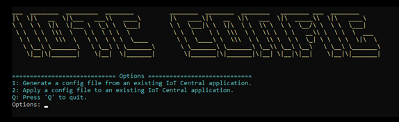
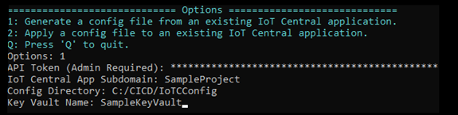
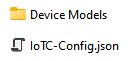
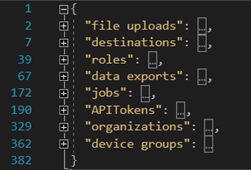
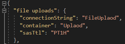
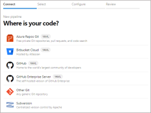
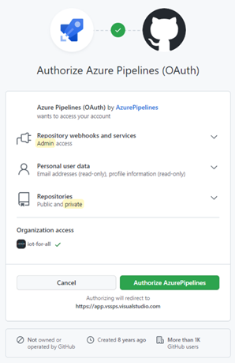
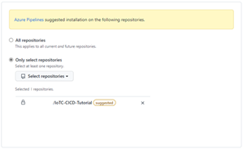
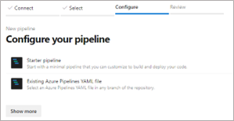
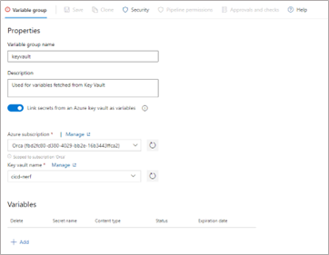

# Integrating Azure IoT Central Into Your CI/CD Pipeline

## Overview

Continuous integration and continuous delivery (CI/CD) refer to the process of developing and delivering software in short, frequent cycles using automation pipelines. While this is by no means a new process, having been ubiquitous in traditional software engineering for decades, it is no less valuable for IoT Central applications. By automating the building, testing, and deployment of IoT Central application configuration, development teams can deliver highly reliable releases more frequently.

Continuous integration begins with the practice of having you commit your code with some frequency to a branch within a source code repository. Each commit is then merged with the commits from other developers to ensure that no conflicts are introduced. Changes are further validated by creating a build and running automated tests against that build. This process ultimately results in an artifact, or deployment bundle, that will eventually be deployed to a target environment, in this case an Azure IoT Central application.

Just as IoT Central is one part of your larger IoT solution, IoT Central is one part of your CI/CD pipeline. Your CI/CD pipeline should deploy your entire IoT solution and all configurations to each environment from Dev environments all the way through to production.


With IoT Central being an Application Platform as a Service (aPaaS) it is a bit different than Platform as a Service (PaaS) components. For IoT Central, you will be deploying configurations and device templates. These are managed and integrated into your release pipeline via APIs.

While it is possible to automate app creation, you should create an app in each environment prior to developing your CI/CD pipeline.

By using the Azure IoT Central REST API, you can integrate IoT Central app configurations into your release pipeline.

This guide will walk you through the process of creating a new DevOps pipeline that updates an IoT Central application based on configuration files managed in GitHub. While this process calls out specific instructions for integrating with Azure DevOps, this same process can be used to include IoT Central in any release pipeline including popular tools like Tekton, Jenkins, GitLab, GitHub Actions and more.

For the purpose of this guide, we will create a DevOps pipeline that only applies an IoT Central configuration to a single instance of an IoT Central application. This process should be integrated into a larger DevOps pipeline that deploys your entire solution promoting it from Dev to QA to Pre-Production to Production and performs all necessary testing along the way.

## Prerequisites

The following prerequisites are required to complete this guide

- Two IoT Central applications. (One will be for your dev environment and the other will be for your production environment) [Create an IoT Central application](https://docs.microsoft.com/en-us/azure/iot-central/core/howto-create-iot-central-application)
- Two Azure Key Vaults. (One will be for your dev environment and the other will be for your production environment. It is a best practice to have a dedicated Key Vault per environment.) [Quickstart - Create an Azure Key Vault with the Azure portal](https://docs.microsoft.com/en-us/azure/key-vault/general/quick-create-portal)
- A GitHub account [GitHub](https://github.com/)
- An Azure DevOps organization [Create an organization - Azure DevOps](https://docs.microsoft.com/en-us/azure/devops/organizations/accounts/create-organization?view=azure-devops#:~:text=%20Create%20an%20organization%20%201%20Sign%20in,an%20organization%20owner%21Sign%20in%20to%20your...%20See%20More.)
- PowerShell 7 for Windows, Mac or Linux. [Get PowerShell](https://docs.microsoft.com/en-us/powershell/scripting/install/installing-powershell)
- Visual Studio Code or other tool for editing PowerShell and JSON files.[Get Visual Studio Code](https://code.visualstudio.com/Download)
- Git client. Download the latest version here [Git - Downloads (git-scm.com)](https://git-scm.com/downloads)

## Download the sample code

To get started, you will need to fork the IoT Central CICD Git Hub repository and then clone your copy to your local machine.

1. Fork the Git Hub repository
    1. Open the Git Hub repository in a browser by going [https://github.com/Azure/iot-central-CICD-samplehttps://github.com/Azure/iot-central-CICD-sample](https://github.com/Azure/iot-central-CICD-samplehttps:/github.com/Azure/iot-central-CICD-sample) and click "Fork"
    
    
1. Clone your fork of the repository to your local machine by opening a console or bash window and running the following command.

cmd\bash

git clone [https://github.com/\<YOUR](https://github.com/%3CYOUR) REPOSITORY\>.git

## Create a Service Principal in Azure

While Azure DevOps can integrate directly with Key Vault, DevOps will need a service principal for some of the dynamic KeyVault interactions. Fetching secrets for data export destinations will require this service principal.

1. Run the following command to create a new service principal.

cmd\bash

az ad sp create-for-rbac --scopes /subscriptions/\<SubscriptionID\>

1. Note the App ID and Tenant ID as you will need these later.

1. Manually save the password to the Key Vault for production.

## Generate an IoT Central API token for each application

For this guide, your Azure DevOps pipeline will use an API token to interact with your IoT Central Applications. While not covered in this document, Service Principals can also be used.

> [!NOTE]
> IoT Central API tokens expire after 1 year.

Follow these steps for both your dev app and your production app.

1. In your IoT Central application click on Permissions and then API tokens
2. Click New
3. Give the token a name, specify the top-level organization, and set the role to "App Administrator"
 
4. Save the generated token to the appropriate Key Vault for the application.

## Generate a configuration file representing your Dev instance of IoT Central

This will produce a JSON configuration file based on an existing IoT Central application for your dev environment. You will also download all existing device templates from the application.

   ```powershell
   cd \<project directory\>/powershell
   ./IoTC-Config.ps1
   ```

1. You will be prompted to press enter to log into Azure. This will take you to a web browser.
1. Once logged in, you will see the IoTC Config options menu. This script can generate a config file from an existing IoT Central application as well as apply a configuration to another IoT Central application.
 
1. Enter "1" and hit enter
1. Enter the necessary parameters:
    1. Your API token
    1. Your app's subdomain
    1. The directory for the config file \<path\>/Config/Dev
    1. Your Key Vault name.
 
1. There will now be a new directory called "IoTC Configuration" in the location you specified. This folder will contain a config file and a directory for all your device templates. <br>


## Modify the configuration file

Now that you have a configuration file that represents the settings for your dev instance of the IoT Central application, you will need to make some changes before applying this configuration to your production IoT Central application.

1. Create a copy of the Dev folder created above and rename it "Production"
1. Open IoTC-Config.json in the Production folder using the editor of your choice
1. Your file will have multiple sections. However, if your application doesn't use a particular setting then that section will be omitted from your file. <br>
 

1. If your application uses file uploads then a secret will have been created in your dev Key Vault with the value shown in the "connectionString" property. You will need to create a secret in your production key vault with the same name that contains the connection string for the production storage account.
 
1. If your application uses data exports then you will need to configure the secrets for the destinations. The config file doesn't contain any actual secrets for your destination. Instead, your secrets should be stored in Key Vault.
1. Update the secrets in the config file with the name of the secret in your Key Vault.

    | **Destination Type** | **Property to be changed** |
    | --- | --- |
    | **Service Bus Queue** | connectionString |
    | **Service Bus Topic** | connectionString |
    | **Azure Data Explorer** | clientSecret |
    | **Azure Blob Storage** | connectionString |
    | **Event Hub** | connectionString |
    | **Webhook No Auth** | N/A |

1. Upload the "Configuration" directory to your GitHub repository by running the following commands from the IoTC-CICD-howto folder.

   ```cmd/bash
    git add Config
    git commit -m "Adding config directories and files"
    git push
   ```

## Create an Azure DevOps pipeline

1. Open your DevOps organization in a web browser by going to https[]()://dev.azure.com/&lt;Organization&gt;
1. Click "New project" to create a new project. <br> 

1. Give your project a name and optional description and click "Create" <br> 

1. Click "Pipelines" and then click the "New Pipeline" button.
1. Click on GitHub to indicate this is where your code is. <br>
 
1. You will need to authorize Azure Pipelines to access your GitHub account by clicking "Authorize AzurePipelines"
 
1. Select the repository you created earlier
1. You will be prompted to log into GitHub and provide permission for Azure Pipelines to access this repository. Click "Approve and Install" <br>
 
1. Select "Starter pipeline" to create a minimal pipeline to get started. <br>
 

## Create a variable group in Azure DevOps

An easy way to integrate key Vault secrets into a pipeline is through variable groups. Creating a variable group will ensure the right secrets are available to your deployment script.

1. Create a variable group
    1. Click on "Library" in the left menu
    1. Click "+ Variable group"
    1. Give your group a name and description. Also click the toggle to link secrets from Azure Key Vault.
 Select the subscription and authorize it. Then select the Key Vault name.

Click "Add"

 

  1. Specify which secrets to include in the variable group. Select the following.
      1. The IoT Central API Key for your production app.
      1. The password for the service principal you created earlier.
  1. Click OK.
  1. Click Save

## Configure your Azure DevOps pipeline

Now that you have a pipeline, it is time to configure it so that it can push configuration changes to IoT Central.

1. Replace the contents of your pipeline YAML with the following. Be sure to replace API KEY SECRET NAME, SERVICE PRINCIPAL SECRET NAME, SERVICE PRINCIPAL APP ID, KEY VAULT NAME and SERVICE PRINCIPAL TENANT ID with the correct values.

   ```yml
    trigger:
    - master
    variables:
    - group: keyvault
    - name: buildConfiguration
      value: 'Release'
    steps:
    - task: PowerShell@2
      displayName: 'IoT Central'
      inputs:
        filePath: 'powershell/IoTC-Task.ps1'
        arguments: '-ApiToken "$(<API KEY SECRET NAME>)" -ConfigPath "Configs/Prod" -AppName "nerf" -ServicePrincipalPassword (ConvertTo-SecureString "$(\<SERVICE PRINCIPAL SECRET NAME)" -AsPlainText -Force) -AppId "\<SERVICE PRINCIPAL APP ID\>" -KeyVault "\<KEY VAULT NAME\>" -TenantId "\<SERVICE PRINCIPAL TENANT ID\>"'
        pwsh: true
        failOnStderr:  true
   ```

1. Click "Save and run"
1. The YAML file will be saved to your Git Hub repository so you will need to provide a commit message and then click "Save and run" again.

 Your pipeline will be queued and could take a few minutes before running.

 The very first time you run your pipeline, you will be prompted to give permissions for the pipeline to access your subscription and to access Key Vault.

 
  a. Click "view" and then click "Permit" for each resource.


1. If your pipeline job succeeded, log into your production IoT Central application and verify the configuration has been applied as expected.

## 11.Making changes to Dev and promoting to Production

Now that you have a working pipeline you can manage your IoT Central instances directly via config changes. You can upload new device templates into the Device Models folder as well as make changes directly to the config file. This allows you to treat your IoT Central application's configuration the same as any other code.

