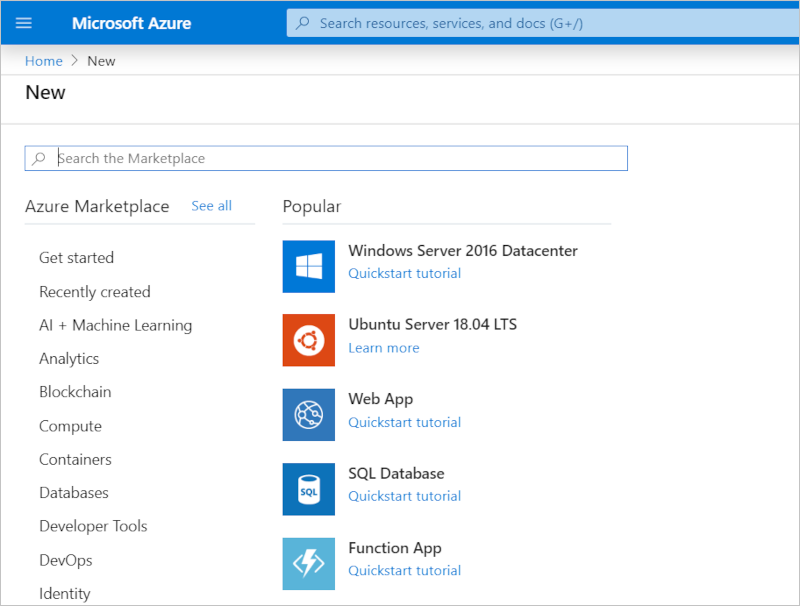
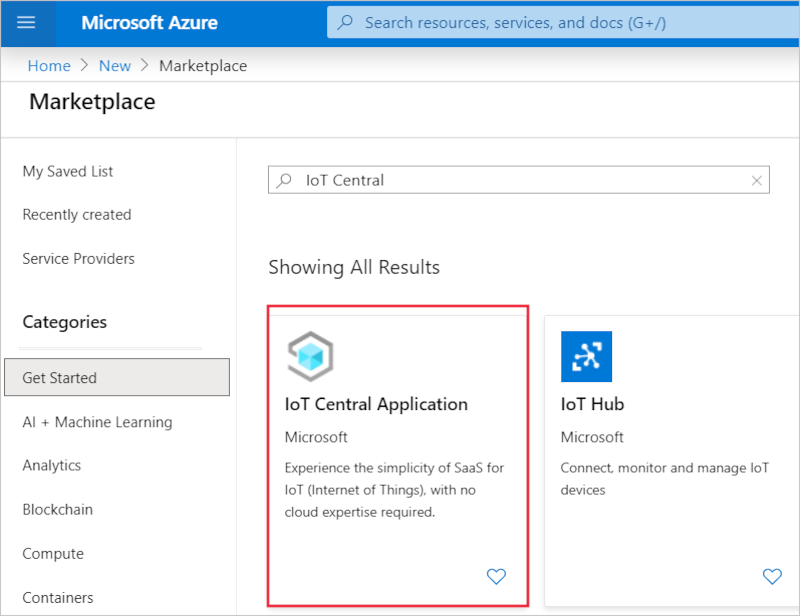
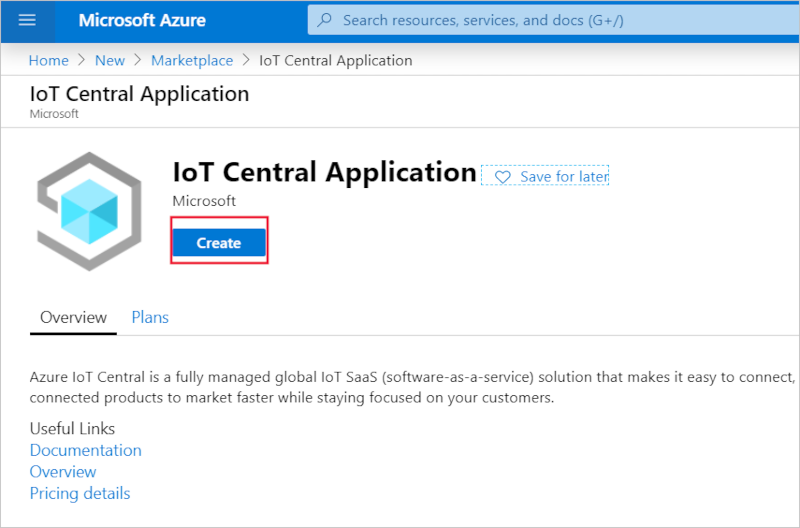
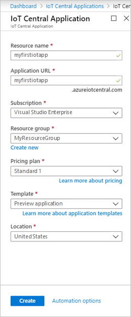
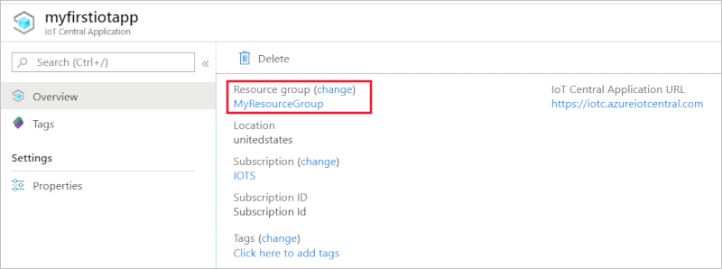
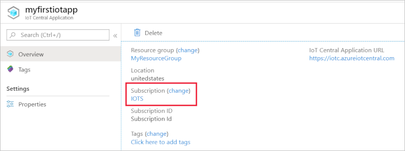

# Manage IoT Central from the Azure portal

[!INCLUDE [iot-central-selector-manage](../../../includes/iot-central-selector-manage.md)]

Instead of creating and managing IoT Central applications on the [Azure IoT Central application manager](https://aka.ms/iotcentral) website, you can use the [Azure portal](https://portal.azure.com) to manage your applications.

## Create IoT Central applications

To create an application, navigate to the [Azure portal](https://ms.portal.azure.com) and select **Create a resource**.

In **Search the Marketplace** bar, type *IoT Central*:

Select the **IoT Central Application** tile in the search results:

Now, select **Create**:

Fill in all the fields in the form. This form is similar to the form you fill out to create applications on the [Azure IoT Central application manager](https://aka.ms/iotcentral) website. For more information, see the [Create an IoT Central application](quick-deploy-iot-central.md) quickstart.

**Location** is the [geography](https://azure.microsoft.com/global-infrastructure/geographies/) where you'd like to create your application. Typically, you should choose the location that's physically closest to your devices to get optimal performance. Azure IoT Central is currently available in the **Australia**, **Asia Pacific**, **Europe**, **United States**, **United Kingdom**, and **Japan** geographies. Once you choose a location, you can't move your application to a different location later.

After filling out all fields, select **Create**.

## Manage existing IoT Central applications

If you already have an Azure IoT Central application you can delete it, or move it to a different subscription or resource group in the Azure portal.

> [!NOTE]
> You can't see applications created on the free pricing plan in the Azure portal because they are not associated with your subscription.

To get started, select **All resources** in the portal. Select **Show hidden types** and start typing the name of your application in **Filter by name** to find it. Then select the IoT Central application you'd like to manage.

To navigate to the application, select the **IoT Central Application URL**:

To move the application to a different resource group, select **change** beside the resource group. On the **Move resources** page, choose the resource group you'd like to move this application to:

To move the application to a different subscription, select  **change** beside the subscription. On the **Move resources** page, choose the subscription you'd like to move this application to:

## Next steps

Now that you've learned how to manage Azure IoT Central applications from the Azure portal, here is the suggested next step:

> [!div class="nextstepaction"]
> [Administer your application](howto-administer.md)