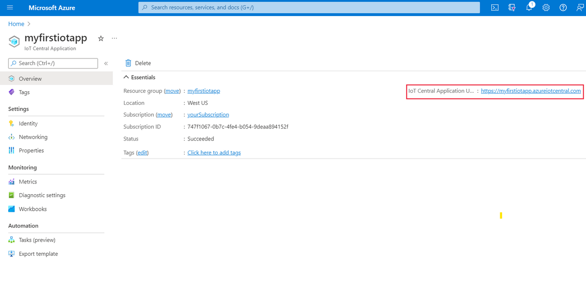
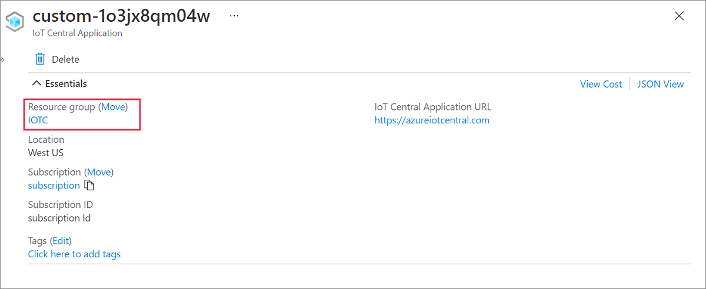
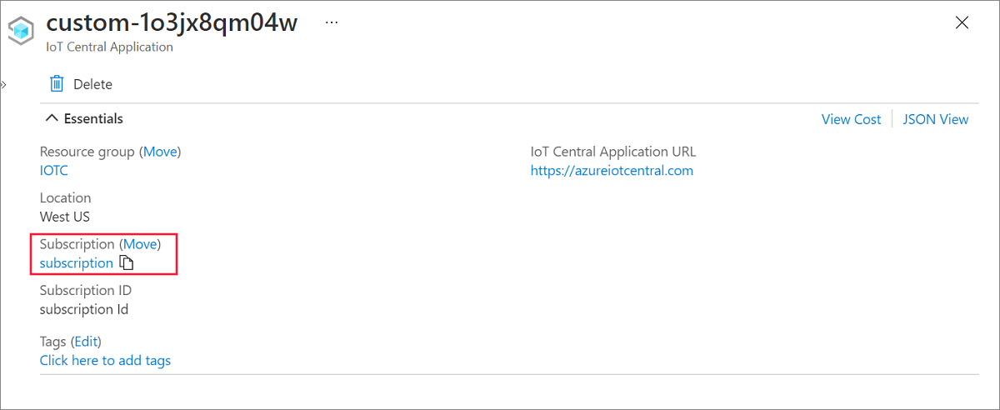

# Manage and monitor IoT Central from the Azure portal

You can use the [Azure portal](https://portal.azure.com) to create, manage, and monitor IoT Central applications.

## Create IoT Central applications

[!INCLUDE [Warning About Access Required](../../../includes/iot-central-warning-contribitorrequireaccess.md)]

To create an application, navigate to the [IoT Central Application](https://ms.portal.azure.com/#create/Microsoft.IoTCentral) page in the Azure portal:

* **Resource name** is a unique name you can choose for your IoT Central application in your Azure resource group.

* **Application URL** is the URL you can use to access your application.

* **Template** is the type of IoT Central application you want to create. You can create a new application either from the list of industry-relevant templates to help you get started quickly, or start from scratch using the **Custom application** template.

* **Location** is the [geography](https://azure.microsoft.com/global-infrastructure/geographies/) where you'd like to create your application. Typically, you should choose the location that's physically closest to your devices to get optimal performance. Azure IoT Central is currently available in the following locations:

  * Asia Pacific
  * Australia
  * Europe
  * Japan
  * United Kingdom
  * United States

  Once you choose a location, you can't later move your application to a different location.

After filling out all fields, select **Create**. To learn more, see [Create an IoT Central application](howto-create-iot-central-application.md).

## Manage existing IoT Central applications

If you already have an Azure IoT Central application, you can delete it, or move it to a different subscription or resource group in the Azure portal.

> [!NOTE]
> Applications created using the *free* plan do not require an Azure subscriptions, and therefore you won't find them listed in your Azure subscription on the Azure portal. You can only see and manage free apps from the IoT Central portal.

To get started, search for your application in the search bar at the top of the Azure portal. You can also view all your applications by searching for _IoT Central Applications_ and selecting the service:

When you select an application in the search results, the Azure portal shows you its overview. You can navigate to the application by selecting the **IoT Central Application URL**:

To move the application to a different resource group, select **change** beside the resource group. On the **Move resources** page, choose the resource group you'd like to move this application to:

To move the application to a different subscription, select  **change** beside the subscription. On the **Move resources** page, choose the subscription you'd like to move this application to:

## Monitor application health

> [!NOTE]
> Metrics are only available for version 3 IoT Central applications. To learn how to check your application version, see [How do I get information about my application?](howto-faq.yml#how-do-i-get-information-about-my-application-).

You can use the set of metrics provided by IoT Central to assess the health of devices connected to your IoT Central application and the health of your running data exports.

Metrics are enabled by default for your IoT Central application and you access them from the [Azure portal](https://portal.azure.com/). The [Azure Monitor data platform exposes these metrics](../../azure-monitor/essentials/data-platform-metrics.md) and provides several ways for you to interact with them. For example, you can use charts in the Azure portal, a REST API, or queries in PowerShell or the Azure CLI.

> [!TIP]
> Applications that use the free trial plan don't have an associated Azure subscription and so don't support Azure Monitor metrics. You can [convert an application to a standard pricing plan](./howto-faq.yml#how-do-i-move-from-a-free-to-a-standard-pricing-plan-) and get access to these metrics.

### View metrics in the Azure portal

The following steps assume you have an [IoT Central application](./howto-create-iot-central-application.md) with some [connected devices](./tutorial-connect-device.md) or a running [data export](howto-export-data.md).

To view IoT Central metrics in the portal:

1. Navigate to your IoT Central application resource in the portal. By default, IoT Central resources are located in a resource group called **IOTC**.
1. To create a chart from your application's metrics, select **Metrics** in the **Monitoring** section.

### Azure portal permissions

Access to metrics in the Azure portal is managed by [Azure role based access control](../../role-based-access-control/overview.md). Use the Azure portal to add users to the IoT Central application/resource group/subscription to grant them access. You must add a user in the portal even they're already added to the IoT Central application. Use [Azure built-in roles](../../role-based-access-control/built-in-roles.md) for finer grained access control.

### IoT Central metrics

For a list of of the metrics that are currently available for IoT Central, see [Supported metrics with Azure Monitor](../../azure-monitor/essentials/metrics-supported.md#microsoftiotcentraliotapps).

### Metrics and invoices

Metrics may differ from the numbers shown on your Azure IoT Central invoice. This situation occurs for a number of reasons such as:

* IoT Central [standard pricing plans](https://azure.microsoft.com/pricing/details/iot-central/) include two devices and varying message quotas for free. While the free items are excluded from billing, they're still counted in the metrics.

* IoT Central autogenerates one test device ID for each device template in the application. This device ID is visible on the **Manage test device** page for a device template. You may choose to validate your device templates before publishing them by generating code that uses these test device IDs. While these devices are excluded from billing, they're still counted in the metrics.

* While metrics may show a subset of device-to-cloud communication, all communication between the device and the cloud [counts as a message for billing](https://azure.microsoft.com/pricing/details/iot-central/).

## Next steps

Now that you've learned how to manage and monitor Azure IoT Central applications from the Azure portal, here is the suggested next step:

> [!div class="nextstepaction"]
> [Administer your application](howto-administer.md)