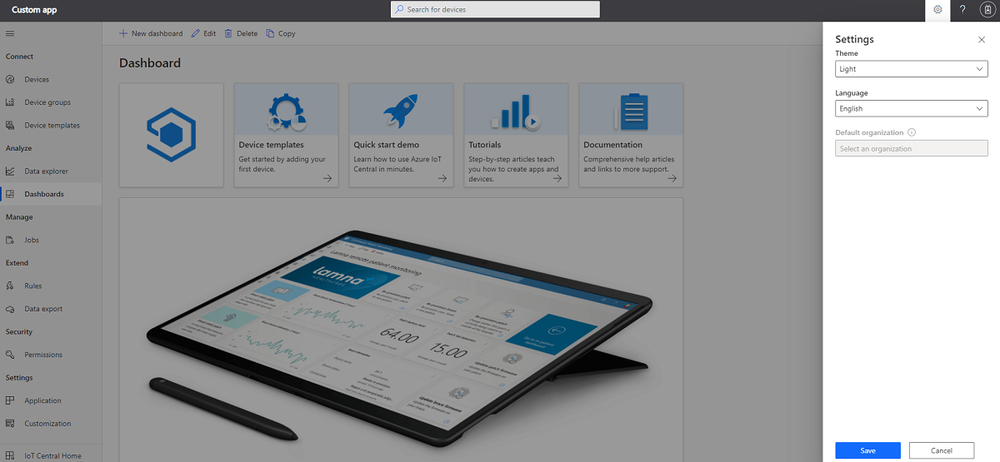

# Manage your personal application preferences

IoT Central provides the flexibility to customize your applications to fit your need. IoT Central also provides some flexibility on a per-user basis to customize your own view. This article describes the various customization options that a user can apply to their profile.

## Change language

IoT Central is supported in multiple languages. You can switch your preferred language by using the **language picker** on the settings icon on the top navigation bar. Once you've changed your language, IoT Central remembers your selection and applies it across all your applications. Customization within the application such dashboard images aren't localized.

## Change theme

We have support for both dark theme and light theme. While the light theme is the default, you can change the theme by selecting the settings icon on the top navigation bar.

> [!NOTE]
> The option to choose between light and dark themes isn't available if your administrator has configured a custom theme for the application.

## Change default organization

If your application uses organizations, you can select a default organization to use whenever you need to select an organization. For example, the default organization pre-populates the organization field when you add a new device to your application.

