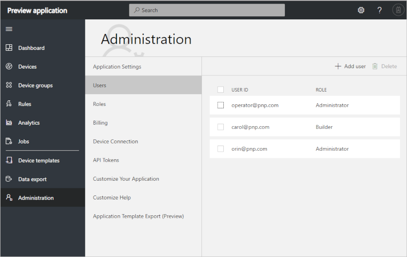

# Manage users and roles in your IoT Central application (preview features)

[!INCLUDE [iot-central-pnp-original](../../../includes/iot-central-pnp-original-note.md)]

This article describes how, as an administrator, you can add, edit, and delete users in your Azure IoT Central application. The article also describes how to manage roles in your Azure IoT Central application.

To access and use the **Administration** section, you must be in the **Administrator** role for an Azure IoT Central application. If you create an Azure IoT Central application, you're automatically added to the **Administrator** role for that application.

## Add users

Every user must have a user account before they can sign in and access an Azure IoT Central application. Microsoft Accounts (MSAs) and Azure Active Directory (Azure AD) accounts are supported in Azure IoT Central. Azure Active Directory groups aren't currently supported in Azure IoT Central.

For more information, see [Microsoft account help](https://support.microsoft.com/products/microsoft-account?category=manage-account) and  [Quickstart: Add new users to Azure Active Directory](https://docs.microsoft.com/azure/active-directory/add-users-azure-active-directory).

1. To add a user to an IoT Central application, go to the **Users** page in the **Administration** section.

    

1. To add a user, on the **Users** page, choose **+ Add user**.

1. Choose a role for the user from the **Role** drop-down menu. Learn more about roles in the [Manage roles](#manage-roles) section of this article.

    

    > [!NOTE]
    >  To add users in bulk, enter the user IDs of all the users you'd like to add separated by semi-colons. Choose a role from the **Role** drop-down menu. Then select **Save**.

### Edit the roles that are assigned to users

Roles can't be changed after they're assigned. To change the role that's assigned to a user, delete the user, and then add the user again with a different role.

> [!NOTE]
> The roles assigned are specific to IoT Central application and cannot be managed from the Azure Portal.

## Delete users

To delete users, select one or more check boxes on the **Users** page. Then select **Delete**.

## Manage roles

Roles enable you to control who within your organization is allowed to do various tasks in IoT Central. There are three built-in roles you can assign to users of your application. You can also [create custom roles](#create-a-custom-role) if you require finer-grained control.

### Administrator

Users in the **Administrator** role have access to all functionality in an application.

The user who creates an application is automatically assigned to the **Administrator** role. There must always be at least one user in the **Administrator** role.

### Application Builder

Users in the **Application Builder** role can do everything in an application except administer the application. Builders can create, edit, and delete device templates and devices, manage device sets, and run analytics and jobs. Builders won't have access to the **Administration** section of the application.

### Application Operator

Users in the **Application Operator** role aren't allowed to make changes to device templates or to administer the application. Operators can add and delete devices, manage device sets, and run analytics and jobs. Operators won't have access to the **Application Builder** and **Administration** pages.

## Create a custom role

If your solution requires finer-grained access controls, you can create custom roles with custom sets of permissions. To create a custom role, navigate to the **Roles (preview)** page in the **Administration** section of your application. Then select **+ New role**, and add a name and description for your role. Select the permissions your role requires and then select **Save**.

You can add users to your custom role in the same way that you add users to a built-in role.

### Custom role options

When you define a custom role, you choose the set of permissions that a user is granted if they're a member of the role. Some permissions are dependent on others. For example, if you add the **Update application dashboards** permission to a role, the **View application dashboards** permission is automatically added. The following tables summarize the available permissions, and their dependencies, you can use when creating custom roles:

#### Customizing the app

**Application dashboard permissions**

| Name | Dependencies |
| ---- | -------- |
| View | None     |
| Update | View   |
| Create | View, Update |
| Delete | View   |
| Full Control | View, Update, Create, Delete |

**Personal dashboards permissions**

| Name | Dependencies |
| ---- | -------- |
| View | None     |
| Update | View   |
| Create | View, Update   |
| Delete | View   |
| Full Control | View, Update, Create, Delete |

**White labeling permissions**

| Name | Dependencies |
| ---- | -------- |
| View | None     |
| Update | View   |
| Full Control | View, Update |

**Help links permissions**

| Name | Dependencies |
| ---- | -------- |
| View | None     |
| Update | View   |
| Full Control | View, Update |

#### Extending the app

**Data export permissions**

| Name | Dependencies |
| ---- | -------- |
| View | None     |
| Update | View   |
| Create | View, Update  |
| Delete | View   |
| Full Control | View, Update, Create, Delete |

**API token permissions**

| Name | Dependencies |
| ---- | -------- |
| View | None     |
| Create | View   |
| Delete | View   |
| Full Control | View, Create, Delete |

#### Managing the app

**Application settings permissions**

| Name | Dependencies |
| ---- | -------- |
| View | None     |
| Update | View   |
| Copy | View   Other dependencies: View device templates, device instances, device groups, dashboards, data export, white labeling, help links, custom roles, rules |
| Delete | View   |
| Full Control | View, Update, Copy, Delete   Other dependencies: View device templates, device instances, device groups, dashboards, data export, white labeling, help links, custom roles, rules |

**Application template export permissions**

| Name | Dependencies |
| ---- | -------- |
| View | None     |
| Export | View   Other dependencies:  View device templates, device instances, device groups, dashboards, data export, white labeling, help links, custom roles, rules |
| Full Control | View, Export   Other dependencies:  View device templates, device instances, device groups, dashboards, data export, white labeling, help links, custom roles, rules |

**Billing permissions**

| Name | Dependencies |
| ---- | -------- |
| Manage | None     |
| Full Control | Manage |

#### Managing devices

**Device template permissions**

| Name | Dependencies |
| ---- | -------- |
| View | None     |
| Update | View   |
| Create | View, Update   |
| Delete | View   |
| Publish | View, Update|
| Full Control | View, Update, Create, Delete, Publish |

**Device instance permissions**

| Name | Dependencies |
| ---- | -------- |
| View | None   Other dependencies: View device templates |
| Update | View   Other dependencies: View device templates |
| Create | View   Other dependencies:  View device templates |
| Delete | View   Other dependencies: View device templates |
| Execute Commands | Update, View   Other dependencies: View device templates |
| Full Control | View, Update, Create, Delete, Execute Commands   Other dependencies: View device templates |

**Device groups permissions**

| Name | Dependencies |
| ---- | -------- |
| View | None   Other dependencies: View device templates and device instances |
| Update | View   Other dependencies: View device templates and device instances   |
| Create | View, Update   Other dependencies:  View device templates and device instances   |
| Delete | View   Other dependencies:  View device templates and device instances   |
| Full Control | View, Update, Create, Delete   Other dependencies: View device templates and device instances |

**Device connectivity management permissions**

| Name | Dependencies |
| ---- | -------- |
| Read instance | None   Other dependencies: View device templates and device instances |
| Read global | None   |
| Update global | Read Global |
| Full Control | Read instance, Read global, Update global.   Other dependencies: View device templates and device instances |

**Jobs permissions**

| Name | Dependencies |
| ---- | -------- |
| View | None   Other dependencies: View device templates, device instances, and device groups |
| Update | View   Other dependencies: View device templates, device instances, and device groups |
| Create | View, Update   Other dependencies:  View device templates, device instances, and device groups |
| Delete | View   Other dependencies:  View device templates, device instances, and device groups |
| Execute | View   Other dependencies: View device templates, device instances, and device groups; Update device instances; Execute commands on device instances |
| Full Control | View, Update, Create, Delete, Execute   Other dependencies:  View device templates, device instances, and device groups; Update device instances; Execute commands on device instances |

**Rules permissions**

| Name | Dependencies |
| ---- | -------- |
| View | None   Other dependencies: View device templates |
| Update | View   Other dependencies: View device templates |
| Create | View, Update   Other dependencies:  View device templates |
| Delete | View   Other dependencies: View device templates |
| Full Control | View, Update, Create, Delete   Other dependencies: View device templates |

**Analytics permissions**

| Name | Dependencies |
| ---- | -------- |
| View | None   Other dependencies: View device templates, device instances,  device groups |
| Full Control | View   Other dependencies:  View device templates, device instances,  device groups |

#### Managing users and roles

**Custom roles permissions**

| Name | Dependencies |
| ---- | -------- |
| View | None |
| Update | View |
| Create | View, Update |
| Delete | View |
| Full Control | View, Update, Create, Delete |

**User management permissions**

| Name | Dependencies |
| ---- | -------- |
| View | None   Other dependencies: View custom roles |
| Add | View   Other dependencies:  View custom roles |
| Delete | View   Other dependencies:  View custom roles |
| Full Control | View, Add, Delete   Other dependencies:  View custom roles |

## Next steps

Now that you've learned about how to manage users and roles in your Azure IoT Central application, the suggested next step is to learn how to [Manage your bill](/howto-view-bill-pnp.md?toc=/azure/iot-central-pnp/toc.json&bc=/azure/iot-central-pnp/breadcrumb/toc.json).
