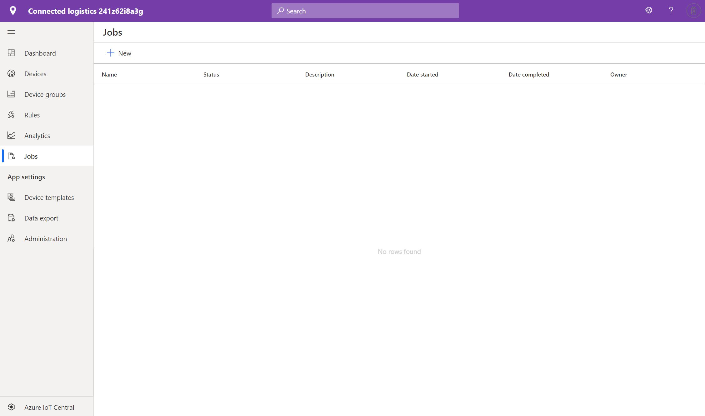
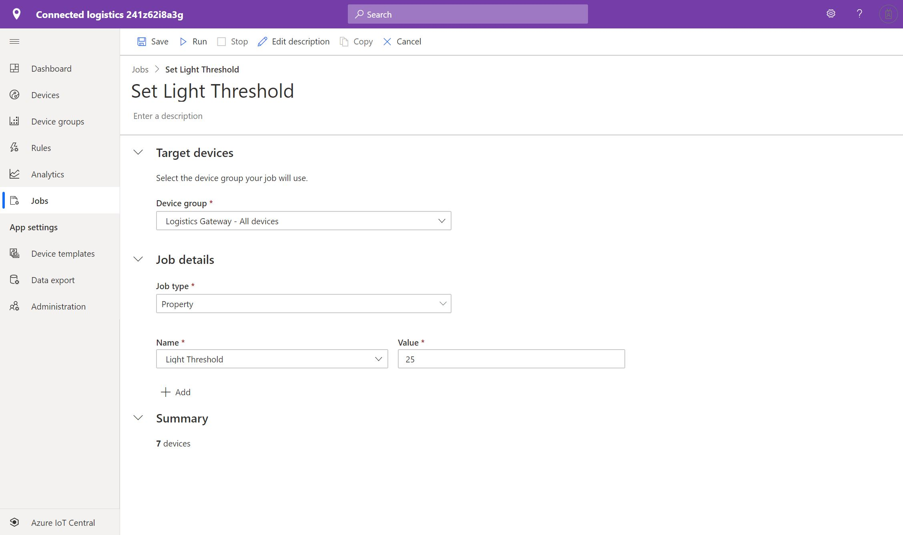
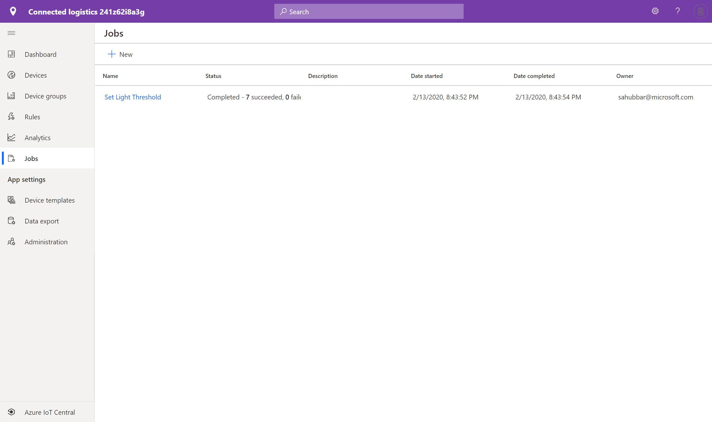
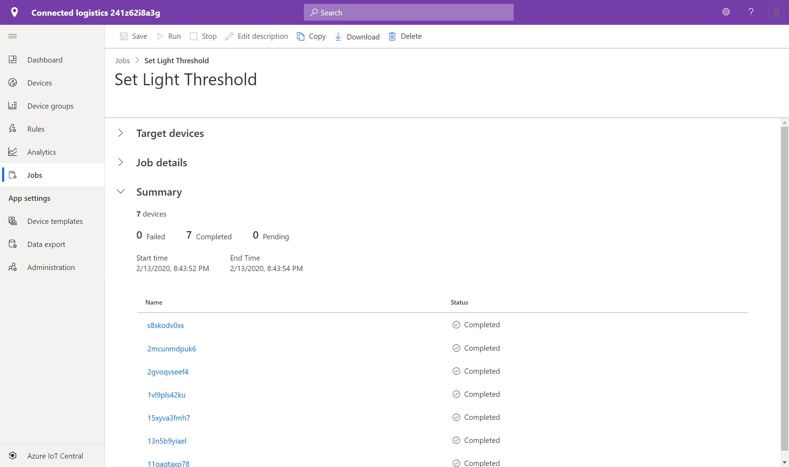
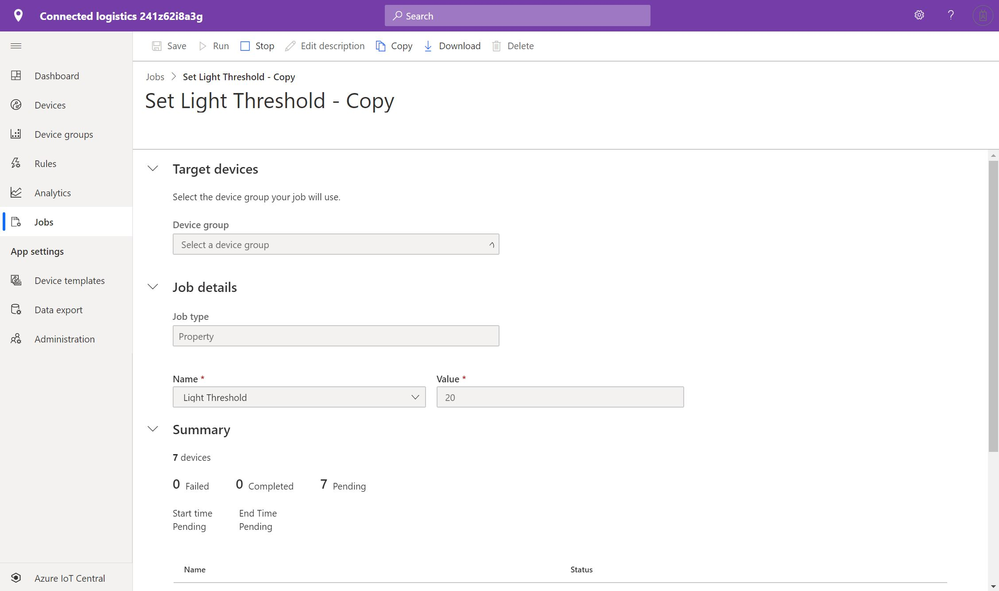
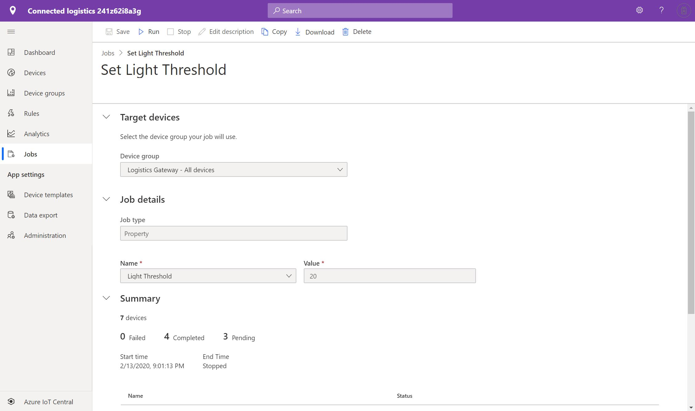
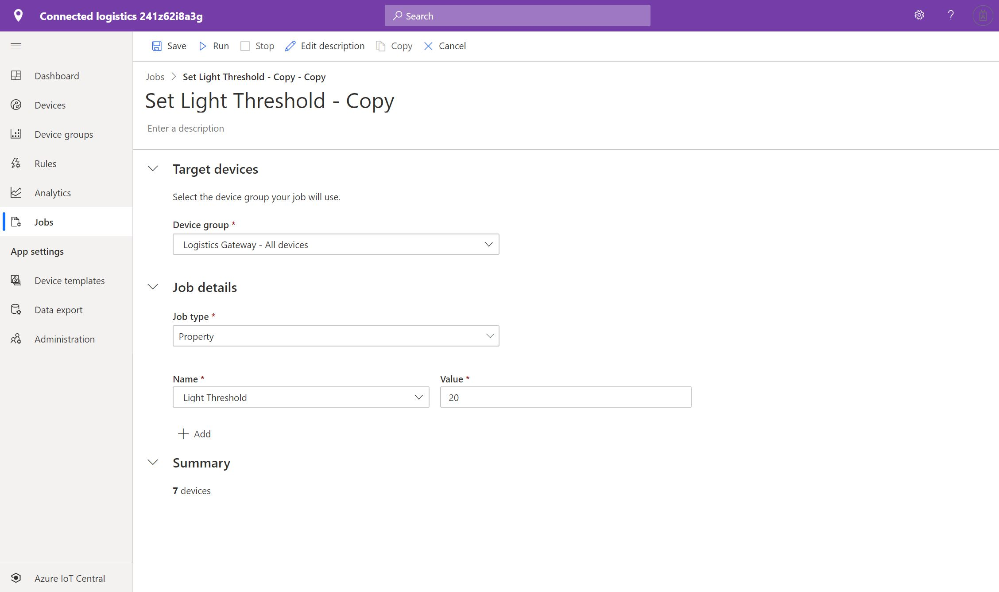

# Create and run a job in your Azure IoT Central application

You can use Microsoft Azure IoT Central to manage your connected devices at scale using jobs. Jobs let you do bulk updates to device properties and run commands. This article shows you how to get started using jobs in your own application.

## Create and run a job

This section shows you how to create and run a job. It shows you how to set the light threshold for a group of logistic gateway devices.

1. Navigate to **Jobs** from the left pane.

2. Select **+ New** to create a new job:

    > [!div class="mx-imgBorder"]
    > 

3. Enter a name and description to identify the job you're creating.

4. Select the target device group you want your job to apply to. You can see how many devices your job configuration applies to in the **Summary** section.

5. Next, choose either **Property** or **Command**  as the type of job to configure. To set up a **Property** job configuration, select a property and set its new value. To set up a **Command**, or  choose the command to run. A property job can set multiple properties:

    > [!div class="mx-imgBorder"]
    > 

6. After selecting your devices, choose **Run** or **Save**. The job now appears on your main **Jobs** page. On this page, you can see your currently running job and the history of any previously run or saved jobs. Your saved job can be opened again at any time to continue editing it or to run it:

    > [!div class="mx-imgBorder"]
    > 

    > [!NOTE]
    > You can view up 30 days of history for your previously run jobs.

7. To get an overview of your job, select the job to view from the list. This overview contains the job details, devices, and device status values. From this overview, you can also select **Download Job Details** to download a CSV file of your job details, including the devices and their status values. This information can be useful for troubleshooting:

    > [!div class="mx-imgBorder"]
    > 

### Stop a running job

To stop one of your running jobs, open it and select **Stop**. The job status changes to reflect the job is stopped. The **Summary** section shows which devices have completed, failed, or are still pending:

    > [!div class="mx-imgBorder"]
    > 

### Run a stopped job

To run a job that's currently stopped, select it, and then select **Run**. The job status changes to reflect the job is now running again. The **Summary** section continues to update with the latest progress:

    > [!div class="mx-imgBorder"]
    > 

## Copy a job

To copy one of your existing jobs, open it and select **Copy**. A copy of the job configuration opens for you to edit, and **Copy** is appended to the end of the job name. You can save or run the new job:

    > [!div class="mx-imgBorder"]
    > 

## View the job status

After a job is created, the **Status** column updates with the latest status message of the job. The following table lists the possible status values:

| Status message       | Status meaning                                          |
| -------------------- | ------------------------------------------------------- |
| Completed            | This job has been executed on all devices.              |
| Failed               | This job has failed and not fully executed on devices.  |
| Pending              | This job hasn't yet begun executing on devices.         |
| Running              | This job is currently executing on devices.             |
| Stopped              | This job has been manually stopped by a user.           |

The status message is followed by an overview of the devices in the job. The following table lists the possible device status values:

| Status message       | Status meaning                                                     |
| -------------------- | ------------------------------------------------------------------ |
| Succeeded            | The number of devices that the job successfully executed on.       |
| Failed               | The number of devices that the job has failed to execute on.       |

### View the device status

To view the status of the job and all the affected devices, select the job. To download a CSV file that includes the job details, including the list of devices and their status values, select **Download job details**. Next to each device name, you see one of the following status messages:

| Status message       | Status meaning                                                                |
| -------------------- | ----------------------------------------------------------------------------- |
| Completed            | The job has been executed on this device.                                     |
| Failed               | The job has failed to execute on this device. The error message shows more information.  |
| Pending              | The job hasn't yet executed on this device.                                   |

> [!NOTE]
> If a device has been deleted, you can't select the device. It displays as deleted with the device ID.

## Next steps

Now that you've learned how to create jobs in your Azure IoT Central application, here are some next steps:

- [Manage your devices](howto-manage-devices.md)
- [Version your device template](howto-version-device-template.md)
