# Create and run a job in your Azure IoT Central application

You can use Microsoft Azure IoT Central to manage your connected devices at scale through jobs. Jobs let you do bulk updates to device and cloud properties and run commands. This article shows you how to get started with using jobs in your own application.

## Create and run a job

This section shows you how to create and run a job in the form of setting the light threshold for a group of logistic gateway devices. You will use a new job wizard to create and run a job. You will have the option to save a job to run in the future. 

1. On the left pane, select **Jobs**.

2. Select **+ New Job**.

   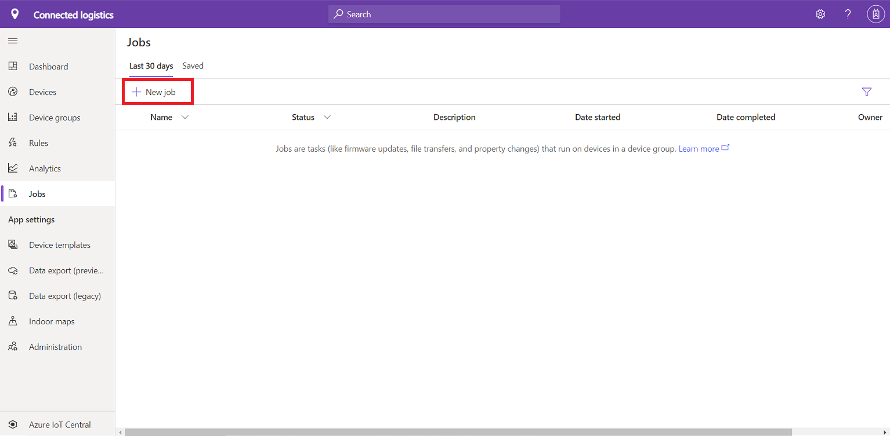

3. Configure your job by entering a name and description to identify the job that you're creating.

4. Select the target device group that you want your job to apply to. You can see how many devices your job configuration applies to in the **Summary** section.

5. Choose **Cloud property**, **Property**, or **Command** as the type of job to configure. 

   To set up a **Property** job configuration, select a property and set its new value. To set up a **Command** job configuration, choose the command to run. A property job can set multiple properties.

   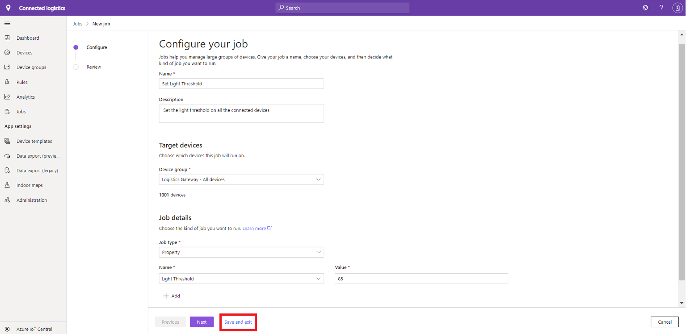

   You can choose to save and exit the job. You will be presented with Saved Jobs list page and the job now appears on saved jobs list page.
   
   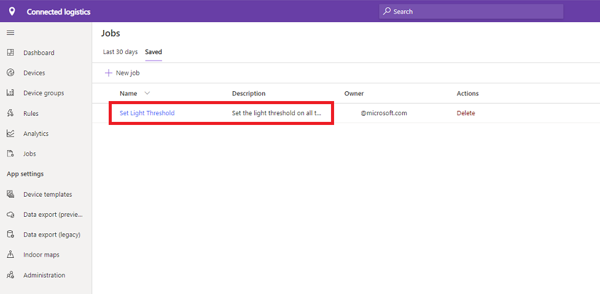

   Click on the Job to go back to Job Wizard page. Click **Next** button. You will be presented with Review Page. 

   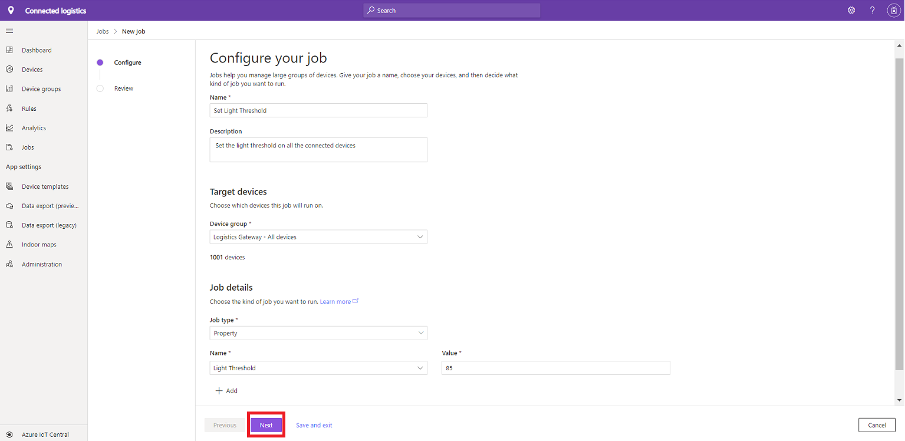
   
   You will be presented with Review Page. The review page will have job configuration details, number of devices which qualify for the job and the job type details. Click **Run** button to submit the job for execution.
   
   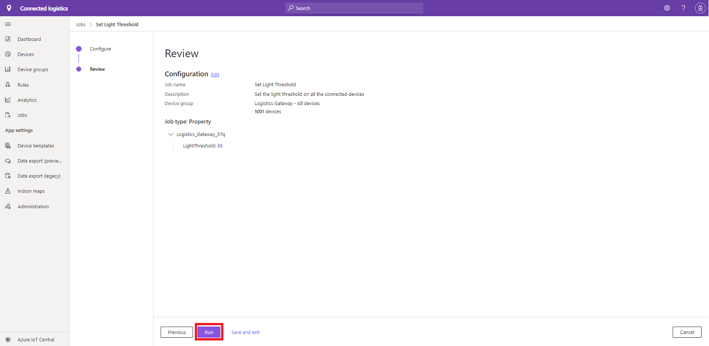

6. A job goes through the phases of pending, running, and completed. The job execution details contain result metrics, duration details, and a device list grid. 

   From this overview, you can also select **Results log** to download a CSV file of your job details, including the devices and their status values. This information can be useful for troubleshooting.

   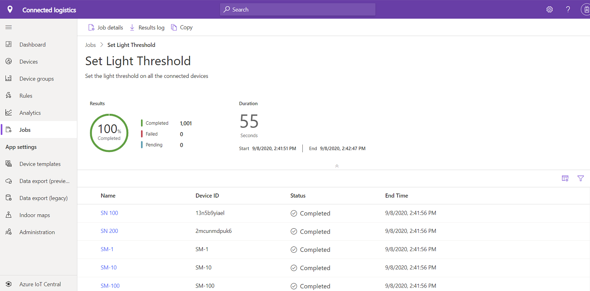

6. Click on Jobs in the left nav or in the breadcrumbs. The job now appears on **Last 30 days** page. On this page, you can see your currently running jobs and the history of any previously run or saved jobs. 

   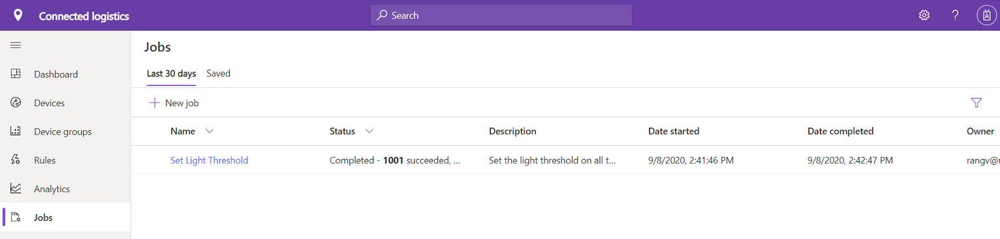

   > [!NOTE]
   > You can view up 30 days of history for your previously run jobs.

## Manage jobs

To stop a running job, open it and select **Stop**. The job status changes to reflect that the job is stopped. The **Summary** section shows which devices have completed, have failed, or are still pending.

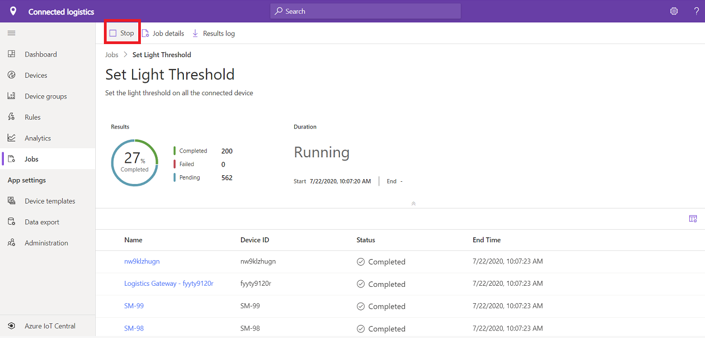

After a job is in a stopped state, you can select **Continue** to resume running the job. The job status changes to reflect that the job is now running again. The **Summary** section continues to be updated with the latest progress.

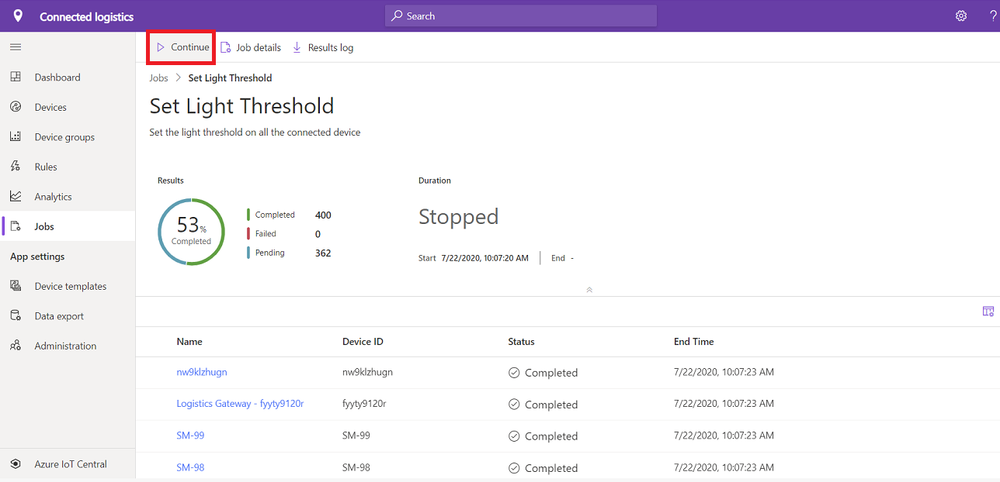

## Copy a job

To copy one of your existing jobs, select an executed job. click on **Copy** from job results page or from the jobs details page.  

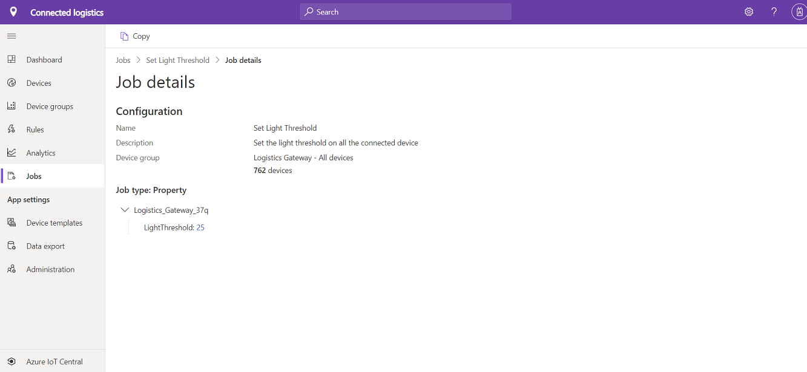

Select **Copy**.

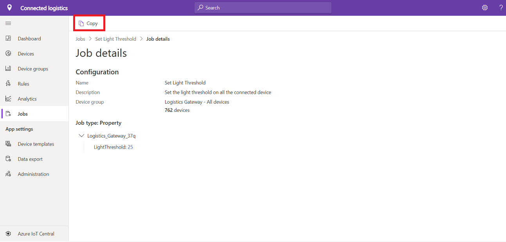

A copy of the job configuration opens for you to edit, and **Copy** is appended to the job name. You can save and exit from the job wizard or run the new job.

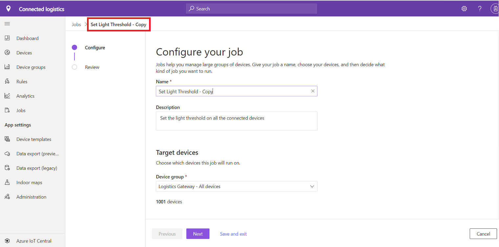

## View job status

After a job is created, the **Status** column is updated with the latest status message for the job. The following table lists the possible job status values:

| Status message       | Status meaning                                          |
| -------------------- | ------------------------------------------------------- |
| Completed            | This job ran on all devices.              |
| Failed               | This job failed and did not fully run on devices.  |
| Pending              | This job hasn't yet begun running on devices.         |
| Running              | This job is currently running on devices.             |
| Stopped              | A user has manually stopped this job.           |

The status message is followed by an overview of the devices in the job. The following table lists the possible device status values:

| Status message       | Status meaning                                                     |
| -------------------- | ------------------------------------------------------------------ |
| Succeeded            | The number of devices that the job successfully ran on.       |
| Failed               | The number of devices that the job has failed to run on.       |

To view the status of the job and all the affected devices, open the job. Next to each device name, you see one of the following status messages:

| Status message       | Status meaning                                                                |
| -------------------- | ----------------------------------------------------------------------------- |
| Completed            | The job ran on this device.                                     |
| Failed               | The job failed to run on this device. The error message shows more information.  |
| Pending              | The job hasn't yet run on this device.                                   |

To download a CSV file that includes the job details and the list of devices and their status values, select **Download**.

## Filter the device list

You can filter the device list on the **Job details** page by selecting the filter icon. You can filter on the **Device ID** or **Status** field.

:::image type="content" source="media/howto-run-a-job/filter.png" alt-text="Screenshot that shows selections for filtering a device list.":::

## Customize columns in the device list

You can choose additional columns to display in the device list by selecting the column options icon.

:::image type="content" source="media/howto-run-a-job/column-options.png" alt-text="Screenshot that shows the icon for column options.":::

A dialog box lets you choose the columns to display in the device list. Select the columns that you want to display, select the right arrow, and then select **OK**. To select all the available columns, check **Select all**.

:::image type="content" source="media/howto-run-a-job/column-picker-popup.png" alt-text="Screenshot that shows the dialog box for choosing columns to display.":::

The selected columns appear in the device list.

:::image type="content" source="media/howto-run-a-job/column-picker-column-selected.png" alt-text="Screenshot that shows selected columns in the device list.":::

Selected columns are persisted across a user session or across user sessions that have access to the application.

## Rerun jobs

You can rerun a job that has failed devices. Select **Rerun on failed**.

:::image type="content" source="media/howto-run-a-job/rerun.png" alt-text="Screenshot that shows the button for rerunning a job on failed devices.":::

Enter a job name and description, and then select **Rerun job**. A new job is submitted to retry the action on failed devices.

:::image type="content" source="media/howto-run-a-job/rerun-failed.png" alt-text="Screenshot that shows the dialog box for rerunning failed devices.":::

> [!NOTE]
> You can't run more than five jobs at the same time from an Azure IoT Central application.
>
> When a job is complete and you delete a device that's in the job's device list, the device entry appears as deleted in the device name. The details link isn't available for the deleted device.

## Next steps

Now that you've learned how to create jobs in your Azure IoT Central application, here are some next steps:

- [Manage your devices](howto-manage-devices.md)
- [Version your device template](howto-version-device-template.md)
