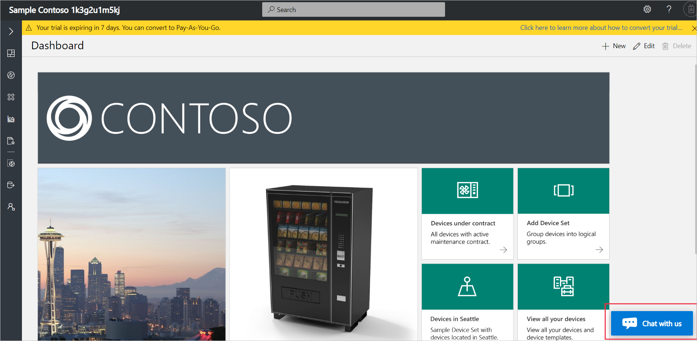
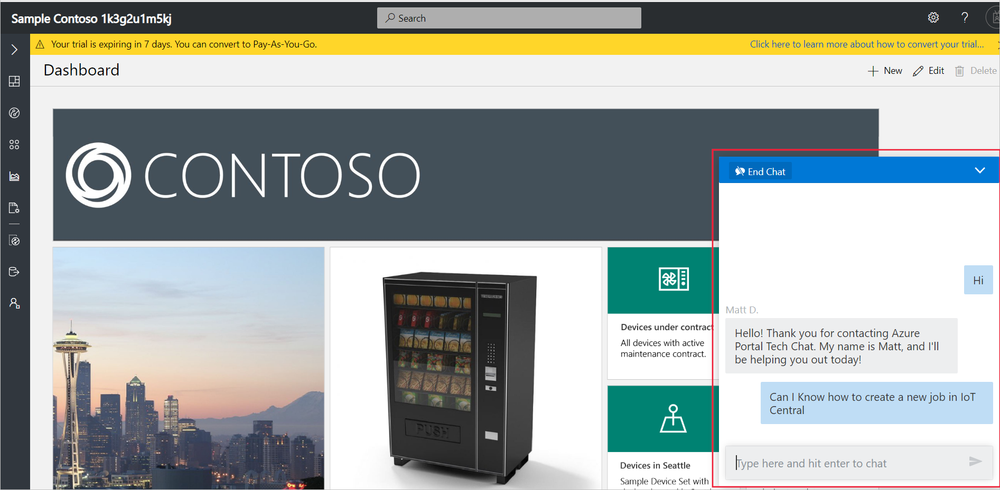

# Toggle live chat

This how-to article shows you how to toggle the live chat in your IoT Central application. You can use live chat to access technical support.

> [!NOTE]
> The chat option is available only for applications created using the free pricing plan.

## Chat with us

To get technical support, open your IoT Central application and select **Chat with us**.

You can type a question as shown in the following screenshot:

## Hide chat

To hide the chat, choose **Hide Chat** in the **Help** panel:

 

## Enable chat

To show the chat, choose **Show Chat** in the **Help** panel:

 

## Next steps

Now that you've learned how to toggle live chat in Azure IoT Central, here is the suggested next step:

> [!div class="nextstepaction"]
> [Add tiles to your dashboard](howto-add-tiles-to-your-dashboard.md)
