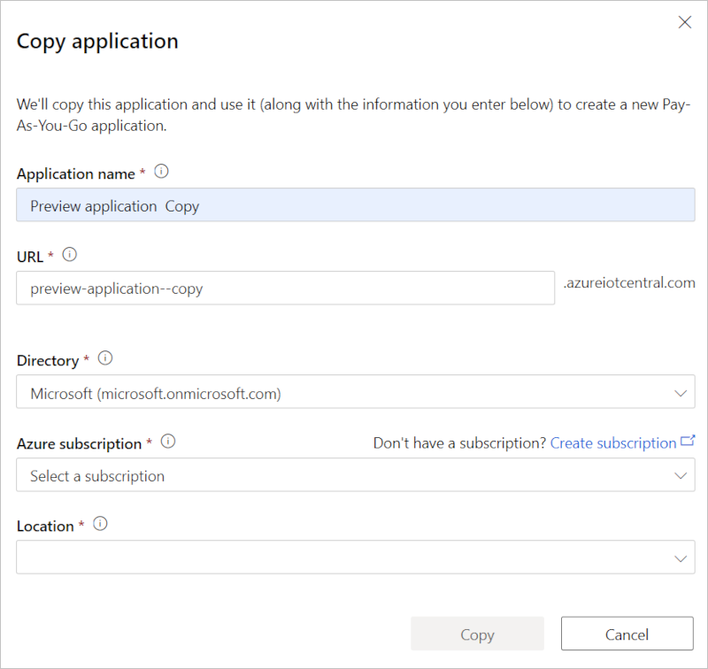
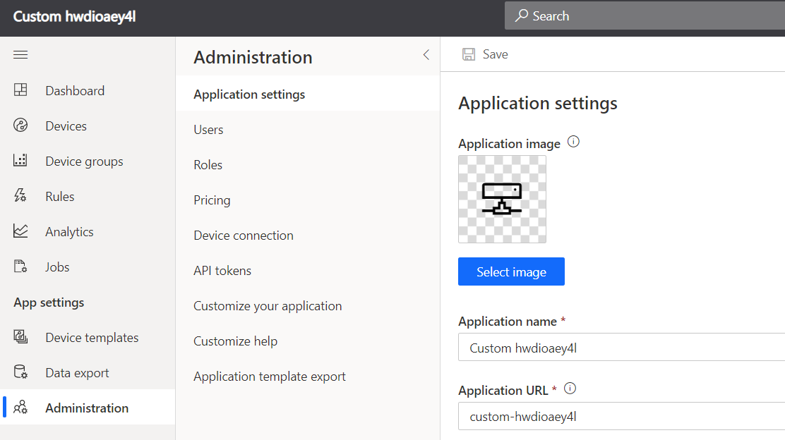
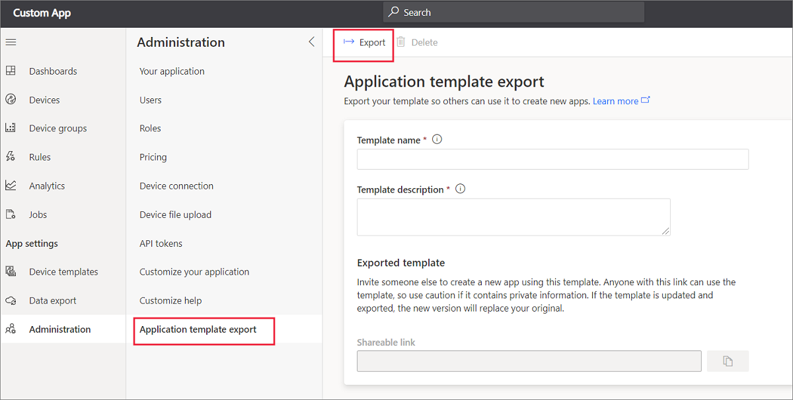
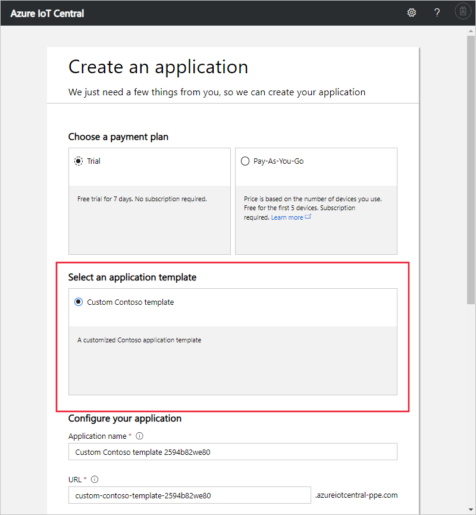

# Export your application

This article describes how, as a solution manager, to export an IoT Central application to be able to reuse it.

You have two options:

- You can create a copy of your application if you just need to create a duplicate copy of your application.
- You can create an application template from your application if you plan to create multiple copies.

## Copy your application

You can create a copy of any application, minus any device instances, device data history, and user data. The copy uses a standard pricing plan that you'll be billed for. You can't create an application that uses the free pricing plan by copying an application.

Select **Copy**. In the dialog box, enter the details for the new application. Then select **Copy** to confirm that you want to continue. To learn more about the fields in the form, see the [Create an application](quick-deploy-iot-central.md) quickstart.

After the app copy operation succeeds, you can navigate to the new application using the link.

Copying an application also copies the definition of rules and email action. Some actions, such as Flow and  Logic Apps, are tied to specific rules via the Rule ID. When a rule is copied to a different application, it gets its own Rule ID. In this case, users will have to create a new action and then associate the new rule with it. In general, it's a good idea to check the rules and actions to make sure they're up-to-date in the new app.

> [!WARNING]
> If a dashboard includes tiles that display information about specific devices, then those tiles show **The requested resource was not found** in the new application. You must reconfigure these tiles to display information about devices in your new application.

## Create an application template

When you create an Azure IoT Central application, you have a choice of built-in sample templates. You can also create your own application templates from existing IoT Central applications. You can then use your own application templates when you create new applications.

When you create an application template, it includes the following items from your existing application:

- The default application dashboard, including the dashboard layout and all the tiles you've defined.
- Device templates, including measurements, settings, properties, commands, and dashboard.
- Rules. All rule definitions are included. However actions, except for email actions, aren't included.
- Device sets, including their conditions and dashboards.

> [!WARNING]
> If a dashboard includes tiles that display information about specific devices, then those tiles show **The requested resource was not found** in the new application. You must reconfigure these tiles to display information about devices in your new application.

When you create an application template, it doesn't include the following items:

- Devices
- Users
- Continuous data export definitions

Add these items manually to any applications created from an application template.

To create an application template from an existing IoT Central application:

1. Go to the **Administration** section in your application.
1. Select **Application Template Export**.
1. On the **Application Template Export** page, enter a name and description for your template.
1. Select the **Export** button to create the application template. You can now copy the **Shareable Link** that enables someone to create a new application from the template:

### Use an application template

To use an application template to create a new IoT Central application, you need a previously created **Shareable Link**. Paste the **Shareable Link** into your browser's address bar. The **Create an application** page displays with your custom application template selected:

Select your pricing plan and fill out the other fields on the form. Then select **Create** to create a new IoT Central application from the application template.

### Manage application templates

On the **Application Template Export** page, you can delete or update the application template.

If you delete an application template, you can no longer use the previously generated shareable link to create new applications.

To update your application template, change the template name or description on the **Application Template Export** page. Then select the **Export** button again. This action generates a new **Shareable link** and invalidates any previous **Shareable link** URL.

## Next steps

Now that you've learned how to use application templates, the suggested next step is to learn how to [Monitor the overall health of the devices connected to an IoT Central application](howto-monitor-application-health.md)
