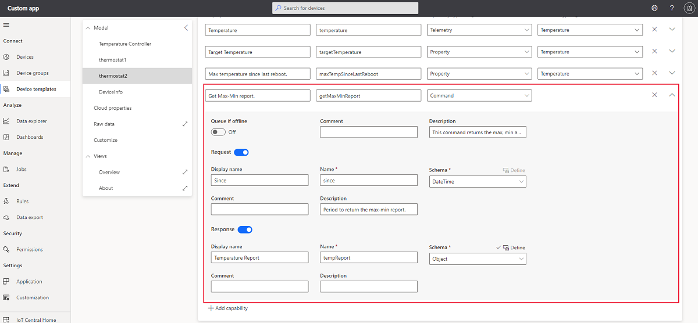

# How to use commands in an Azure IoT Central solution

This how-to guide shows you how, as a device developer, to implement commands that are defined in a device template in your Azure IoT Central application. 

## Use custom templates in an Azure IoT Central solution

To complete the steps in this article, you need the following:

* An Azure IoT Central application created using the **Custom application** template. For more information, see the [create an application quickstart](quick-deploy-iot-central.md). The application must have been created on or after 07/14/2020.
* A development machine with [Node.js](https://nodejs.org/) version 10.0.0 or later installed. You can run `node --version` in the command line to check your version. The instructions in this tutorial assume you're running the **node** command at the Windows command prompt. However, you can use Node.js on many other operating systems.

## Define device commands

These commands have the following header properties:

* `iothub-command-name` : the command name, for example `UpdateFirmware`.

* `iothub-command-request-id` : the request ID generated on the server side and sent to the device in the initial call.

* `iothub-interface-id` :  The ID of the interface this command is defined on, for example `urn:example:AssetTracker:1`.

* `iothub-interface-name` : the instance name of this interface, for example `myAssetTracker`.

* `iothub-command-statuscode` : the status code returned from the device, for example `202`.

The following screenshot shows a command definition in an Azure IoT Central application. The commands are defined as part of the device template.



## Configuration setting
The following table shows the configuration settings for a command capability:

| Field             |Description|
|-------------------|-----------|
|Display Name       |The command value used on dashboards and forms.|
| Name            | The name of the command. IoT Central generates a value for this field from the display name, but you can choose your own value if necessary. This field needs to be alphanumeric. The code in the device will use this Name value.|
| Capability Type | Command.|
| Description     | A description of the command capability.|
| Request     | The payload for the device command.|
| Response     | The payload of the device command response.|                                                                                                                                   The The following snippet shows the JSON representation of the command in the device model. You can export the device model from the device template page.

``` jsonf
{
 "@id": "turnon",
 "@type": "Command",
 "comment": "This Commands will turn-on the LED light on the device.",
 "name": "turnon"
},
{
 "@id": "turnoff",
 "@type": "Command",
 "comment": "This Commands will turn-off the LED light on the device.",
 "name": "turnoff"
},
{
 "@id": "rundiagnostics",
 "@type": "Command",
 "comment": "This command initiates a diagnostics run.  This will take time and is implemented as a command", "name": "rundiagnostics"
}

```

This example shows three commands, these can be related to the command definition in the UI as below:

* `@type` to specify the type of capability: `Command`
* `name` for the command value.

Optional fields, such as display name and description, let you add more details to the interface and capabilities.

In the above example, device receives an empty payload in the request and will return an empty payload in the response with a `200` HTTP response code to indicate success.

## Run command example

. To send device twin properties to your Azure IoT Central application, add the following function to your file:

```javascript
    // Send device twin reported properties.
    function sendDeviceProperties(twin, properties) {
      twin.properties.reported.update(properties, (err) => console.log(`Sent device properties: ${JSON.stringify(properties)}; ` +
        (err ? `error: ${err.toString()}` : `status: success`)));
    }
```

IoT Central uses device twins to synchronize property values between the device and the IoT Central application. Device property values use device twin reported properties. Writeable properties use both device twin reported and desired properties.

1. To define and handle the writeable properties your device responds to, add the following code. The message the device sends in response to the [writeable property update](concepts-telemetry-properties-commands.md#writeable-property-types) must include the `av` and `ac` fields. The `ad` field is optional:

```javascript
    // Add any writeable properties your device supports,
    // mapped to a function that's called when the writeable property
    // is updated in the IoT Central application.
    var writeableProperties = {
      'name': (newValue, callback) => {
          setTimeout(() => {
            callback(newValue, 'completed', 200);
          }, 1000);
      },
      'brightness': (newValue, callback) => {
        setTimeout(() => {
            callback(newValue, 'completed', 200);
        }, 5000);
      }
    };

    // Handle writeable property updates that come from IoT Central via the device twin.
    function handleWriteablePropertyUpdates(twin) {
      twin.on('properties.desired', function (desiredChange) {
        for (let setting in desiredChange) {
          if (writeableProperties[setting]) {
            console.log(`Received setting: ${setting}: ${desiredChange[setting]}`);
            writeableProperties[setting](desiredChange[setting], (newValue, status, code) => {
              var patch = {
                [setting]: {
                  value: newValue,
                  ad: status,
                  ac: code,
                  av: desiredChange.$version
                }
              }
              sendDeviceProperties(twin, patch);
            });
          }
        } 
      });
    }
```
When the operator sets a writeable property in the IoT Central application, the application uses a device twin desired property to send the value to the device. The device then responds using a device twin reported property. When IoT Central receives the reported property value, it updates the property view with a status of **synced**.

The names of the properties (`name` and `brightness`) must match the names used in the device template.

1. Add the following code to handle the commands sent from the IoT Central application:

    ```javascript
    // Setup command handlers
    function setupCommandHandlers(twin) {
        response.send(200, responsePayload, (err) => {
          if (err) {
            console.error('Unable to send method response: ' + err.toString());
          } else {
            console.log('Blinking LED every ' + request.payload  + ' seconds');
          }
        });
      }

      // Handle LED turn on command
      function turnOn(request, response) {
        console.log('Received synchronous call to turn on LED');
        if(!ledOn){
          console.log('Turning on the LED');
          ledOn = true;
        }
        response.send(200, (err) => {
          if (err) {
            console.error('Unable to send method response: ' + err.toString());
          }
        });
      }

      // Handle LED turn off command
      function turnOff(request, response) {
        console.log('Received synchronous call to turn off LED');
        if(ledOn){
          console.log('Turning off the LED');
          ledOn = false;
        }
        response.send(200, (err) => {
          if (err) {
            console.error('Unable to send method response: ' + err.toString());
          }
        });
      }

      // Handle sensor diagnostics command with response payload.
      function diagnostics(request, response) {
        console.log('Starting asynchronous diagnostics run...');
        response.send(202, (err) => {
          if (err) {
            console.error('Unable to send method response: ' + err.toString());
          } else {
            var repetitions = 3;
            var intervalID = setInterval(() => {
              console.log('Generating diagnostics...');
              if (--repetitions === 0) {
                clearInterval(intervalID);
                var properties = {
                  rundiagnostics: {
                    value: 'Diagnostics run complete at ' + new Date().toLocaleString()
                  }
                };
                sendDeviceProperties(twin, properties);
              }
            }, 2000);
          }
        });
      }

      hubClient.onDeviceMethod('blink', onBlink);
      hubClient.onDeviceMethod('turnon', turnOn);
      hubClient.onDeviceMethod('turnoff', turnOff);
      hubClient.onDeviceMethod('rundiagnostics', diagnostics);
    }
    ```

    The names of the commands (`blink`, `turnon`, `turnoff`, and `rundiagnostics`) must match the names used in the device template.

    Currently, IoT Central doesn't use the response schema defined in the device capability model. For a synchronous command, the response payload can be any valid JSON. For an asynchronous command, the device should return a 202 response immediately, followed by reported property update when the work is finished. The format of the reported property update is:

    ```json
    {
      [command name] : {
        value: 'response message'
      }
    }

## Next steps

Now that you've learned how to use commands in your Azure IoT Central application, you can see [Payloads](concepts-telemetry-properties-commands.md) and [Create and connect a client application to your Azure IoT Central application (Node.js)](tutorial-connect-device-nodejs.md).