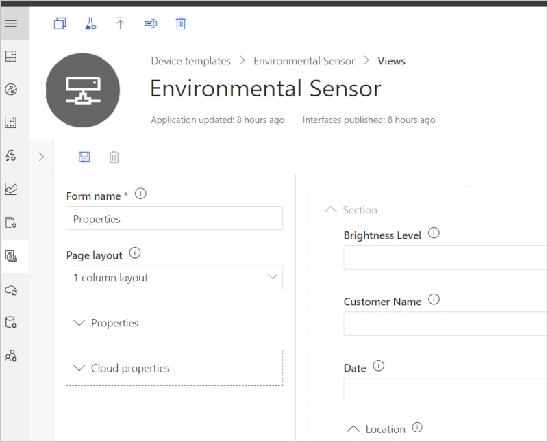
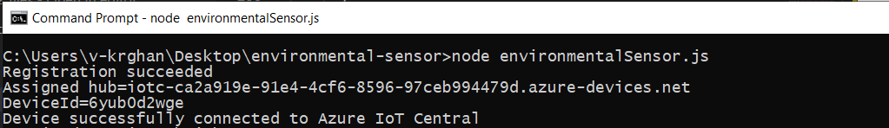
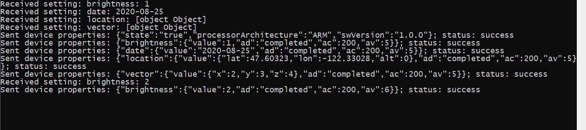

# How to implement properties in Azure IoT Central Application

This article shows you how, as a device developer, to implement various device properties in your Azure IoT Central application.

Properties are data fields that represent the state of your device. Properties are used to represent the durable state of the device, they also represent basic device properties, such as the firmware version of the device. You can declare properties as read-only or writable.

By default, properties are read-only. Read-only properties mean that the device reports property value updates to your IoT Central application. Your IoT Central application can't set the value of a read-only property.

You can also mark a property as writeable on an interface. A device can receive an update to a writeable property from your IoT Central application as well as reporting property value updates to your application.

For writable properties, the device application returns a desired state status code, version, and description to indicate whether it received and applied the property value. To learn more about writable properties [see](https://docs.microsoft.com/azure/iot-central/core/concepts-telemetry-properties-commands#writeable-property-types)


## Prerequisites

To complete the steps in this article, you need the following:

* An Azure IoT Central application created using the **Custom application** template. For more information, see the [create an application quickstart](quick-deploy-iot-central.md).
* A development machine with [Node.js](https://nodejs.org/) version 10.0.0 or later installed.


## Create a device template

Create a folder called `environmental-sensor` on your local machine.

Download the [Environmental sensor capability model](https://raw.githubusercontent.com/Azure/IoTPlugandPlay/9004219bff1e958b7cd6ff2a52209f4b7ae19396/samples/EnvironmentalSensorInline.capabilitymodel.json) JSON file and save it in the `environmental-sensor` folder.

Use a text editor to replace the two instances of `{YOUR_COMPANY_NAME_HERE}` with your company name in the `EnvironmentalSensorInline.capabilitymodel.json` file you downloaded. Use only the characters a-z, A-Z, 0-9, and underscore.

Edit the custom **Environmental Sensor** interface section in the `EnvironmentalSensorInline.capabilitymodel.json` file to add the following properties and save the file.

```json
{
"@type": "Property",
"displayName": "Date ",
"description": "The date on which the device is currently operating",
"name": "date",
"writable": true,
"schema": "date"
},
{
"@type": "Property",
"displayName": "Location",
"description": "The current location of the device",
"name": "location",
"writable": true,
"schema": "geopoint"
},
{
"@type": "Property",
"displayName": "Vector Level",
"description": "The Vector level of the device",
"name": "vector",
"writable": true,
"schema": "vector"
}
```

In your Azure IoT Central application, create a device template called *Environmental sensor* by importing the `EnvironmentalSensorInline.capabilitymodel.json` device capability model file:


The **Environmental Sensor** interface defines the following properties:

| Type | Display Name | Description |
| ---- | ------------ | ----------- |
| Property | Device State     | The state of the device. Two states online/offline are available. |
| Property (writeable) | Customer Name    | The name of the customer currently operating the device. |
| Property (writeable) | Brightness Level | The brightness level for the light on the device. Can be specified as 1 (high), 2 (medium), 3 (low). |
|Property (writeable)  | Date    | The date on which the device is currently operating. |
|Property (writeable)  | Location    | The current location of the device. |
|Property (writeable)  | Vector level    | The Vector level of the device. |


## Create view and publish the template

Views let you interact with devices connected to your IoT Central application. views display properties, let you edit writeable properties.

1. Select **Views** and then select the **Editing device and cloud data** tile.

1. Enter _Properties_ as the form name.

1. Select the **Brightness Level**, **Customer Name**, **Date**, **Location** and **Vector** properties. Then select **Add section**.

1. Save your changes.



In the device template, select **Publish**. On the **Publish this device template to the application** panel, select **Publish**.


## Add a real device

In your Azure IoT Central application, add a real device to the device template you created in the previous section:

1. On the **Devices** page, select the **Environmental sensor** device template.

1. Select **+ New**.

1. In the **Create a new device** dialog, make sure that **Environmental Sensor** is the template type and that **Simulate this device?** is set to **No**.

1. Then select **Create**.

Click on the device name, and then select **Connect**. Make a note of the device connection information on the **Device Connection** page - **ID scope**, **Device ID**, and **Primary key**. You need these values when you create your device code:


### Create a Node.js application

The following steps show you how to create a Node.js client application that connects to the real device you added to the application. This Node.js application simulates the behavior of a real device.

1. In your command-line environment, navigate to the `environmental-sensor` folder you created previously.

1. To initialize your Node.js project and install the required dependencies, run the following commands - accept all the default options when you run `npm init`:

    ```cmd/sh
    npm init
    npm install azure-iot-device azure-iot-device-mqtt azure-iot-provisioning-device-mqtt azure-iot-security-symmetric-key --save
    ```

1. Create a file called **environmentalSensor.js** in the `environmental-sensor` folder.

1. Add the following `require` statements at the start of the **environmentalSensor.js** file:

    ```javascript
    "use strict";

    // Use the Azure IoT device SDK for devices that connect to Azure IoT Central.
    var iotHubTransport = require('azure-iot-device-mqtt').Mqtt;
    var Client = require('azure-iot-device').Client;
    var Message = require('azure-iot-device').Message;
    var ProvisioningTransport = require('azure-iot-provisioning-device-mqtt').Mqtt;
    var SymmetricKeySecurityClient = require('azure-iot-security-symmetric-key').SymmetricKeySecurityClient;
    var ProvisioningDeviceClient = require('azure-iot-provisioning-device').ProvisioningDeviceClient;
    ```

1. Add the following variable declarations to the file:

    ```javascript
    var provisioningHost = 'global.azure-devices-provisioning.net';
    var idScope = '{your Scope ID}';
    var registrationId = '{your Device ID}';
    var symmetricKey = '{your Primary Key}';
    var provisioningSecurityClient = new SymmetricKeySecurityClient(registrationId, symmetricKey);
    var provisioningClient = ProvisioningDeviceClient.create(provisioningHost, idScope, new ProvisioningTransport(), provisioningSecurityClient);
    var hubClient;
    ```

    Update the placeholders `{your Scope ID}`, `{your Device ID}`, and `{your Primary Key}` with the values you made a note of previously.

1. To send device twin properties to your Azure IoT Central application, add the following function to your file:

    ```javascript
    // Send device twin reported properties.
    function sendDeviceProperties(twin, properties) {
      twin.properties.reported.update(properties, (err) => console.log(`Sent device properties: ${JSON.stringify(properties)}; ` +
        (err ? `error: ${err.toString()}` : `status: success`)));
    }
    ```

    IoT Central uses device twins to synchronize property values between the device and the IoT Central application. Device property values use device twin reported properties. Writeable properties use both device twin reported and desired properties.

1. To define and handle the writeable properties your device responds to, add the following code. The message the device sends in response to the [writeable property update](concepts-telemetry-properties-commands.md#writeable-property-types) must include the `av` and `ac` fields. The `ad` field is optional:

    ```javascript
    // Add any writeable properties your device supports,
    // mapped to a function that's called when the writeable property
    // is updated in the IoT Central application.
    var writeableProperties = {
      'name': (newValue, callback) => {
      setTimeout(() => {
        callback(newValue, 'completed', 200);
          }, 1000);
      },
      'brightness': (newValue, callback) => {
        setTimeout(() => {
        callback(newValue, 'completed', 200);
        }, 5000);
      },
      'location': (newValue, callback) => {
        setTimeout(() => {
        callback(newValue, 'completed', 200);
        }, 5000);
      },
      'vector': (newValue, callback) => {
        setTimeout(() => {
        callback(newValue, 'completed', 200);
        }, 5000);
      },
      'date': (newValue, callback) => {
        setTimeout(() => {
        callback(newValue, 'completed', 200);
        }, 5000);
      }
    };


    // Handle writeable property updates that come from IoT Central via the device twin.
    function handleWriteablePropertyUpdates(twin) {
      twin.on('properties.desired', function (desiredChange) {
        for (let setting in desiredChange) {
          if (writeableProperties[setting]) {
            console.log(`Received setting: ${setting}: ${desiredChange[setting]}`);
            writeableProperties[setting](desiredChange[setting], (newValue, status, code) => {
              var patch = {
                [setting]: {
                  value: newValue,
                  ad: status,
                  ac: code,
                  av: desiredChange.$version
                }
              }
              sendDeviceProperties(twin, patch);
            });
          }
        }
      });
    }
    ```

    When the operator sets a writeable property in the IoT Central application, the application uses a device twin desired property to send the value to the device. The device then responds using a device twin reported property. When IoT Central receives the reported property value, it updates the property view with a status of **synced**.

    The names of the properties must match the names used in the device template.

1. Add the following code to complete the connection to Azure IoT Central and hook up the functions in the client code:

    ```javascript
    // Handle device connection to Azure IoT Central.
    var connectCallback = (err) => {
      if (err) {
        console.log(`Device could not connect to Azure IoT Central: ${err.toString()}`);
      } else {
        console.log('Device successfully connected to Azure IoT Central');

        // Get device twin from Azure IoT Central.
        hubClient.getTwin((err, twin) => {
          if (err) {
            console.log(`Error getting device twin: ${err.toString()}`);
          } else {
            // Send device properties once on device start up.
            var properties = {
              state: 'true',
              processorArchitecture: 'ARM',
              swVersion: '1.0.0'
            };
            sendDeviceProperties(twin, properties);

            handleWriteablePropertyUpdates(twin);

          }
        });
      }
    };

    // Start the device (register and connect to Azure IoT Central).
    provisioningClient.register((err, result) => {
      if (err) {
        console.log('Error registering device: ' + err);
      } else {
        console.log('Registration succeeded');
        console.log('Assigned hub=' + result.assignedHub);
        console.log('DeviceId=' + result.deviceId);
        var connectionString = 'HostName=' + result.assignedHub + ';DeviceId=' + result.deviceId + ';SharedAccessKey=' + symmetricKey;
        hubClient = Client.fromConnectionString(connectionString, iotHubTransport);

        hubClient.open(connectCallback);
      }
    });
    ```

## Run your Node.js application

To start the device client application, run the following command in your command-line environment:

```cmd/sh
node environmentalSensor.js
```

You can see the device connects to your Azure IoT Central application.



You can update writeable property values on the Properties page in your IoT Central application.




