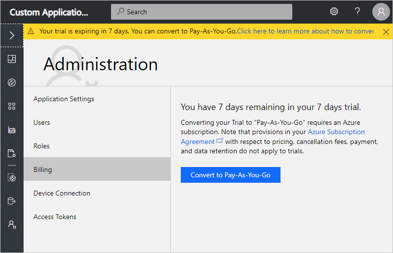

# View your bill in IoT Central application

This article describes how, as an administrator, you can manage your bill in Azure IoT Central application in the administration section. You will learn how you can move your application from the free pricing plan to a standard pricing plan, and also how to upgrade or downgrade your pricing plan.

To access and use the **Administration** section, you must be in the *Administrator* role or have a *custom user role* that allows you to view billing for an Azure IoT Central application. If you create an Azure IoT Central application, you're automatically assigned to the **Administrator** role for that application.

## Move from free to standard pricing plan

- Applications that use the free pricing plan are free for seven days before they expire. In order to avoid losing data you can move them to a standard pricing plan at any time before they expire.

In the pricing section, you can move your application from the free to a standard pricing plan.

To complete this self-service process, follow these steps:

1. Go to the **Pricing** page in the **Administration** section.

    

1. Select **Convert to a paid plan**.

    

1. Select the appropriate Azure Active Directory, and then the Azure subscription to use for your application that uses a paid plan.

1. After you select **Convert**, your application now uses a paid plan and you start getting billed.

> [!Note]
> By default, you are converted to a *Standard 2* pricing plan.

## How to change your application pricing plan

- Applications that use a standard pricing plan are charged per device, with the first two devices free, per application.

In the pricing section, you can upgrade or downgrade your Azure IoT pricing plan at any time.

1. Go to the **Pricing** page in the **Administration** section.

    

1. Select the **Plan** and click **Save** to upgrade or downgrade.

Learn more about pricing on the [Azure IoT Central pricing page](https://azure.microsoft.com/pricing/details/iot-central/).

## View your bill

To view your bill, go to the **Pricing** page in the **Administration** section. The Azure pricing page opens in a new tab, where you can see the bill for each of your Azure IoT Central applications.

## Next steps

Now that you've learned about how to view your bill in Azure IoT Central application, the suggested next step is to learn about [Customize application UI](howto-customize-ui.md) in Azure IoT Central.