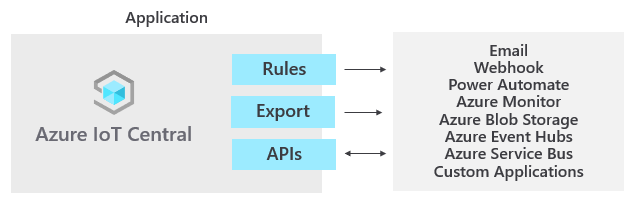

# What is Azure IoT Central?

IoT Central is an IoT application platform as a service (aPaaS) that reduces the burden and cost of developing, managing, and maintaining IoT solutions. Use IoT Central to quickly evaluate your IoT scenario and assess the opportunities it can create for your business. To streamline the development of a complex and continually evolving IoT infrastructure, IoT Central lets you focus your efforts on determining the business impact you can create with the IoT data stream.

The web UI lets you quickly connect devices, monitor device conditions, create rules, and manage devices and their data throughout their life cycle. Furthermore, it enables you to act on device insights by extending IoT intelligence into line-of-business applications. After you've used IoT Central to evaluate your IoT scenario, you can then build your enterprise-ready Azure IoT solution.  

This article provides an overview of the features of Azure IoT Central.

## Create an IoT Central application

You can quickly deploy a new IoT Central application and then customize it to your specific requirements. Application templates in Azure IoT Central are a tool to help you kickstart your IoT solution development. You can use application templates for everything from getting a feel for what is possible, to fully customizing your application to fit your scenario.

Start with a generic _application template_ or with one of the industry-focused application templates:

- [Retail](../retail/tutorial-in-store-analytics-create-app.md)
- [Energy](../energy/tutorial-smart-meter-app.md)
- [Government](../government/tutorial-connected-waste-management.md)
- [Healthcare](../healthcare/tutorial-continuous-patient-monitoring.md)

See the [Use your smartphone as a device to send telemetry to an IoT Central application](quick-deploy-iot-central.md) quickstart to learn how to create your first application and connect a device.

## Connect devices

After you create your application, the next step is to create and connect devices. The following video walks you through the process of connecting a device to an IoT Central application:

> [!VIDEO https://aka.ms/docs/player?id=66834fbb-7006-4f2b-b73f-540239fd2784]

Every device connected to IoT Central uses a _device template_. A device template is the blueprint that defines the characteristics and behavior of a type of device such as the:

- Telemetry it sends. Examples include temperature and humidity. Telemetry is streaming data.
- Business properties that an operator can modify. Examples include a customer address and a last serviced date.
- Device properties that a device sets and that are read-only in the application. For example, the state of a valve as either open or shut.
- Device properties that an operator sets and that determine the behavior of the device. For example, a target temperature for the device.
- Commands that are called by an operator and that run on a device. For example, a command to remotely reboot a device.

Every [device template](howto-set-up-template.md) includes:

- A _device model_ describing the capabilities a device should implement. The device capabilities include:

  - The telemetry it streams to IoT Central.
  - The read-only properties it uses to report state to IoT Central.
  - The writable properties it receives from IoT Central to set device state.
  - The commands called from IoT Central.

- Cloud properties that aren't stored on the device.
- Customizations, forms, and device views that are part of your IoT Central application.

You have several options for creating device templates:

- Design the device template in IoT Central and then implement its device model in your device code.
- Create a device model using Visual Studio code and publish the model to a repository. Implement your device code from the model, and connect your device to your IoT Central application. IoT Central finds the device model from the repository and creates a simple device template for you.
- Create a device model using Visual Studio code. Implement your device code from the model. Manually import the device model into your IoT Central application and then add any cloud properties, customizations, and views your IoT Central application needs.

If the telemetry from your devices is too complex, you can [map telemetry on ingress to IoT Central](howto-map-data.md) to simplify or normalize it.

## Customize the UI

Customize the IoT Central application UI for the operators who are responsible for the day-to-day use of the application. Customizations you can make include:

- Configuring custom dashboards to help operators discover insights and resolve issues faster.
- Configuring custom analytics to explore time series data from your connected devices.
- Defining the layout of properties and settings on a device template.

## Manage your devices

Use the IoT Central application to [manage the devices](howto-manage-devices-individually.md) in your IoT Central solution. Operators do tasks such as:

- Monitoring the devices connected to the application.
- Troubleshooting and remediating issues with devices.
- Provisioning new devices.

You can [define custom rules and actions](howto-configure-rules.md) that operate over data streaming from connected devices. An operator can enable or disable these rules at the device level to control and automate tasks within the application.

As with any IoT solution designed to operate at scale, a structured approach to device management is important. It's not enough just to connect your devices to the cloud, you need to keep your devices connected and healthy. Use the following IoT Central capabilities to manage your devices throughout the application life cycle:

### Dashboards

Start with a prebuilt dashboard in an application template or create your own dashboards tailored to the needs of your operators. You can share dashboards with all users in your application, or keep them private.

### Rules and actions

Build [custom rules](tutorial-create-telemetry-rules.md) based on device state and telemetry to identify devices in need of attention. Configure actions to notify the right people and ensure corrective measures are taken in a timely fashion.

### Jobs

[Jobs](howto-manage-devices-in-bulk.md) let you apply single or bulk updates to devices by setting properties or calling commands.

## Integrate with other services

As an application platform, IoT Central lets you transform your IoT data into the business insights that drive actionable outcomes. Examples include: determining machine efficiency trends and predicting future energy usage on a factory floor.

[Rules](./tutorial-create-telemetry-rules.md), [data export](./howto-export-to-blob-storage.md), and the [public REST API](tutorial-use-rest-api.md) are examples of how you can integrate IoT Central with line-of-business applications:

Generate business insights by building custom analytics pipelines to process telemetry from your devices and store the results. Configure data exports in your IoT Central application to export telemetry, device property changes, and device template changes to other services where you can analyze, store, and visualize the data with your preferred tools.

### Build custom IoT solutions and integrations with the REST APIs

Build IoT solutions such as:

- Mobile companion apps that can remotely set up and control devices.
- Custom integrations that enable existing line-of-business applications to interact with your IoT devices and data.
- Device management applications for device modeling, onboarding, management, and data access.

## Administer your application

IoT Central applications are fully hosted by Microsoft, which reduces the administration overhead of managing your applications. Administrators manage access to your application with [user roles and permissions](howto-administer.md) and track activity by using [audit logs](howto-use-audit-logs.md).

## Pricing

Applications you create using the *standard* plan are billed on a per device basis, you can choose either **Standard 0**, **Standard 1**, or **Standard 2** pricing plan with the first two devices being free. Learn more about [IoT Central pricing](https://azure.microsoft.com/pricing/details/iot-central/).

## User roles

The IoT Central documentation refers to four user roles that interact with an IoT Central application:

- A _solution builder_ is responsible for [creating an application](quick-deploy-iot-central.md), [configuring rules and actions](quick-configure-rules.md), [defining integrations with other services](quick-export-data.md), and further customizing the application for operators and device developers.
- An _operator_ [manages the devices](howto-manage-devices-individually.md) connected to the application.
- An _administrator_ is responsible for administrative tasks such as managing [user roles and permissions](howto-administer.md) within the application and [configuring managed identities](howto-manage-iot-central-from-portal.md#configure-a-managed-identity) for securing connects to other services.
- A _device developer_ [creates the code that runs on a device](./tutorial-connect-device.md) or [IoT Edge module](concepts-iot-edge.md) connected to your application.

## Next steps

Now that you have an overview of IoT Central, here are some suggested next steps:

- If you're a device developer and want to dive into some code, the suggested next step is to [Create and connect a client application to your Azure IoT Central application](./tutorial-connect-device.md).
- Familiarize yourself with the [Azure IoT Central UI](overview-iot-central-tour.md).
- Get started by [creating an Azure IoT Central application](quick-deploy-iot-central.md).

