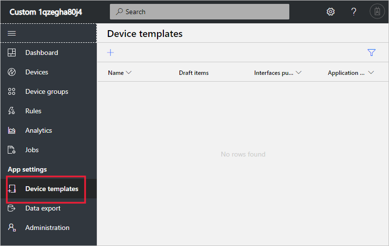
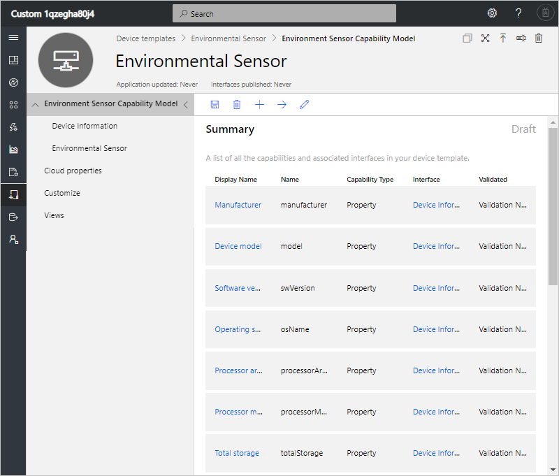
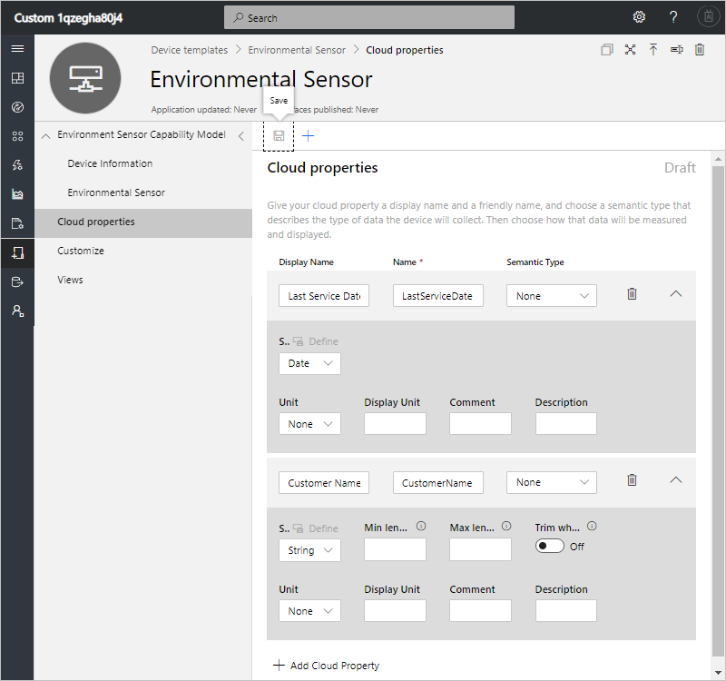
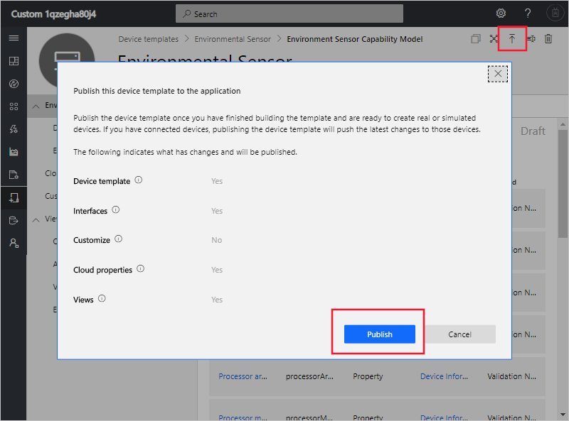
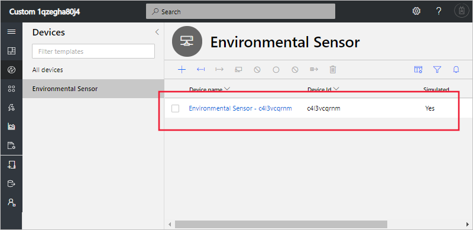
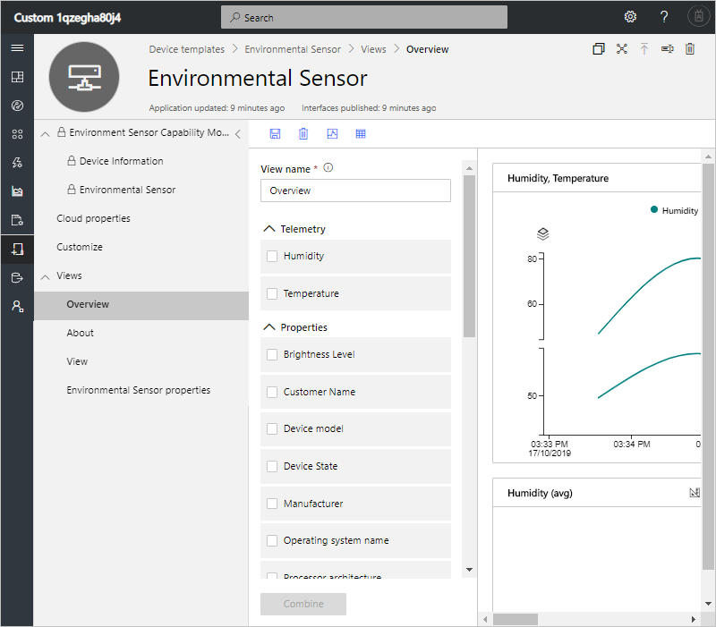

# Quickstart: Add a simulated device to your IoT Central application (preview features)

*This article applies to operators, builders, and administrators.*

[!INCLUDE [iot-central-pnp-original](../../../includes/iot-central-pnp-original-note.md)]

A device template defines the capabilities of a device that connects to your IoT Central application. Capabilities include telemetry the device sends, device properties, and the commands a device responds to. From a device template, a builder or operator can add both real and simulated devices to an application. Simulated devices are useful for testing the behavior of your IoT Central application before you connect real devices.

In this quickstart, you create an **Environmental Sensor** device template and add a simulated device. An environmental sensor device:

* Sends telemetry such as temperature.
* Reports device-specific properties such as brightness level.
* Responds to commands such as turn on and turn off.
* Reports generic device properties such as firmware version and serial number.

## Prerequisites

Complete the [Create an Azure IoT Central application (preview features)](./quick-deploy-iot-central-pnp.md?toc=/azure/iot-central-pnp/toc.json&bc=/azure/iot-central-pnp/breadcrumb/toc.json) quickstart to create an IoT Central application using the **Custom app > Preview application** template.

You also need a local copy of the **EnvironmentalSensorInline.capabilitymodel.json** file that contains the [IoT Plug and Play](../../iot-pnp/overview-iot-plug-and-play.md) device capability model. You can download it from [here](https://raw.githubusercontent.com/Azure/IoTPlugandPlay/master/samples/EnvironmentalSensorInline.capabilitymodel.json). Right-click on the page and select **Save as**.

After you download the file, open it in a text editor, and replace the two instances of `<YOUR_COMPANY_NAME_HERE>` with your name. Use only the characters a-z, A-Z, 0-9, and underscore.

## Create a template

As a builder, you can create and edit device templates in your application. After you publish a device template, you can generate a simulated device or connect real devices that implement the device template. Simulated devices let you test the behavior of your application before you connect a real device.

To add a new device template to your application, go to the **Device Templates** page. To do so select the **Device Templates** tab in the left pane.

### Add a device capability model

There are several options for authoring a device capability model in IoT Central. You can choose to create a custom model from scratch, import from a file, select from the device catalog, or connect an IoT Plug and Play device through a device-first connection where the device capability model has been published in the public repository. In this tutorial, you import a device capability model from a file.

The following steps show you how to import the capability model for an **Environmental Sensor** device. These devices send telemetry, such as temperature, to your application:

1. To add a new device template, select **+** on the **Device Templates** page.

1. Choose **IoT Device** from the list of custom device templates, select **Next: Customize**, then select **Next: Review**, and then select **Create**.

1. Enter **Environmental Sensor** as the name of your device template.

1. Choose **Import Capability Model** to create a new device capability model from a JSON file. Navigate to the folder where you saved the **EnvironmentalSensorInline.capabilitymodel.json** file on your local machine. Select the file **EnvironmentalSensorInline.capabilitymodel.json** and then select **Open**. The environmental sensor capability model includes the **Environmental Sensor** and **Device Information** interfaces:

    

    These interfaces define the capabilities of an **Environmental Sensor** device. Capabilities include the telemetry a device sends, the properties a device reports, and the commands a device responds to.

### Add cloud properties

A device template can include cloud properties. Cloud properties only exist in the IoT Central application and are never sent to, or received from, a device.

1. Select **Cloud Properties** and then **+ Add Cloud Property**. Use the information in the following table to add a cloud property to your device template.

    | Display Name      | Semantic Type | Schema |
    | ----------------- | ------------- | ------ |
    | Last Service Date | None          | Date   |
    | Customer Name     | None          | String |

1. Select **Save** to save your changes:

    

## Create views

As a builder, you can customize the application to display relevant information about the environmental sensor device to an operator. Your customizations enable the operator to manage the environmental sensor devices connected to the application. You can create two types of views for an operator to use to interact with devices:

* Forms to view and edit device and cloud properties.
* Dashboards to visualize devices.

### Generate default views

Generating default views is a quick way to get started with visualizing your important device information. You can have up to three default views generated for your device template:

* The **Commands** view lets your operator dispatch commands to your device.
* The **Overview** view uses charts and metrics to display device telemetry.
* The **About** view displays device properties.

Select **Views** and then **Generate default views**.

### Configure a view to visualize devices

A device dashboard lets an operator visualize a device using charts and metrics. As a builder, you can define what information displays on a device dashboard. You can define multiple dashboards for devices. To create a dashboard to visualize the environmental sensor telemetry, select **Views** and then **Visualizing the Device**:

1. All of the device properties, cloud properties, telemetry, and static options are listed under **Properties**. You can drag and drop any of these items out into the view. Drag the **Brightness Level** property to the view. You can configure the tile using the gear icon.

1. To add a chart that plots telemetry, select **Humidity** and **Temperature**, and then select **Combine**. To view this chart in a different format, such as a pie chart or bar chart, select the **Change Visualization** button at the top of the tile.

1. Select **Save** to save your view:

You can add more tiles that show other properties or telemetry values. You can also add static text, links, and images. To move or resize a tile on the dashboard, move the mouse pointer over the tile and drag the tile to a new location or resize it.

### Add a device form

A device form lets an operator edit writeable device properties and cloud properties. As a builder, you can define multiple forms and choose which device and cloud properties to show on each form. You can also display read-only device properties on a form.

To create a form to view and edit environmental sensor properties:

1. Navigate to **Views** in the **Environmental Sensor** template. Select the **Editing Device and Cloud data** tile to add a new view.

1. Enter the form name **Environmental Sensor properties**.

1. Drag the **Customer name** and **Last service date** cloud properties onto the existing section on the form.

1. Select the **Brightness Level** and **Device State**  device properties. Then select **Add Section**. Edit the title of the section to be **Sensor properties**. Select **Apply**.

1. Select the **Device model**, **Software version**, **Manufacturer**, and **Processor manufacturer** device properties. Then select **Add Section**. Edit the title of the section to be **Device properties**. Select **Apply**.

1. Select **Save** to save your view.

## Publish device template

Before you can create a simulated environmental sensor, or connect a real environmental sensor, you need to publish your device template.

To publish a device template:

1. Go to your device template from the **Device Templates** page.

1. Select **Publish**.

1. On the **Publish a Device Template** dialog, choose **Publish**:

    

After a device template is published, it's visible on the **Devices** page and to the operator. In a published device template, you can't edit a device capability model without creating a new version. However, you can make updates to cloud properties, customizations, and views, in a published device template without versioning. After making any changes, select **Publish**  to push those changes out to your operator.

## Add a simulated device

To add a simulated device to your application, you use the **Environmental Sensor** device template you created.

1. To add a new device as an operator choose **Devices** in the left pane. The **Devices** tab shows **All devices** and the **Environmental Sensor** device template. Select **Environmental Sensor**.

1. To add a simulated environmental sensor device, select **+ New**. Use the suggested **Device ID** or enter your own lowercase **Device ID**. You can also enter a name for your new device. Switch the **simulated** toggle to **On** and then select **Create**.

    

Now you can interact with the views that were created by the builder for the device template using simulated data.

## Use a simulated device to improve views

After you create a new simulated device, the builder can use this device to continue to improve and build upon the views for the device template.

1. Choose **Device templates** in the left pane and select the **Environmental Sensor** template.

1. Select any of the views you would like to edit, or create a new view. Click **Configure preview device**, then **Select from a running device**. Here you can choose between having no preview device, using a real device you can configure for testing, or from an existing device you've added into IoT Central.

1. Choose your simulated device in the list. Then select **Apply**. Now you can see the same simulated device in your device template views building experience. This view is useful for charts and other visualizations.

    

## Next steps

In this quickstart, you learned how to you create an **Environment Sensor** device template and add a simulated device to your application.

To learn more about monitoring devices connected to your application, continue to the quickstart:

> [!div class="nextstepaction"]
> [Configure rules and actions](./quick-configure-rules-pnp.md?toc=/azure/iot-central-pnp/toc.json&bc=/azure/iot-central-pnp/breadcrumb/toc.json)
