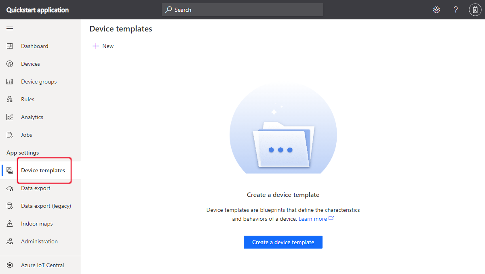
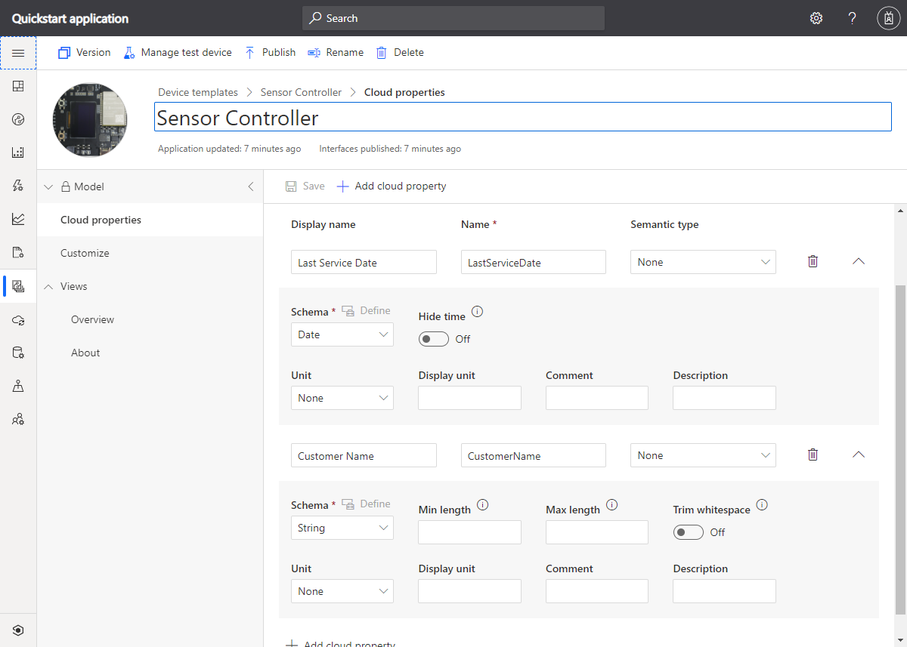
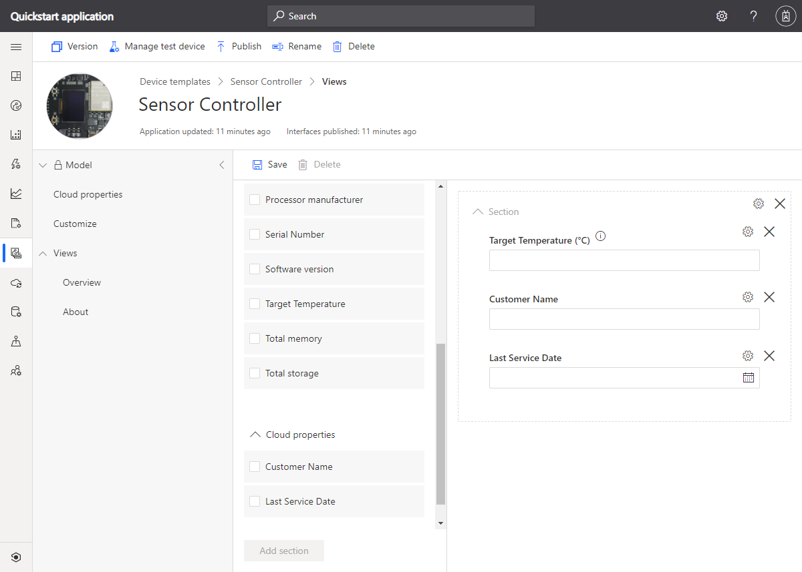
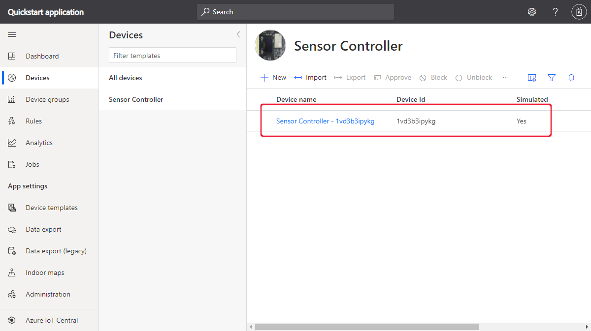
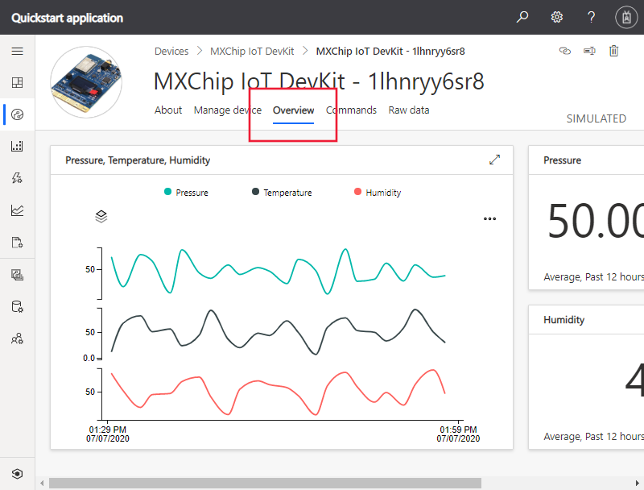
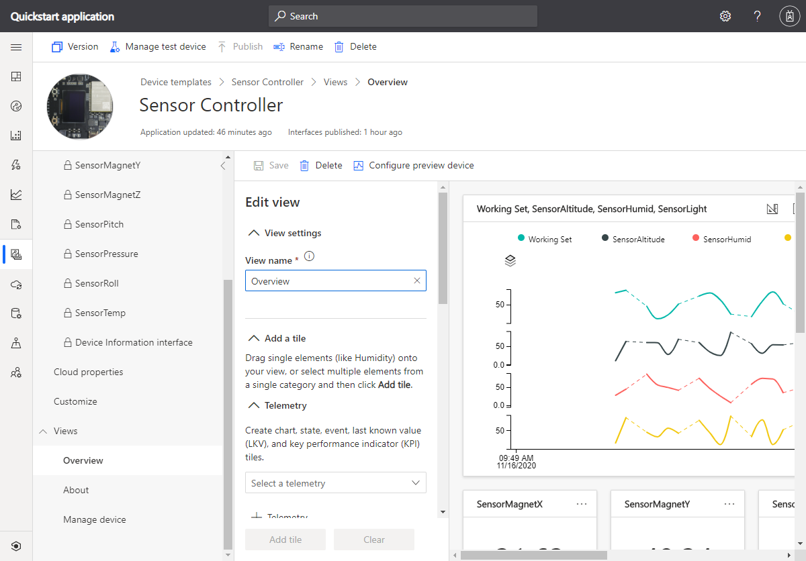

# Quickstart: Add a simulated device to your IoT Central application

*This article applies to operators, builders, and administrators.*

A device template defines the capabilities of a device that connects to your IoT Central application. Capabilities include telemetry the device sends, device properties, and the commands a device responds to. From a device template, a builder or operator can add both real and simulated devices to an application. Simulated devices are useful for testing the behavior of your IoT Central application before you connect real devices.

In this quickstart, you add a device template for an *MXChip IoT DevKit* (DevKit) board and create a simulated device. To complete this quickstart you don't need a real device, you work with a simulation of the device. A DevKit device:

* Sends telemetry such as temperature.
* Reports device-specific properties such as brightness level.
* Responds to commands such as turn on and turn off.
* Reports generic device properties such as firmware version and serial number.

## Prerequisites

Complete the [Create an Azure IoT Central application](./quick-deploy-iot-central.md) quickstart to create an IoT Central application using the **Custom app > Custom application** template.

## Create a template

As a builder, you can create and edit device templates in your IoT Central application. After you publish a device template, you can generate simulated device or connect real devices from the device template. Simulated devices let you test the behavior of your application before you connect a real device.

To add a new device template to your application, select the **Device Templates** tab in the left pane.

A device template includes a device capability model that defines the telemetry the device sends, device properties, and the commands the device responds to.

### Add a device capability model

There are several options for adding a device capability model to your IoT Central application. You can create a model from scratch, import a model from a file, or select a device from the device catalog. IoT Central also supports a *device-first* approach where it automatically imports a model from a repository when a device connects for the first time. In this quickstart, you choose a device from the device catalog to import its device capability model.

The following steps show you how to use the device catalog to import the capability model for an **MXChip IoT DevKit** device. These devices send telemetry, such as temperature, to your application:

1. To add a new device template, select **+** on the **Device templates** page.

1. On the **Select template type** page, scroll down until you find the **MXChip IoT DevKit** tile.

1. Select the **MXChip IoT DevKit** tile, and then select **Next: Customize**.

1. On the **Review** page, select **Create**.

1. After a few seconds, you can see your new device template:

    

    The MXChip IoT DevKit capability model includes interfaces such as **mxchip_sensor**, **mxchip_settings**, and **Device Information**. Interfaces define the capabilities of an MXChip IoT DevKit device. Capabilities include the telemetry a device sends, the properties a device reports, and the commands a device responds to.

### Add cloud properties

A device template can include cloud properties. Cloud properties only exist in the IoT Central application and are never sent to, or received from, a device.

1. Select **Cloud Properties** and then **+ Add cloud property**. Use the information in the following table to add two cloud properties to your device template:

    | Display Name      | Semantic Type | Schema |
    | ----------------- | ------------- | ------ |
    | Last Service Date | None          | Date   |
    | Customer Name     | None          | String |

1. Select **Save** to save your changes:

    

## Views

As a builder, you can customize the application to display relevant information about the device to an operator. Your customizations enable the operator to manage the devices connected to the application. You can create two types of views for an operator to use to interact with devices:

* Forms to view and edit device and cloud properties.
* Dashboards to visualize devices including the telemetry they send.

### Default views

Default views are a quick way to get started with visualizing your important device information. You can have up to three default views generated for your device template:

* The **Commands** view lets your operator dispatch commands to your device.
* The **Overview** view uses charts and metrics to display device telemetry.
* The **About** view displays device properties.

Select the **Views** node in the device template. You can see that IoT Central generated an **Overview** and an **About** view for you when you added the template.

To add a new **Manage device** form that an operator can use to manage the device:

1. Select the **Views** node, and then select the **Editing device and cloud data** tile to add a new view.

1. Change the form name to **Manage device**.

1. Select the **Customer Name** and **Last Service Date** cloud properties, and the **Fan Speed** property. Then select **Add section**:

    

1. Select **Save** to save your new form.

## Publish device template

Before you can create a simulated device, or connect a real device, you need to publish your device template. Although IoT Central published the template when you first created it, you must publish the updated version.

To publish a device template:

1. Go to your device template from the **Device Templates** page.

1. Select **Publish**:

    

1. On the **Publish this device template to the application** dialog, select **Publish**. 

After you publish a device template, it's visible on the **Devices** page. In a published device template, you can't edit a device capability model without creating a new version. However, you can make updates to cloud properties, customizations, and views, in a published device template without versioning. After making any changes, select **Publish**  to push those changes out to your operator.

## Add a simulated device

To add a simulated device to your application, you use the **MXChip IoT DevKit** device template you created.

1. To add a new device as an operator choose **Devices** in the left pane. The **Devices** tab shows **All devices** and the **MXChip IoT DevKit** device template. Select **MXChip IoT DevKit**.

1. To add a simulated DevKit device, select **+**. Use the suggested **Device ID** or enter your own lowercase **Device ID**. You can also enter a name for your new device. Make sure the **Simulated** toggle is **On** and then select **Create**.

    

Now you can interact with the views that were created by the builder for the device template using simulated data:

1. Select your simulated device on the **Devices** page.

1. The **Overview** view shows a plot of the simulated telemetry:

    

1. The **About** view shows property values, including the cloud properties you added to the view.

1. The **Commands** view lets you run commands, such as **blink** on the device.

1. The **Manage devices** view is the form you created for the operator to manage the device.

## Use a simulated device to improve views

After you create a new simulated device, the builder can use this device to continue to improve and build upon the views for the device template.

1. Choose **Device templates** in the left pane and select the **MXChip IoT DevKit** template.

1. Select any of the views you would like to edit, or create a new view. Select **Configure preview device**, then **Select from a running device**. Here you can choose to have no preview device, a real device configured for testing, or an existing device you've added into IoT Central.

1. Choose your simulated device in the list. Then select **Apply**. Now you can see the same simulated device in your device template views building experience. This view is useful for charts and other visualizations.

    

## Next steps

In this quickstart, you learned how to you create an **MXChip IoT DevKit** device template and add a simulated device to your application.

To learn more about monitoring devices connected to your application, continue to the quickstart:

> [!div class="nextstepaction"]
> [Configure rules and actions](./quick-configure-rules.md)
