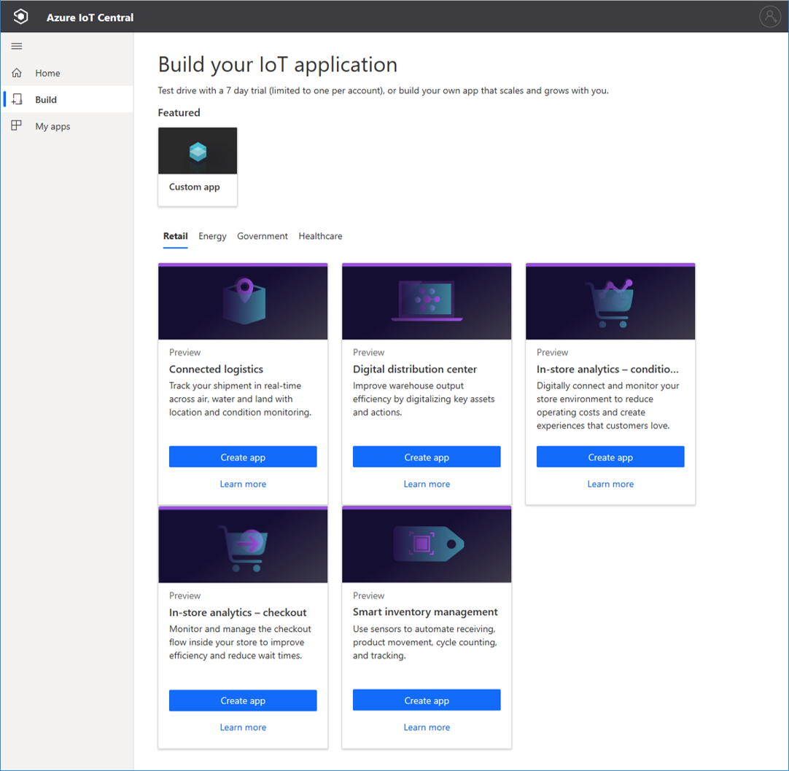
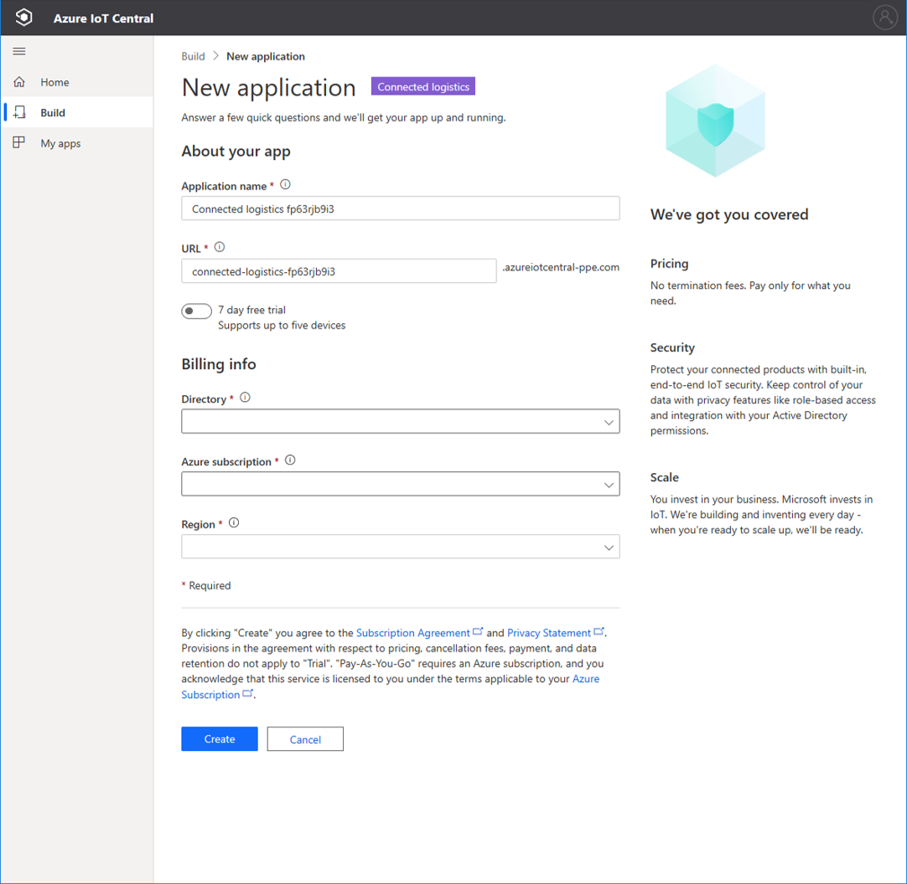

# Create an Azure IoT Central application (preview features)

[!INCLUDE [iot-central-pnp-original](../../../includes/iot-central-pnp-original-note.md)]

This quickstart shows you how to create an Azure IoT Central application that contains preview features such as IoT Plug and Play.

> [!WARNING]
> The IoT Plug and Play capabilities in Azure IoT Central are currently in public preview. Don't use an IoT Plug and Play enabled IoT Central application for production workloads. For production environments use an IoT central application created from a current, generally available, application template.

## Create an application

Navigate to the [Azure IoT Central Build](https://aka.ms/iotcentral) site. Then sign in with a Microsoft personal, work, or school account.

You create a new application either from the list of industry-relevant IoT Central templates to help you get started quickly, or start from scratch using the **Custom app** template.

To create a new Azure IoT Central application:

1. To create a new Azure IoT Central application from an *Industry template*, select an application template from the list of available templates under one of the industries. You can also start from scratch by choosing *Custom app*.
1. Azure IoT Central automatically suggests an **application name** based on the application template you've selected. You can use this name or enter your own friendly application name.
1. Azure IoT Central also generates a unique **application URL** prefix for you, based on the application name. You use this URL to access your application. You're free to change this URL prefix to something more memorable if you'd like.

    

    > [!NOTE]
    > If you're using the Custom app template, you'll see an **Application template** dropdown field. From here you can switch between preview and generally available templates. You might also see other templates that have been made available for your organization.

1. Choose if you want to create this application using a 7-day free trial, or use a Pay-As-You-Go subscription.
    - **Trial** applications are free for seven days and support up to five devices. They can be converted to Pay-As-You-Go at any time before they expire. If you create a Trial application, you need to enter your contact information and choose whether to receive information and tips from Microsoft.
    - **Pay-As-You-Go** applications are charged on a per device basis, with the first two devices being free. Learn more about [IoT Central pricing](https://aka.ms/iotcentral-pricing). If you create a Pay-As-You-Go application, you'll need to select your *Directory*, *Azure Subscription*, and *Region*:
        - *Directory* is the Azure Active Directory (AAD) in which you'll create your application. An Azure AD contains user identities, credentials, and other organizational information. If you don’t have an Azure AD, one is created for you when you create an Azure subscription.
        - An *Azure Subscription* enables you to create instances of Azure services. IoT Central provisions resources in your subscription. If you don’t have an Azure subscription, you can create one on the [Azure sign-up page](https://aka.ms/createazuresubscription). After you create the Azure subscription, navigate back to the **Create an application** page. Your new subscription will appear in the **Azure Subscription** drop-down.
        - *Region* is the physical location where your devices' data will be stored. Typically, you should choose the region that's physically closest to your devices to get optimal performance as well as to ensure data sovereignty compliance. Once you choose a region, you can't move your application to a different region later.

        > [!NOTE]
        > During public preview, the only available regions for **preview applications** are **North Europe** and **Central US**.

1. Review the Terms and Conditions, and select **Create** at the bottom of the page.

## Next steps

In this quickstart, you created an IoT Central application. Here's the suggested next step:

> [!div class="nextstepaction"]
> [Add a simulated device to your IoT Central application](./quick-create-pnp-device-pnp.md)
