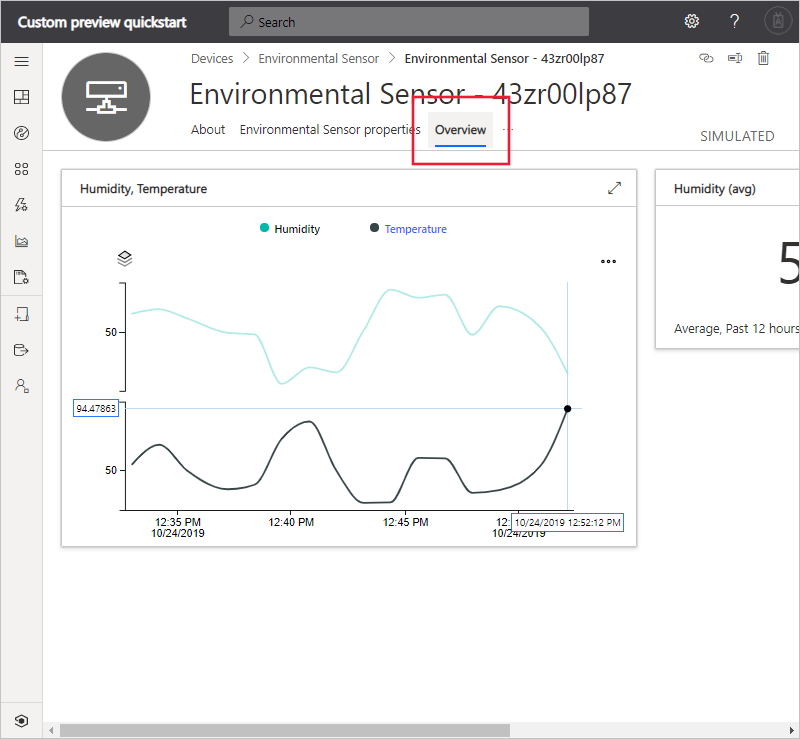
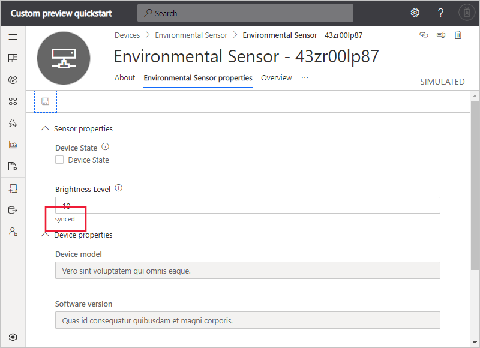

# Quickstart: Use Azure IoT Central to monitor your devices (preview features)

*This article applies to operators, builders, and administrators.*

[!INCLUDE [iot-central-pnp-original](../../../includes/iot-central-pnp-original-note.md)]

This quickstart shows you, as an operator, how to use your Microsoft Azure IoT Central application to monitor your devices and change settings.

## Prerequisites

Before you begin, you should complete the three previous quickstarts [Create an Azure IoT Central application](./quick-deploy-iot-central-pnp.md?toc=/azure/iot-central-pnp/toc.json&bc=/azure/iot-central-pnp/breadcrumb/toc.json), [Add a simulated device to your IoT Central application](./quick-create-pnp-device-pnp.md?toc=/azure/iot-central-pnp/toc.json&bc=/azure/iot-central-pnp/breadcrumb/toc.json) and [Configure rules and actions for your device](quick-configure-rules-pnp.md?toc=/azure/iot-central-pnp/toc.json&bc=/azure/iot-central-pnp/breadcrumb/toc.json).

## Receive a notification

Azure IoT Central sends notifications about devices as email messages. The builder added a rule to send a notification when the temperature in a connected environmental sensor device exceeded a threshold. Check the emails sent to the account the builder chose to receive notifications.

Open the email message you received at the end of the [Configure rules and actions for your device](quick-configure-rules-pnp.md?toc=/azure/iot-central-pnp/toc.json&bc=/azure/iot-central-pnp/breadcrumb/toc.json) quickstart. In the email, select the link to the device:

The **Dashboard** view for the environmental sensor simulated device you created in the previous quickstarts opens in your browser:

## Investigate an issue

As an operator, you can view information about the device on the **Overview**, **Environmental Sensor properties**, and **Commands** pages. The builder customized the **Dashboard** and **Environmental Sensor properties** pages to display important information about a connected environmental sensor device.

Choose the **Overview** view to see information about the device.

The chart on the dashboard shows a plot of the device temperature. You decide that the device temperature is too high.

## Remediate an issue

To make a change to the device, use the **Environmental Sensor properties** page.

Choose **Environmental Sensor properties**. Change **Brightness Level** to 10. Choose **Save** to update the device. When the device confirms the settings change, the status of the property changes to **synced**:

## Next steps

In this quickstart, you learned how to:

* Receive a notification
* Investigate an issue
* Remediate an issue

Now that you know now to monitor your device, the suggested next step is to:

> [!div class="nextstepaction"]
> [Build and manage a device template](howto-set-up-template-pnp.md?toc=/azure/iot-central-pnp/toc.json&bc=/azure/iot-central-pnp/breadcrumb/toc.json).
