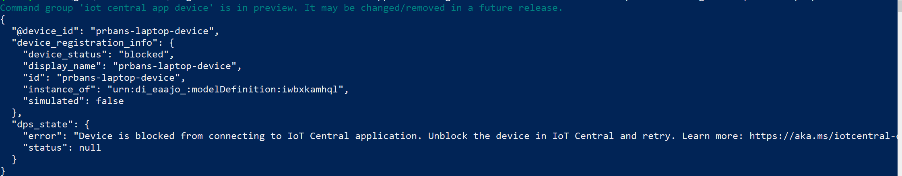

# Troubleshoot why data from your devices isn't showing up in Azure IoT Central

This document helps device developers find out why the data their devices are sending to IoT Central may not be showing up in the application.

There are two main areas to investigate:

- Device connectivity issues
  - Authentication issues such as the device has invalid credentials
  - Network connectivity issues
  - Device isn't approved, or blocked
- Device payload shape issues

This troubleshooting guide focuses on device connectivity issues and device payload shape issues.

## Device connectivity issues

This section helps you determine if your data is reaching IoT Central.

If you haven't already done so, install the `az cli` tool and `azure-iot` extension.

To learn how to install the `az cli`, see [Install the Azure CLI](https://docs.microsoft.com/cli/azure/install-azure-cli?view=azure-cli-latest).

To [install](https://docs.microsoft.com/cli/azure/azure-cli-reference-for-IoT?view=azure-cli-latest#extension-reference-installation) the `azure-iot` extension, run the following command:

```cmd/bash
az extension add --name azure-iot
```

When you've installed the `azure-iot` extension, start your device to see if the messages it's sending are making their way to IoT Central.

Use the following commands to sign in the subscription where you have your IoT Central application:

```cmd/bash
az login
az set account --subscription <your-subscription-id>
```

To monitor the telemetry your device is sending, use the following command:

```cmd/bash
az iot central app monitor-events -n <app-id> -d <device-name>`
```


To monitor the property updates your device is exchanging with IoT Central, use the following preview command:

```cmd/bash
az iot central app monitor-properties -n <app-id> -d <device-name>
```

You may be prompted to install the `uamqp` library the first time you run a `monitor` command.

### Interpreting terminal output

If you see data appear in your terminal, then the data is making it as far as your IoT Central application.

If you don't see any data appear after a few minutes, try pressing the `Enter` or `return` key on your keyboard, in case the output is stuck.

If you're still not seeing any data appear on your terminal, it's likely that your device is having network connectivity issues, or is not sending data correctly to IoT Central.

### Check status of your device

If your data is not appearing on the monitor, check your device status by running the following command:

```cmd/bash
az iot central app device registration-info -n <app-id> -d <device-id>
```



| Device Status | Description | Possible Mitigation |
| - | - | - |
| Provisioned | No immediately recognizable issue. | N/A |
| Registered | The device has not yet connected to IoT Central. | Check your device logs for connectivity issues. |
| Blocked | The device is blocked from connecting to IoT Central. | Ask your app Builder or Administrator to unblock the device. |
| Unapproved | The device is not approved. | Ask your app Builder or Administrator to approve the device. |
| Unassociated | The device is not associated with a device template. | Associate the device with a device template so that IoT Central knows how to parse the data. |

Learn more about [device status codes](concepts-get-connected.md#device-status-values).

### Error codes

If you're still unable to diagnose why your data isn't showing up in `monitor-events`, the next step is to look for error codes reported by your device.

Start a debugging session on your device, or collect logs from your device. Check for any error codes that the device reports.

The following tables show the common error codes and possible actions to mitigate.

If you are seeing issues related to your authentication flow:

| Error code | Description | Possible Mitigation |
| - | - | - |
| 400 | The body of the request is not valid. For example, it cannot be parsed, or the object cannot be validated. | Ensure that you're sending the correct request body as part of the attestation flow, or use a device SDK. |
| 401 | The authorization token cannot be validated. For example, it has expired or doesn't apply to the request's URI. This error code is also returned to devices as part of the TPM attestation flow. | Ensure that your device has the correct credentials. |
| 404 | The Device Provisioning Service instance, or a resource such as an enrollment doesn't exist. | File a ticket with customer support. |
| 412 | The `ETag` in the request doesn't match the `ETag` of the existing resource, as per RFC7232. | File a ticket with customer support. | 
| 429 | Operations are being throttled by the service. For specific service limits, see [IoT Hub Device Provisioning Service limits](https://docs.microsoft.com/azure/azure-resource-manager/management/azure-subscription-service-limits#iot-hub-device-provisioning-service-limits). | Reduce message frequency, split responsibilities among more devices. | 
| 500 | An internal error occurred. | File a ticket with Customer Support to see if they can help you further. |

## Payload shape issues

When you've established that your device is sending data to IoT Central, the next step is to ensure that your device is sending data in a valid format.

There are two main categories of common issues that cause device data to not appear in IoT Central:

- Device template to device data mismatch:
    - Mismatch in naming such as typos or case-matching issues.
    - Unmodeled properties where the schema isn't defined in the device template.
    - Schema mismatch such as a type defined in the template as `boolean`, but the data is a string.
    - The same telemetry name is defined in multiple interfaces, but the device isn't IoT Plug and Play compliant.
- Data shape is invalid JSON. To learn more, see [Telemetry, property, and command payloads](concepts-telemetry-properties-commands.md).

To detect which categories your issue is in, run the most appropriate command for your scenario:

- To validate telemetry, use the preview command `az iot central app validate-messages -n <app-id> -d <device-name>`
- To validate property updates, use the preview command `az iot central app validate-properties -n <app-id> -d <device-name>`
- If you prefer to use a GUI, use the IoT Central **Raw data** view to see if something isn't being modeled. The **Raw data** view doesn't detect if the device is sending malformed JSON.

You may be prompted to install the `uamqp` library the first time you run a `validate` command.

:::image type="content" source="media/troubleshoot-connection/validate-messages.png" alt-text="Screenshot of validate messages ouput":::

:::image type="content" source="media/troubleshoot-connection/raw-data-view.png" alt-text="Screenshot of Raw Data view":::

### Interpreting terminal output

When you've detected the issue, you may need to update device firmware, or create a new device template that models previously unmodeled data.

If you chose to create a new template that models the data correctly, migrate devices from your old template to the new template. To learn more, see [Manage devices in your Azure IoT Central application](howto-manage-devices.md).

<!--
Need to double check that we have a few sentences on how to move a device between templates.
-->

## Next steps

If you are unable to troubleshoot and fix the issue using this guide, open a support ticket. Azure customers can create and manage support requests in the Azure portal:

- [Azure portal](https://ms.portal.azure.com/#blade/Microsoft_Azure_Support/HelpAndSupportBlade/overview)
- [Azure portal for the United States government](https://portal.azure.us/)

For more information, see [Azure IoT support and help options](../../iot-fundamentals/iot-support-help.md).
