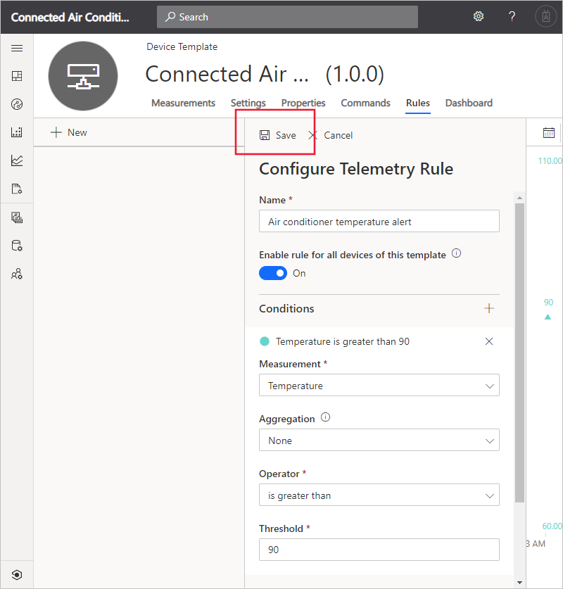
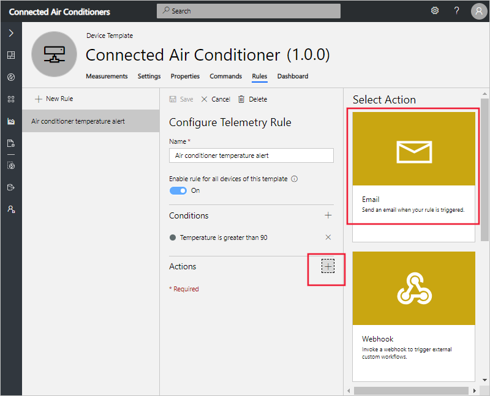
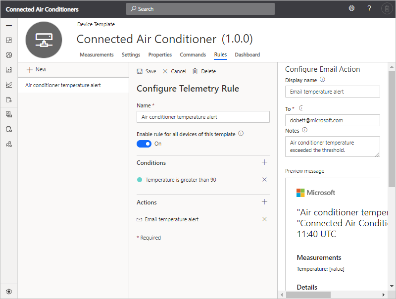

# Tutorial: Configure rules and actions for your device in Azure IoT Central

*This article applies to operators, builders, and administrators.*

[!INCLUDE [iot-central-original-pnp](../../../includes/iot-central-original-pnp-note.md)]

In this tutorial, you create a rule that sends an email when the temperature in a connected air conditioner device exceeds 70&deg; F.

In this tutorial, you learn how to:

> [!div class="checklist"]
>
> * Create a telemetry-based rule
> * Add an action

## Prerequisites

Before you begin, you should complete the [Define a new device type in your application](tutorial-define-device-type.md) tutorial to create the **Connected Air Conditioner** device template to work with.

## Create a telemetry-based rule

1. To add a new telemetry-based rule to your application, in the left pane, select **Device Templates**:

    

    You see the **Connected Air Conditioner (1.0.0)** device template you created in the previous tutorial.

2. To customize your device template, select the **Connected Air Conditioner** template you created in the previous tutorial.

3. To add a telemetry-based rule in the **Rules** view, select **Rules**, select **+ New Rule**, and then select **Telemetry**:

    

4. To define your rule, use the information in the following table:

    | Setting                                      | Value                             |
    | -------------------------------------------- | ------------------------------    |
    | Name                                         | Air conditioner temperature alert |
    | Enable rule for all devices of this template | On                                |
    | Condition                                    | Temperature is greater than 70    |
    | Aggregation                                  | None                              |

    

    Then select **Save**.

## Add an action

When you define a rule, you also define an action to run when the rule conditions are met. In this tutorial, you create a rule with an action that sends an email notification.

1. To add an **Action**, first **Save** the rule and then scroll down on the **Configure Telemetry Rule** panel. Choose the **+** next to **Actions**, and then choose **Email**:

    

2. To define your action, use the information in the following table:

    | Setting      | Value                                               |
    | ------------ | --------------------------------------------------- |
    | Display name | Email temperature alert                             |
    | To           | Your email address                                  |
    | Notes        | Air conditioner temperature exceeded the threshold. |

    > [!NOTE]
    > To receive an email notification, the email address must be a [user ID in the application](howto-administer.md), and that user must have signed in to the application at least once.

    

3. Select **Save**. Your rule is listed on the **Rules** page.

## Test the rule

Shortly after you save the rule, it becomes live. When the conditions defined in the rule are met, your application sends a message to the email address you specified in the action.

> [!NOTE]
> After your testing is complete, turn off the rule to stop receiving alerts in your inbox.

## Next steps

In this tutorial, you learned how to:

<!-- Repeat task list from intro -->
> [!div class="nextstepaction"]
>
> * Create a telemetry-based rule
> * Add an action

Now that you've defined a threshold-based rule the suggested next step is to [Customize the operator's views](tutorial-customize-operator.md).

To learn more about different types of rules in Azure IoT Central and how to parameterize the rule definition, see:

* [Create a telemetry rule and set up notifications](howto-create-telemetry-rules.md).
* [Create an event rule and set up notifications](howto-create-event-rules.md).

<!-- Next tutorials in the sequence -->